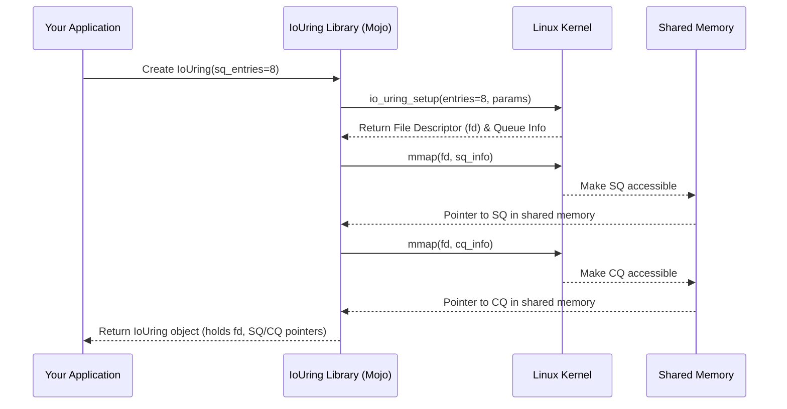

# Chapter 1: IoUring (Queue Pair)

Welcome to the `io_uring` tutorial! If you're looking to make your Mojo applications handle Input/Output (like reading files or network requests) faster and without getting stuck waiting, you're in the right place.

## Why Do We Need This? The Problem of Waiting

Imagine you're writing a program that needs to read a large file from the disk. Traditionally, when your program asks to read the file, it just stops and waits... and waits... until the disk finally provides the data. This is called *blocking I/O*. While waiting, your program can't do anything else – it's unresponsive.

Modern applications often need to do many things at once. Think of a web server handling multiple user requests simultaneously. If it gets stuck waiting for one disk read, all other users have to wait too!

This is where *asynchronous I/O* comes in. Instead of waiting, you tell the operating system (Linux, in this case), "Hey, please start reading this file. Let me know when you're done." Your program can then continue doing other useful work. When the file read is complete, the system notifies your program.

Linux provides a powerful mechanism for this called `io_uring`. It's designed to be very fast and efficient. However, interacting directly with the kernel's `io_uring` interface can be complicated.

## The Solution: The `IoUring` Object (Our Central Hub)

The `io_uring` library for Mojo provides a friendly way to use this powerful feature. The most important piece you'll interact with first is the `IoUring` object.

Think of the `IoUring` object as the **main control office** for managing all your asynchronous I/O tasks. It's the central place you go to:

1.  **Submit new tasks:** Like dropping off a package request at the office counter. ("Please read data from this file.")
2.  **Check for completed tasks:** Like checking your mailbox for delivered packages. ("Is the file read finished? Give me the result.")

Internally, this "office" manages two key components:

*   **[Submission Queue (SQ)](02_submission_queue__sq__.md):** This is the "outbox". You place your requests (called Submission Queue Entries or SQEs) here for the kernel to pick up and process.
*   **[Completion Queue (CQ)](03_completion_queue__cq__.md):** This is the "inbox". When the kernel finishes a task, it places a result (a Completion Queue Entry or CQE) here for you to retrieve.

The `IoUring` object bundles these two queues together (that's why it's sometimes called a "Queue Pair"). It also handles the behind-the-scenes setup:

*   It manages the connection to the kernel (a special [File Descriptor](04_file_descriptors__fd___ownedfd___iouringfd__.md)).
*   It sets up efficient [Memory Management](06_memory_management__region___memorymapping__.md) so your program and the kernel can share information about the queues without slow data copying.

## Setting Up Your "Office": Creating an `IoUring` Instance

Let's create our main control hub. The simplest way to get started is to create an `IoUring` object. You need to tell it roughly how many tasks you might want to submit at the same time.

```mojo
from io_uring import IoUring

fn main() raises:
    # Create an IoUring instance.
    # We tell it we expect to handle up to 8 submissions
    # in the queue at any one time.
    var ring = IoUring(sq_entries=8)

    print("IoUring control office created successfully!")

    # In later chapters, we'll use 'ring' to submit
    # tasks (like reading a file) and get results.
```

**Explanation:**

*   `from io_uring import IoUring`: We import the necessary type.
*   `var ring = IoUring(sq_entries=8)`: This is the core line. We create an `IoUring` instance named `ring`. The `sq_entries=8` argument suggests we want space for at least 8 requests in the [Submission Queue (SQ)](02_submission_queue__sq__.md). The library might adjust this number slightly (e.g., rounding up to a power of two for efficiency). This single line triggers the setup of the SQ, the CQ, the kernel connection, and the shared memory.

That's it! You now have the central `IoUring` object ready to manage asynchronous tasks.

## Under the Hood: Building the Office Step-by-Step

What actually happens when you call `IoUring(sq_entries=8)`? Let's peek behind the curtain.

1.  **Requesting Setup:** Your Mojo program asks the `IoUring` library to create a new instance.
2.  **Talking to the Kernel:** The library makes a special request to the Linux kernel called `io_uring_setup`. It tells the kernel how many slots you requested for the Submission Queue (and optionally, the Completion Queue).
3.  **Kernel Creates Queues:** The kernel sets aside space *within its own protected memory* for the Submission Queue (SQ) and the Completion Queue (CQ).
4.  **Getting the "Phone Number":** The kernel gives back a special identifier called a [File Descriptor](04_file_descriptors__fd___ownedfd___iouringfd__.md). Think of this like a direct phone line to this specific `io_uring` instance.
5.  **Sharing the Queues:** The library then uses another kernel feature (`mmap`) to create a shared memory window. This allows *your* program to directly see and modify the SQ (to add requests) and read the CQ (to get results) without constantly asking the kernel to copy data back and forth. This direct access is key to `io_uring`'s speed.
6.  **Packaging it Up:** The `IoUring` object you get back holds references to everything: the SQ, the CQ (via the shared memory), the kernel file descriptor, and information about the shared memory mappings.

Here's a diagram showing the flow:



Let's look at a simplified view of the code that does this (from `io_uring/qp.mojo`):

```mojo
# File: io_uring/qp.mojo (Simplified IoUring __init__)

# Import necessary components
from .cq import Cq
from .sq import Sq
from .mm import MemoryMapping
from mojix.fd import OwnedFd
from mojix.io_uring import io_uring_setup, IoUringParams
# ... other imports

struct IoUring[...](Movable):
    var _sq: Sq[...]  # Wrapper for Submission Queue
    var _cq: Cq[...]  # Wrapper for Completion Queue
    var fd: OwnedFd[...] # The kernel file descriptor
    var mem: MemoryMapping[...] # Manages shared memory

    fn __init__(
        out self, *, sq_entries: UInt32, mut params: IoUringParams
    ) raises:
        # ... prepare kernel parameters (params) ...

        # 1. Ask kernel for io_uring instance and get file descriptor
        # This calls the io_uring_setup syscall internally.
        self.fd = io_uring_setup[is_registered](sq_entries, params)

        # 2. Set up shared memory using MemoryMapping
        # This calls mmap syscalls internally via the Region type.
        self.mem = MemoryMapping[sqe, cqe](sq_entries, params)

        # 3. Initialize our SQ/CQ wrappers using the shared memory
        self._sq = Sq[...] (params, sq_cq_mem=self.mem.sq_cq_mem, ...)
        self._cq = Cq[...] (params, sq_cq_mem=self.mem.sq_cq_mem)

        # ... other potential setup ...
```

**Explanation:**

*   The `IoUring` struct holds the key parts: `_sq`, `_cq`, `fd`, and `mem`.
*   `io_uring_setup[...]` (defined in `mojix/io_uring.mojo`) is called to interact with the kernel and get the `fd`.
*   `MemoryMapping[...]` (defined in `io_uring/mm.mojo`) handles the `mmap` calls to set up the shared memory regions needed for the queues.
*   Finally, the `Sq` and `Cq` objects (wrappers around the raw queue memory) are initialized using the information from the kernel (`params`) and the shared memory (`self.mem`).

Don't worry if the details of `mmap` or kernel parameters seem complex right now. The key takeaway is that the `IoUring` object conveniently bundles all these necessary pieces together for you.

## Conclusion

You've learned about the core concept of the `IoUring` object (the Queue Pair). It's the central control hub for asynchronous I/O using `io_uring` in Mojo. It cleverly manages the [Submission Queue (SQ)](02_submission_queue__sq__.md) (for sending requests) and the [Completion Queue (CQ)](03_completion_queue__cq__.md) (for receiving results), along with the necessary kernel connection ([File Descriptor](04_file_descriptors__fd___ownedfd___iouringfd__.md)) and efficient [Memory Management](06_memory_management__region___memorymapping__.md).

Creating an `IoUring` instance is the first step in leveraging asynchronous I/O. Now that our "office" is set up, we need to understand how to actually submit tasks. In the next chapter, we'll dive into the first part of the queue pair: the [Submission Queue (SQ)](02_submission_queue__sq__.md).

---

Generated by [AI Codebase Knowledge Builder](https://github.com/The-Pocket/Tutorial-Codebase-Knowledge)