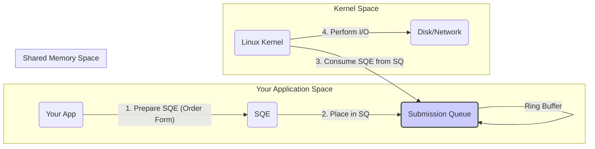
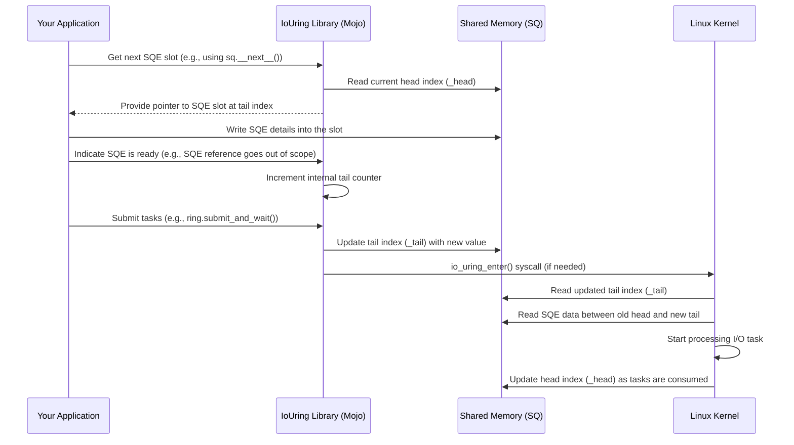

# Chapter 2: Submission Queue (SQ)

In the [previous chapter](01_iouring__queue_pair__.md), we set up our main "control office" – the `IoUring` object. This office manages the communication between your application and the Linux kernel for fast, non-blocking I/O tasks. Now that the office is open, how do we actually give it tasks to perform, like reading a file?

That's where the **Submission Queue (SQ)** comes in.

## The Problem: Sending Instructions to the Kernel

Imagine you want your program to read data from a file. With asynchronous I/O, you don't want to wait. You want to tell the kernel, "Please start reading 100 bytes from this file into this specific part of my program's memory, and let me know when you're done."

How do you efficiently send these detailed instructions to the kernel without slowing things down? Calling the kernel for every single tiny request can be inefficient. We need a way to batch requests and share them quickly.

## The Solution: The Submission Queue (Your "In-Tray")

The Submission Queue (SQ) is the first part of the queue pair managed by our `IoUring` object. Think of it as the **"in-tray"** or a **conveyor belt** sitting between your application and the kernel.

1.  **You Prepare an Order:** You create a small instruction packet called a **Submission Queue Entry (SQE)**. This SQE contains all the details the kernel needs: *what* operation to do (e.g., read, write), *which* file to use, *where* in memory to put the data (for a read) or get the data from (for a write), how much data, etc. We'll learn exactly how to create these SQEs in the [Operations (Op Builders)
](05_operations__op_builders__.md) chapter.
2.  **You Place it in the In-Tray:** Your application places this SQE onto the Submission Queue (SQ).
3.  **The Kernel Picks it Up:** The Linux kernel monitors this SQ. When it sees new SQEs arrive, it picks them up and starts working on the requested I/O operations.

Crucially, the SQ is implemented as a **ring buffer** in **shared memory**.

*   **Shared Memory:** This is a special region of memory that *both* your application and the kernel can directly access. This avoids slow data copying between your app and the kernel. Your app writes the SQE directly into this shared space, and the kernel reads it directly from there.
*   **Ring Buffer:** Imagine the conveyor belt is circular. When you reach the end, you wrap around to the beginning. This allows the queue to be reused continuously without needing to constantly allocate new memory for it. Your application adds new SQEs at the "tail" of the ring, and the kernel consumes them from the "head".

Here's a simple diagram:



## How Your Application Uses the SQ (Conceptually)

While the `io_uring` library handles the low-level details, conceptually, submitting a task involves these steps (simplified):

1.  **Check for Space:** Ask the `IoUring` object if there's an empty slot in the SQ's ring buffer. You can't add more orders if the in-tray is full!
2.  **Get a Slot:** If there's space, get a pointer to the next available SQE slot in the shared memory.
3.  **Prepare the SQE:** Fill in the details of the operation (like "read file X into buffer Y") into the SQE slot. (We'll see how using [Operations (Op Builders)
](05_operations__op_builders__.md)).
4.  **Update the Tail:** Tell the SQ that you've added a new entry by moving the "tail" marker forward. This makes the new SQE visible to the kernel.
5.  **(Optional) Notify the Kernel:** Sometimes, you need to explicitly tell the kernel, "Hey, I've added new tasks, please check the SQ!" This is often called "submitting". In some modes, the kernel might already be watching, but often an explicit "submit" step is needed, especially after adding a batch of SQEs. Our `IoUring` object provides methods like `submit_and_wait` to handle this.

Let's imagine a simplified view of getting an SQE slot (the actual library code is more sophisticated):

```mojo
// --- Conceptual Example ---
// This is simplified to show the idea.
// You usually use higher-level methods.

// Assume 'ring' is our IoUring object from Chapter 1
var ring = IoUring(sq_entries=8)

// 1. Get a pointer to the Submission Queue interface
//    (This might internally check if there's space)
var sq = ring.sq() // Returns a helper 'SqPtr'

// 2. Check if there's space (the helper might do this implicitly)
if sq:
    // 3. Get the next available SQE slot
    //    Calling next() on the iterator gives us a reference
    //    to the memory location for the next SQE.
    var sqe: Sqe = sq.__next__() // Get a reference to the next SQE slot

    // 4. Prepare the SQE (fill in the details)
    //    We'll learn how to do this properly later.
    //    For now, imagine setting opcode, file descriptor, buffer, etc.
    // sqe.opcode = IoUringOp.READ
    // sqe.fd = file_descriptor
    // sqe.addr = buffer_address
    // sqe.len = bytes_to_read
    // sqe.user_data = my_request_id

    print("SQE prepared (conceptually)")

    // 5. The SqPtr implicitly handles updating the tail when
    //    the 'sqe' reference goes out of scope or when flushed.

    // 6. Tell the kernel to check (if needed)
    // ring.submit_and_wait(wait_nr=0) // Submit, don't wait for completions yet

else:
    print("Submission Queue is full!")

```

**Explanation:**

*   We get an interface to the SQ using `ring.sq()`. This returns a helper object (`SqPtr`) that knows how to interact with the underlying ring buffer.
*   The helper object lets us check if there's space (`if sq:`).
*   `sq.__next__()` conceptually gives us a writable slot (an `Sqe`) in the shared memory queue.
*   We'd then fill this `sqe` with the operation details (shown as comments).
*   The library manages updating the internal SQ "tail" pointer when the SQE is ready.
*   Finally, a call like `submit_and_wait` (or similar) is often needed to signal the kernel.

**Key Takeaway:** You don't manually manipulate memory addresses. The library provides safe abstractions like `SqPtr` and methods on the `IoUring` object to prepare and submit SQEs.

## Under the Hood: How the SQ Ring Buffer Works

Let's peek behind the curtain at the `Sq` struct (defined in `io_uring/sq.mojo`) which manages the SQ data structures in shared memory.

1.  **Shared Memory Setup:** When the `IoUring` object was created in Chapter 1, the library asked the kernel to set up the shared memory regions. It received back information about where the SQ-related data structures live within that shared memory.
2.  **Pointers:** The `Sq` struct stores pointers (`UnsafePointer`) to key locations in this shared memory:
    *   `_head`: A pointer to an index value that the *kernel* updates. It indicates how far the kernel has read into the queue.
    *   `_tail`: A pointer to an index value that *your application* updates. It indicates how far your application has written into the queue.
    *   `sqes`: A pointer to the beginning of the array of actual `Sqe` structures where you write your command details.
    *   `ring_mask`, `ring_entries`: Values used to calculate buffer indices correctly when the queue wraps around (the "ring" behaviour).
3.  **Adding an SQE:**
    *   Your app checks if there's space by comparing its internal record of the tail (`sqe_tail`) with the latest head position read from shared memory (`sqe_head`). `available = ring_entries - (sqe_tail - sqe_head)`.
    *   If space exists, it calculates the index for the next slot: `index = sqe_tail & ring_mask`.
    *   It gets a pointer to `sqes[index]` and writes the operation data.
    *   It increments its internal `sqe_tail` counter.
4.  **Submitting:** When you call a submit function:
    *   The library writes the application's current `sqe_tail` value to the shared `_tail` location. This makes the newly added SQEs visible to the kernel.
    *   It might then make a system call (`io_uring_enter`) to wake up the kernel if necessary.
5.  **Kernel Processing:**
    *   The kernel notices that the `_tail` value in shared memory is ahead of its `_head` value.
    *   It reads the SQEs from `_head` up to (but not including) `_tail`, using the `ring_mask` to handle wrapping.
    *   For each SQE it processes, it updates the `_head` value in shared memory, signalling that those slots are now free for the application to reuse.

Here's a sequence diagram showing the flow when adding and submitting an SQE:



Let's look at a simplified view of the `Sq` struct definition:

```mojo
# File: io_uring/sq.mojo (Simplified Sq struct)

from memory import UnsafePointer
from mojix.io_uring import Sqe, SQE, IoUringParams
# ... other imports

struct Sq[type: SQE, polling: PollingMode](...):
    # Pointers to locations in SHARED MEMORY
    var _head: UnsafePointer[UInt32] # Kernel updates this
    var _tail: UnsafePointer[UInt32] # Application updates this (via library)
    # ... other shared pointers like _flags, dropped ...

    # Pointer to the array of SQE slots in SHARED MEMORY
    var sqes: UnsafePointer[Sqe[type]]

    # Application's private copy of indices (cached)
    var sqe_head: UInt32 # App's last known head position
    var sqe_tail: UInt32 # App's current tail position

    # Ring buffer parameters (read from shared memory at init)
    var ring_mask: UInt32   # e.g., 7 for size 8 (entries - 1)
    var ring_entries: UInt32 # e.g., 8

    fn __init__(
        out self,
        params: IoUringParams, # Info from kernel setup
        *,
        sq_cq_mem: Region,   # Shared memory for SQ/CQ indices
        sqes_mem: Region     # Shared memory for SQE array
    ) raises:
        # Calculate pointers based on offsets from kernel (params.sq_off)
        # and the shared memory regions (sq_cq_mem, sqes_mem)
        self._head = sq_cq_mem.unsafe_ptr[UInt32](offset=params.sq_off.head, ...)
        self._tail = sq_cq_mem.unsafe_ptr[UInt32](offset=params.sq_off.tail, ...)
        self.sqes = sqes_mem.unsafe_ptr[Sqe[type]](offset=0, ...)
        self.ring_mask = sq_cq_mem.unsafe_ptr[UInt32](offset=params.sq_off.ring_mask, ...)[]
        self.ring_entries = sq_cq_mem.unsafe_ptr[UInt32](offset=params.sq_off.ring_entries, ...)[]

        # Initialize local cache of indices
        self.sqe_head = self._head[] # Read initial head from shared mem
        self.sqe_tail = self._tail[] # Read initial tail from shared mem
        # ... error checking ...

    # Helper method (conceptual) to update shared tail pointer
    fn sync_tail(mut self):
        # Write our application's tail counter to the shared memory location
        self._tail[] = self.sqe_tail
        # (May involve memory barriers/atomics depending on mode)

    # Helper method (conceptual) to update local head cache
    fn sync_head(mut self):
        # Read the kernel's latest head position from shared memory
        self.sqe_head = self._head[]
        # (May involve memory barriers/atomics depending on mode)

    # ... other methods to manage the queue ...

```

**Explanation:**

*   The struct holds `UnsafePointer`s directly into the shared memory regions (`sq_cq_mem`, `sqes_mem`) allocated during `IoUring` creation.
*   The `_head` and `_tail` pointers reference single `UInt32` values in shared memory that act as the core synchronization mechanism.
*   `sqes` points to the actual array where `Sqe` data is stored.
*   `sqe_head` and `sqe_tail` are the application's *local* copies of the indices, used to track available space and the next slot to write to. These are synchronized with the shared memory values (`_head`, `_tail`) when needed (e.g., before checking space, after submitting).
*   Methods like `sync_tail` and `sync_head` handle the communication with shared memory (reading the kernel's head progress, writing the application's tail progress).

This shared ring buffer design is the heart of `io_uring`'s efficiency for submitting requests.

## Conclusion

You've now learned about the Submission Queue (SQ) – the essential "in-tray" for sending I/O requests to the Linux kernel via `io_uring`. You understand that it's a ring buffer in shared memory, allowing your application and the kernel to exchange requests (Submission Queue Entries or SQEs) very quickly without expensive data copying.

Your application prepares SQEs describing the tasks and places them onto the SQ's tail. The kernel consumes these SQEs from the head and performs the work. The `IoUring` library provides convenient and safe ways to interact with the SQ.

But sending a request is only half the story! Once the kernel finishes a task (like reading that file), how does it tell your application the result? That's the job of the other half of our queue pair: the [Completion Queue (CQ)
](03_completion_queue__cq__.md), which we'll explore in the next chapter.

---

Generated by [AI Codebase Knowledge Builder](https://github.com/The-Pocket/Tutorial-Codebase-Knowledge)