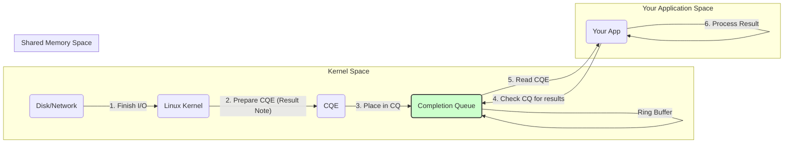
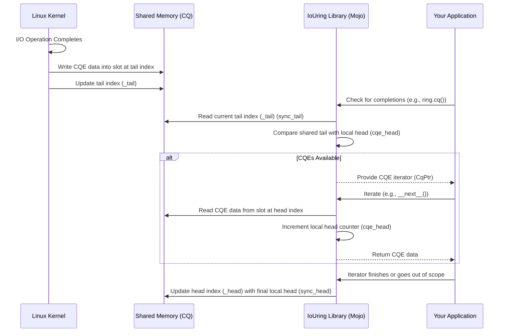

# Chapter 3: Completion Queue (CQ)

In the [previous chapter](02_submission_queue__sq__.md), we learned how to send requests to the kernel using the [Submission Queue (SQ)](02_submission_queue__sq__.md). We prepared our "order forms" (SQEs) and placed them in the "in-tray" (SQ) for the kernel to process.

But how do we know when the kernel has finished processing our request? If we asked the kernel to read a file, how do we get the data back, or find out if there was an error?

## The Problem: Getting Results Back

Imagine you asked your coworker (the kernel) to go fetch a document (read a file). You gave them the request slip (the SQE). Now you need a way for them to return the document (the data) and maybe a note saying if they found it or if the filing cabinet was locked (the result status).

You don't want to constantly interrupt them asking "Are you done yet?". That would be inefficient (like blocking I/O). You need a designated place where they can drop off the results for you to check when you're ready.

## The Solution: The Completion Queue (Your "Out-Tray")

This is exactly what the **Completion Queue (CQ)** does. It's the second part of the queue pair managed by our main [IoUring (Queue Pair)](01_iouring__queue_pair__.md) object.

Think of the CQ as the **"out-tray"** or the **"mailbox"** sitting between the kernel and your application.

1.  **Kernel Finishes a Task:** When the Linux kernel completes an I/O operation you submitted (like reading a file or sending network data), it prepares a result summary.
2.  **Kernel Prepares a Result Note:** This summary is called a **Completion Queue Entry (CQE)**. It contains information like:
    *   Was the operation successful or did it fail?
    *   If it was a read/write, how many bytes were actually transferred?
    *   Crucially, it includes the unique `user_data` identifier you attached to the original request (SQE), so you know *which* request this result belongs to.
3.  **Kernel Places it in the Out-Tray:** The kernel places this CQE onto the Completion Queue (CQ).
4.  **You Check Your Mailbox:** Your application checks the CQ periodically (or waits for a signal) to see if any new CQEs have arrived.
5.  **You Process the Results:** You read the CQEs, check the status, retrieve any resulting data (if applicable), and match them back to your original requests using the `user_data`.

Like the SQ, the CQ is also implemented as a **ring buffer** in **shared memory**.

*   **Shared Memory:** Both your application and the kernel can access this memory directly, avoiding slow data copies. The kernel writes CQEs directly here, and your app reads them directly.
*   **Ring Buffer:** It's a circular queue. The kernel adds new CQEs at the "tail" of the ring, and your application consumes them from the "head". When the kernel writes a CQE, it updates the *tail* pointer in shared memory. When your application processes a CQE, it updates the *head* pointer in shared memory to signal that the slot is now free. (Note: This is the opposite of the SQ, where the app updated the tail and the kernel updated the head).

Here's a diagram showing the flow:



## How Your Application Uses the CQ (Conceptually)

The `io_uring` library provides convenient ways to check for and process completions. Conceptually, it works like this:

1.  **Ask for Completions:** You typically call a method on the `IoUring` object (like `submit_and_wait` or a dedicated `cq()` method) which might involve telling the kernel to check for finished tasks and potentially waiting if none are immediately ready.
2.  **Check the CQ:** The library reads the current "tail" position of the CQ from shared memory (where the kernel last wrote).
3.  **Compare Head and Tail:** It compares this tail position with its internal record of the "head" position (where your app last finished reading). If the tail is ahead of the head, there are new CQEs waiting.
4.  **Iterate Through CQEs:** The library provides an iterator (like `CqPtr`) that lets you loop through the available CQEs one by one.
5.  **Process Each CQE:** Inside the loop, you get a reference to a `Cqe` object. You can inspect its fields:
    *   `res`: The result code (e.g., non-negative for success, often indicating bytes transferred; negative for an error code).
    *   `user_data`: The identifier you originally submitted with the SQE.
    *   `flags`: Additional status flags.
6.  **Update the Head:** As you iterate through the CQEs using the library's iterator, the library automatically updates the CQ's "head" marker in shared memory behind the scenes, telling the kernel that these slots can be reused.

Let's see a simplified example of how you might check the CQ after submitting some (imaginary) tasks:

```mojo
from io_uring import IoUring

fn main() raises:
    var ring = IoUring(sq_entries=8)

    # --- Imagine submitting some tasks here ---
    # (e.g., using ring.sq() and ring.submit_and_wait(0))
    # We'll learn how in Chapter 5. Assume we submitted
    # two tasks with user_data 101 and 102.
    # ------------------------------------------

    print("Submitting tasks and waiting for at least 1 completion...")
    # submit_and_wait can both submit SQEs (if any are pending)
    # and wait for CQEs. Here, we wait for at least 1.
    let submitted = ring.submit_and_wait(wait_nr=1)
    print("submit_and_wait returned. Submitted:", submitted)

    print("Checking the Completion Queue...")
    # Get an iterator for the available CQEs
    var cq: CqPtr[...] = ring.cq(wait_nr=0) # Check without waiting further

    # Loop through all currently available CQEs
    while cq:
        let cqe = cq.__next__() # Get the next CQE
        print("-> Found CQE:")
        print("   User Data (Request ID):", cqe.user_data)
        print("   Result Code:", cqe.res)
        if cqe.res < 0:
            print("   Status: Error!")
        else:
            print("   Status: Success (Bytes transferred:", cqe.res, ")")

    print("Finished checking the CQ.")

    # The 'cq' object automatically updates the CQ head
    # pointer in shared memory when it goes out of scope (__del__).
```

**Explanation:**

*   We first call `ring.submit_and_wait(wait_nr=1)`. This tells the `io_uring` instance to submit any pending SQEs (requests) and then wait until at least one CQE (result) is available in the Completion Queue.
*   Then, `ring.cq(wait_nr=0)` gives us a `CqPtr` iterator. This checks the CQ *without* waiting further. If `submit_and_wait` already fetched completions, they will be available here.
*   The `while cq:` loop continues as long as the `CqPtr` iterator (`cq`) has more completions available (`cq.__has_next__()` is true, checked implicitly by `while`).
*   `cq.__next__()` retrieves the next `Cqe` from the shared memory ring buffer.
*   We print the `user_data` (to identify the request) and the `res` (the result). A negative `res` usually indicates an error code.
*   Crucially, as we iterate using `cq.__next__()`, the library internally advances its `cqe_head` counter. When the `cq` iterator object is finished (e.g., goes out of scope at the end of the `while` loop), its destructor (`__del__`) typically updates the shared `_head` pointer in memory, signalling to the kernel that we've processed these entries.

**Key Takeaway:** You interact with the CQ through high-level methods on the `IoUring` object and iterators like `CqPtr`. The library handles the details of reading from shared memory and updating pointers.

## Under the Hood: How the CQ Ring Buffer Works

Let's peek at the `Cq` struct (defined in `io_uring/cq.mojo`) which manages the CQ data structures in shared memory.

1.  **Shared Memory Setup:** During `IoUring` creation ([Chapter 1](01_iouring__queue_pair__.md)), shared memory was set up. The kernel provided offsets for the CQ structures within this memory.
2.  **Pointers:** The `Cq` struct stores pointers (`UnsafePointer`) to key locations in shared memory:
    *   `_head`: A pointer to an index value that *your application* updates (via the library). It tells the kernel how far the application has read and processed entries.
    *   `_tail`: A pointer to an index value that the *kernel* updates. It indicates how far the kernel has written new completion entries into the queue.
    *   `cqes`: A pointer to the beginning of the array of actual `Cqe` structures where the kernel writes the result details.
    *   `ring_mask`, `ring_entries`: Values used for ring buffer index calculations.
3.  **Kernel Adding a CQE:**
    *   The kernel finishes an I/O operation.
    *   It checks if there's space in the CQ (compares its internal tail with the head value read from `_head` in shared memory).
    *   If space exists, it calculates the index for the next slot: `index = kernel_tail & ring_mask`.
    *   It writes the `Cqe` data (result, user_data, flags) to `cqes[index]`.
    *   It increments its internal tail counter.
    *   Finally, it *updates the shared `_tail` location* with the new tail value, making the CQE visible to the application (often using memory barriers to ensure correct ordering).
4.  **Application Checking for CQEs:**
    *   When you call a function like `ring.cq()` or `ring.submit_and_wait()`, the library needs to see if new CQEs are available.
    *   It reads the current value from the shared `_tail` pointer (using `sync_tail`). Let's call this `shared_tail`.
    *   It compares `shared_tail` with its own cached `cqe_head` value (the last position it processed up to). The number of available CQEs is `shared_tail - cqe_head`.
5.  **Application Processing a CQE:**
    *   The `CqPtr` iterator calculates the index of the next CQE to read: `index = cqe_head & ring_mask`.
    *   It reads the `Cqe` data from `cqes[index]`.
    *   It increments its internal `cqe_head` counter.
6.  **Application Signalling Consumption:**
    *   After the application has iterated through one or more CQEs (e.g., when the `CqPtr` iterator goes out of scope), the library needs to tell the kernel these slots are free.
    *   It writes the application's current `cqe_head` value to the *shared `_head` location* (using `sync_head`). This allows the kernel to potentially reuse those CQE slots.

Here's a sequence diagram showing the flow:



Let's look at a simplified view of the `Cq` struct definition from `io_uring/cq.mojo`:

```mojo
# File: io_uring/cq.mojo (Simplified Cq struct)

from memory import UnsafePointer
from mojix.io_uring import Cqe, CQE, IoUringParams
from .mm import Region # Used for shared memory management
from .utils import AtomicOrdering, _atomic_load, _atomic_store # For safe memory access

struct Cq[type: CQE](...):
    # Pointers to locations in SHARED MEMORY
    var _head: UnsafePointer[UInt32] # Application updates this (via library)
    var _tail: UnsafePointer[UInt32] # Kernel updates this
    # ... other shared pointers like flags, overflow ...

    # Pointer to the array of CQE slots in SHARED MEMORY
    var cqes: UnsafePointer[Cqe[type]]

    # Application's private copy of indices (cached)
    var cqe_head: UInt32 # App's current head position (next to read)
    var cqe_tail: UInt32 # App's last known tail position (last written by kernel)

    # Ring buffer parameters (read from shared memory at init)
    var ring_mask: UInt32   # e.g., 15 for size 16 (entries - 1)
    var ring_entries: UInt32 # e.g., 16

    fn __init__(out self, params: IoUringParams, *, sq_cq_mem: Region) raises:
        # Calculate pointers based on offsets from kernel (params.cq_off)
        # and the shared memory region (sq_cq_mem)
        self._head = sq_cq_mem.unsafe_ptr[UInt32](offset=params.cq_off.head, ...)
        self._tail = sq_cq_mem.unsafe_ptr[UInt32](offset=params.cq_off.tail, ...)
        self.cqes = sq_cq_mem.unsafe_ptr[Cqe[type]](offset=params.cq_off.cqes, ...)
        self.ring_mask = sq_cq_mem.unsafe_ptr[UInt32](offset=params.cq_off.ring_mask, ...)[]
        self.ring_entries = sq_cq_mem.unsafe_ptr[UInt32](offset=params.cq_off.ring_entries, ...)[]
        # ... error checking ...

        # Initialize local cache of indices
        # Read initial head/tail from shared memory
        self.cqe_head = _atomic_load(self._head)
        self.cqe_tail = _atomic_load(self._tail)

    # Helper method (conceptual) to update local tail cache
    fn sync_tail(mut self):
        # Read the kernel's latest tail position from shared memory
        self.cqe_tail = _atomic_load[AtomicOrdering.ACQUIRE](self._tail)

    # Helper method (conceptual) to update shared head pointer
    fn sync_head(self):
        # Write our application's head counter to the shared memory location
        _atomic_store(self._head, self.cqe_head)
        # (Uses atomic operations/memory barriers for safety)

    # ... other methods to manage the queue ...
```

**Explanation:**

*   Similar to the `Sq` struct, `Cq` holds `UnsafePointer`s into the shared memory region (`sq_cq_mem`) set up earlier.
*   `_head` points to the shared head index (updated by the app via `sync_head`), and `_tail` points to the shared tail index (updated by the kernel, read by the app via `sync_tail`).
*   `cqes` points to the array of `Cqe` structures where results are stored.
*   `cqe_head` and `cqe_tail` are the application's *local, cached* copies of the indices. `cqe_head` tracks how far the app has processed, and `cqe_tail` tracks the latest known position written by the kernel.
*   `sync_tail` reads the shared `_tail` (using atomic loads for memory safety) to update the local `cqe_tail`. This is how the app discovers new completions.
*   `sync_head` writes the local `cqe_head` to the shared `_head` (using atomic stores). This tells the kernel that the application has consumed CQEs up to that point.

The shared ring buffer for completions allows the kernel to deliver results back to your application efficiently, again minimizing overhead and enabling high performance.

## Conclusion

You've now explored the Completion Queue (CQ), the vital "out-tray" where the kernel delivers the results of your asynchronous I/O requests. You understand that it uses a shared memory ring buffer, just like the [Submission Queue (SQ)](02_submission_queue__sq__.md), but this time the kernel writes Completion Queue Entries (CQEs) to the tail, and your application reads them from the head.

Each CQE contains the result status and the `user_data` identifier, allowing you to match results back to your original requests. The `io_uring` library provides convenient ways (like the `CqPtr` iterator) to check for and process these completions without needing to manage the low-level shared memory details directly.

We now understand how to submit requests (SQ) and receive results (CQ). But what exactly are we submitting requests *for*? Often, it involves interacting with files or network sockets. To do that, we need a way to refer to these resources. In the next chapter, we'll look at how `io_uring` handles [File Descriptors (Fd / OwnedFd / IoUringFd)](04_file_descriptors__fd___ownedfd___iouringfd__.md).

---

Generated by [AI Codebase Knowledge Builder](https://github.com/The-Pocket/Tutorial-Codebase-Knowledge)