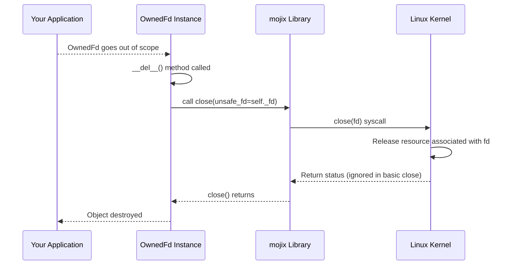

# Chapter 4: File Descriptors (Fd / OwnedFd / IoUringFd)

In the [previous chapter](03_completion_queue__cq__.md), we saw how the kernel sends results back to us using the [Completion Queue (CQ)](03_completion_queue__cq__.md). We now understand the full cycle: submitting requests via the [Submission Queue (SQ)](02_submission_queue__sq__.md) and getting results via the CQ.

But when we submit a request, like "read data", how do we tell the kernel *which* specific file, network connection, or other resource we want to read from?

## The Problem: Identifying Your Target

Imagine you're sending a request to a mailroom (the kernel) to fetch a document. You can't just say "fetch a document". You need to specify *which* document, maybe by giving a filing cabinet number and a folder name.

Similarly, when using `io_uring` to perform I/O operations, we need a way to uniquely identify the target resource (like an open file) for each request (SQE).

## The Solution: File Descriptors - The Resource IDs

In Linux and Unix-like systems, the operating system uses a simple concept called a **File Descriptor** (often abbreviated as **fd**). When you open a file, connect to a network address, or create other I/O resources, the kernel gives your program back a small, non-negative integer number. This number is the file descriptor.

Think of it like a coat check ticket. You hand over your coat (open a file), and you get a ticket (the file descriptor). Whenever you want to interact with your coat (read/write the file), you show the ticket.

This file descriptor is the unique ID you use in system calls (like `read`, `write`, and importantly, `io_uring` operations) to tell the kernel exactly which resource you're talking about.

The `io_uring` library provides several ways to handle these file descriptors safely and efficiently.

## Meet the Descriptor Types in `io_uring`

Directly using the raw integer file descriptor (which we call `UnsafeFd` in the library) can be tricky. What if you forget to "return the ticket" (close the file descriptor) when you're done? This can lead to resource leaks in your application.

To help manage this, the `io_uring` library (specifically, the underlying `mojix` layer) provides safer wrappers:

1.  **`Fd` (The Basic Key):**
    *   This is a simple wrapper around a raw `UnsafeFd`.
    *   It *doesn't own* the descriptor. Think of it as having a *copy* of a key. You can use it to open the door (perform an operation), but you're not responsible for managing the original key (closing the descriptor).
    *   Useful when you receive a file descriptor from somewhere else that is still responsible for closing it.

2.  **`OwnedFd` (The Auto-Return Key):**
    *   This wrapper *owns* the file descriptor it holds.
    *   Analogy: It's like a temporary keycard for a hotel room. When you're finished with the room (the `OwnedFd` object is no longer needed and goes out of scope), the keycard is *automatically returned* (the file descriptor is automatically closed).
    *   This is the safest way to handle file descriptors you create yourself (e.g., by opening a file), as it prevents resource leaks. It automatically calls `close()` in its destructor (`__del__`).

3.  **`IoUringFd` (The Special System Badge):**
    *   This is another wrapper, similar to `Fd`, but it specifically represents a file descriptor relevant to `io_uring`.
    *   It can represent the special file descriptor for the `io_uring` instance itself (the one created in [Chapter 1](01_iouring__queue_pair__.md)).
    *   It can also represent a *registered* file descriptor. `io_uring` allows you to "pre-register" file descriptors with the kernel for potentially faster access in subsequent operations. `IoUringFd` can indicate whether the descriptor it holds is one of these registered, optimized ones.
    *   Analogy: Think of this as a special access badge for the `io_uring` building. A standard `Fd` is like a visitor pass, while an `IoUringFd` might be an employee badge, possibly granting faster entry (if registered).

You'll mostly interact with `OwnedFd` when you open resources yourself, and you'll often pass a non-owning `Fd` or `IoUringFd` (borrowed from the `OwnedFd` or the main `IoUring` object) into the actual I/O operations we'll build in the next chapter.

## How to Use Them: Getting and Owning a Descriptor

Let's imagine we want to open a file named "my_data.txt" for reading. The operating system might provide a low-level function (like `openat` from Linux, which we might wrap in Mojo) that returns a raw `UnsafeFd`.

```mojo
# Assume we have a low-level function to open files
# (This is a simplified hypothetical example)
fn low_level_open(path: String) raises -> UnsafeFd:
    # ... interacts with the OS to open the file ...
    # On success, returns the integer file descriptor
    # On failure, raises an error
    print("Pretending to open file:", path)
    let pretended_fd: UnsafeFd = 3 # Example fd number
    return pretended_fd

# --- Using the raw descriptor (Less Safe) ---
fn use_unsafe_fd() raises:
    let raw_fd = low_level_open("my_data.txt")
    print("Got raw fd:", raw_fd)
    # ... use raw_fd ...
    # !!! PROBLEM: We need to remember to close it manually !!!
    # close(raw_fd) # Need a function like this
    print("Need to remember to close fd", raw_fd)

# --- Using OwnedFd (Safer) ---
from mojix.fd import OwnedFd, UnsafeFd

fn use_owned_fd() raises:
    let raw_fd = low_level_open("my_data.txt")
    # Wrap the raw fd in OwnedFd to take ownership
    var owned_file = OwnedFd(unsafe_fd=raw_fd)
    print("Got owned fd:", owned_file.unsafe_fd()) # Can still get the number if needed

    # ... use owned_file (or borrow Fd/IoUringFd from it) ...
    # For example, pass owned_file.fd() to an io_uring operation builder

    # No need to manually close!
    # When 'owned_file' goes out of scope here, its __del__
    # method will automatically call close() on the underlying fd.
    print("OwnedFd will automatically close fd", owned_file.unsafe_fd(), "when it goes out of scope.")

fn main() raises:
    # use_unsafe_fd() # Less safe
    use_owned_fd()    # Safer
```

**Explanation:**

1.  `low_level_open` simulates opening a file and getting back a raw `UnsafeFd` (just an integer, like `3`).
2.  In `use_unsafe_fd`, we get the raw `UnsafeFd`. We *must* remember to call a `close()` function later, otherwise the file stays open, potentially leaking resources.
3.  In `use_owned_fd`, we get the raw `UnsafeFd` but immediately wrap it in an `OwnedFd`. This `OwnedFd` instance now "owns" the descriptor `3`.
4.  We can use `owned_file` (e.g., by calling `owned_file.fd()` to get a temporary, non-owning `Fd` to pass into an `io_uring` operation).
5.  The crucial part: when `use_owned_fd` finishes, the `owned_file` variable goes out of scope. Mojo automatically calls its destructor (`__del__`). The `OwnedFd.__del__` method is specifically designed to call the underlying `close()` system call on the file descriptor it owns (`3` in this case). This guarantees the file is closed without you needing to write manual cleanup code in the normal execution path.

Our main `IoUring` object from [Chapter 1](01_iouring__queue_pair__.md) also holds its own file descriptor (an `OwnedFd` or `IoUringFd` depending on registration status) that represents the connection to the kernel's `io_uring` instance for that specific ring.

## Under the Hood: How `OwnedFd` Manages Lifetime

The magic of `OwnedFd` lies in its structure and its destructor.

1.  **Storage:** The `OwnedFd` struct simply holds the raw `UnsafeFd` integer value.
2.  **Destruction (`__del__`)**: When an `OwnedFd` object is destroyed (usually when it goes out of scope or is explicitly deleted), its `__del__` method is automatically invoked.
3.  **Closing Logic:** Inside `__del__`, the code checks if the `OwnedFd` represents a *registered* file descriptor (using the `is_registered` parameter).
    *   If **not registered** (`is_registered = False`, the default), it calls the standard `close()` system call on the stored `UnsafeFd`. This tells the kernel to release the resource associated with that descriptor.
    *   If **registered** (`is_registered = True`), it needs to perform a special `io_uring` operation to *unregister* the file descriptor from the ring's internal table before potentially closing it. It uses `io_uring_register` with the `UNREGISTER_RING_FDS` operation.

Here's a simplified sequence diagram showing what happens when a non-registered `OwnedFd` goes out of scope:



Let's look at a simplified version of the `OwnedFd` definition from `mojix/fd.mojo`:

```mojo
# File: mojix/fd.mojo (Simplified OwnedFd)

from .close import close  # Function that wraps the close() syscall
from .ctypes import c_int
from .io_uring import io_uring_register, IoUringRegisterOp, IoUringRsrcUpdate, RegisterArg
# ... other imports ...

alias UnsafeFd = c_int # The raw integer descriptor

# Trait indicating an object can provide an UnsafeFd
trait UnsafeFileDescriptor:
    fn unsafe_fd(self) -> UnsafeFd: ...

# Trait indicating an object can provide a non-owning Fd
trait FileDescriptor(UnsafeFileDescriptor, Movable):
    fn fd(self) -> Fd: ...

# ... Fd and IoUringFd struct definitions (simpler wrappers) ...

# The OwnedFd struct
@register_passable
struct OwnedFd[is_registered: Bool = False](FileDescriptor, ...):
    """An owned file descriptor that is automatically closed/unregistered
    in its destructor.
    """
    # is_registered: Parameter indicating if this is an io_uring registered fd

    var _fd: UnsafeFd # Stores the raw file descriptor integer

    fn __init__(out self, *, unsafe_fd: UnsafeFd):
        """Takes ownership of an existing UnsafeFd."""
        debug_assert(unsafe_fd > -1, "invalid file descriptor")
        self._fd = unsafe_fd

    fn __del__(owned self):
        """Closes/unregisters the file descriptor automatically."""
        @parameter # Check the compile-time parameter 'is_registered'
        if is_registered:
            # If it's a registered fd, unregister it from io_uring
            op = IoUringRsrcUpdate(UInt32(self._fd), 0, 0) # Prepare args
            arg = op.as_register_arg(
                unsafe_opcode=IoUringRegisterOp.UNREGISTER_RING_FDS
            )
            try:
                # Call the io_uring_register syscall
                _ = io_uring_register(self.io_uring_fd(), arg)
                # (Error handling simplified here)
            except:
                pass # Ignore errors during cleanup for simplicity
        else:
            # If it's a regular fd, just close it
            close(unsafe_fd=self._fd) # Calls the close() syscall

    # Method to get the raw fd number (borrowing)
    fn unsafe_fd(self) -> UnsafeFd:
        return self._fd

    # Method to get a non-owning Fd wrapper (borrowing)
    fn fd(self) -> Fd:
        constrained[not is_registered]() # Only if not registered
        return Fd(unsafe_fd=self._fd)

    # Method to get a non-owning IoUringFd wrapper (borrowing)
    fn io_uring_fd(self) -> IoUringFd[is_registered]:
        return IoUringFd[is_registered](unsafe_fd=self._fd)

```

**Explanation:**

*   The `OwnedFd` struct simply holds the `_fd: UnsafeFd`.
*   The key is the `__del__` method. It's automatically called by Mojo when the `OwnedFd` instance is no longer needed.
*   Inside `__del__`, it checks the `is_registered` parameter (which is `False` by default).
*   If `False`, it calls the `close(unsafe_fd=self._fd)` function (from `mojix/close.mojo`), which performs the actual `close` system call.
*   If `True`, it performs the more complex `io_uring_register` call to unregister the descriptor before it's potentially closed.
*   Methods like `unsafe_fd()`, `fd()`, and `io_uring_fd()` allow you to safely *borrow* a reference to the descriptor (either the raw number or a non-owning wrapper) without giving up ownership, so the `OwnedFd` still ensures it gets closed later.

## Conclusion

You've now learned about the crucial role of File Descriptors in identifying resources like files for I/O operations. You've seen the different wrappers provided by `mojix` within the `io_uring` library:

*   **`Fd`**: A basic, non-owning reference (like a copied key).
*   **`OwnedFd`**: A safe, owning wrapper that automatically closes the descriptor when done (like an auto-returning keycard). This is your primary tool for managing file lifetimes.
*   **`IoUringFd`**: A specialized reference, potentially indicating a registered (optimized) descriptor for `io_uring` (like a special system badge).

Understanding these wrappers is essential for writing safe and correct `io_uring` applications, preventing resource leaks by ensuring files are properly closed.

Now that we know how to set up the queues ([Chapter 1-3](01_iouring__queue_pair__.md)) and how to identify the files we want to work with ([Chapter 4](04_file_descriptors__fd___ownedfd___iouringfd__.md)), we're finally ready to learn how to actually *create* the I/O requests (SQEs) themselves. In the next chapter, we'll explore the [Operations (Op Builders)](05_operations__op_builders__.md) that help us construct these requests.

---

Generated by [AI Codebase Knowledge Builder](https://github.com/The-Pocket/Tutorial-Codebase-Knowledge)