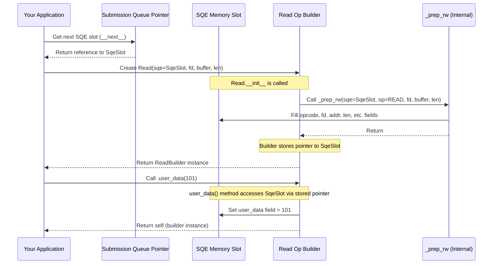

# Chapter 5: Operations (Op Builders)

In the [previous chapter](04_file_descriptors__fd___ownedfd___iouringfd__.md), we learned how to use File Descriptors (like `OwnedFd`) to safely identify the files or network connections we want to work with. We know how to set up the communication queues ([Submission Queue (SQ)](02_submission_queue__sq__.md) and [Completion Queue (CQ)](03_completion_queue__cq__.md)) and how to refer to our target resources.

Now, the big question is: **How do we actually tell `io_uring` *what* specific task to perform?** How do we create the "order forms" (Submission Queue Entries or SQEs) that describe the job?

## The Problem: Crafting the Perfect Order Form (SQE)

Remember the [Submission Queue (SQ)](02_submission_queue__sq__.md)? We need to place Submission Queue Entries (SQEs) onto it. An SQE is a small data structure packed with details for the kernel:

*   **Opcode:** What operation to perform (read, write, accept connection, etc.).
*   **File Descriptor:** Which file or socket to use.
*   **Buffer Address:** Where is the memory to read data into or write data from?
*   **Length:** How many bytes to read or write?
*   **Offset:** Where in the file to start reading/writing (for file operations)?
*   **Flags:** Special options for the operation.
*   **User Data:** Our unique identifier for this request.
*   ...and several other fields for more advanced scenarios.

Manually filling out every single field in this `Sqe` structure for every request would be tedious and very easy to get wrong. Imagine having a blank, complicated form with dozens of boxes – you'd likely miss something or put information in the wrong place.

```mojo
# This is what a raw SQE structure looks like (simplified)
# You DON'T normally fill this out directly!

struct Sqe:
    var opcode: IoUringOp # e.g., READ, WRITE, ACCEPT...
    var flags: IoUringSqeFlags # Special options
    var ioprio: UInt16 # I/O priority
    var fd: UnsafeFd # The file descriptor number
    var off_or_addr2_or_cmd_op: UInt64 # Offset for files, or other uses...
    var addr_or_splice_off_in_or_msgring_cmd: UInt64 # Buffer address, or other uses...
    var len_or_poll_flags: UInt32 # Length for read/write, or poll flags...
    var op_flags: UInt32 # Operation-specific flags (e.g., read/write flags)
    var user_data: UInt64 # Your request ID
    var buf_index_or_buf_group: UInt16 # Buffer index/group (for buffer rings)
    var personality: UInt16 # Credentials ID
    # ... and potentially more fields ...
```

We need a simpler, safer, and more intuitive way to create these SQEs.

## The Solution: Op Builders - Your Task Wizards

The `io_uring` library provides a brilliant solution: **Operation Builders** (or **Op Builders**).

These are helper structures like `Read`, `Write`, `Accept`, `Connect`, `Nop` (No Operation), etc., specifically designed to make creating SQEs easy and less error-prone.

**Analogy:** Think of Op Builders as **pre-filled templates** or **wizards** for specific tasks.

*   Instead of a blank form (`Sqe`), you pick the template for the job you want (e.g., the `Read` template).
*   The template already knows which basic fields are needed for that specific task and how to set the `opcode`.
*   You just need to provide the essential details for *that* task (like the file descriptor, buffer address, and length for a `Read`).
*   The builder has convenient methods to set common optional fields, like your `user_data` identifier.

Each Op Builder corresponds to a specific `io_uring` operation code (like `IoUringOp.READ`, `IoUringOp.WRITE`). They ensure you provide the necessary information in a structured way and handle filling the underlying `Sqe` correctly.

## Using an Op Builder: Reading a File

Let's see how to prepare an SQE to read data from a file using the `Read` Op Builder.

**Goal:** Prepare an SQE to read `100` bytes from an open file (`my_file: OwnedFd`) into a memory buffer (`my_buffer_ptr: UnsafePointer[UInt8]`) and tag it with the request ID `101`.

```mojo
from io_uring import IoUring
from io_uring.op import Read # Import the Read Op Builder
from mojix.fd import OwnedFd, Fd # We need Fd for the builder
from memory import UnsafePointer, StackBuffer # For our data buffer

# Assume 'ring' is our IoUring instance from Chapter 1
# Assume 'my_file' is an OwnedFd for the file we want to read (Chapter 4)
# Assume 'my_buffer_ptr' is an UnsafePointer[UInt8] pointing to 100 bytes of memory

fn prepare_read_sqe(
    ring: IoUring,
    my_file: Fd, # We borrow a non-owning Fd for the operation
    my_buffer_ptr: UnsafePointer[UInt8],
    bytes_to_read: UInt,
    request_id: UInt64,
) raises:
    print("Getting SQE slot...")
    # 1. Get access to the Submission Queue
    var sq: SqPtr[...] = ring.sq()

    # 2. Check if there's space and get the next SQE slot reference
    if sq:
        var sqe: Sqe = sq.__next__() # Get a reference to the raw SQE slot

        print("Preparing Read operation...")
        # 3. Create the 'Read' Op Builder
        #    Pass the SQE slot, file descriptor, buffer pointer, and length.
        #    This immediately fills the basic SQE fields (opcode, fd, addr, len).
        var read_op = Read(sqe, my_file, my_buffer_ptr, bytes_to_read)

        # 4. Use builder methods to set optional fields (like user_data)
        #    This modifies the SQE that 'read_op' points to.
        read_op = read_op.user_data(request_id)
        # We could chain other methods like .offset() or .sqe_flags() here.

        print("SQE prepared for Read with user_data:", request_id)
        # 5. SQE is ready in the queue!
        #    The 'sq' SqPtr will handle making it visible to the kernel
        #    when we later call a submit method (like ring.submit()).
    else:
        print("Submission Queue is full!")

# --- Example Usage (Conceptual) ---
fn main() raises:
    var ring = IoUring(sq_entries=8)
    # Pretend we opened a file and got an OwnedFd
    var owned_file = OwnedFd(unsafe_fd=3) # Assume fd 3 is our file
    # Pretend we have a buffer
    var buffer = StackBuffer[UInt8](100)

    # Prepare the SQE using the Op Builder
    prepare_read_sqe(
        ring,
        owned_file.fd(), # Borrow a non-owning Fd
        buffer.unsafe_ptr(),
        100,
        101, # Our request ID
    )

    # Later, we would submit the queue:
    # _ = ring.submit()
    # And then check the Completion Queue for the result with user_data 101
```

**Explanation:**

1.  `ring.sq()`: We get the `SqPtr` helper to interact with the [Submission Queue (SQ)](02_submission_queue__sq__.md).
2.  `sq.__next__()`: We get a reference (`sqe`) to the next available raw `Sqe` slot in the queue's shared memory.
3.  `var read_op = Read(sqe, my_file, my_buffer_ptr, bytes_to_read)`: This is the key step! We create the `Read` Op Builder. We pass it the `sqe` reference we just got, the file descriptor (`Fd`), the pointer to our buffer, and the number of bytes we want to read. **Critically, the `Read.__init__` function immediately fills in the essential fields of the `sqe` we provided** (like `opcode = IoUringOp.READ`, `fd`, `addr`, `len`).
4.  `read_op = read_op.user_data(request_id)`: The `Read` builder returns an object (`read_op`) that holds a pointer back to the same `sqe`. We use its `.user_data()` method to easily set the `user_data` field in that `sqe`. We reassign `read_op` because these builder methods typically consume `self` and return a new instance (following Mojo conventions for chaining). We could chain other methods here (e.g., `.offset(0)` to read from the start of the file, `.sqe_flags(...)` to add flags).
5.  The `sqe` in the submission queue now contains all the necessary information for the read operation, prepared safely by the `Read` builder. When we later call `ring.submit()`, the kernel will pick up this prepared SQE.

This is much clearer and safer than setting `sqe.opcode`, `sqe.fd`, `sqe.addr`, `sqe.len`, `sqe.user_data` etc., manually!

## Another Example: The `Nop` Builder

Sometimes you want to submit an SQE that does nothing, perhaps just to test the ring or for complex synchronization using flags. The `Nop` builder makes this trivial:

```mojo
from io_uring import IoUring
from io_uring.op import Nop # Import the Nop Op Builder

fn prepare_nop_sqe(ring: IoUring, request_id: UInt64) raises:
    var sq = ring.sq()
    if sq:
        var sqe = sq.__next__()
        # Create Nop builder, only needs the sqe slot
        var nop_op = Nop(sqe)
        # Set user_data
        nop_op = nop_op.user_data(request_id)
        print("SQE prepared for Nop with user_data:", request_id)
    else:
        print("Submission Queue is full!")

# --- Example Usage (Conceptual) ---
fn main() raises:
    var ring = IoUring(sq_entries=8)
    prepare_nop_sqe(ring, 999)
    # _ = ring.submit()
```

**Explanation:**

*   The `Nop` builder is even simpler. Its `__init__` just takes the `sqe` slot and sets the `opcode` to `IoUringOp.NOP` and default flags.
*   We can still use `.user_data()` to track it.

## Under the Hood: How Builders Fill the SQE

What actually happens when you create and use an Op Builder like `Read`?

1.  **Get SQE Reference:** You get a mutable reference (like `ref sqe: Sqe`) to a specific slot in the [Submission Queue (SQ)](02_submission_queue__sq__.md)'s shared memory array.
2.  **Builder Initialization (`__init__`)**: When you call `Read(sqe, fd, ptr, len)`, the `Read.__init__` function is called.
3.  **Call Helper Function:** Inside `Read.__init__`, it usually calls a private helper function (like `_prep_rw` found in `io_uring/op.mojo`) passing along the `sqe` reference, the specific operation code (`IoUringOp.READ`), and the parameters (`fd`, `ptr`, `len`).
4.  **Fill Basic SQE Fields:** The helper function (`_prep_rw`) directly modifies the `sqe` reference, setting the essential fields:
    *   `sqe.opcode = IoUringOp.READ`
    *   `sqe.fd = fd.unsafe_fd()`
    *   `sqe.addr_or_splice_off_in_or_msgring_cmd = Int(ptr)`
    *   `sqe.len_or_poll_flags = len`
    *   It also sets other fields to sensible defaults (e.g., `ioprio = 0`, `offset = 0`, `flags = ...`).
5.  **Store SQE Pointer:** The `Read` builder instance stores a pointer (`sqe: Pointer[Sqe]`) back to the *same* `sqe` slot it just configured.
6.  **Builder Methods (`.user_data()`, etc.)**: When you call a method like `read_op.user_data(101)`, that method uses the stored pointer (`self.sqe`) to access the `sqe` slot in the queue and modify the specific field (`self.sqe[].user_data = 101`).

Here's a sequence diagram illustrating the process:



Let's look at some simplified code from `io_uring/op.mojo`:

```mojo
# File: io_uring/op.mojo (Simplified)

from mojix.io_uring import Sqe, IoUringOp, IoUringSqeFlags
from mojix.fd import IoUringFileDescriptor
from memory import UnsafePointer, Pointer

# --- Internal Helper Function ---
@always_inline
fn _prep_rw[ # Generic helper for read/write style ops
    Fd: IoUringFileDescriptor
](mut sqe: Sqe, op: IoUringOp, fd: Fd, addr: UInt64, len: UInt32):
    sqe.opcode = op # Set the operation code
    sqe.flags = Fd.SQE_FLAGS # Set default flags based on Fd type
    sqe.ioprio = 0
    sqe.fd = fd.unsafe_fd() # Set the file descriptor number
    sqe.off_or_addr2_or_cmd_op = 0 # Default offset to 0
    sqe.addr_or_splice_off_in_or_msgring_cmd = addr # Set buffer address
    sqe.len_or_poll_flags = len # Set buffer length
    sqe.op_flags = 0
    sqe.user_data = 0 # Default user_data to 0
    # ... set other fields to defaults ...

# --- The Read Op Builder ---
@register_passable
struct Read[type: SQE, origin: MutableOrigin](Operation):
    # Stores a pointer back to the SQE in the submission queue
    var sqe: Pointer[Sqe[type], origin]

    # Constructor (simplified)
    @always_inline
    fn __init__[
        Fd: IoUringFileDescriptor,
    ](
        out self,
        ref [origin]sqe: Sqe[type], # Takes the SQE slot reference
        fd: Fd,
        unsafe_ptr: UnsafePointer[c_void],
        len: UInt,
    ):
        # Call the helper to fill the basic SQE fields
        _prep_rw(
            sqe,
            IoUringOp.READ, # Specify the READ opcode
            fd,
            Int(unsafe_ptr),
            len,
        )
        # Store the pointer to the SQE slot
        self.sqe = Pointer.address_of(sqe)

    # Method to set user_data (simplified)
    @always_inline("nodebug")
    fn user_data(owned self, value: UInt64) -> Self:
        # Access the SQE via the stored pointer and set the field
        self.sqe[].user_data = value
        return self^ # Return the builder for chaining

    # Method to set the file offset (simplified)
    @always_inline("nodebug")
    fn offset(owned self, value: UInt64) -> Self:
        # Access the SQE and set the offset field
        self.sqe[].off_or_addr2_or_cmd_op = value
        return self^

    # ... other methods like .sqe_flags(), .ioprio(), etc. ...
```

**Explanation:**

*   `_prep_rw` is a helper that takes the `Sqe` reference and the core parameters, setting the common fields directly.
*   The `Read.__init__` calls `_prep_rw` with `IoUringOp.READ` and the specific arguments. It then saves a `Pointer` to the `sqe` in `self.sqe`.
*   Methods like `user_data` and `offset` use `self.sqe[]` to access the `Sqe` data structure (pointed to by `self.sqe`) and modify the relevant field (`user_data` or `off_or_addr2_or_cmd_op`).

This structure ensures that creating an operation is straightforward, uses sensible defaults, and provides type-safe methods for customization, all while efficiently modifying the SQE directly in the submission queue.

## Conclusion

You've now learned about Operation Builders (`Read`, `Write`, `Nop`, etc.) – the convenient and safe way to create Submission Queue Entries (SQEs) in the `io_uring` library. They act like task-specific wizards or templates, simplifying the process of telling the kernel what I/O operation you want to perform.

By using Op Builders, you:

1.  Choose the builder for your desired operation (e.g., `Read`).
2.  Provide the essential arguments (like file descriptor, buffer, length) during creation.
3.  Use builder methods (like `.user_data()`, `.offset()`) to customize the operation.
4.  The builder handles filling the underlying `Sqe` structure correctly and efficiently.

This makes preparing asynchronous I/O requests much less error-prone than manually constructing SQEs.

We now know how to prepare requests for operations like reading and writing. These operations often involve memory buffers – areas of memory where data is read into or written from. How does `io_uring` manage this memory efficiently, especially considering the need to share it between your application and the kernel? That's the topic of our next chapter: [Memory Management (Region / MemoryMapping)](06_memory_management__region___memorymapping__.md).

---

Generated by [AI Codebase Knowledge Builder](https://github.com/The-Pocket/Tutorial-Codebase-Knowledge)