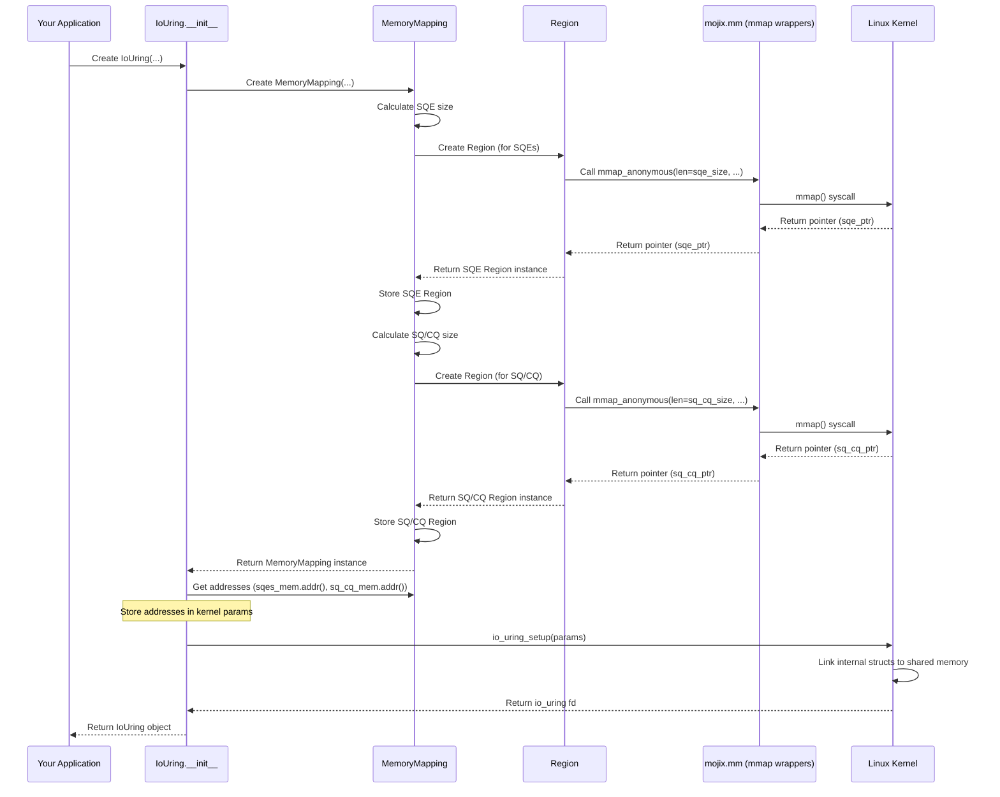

# Chapter 6: Memory Management (Region / MemoryMapping)

In the [previous chapter](05_operations__op_builders__.md), we learned how to use convenient [Operations (Op Builders)](05_operations__op_builders__.md) like `Read` or `Nop` to create the instructions (SQEs) that we place in the [Submission Queue (SQ)](02_submission_queue__sq__.md). We also know that the kernel places results (CQEs) in the [Completion Queue (CQ)](03_completion_queue__cq__.md).

But *where* exactly do these queues (SQ and CQ) and the array of SQEs live? How can both our application and the Linux kernel access them super quickly without constantly copying data back and forth?

## The Problem: Slow Communication Between App and Kernel

Imagine your application and the Linux kernel live in separate buildings. If you need to give the kernel a list of tasks (SQEs) or get results back (CQEs), constantly sending messengers back and forth with copies of the information would be very slow. Every time you submit an SQE, you'd have to copy it into a special message for the kernel. Every time the kernel finishes a task, it would have to copy the CQE into a message for you. This copying takes time and slows things down, defeating the purpose of asynchronous I/O.

## The Solution: A Shared Workspace (Shared Memory)

The genius of `io_uring` lies in its use of **shared memory**. Instead of sending messages, your application and the kernel agree to set up a **shared workspace** that both can directly see and use.

**Analogy:** Imagine you and your coworker (the kernel) set up a shared whiteboard.
*   You can write your task requests (SQEs) directly onto one section of the whiteboard (the SQE array).
*   There are designated areas on the whiteboard to track which tasks are incoming (the SQ ring) and which results are outgoing (the CQ ring).
*   Your coworker (kernel) can read your tasks directly from the whiteboard and write the results directly back.
*   No need to make photocopies or send memos back and forth!

This "shared whiteboard" is achieved using a Linux mechanism called **`mmap`** (memory mapping). `mmap` allows a section of memory to be accessible by both the application (your code) and the kernel simultaneously.

The `io_uring` library needs to map specific memory areas for:
1.  The **Submission Queue (SQ)** ring buffer indices and flags.
2.  The **Completion Queue (CQ)** ring buffer indices, flags, and the array of CQE results.
3.  The array of **Submission Queue Entries (SQEs)** where you prepare your requests using Op Builders.

The `io_uring` library provides helpers to manage these shared memory areas: `Region` and `MemoryMapping`.

## Meet the Memory Managers

1.  **`Region` (A Section of the Whiteboard):**
    *   Think of `Region` as managing one specific rectangular area on our shared whiteboard.
    *   It represents a contiguous block of memory obtained via `mmap`.
    *   Crucially, `Region` also handles cleanup. When a `Region` object is no longer needed (goes out of scope), it automatically tells the system to unmap the memory (using `munmap`), effectively erasing that section of the whiteboard and freeing up the resource. This is similar to how `OwnedFd` manages file descriptors in [Chapter 4](04_file_descriptors__fd___ownedfd___iouringfd__.md).

2.  **`MemoryMapping` (Organizing the Whiteboard):**
    *   `io_uring` actually needs *two* separate shared memory regions for the queues and the SQEs (for technical reasons related to how the kernel sets them up).
    *   `MemoryMapping` is a higher-level helper struct that holds and manages *both* of these required `Region`s together.
    *   It ensures that the correct memory areas are mapped for the SQ/CQ ring structures and the SQE array, based on information provided by the kernel during setup.

**The Good News:** You usually don't interact directly with `Region` or `MemoryMapping` yourself! When you create the main `IoUring` object (back in [Chapter 1](01_iouring__queue_pair__.md)), it automatically creates a `MemoryMapping` instance internally, which in turn creates the necessary `Region`s using `mmap`.

Understanding this concept helps appreciate *how* `io_uring` achieves its speed – by eliminating data copies through shared memory.

## How `IoUring` Sets Up Shared Memory

Let's revisit the creation of our `IoUring` object and see where `MemoryMapping` fits in. Remember this simplified code from Chapter 1?

```mojo
# File: io_uring/qp.mojo (Simplified IoUring __init__)

# ... imports including MemoryMapping, Region, IoUringParams ...
from .mm import MemoryMapping, Region
from mojix.fd import OwnedFd
from mojix.io_uring import io_uring_setup, IoUringParams

struct IoUring[...](Movable):
    var _sq: Sq[...]
    var _cq: Cq[...]
    var fd: OwnedFd[...]
    var mem: MemoryMapping[...] # Holds the shared memory regions!

    fn __init__(
        out self, *, sq_entries: UInt32, mut params: IoUringParams
    ) raises:
        # ... prepare kernel parameters (params) ...

        # 1. Create MemoryMapping BEFORE calling io_uring_setup
        #    (if using registered file descriptors)
        #    This calls mmap internally via Region.
        self.mem = MemoryMapping[sqe, cqe](sq_entries, params)

        # Pass memory addresses to kernel parameters
        params.cq_off.user_addr = self.mem.sq_cq_mem.addr()
        params.sq_off.user_addr = self.mem.sqes_mem.addr()

        # 2. Ask kernel for io_uring instance and get file descriptor
        self.fd = io_uring_setup[is_registered](sq_entries, params)

        # 3. Initialize SQ/CQ wrappers using the shared memory regions
        #    held by self.mem
        self._sq = Sq[...] (params, sq_cq_mem=self.mem.sq_cq_mem, ...)
        self._cq = Cq[...] (params, sq_cq_mem=self.mem.sq_cq_mem)

        # ... other setup ...
```

**Explanation:**

1.  The `IoUring` struct contains a field `mem` of type `MemoryMapping`.
2.  Inside `__init__`, *before* calling the main `io_uring_setup` syscall (when using the default registered FDs), we create the `MemoryMapping` instance: `self.mem = MemoryMapping[...]`.
3.  The `MemoryMapping.__init__` calculates the required sizes for the SQ/CQ ring region and the SQE array region. It then creates two `Region` objects (stored within `self.mem`), each making an `mmap` call to get anonymous shared memory.
4.  We get the memory addresses (`.addr()`) from the regions managed by `self.mem` and put them into the `params` struct that we will pass to the kernel. This tells the kernel where *our* side of the shared memory lives.
5.  `io_uring_setup` is called. The kernel uses the addresses we provided to link its internal structures to our shared memory regions.
6.  Finally, the `Sq` and `Cq` objects are initialized, using pointers derived from the shared memory regions held within `self.mem`.

This automatic setup ensures that the SQ, CQ, and SQE arrays exist in memory accessible to both your application and the kernel right from the start.

## Under the Hood: Mapping the Memory

What happens step-by-step when `MemoryMapping` is created inside `IoUring.__init__`?

1.  **Calculate Sizes:** `MemoryMapping.__init__` determines how much memory is needed for the SQ/CQ ring structures (based on requested queue entries and kernel info) and for the SQE array (based on requested SQ entries and SQE size).
2.  **Create SQE Region:** It creates the first `Region` object for the SQE array. The `Region.__init__` calls the `mmap_anonymous` function (a wrapper around the `mmap` system call). This asks the kernel for a block of shared memory of the calculated size. The kernel returns a pointer to this memory block. The `Region` stores this pointer and the size.
3.  **Create SQ/CQ Region:** It creates the second `Region` object for the combined SQ/CQ ring structures. Again, `Region.__init__` calls `mmap_anonymous`, gets another block of shared memory, and the `Region` stores its pointer and size.
4.  **Store Regions:** The `MemoryMapping` object stores these two newly created `Region` objects (`sqes_mem` and `sq_cq_mem`).
5.  **Provide Addresses:** `MemoryMapping` provides methods (`.addr()`) to get the starting memory addresses of these regions, which are then passed to the kernel via `io_uring_setup`.

Here's a sequence diagram showing this flow:



Let's look at simplified code for `Region` and `MemoryMapping`.

First, the `Region` struct from `io_uring/mm.mojo`, which wraps a single memory mapping:

```mojo
# File: io_uring/mm.mojo (Simplified Region)

from mojix.mm import mmap_anonymous, munmap, MapFlags, ProtFlags
from memory import UnsafePointer
from mojix.ctypes import c_void

struct Region(Movable):
    var ptr: UnsafePointer[c_void] # Pointer to the start of the memory
    var len: UInt                  # Length of the memory block

    # Constructor for anonymous (not file-backed) memory
    @always_inline
    fn __init__(out self, *, len: UInt, flags: MapFlags) raises:
        # Ask kernel for shared, readable/writable memory
        self.ptr = mmap_anonymous(
            unsafe_ptr=UnsafePointer[c_void](), # Let kernel choose address
            len=len,
            prot=ProtFlags.READ | ProtFlags.WRITE,
            flags=MapFlags.SHARED | MapFlags.POPULATE | flags,
        )
        self.len = len

    # Destructor - automatically cleans up the memory mapping!
    @always_inline
    fn __del__(owned self):
        try:
            # Tell kernel we're done with this memory
            munmap(unsafe_ptr=self.ptr, len=self.len)
        except:
            pass # Ignore errors during cleanup

    # Helper to get the memory address as a number
    @always_inline
    fn addr(self) -> UInt64:
        return Int(self.ptr)

    # ... other helpers to get typed pointers into the region ...
```

**Explanation:**

*   `Region` stores the `ptr` (start address) and `len` (size) of the mapped memory.
*   `__init__` calls `mmap_anonymous` to request the shared memory from the kernel. `MapFlags.SHARED` is key here.
*   `__del__` calls `munmap`, ensuring the memory is released when the `Region` object is destroyed. This prevents memory leaks.
*   `addr()` provides the starting address needed for `IoUringParams`.

Now, the `MemoryMapping` struct from `io_uring/mm.mojo`, which holds the two `Region`s needed for `io_uring`:

```mojo
# File: io_uring/mm.mojo (Simplified MemoryMapping)

# ... imports including Region, IoUringParams, Sqe, Cqe ...
from .params import Entries # Helper to calculate queue sizes
from sys.info import sizeof
from mojix.mm import MapFlags

struct MemoryMapping[sqe: SQE, cqe: CQE](Movable):
    var sqes_mem: Region  # Region for the SQE array
    var sq_cq_mem: Region # Region for SQ/CQ ring data

    # Constructor used by IoUring.__init__
    fn __init__(out self, sq_entries: UInt32, mut params: IoUringParams) raises:
        # 1. Calculate required sizes
        entries = Entries(sq_entries=sq_entries, params=params)
        sqes_size = entries.sq_entries * sqe.size
        sq_cq_size = cqe.rings_size + entries.cq_entries * cqe.size
        # (Simplified size calculation)

        # 2. Create the Region for SQEs
        #    (May involve logic for page sizes and huge pages)
        self.sqes_mem = Region(len=sqes_size, flags=MapFlags())

        # 3. Create the Region for SQ/CQ ring data
        self.sq_cq_mem = Region(len=sq_cq_size, flags=MapFlags())

        # 4. Store the addresses in params (for the kernel)
        #    This happens *after* __init__ returns, in IoUring.__init__
        #    params.cq_off.user_addr = self.sq_cq_mem.addr()
        #    params.sq_off.user_addr = self.sqes_mem.addr()

    # Destructor (implicitly calls __del__ on sqes_mem and sq_cq_mem)
    # fn __del__(owned self):
    #    self.sqes_mem^.__del__()
    #    self.sq_cq_mem^.__del__()

    # ... other methods ...
```

**Explanation:**

*   `MemoryMapping` holds two `Region` members: `sqes_mem` and `sq_cq_mem`.
*   Its `__init__` calculates the needed sizes based on the requested number of SQ entries (`sq_entries`) and kernel parameters (`params`).
*   It then creates the two `Region` instances, triggering the `mmap` calls.
*   When a `MemoryMapping` object is destroyed, the destructors of its contained `Region` objects are called automatically, ensuring both memory maps are cleaned up via `munmap`.

This setup provides a robust and automatic way to manage the essential shared memory required for `io_uring` communication.

## Conclusion

You've learned about the critical role of shared memory in making `io_uring` fast. By using memory mapping (`mmap`), both your application and the kernel can access the [Submission Queue (SQ)](02_submission_queue__sq__.md), [Completion Queue (CQ)](03_completion_queue__cq__.md), and the SQE array directly, eliminating slow data copies.

You saw how the `Region` struct wraps a single memory map and ensures it's cleaned up (`munmap`), and how `MemoryMapping` groups the two specific regions needed by `io_uring`. While this happens automatically when you create an `IoUring` object, understanding this foundation helps appreciate the efficiency of the system.

The shared memory we discussed here is primarily for the *control structures* (queues and SQEs). But what about the actual *data* you want to read or write? Can we also use shared memory to make data transfer more efficient? Yes! The next chapter introduces the concept of the [Buffer Ring (BufRing / Buf)](07_buffer_ring__bufring___buf__.md), which allows pre-registering data buffers for even faster I/O operations.

---

Generated by [AI Codebase Knowledge Builder](https://github.com/The-Pocket/Tutorial-Codebase-Knowledge)