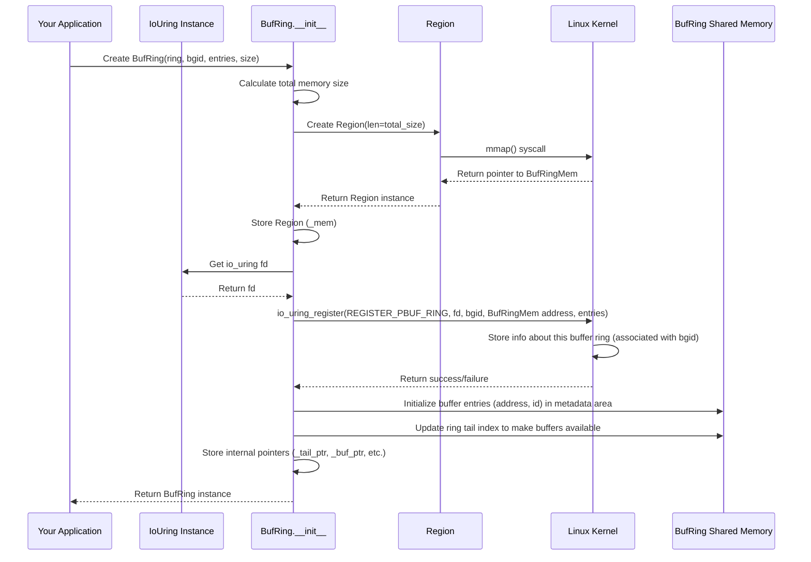

# Chapter 7: Buffer Ring (BufRing / Buf)

In the [previous chapter](06_memory_management__region___memorymapping__.md), we learned how `io_uring` uses shared memory ([`Region`](06_memory_management__region___memorymapping__.md) / [`MemoryMapping`](06_memory_management__region___memorymapping__.md)) to efficiently manage the communication queues ([SQ](02_submission_queue__sq__.md) and [CQ](03_completion_queue__cq__.md)) between your application and the kernel. This avoids slow data copying for the instructions and results themselves.

But what about the actual *data* involved in operations like reading from a file or receiving network packets? Normally, when you submit a read request ([using an Op Builder](05_operations__op_builders__.md)), you tell the kernel *exactly* which piece of your application's memory (a buffer) to put the data into. This works, but it has a hidden cost.

## The Problem: Pointing Out a Box Every Single Time

Imagine you run a busy mail receiving service. Every time a small package arrives, you have to:
1.  Find an empty box in your storage room.
2.  Tell the delivery person (the kernel) the *exact location* of that specific box ("Use box #123 on shelf B").
3.  The delivery person uses that box.
4.  You might need to temporarily reserve that box so no one else uses it while the delivery person has it.

This process of finding, specifying, and temporarily reserving a specific box for *every single package* can become inefficient, especially if packages arrive very quickly. The kernel, similarly, has to do some setup work (like "pinning" the memory page so it doesn't get moved) for the specific buffer address you provide with each read or receive request. Doing this repeatedly adds overhead.

## The Solution: A Revolving Shelf of Pre-Approved Containers

What if you could pre-approve a set of standard containers and put them on a revolving shelf right next to the delivery door?

1.  You set up a revolving shelf (`BufRing`) near the door.
2.  You fill the shelf with standardized, empty containers (`Buf`), each with a unique ID. You tell the kernel about this shelf and its ID.
3.  When a package arrives, you simply tell the delivery person (kernel), "Put the package in the next available container on shelf #X".
4.  The delivery person grabs the next free container, puts the package in it, and tells you the ID of the container they used.
5.  Once you've processed the package, you put the empty container back on the shelf for reuse.

This is exactly what the **Buffer Ring** (`BufRing`) mechanism in `io_uring` allows!

*   **`BufRing` (The Revolving Shelf):** A manager object that holds a pool of memory buffers. You register this ring with the kernel under a specific **Buffer Group ID (`bgid`)**.
*   **`Buf` (The Standardized Container):** A single memory buffer within the ring. Each `Buf` has enough space to hold incoming data and has a unique Buffer ID (`bid`) within the ring.
*   **Kernel Selection:** Instead of passing a specific buffer address in your read/receive SQE, you tell the kernel: "Please use a buffer from buffer group `bgid`". The kernel efficiently picks an available `Buf` from the pre-registered `BufRing`.
*   **Result:** The kernel tells you which buffer it used by putting the `bid` in the Completion Queue Entry ([CQE](03_completion_queue__cq__.md)).
*   **Recycling:** You process the data, and then easily recycle the `Buf` back into the `BufRing` so the kernel can use it again.

This avoids the per-operation overhead of registering and unregistering individual buffers, making operations like network receives potentially much faster.

## How to Use a Buffer Ring

Let's walk through the typical lifecycle:

**1. Setting Up the Shelf (`BufRing`)**

First, you need to create the `BufRing`. You tell it how many buffers (`entries`) you want, how big each buffer should be (`entry_size`), and give it a unique ID (`bgid`). This happens after you've created your main `IoUring` object.

```mojo
from io_uring import IoUring
from io_uring.buf import BufRing # Import the buffer ring types

fn main() raises:
    # 1. Create the main IoUring instance
    var ring = IoUring(sq_entries=32) # Needs capacity

    # 2. Define BufRing parameters
    let buffer_group_id: UInt16 = 1 # Choose a unique ID for this ring
    let num_buffers: UInt16 = 64   # How many buffers in the pool
    let buffer_size: UInt32 = 2048 # Size of each buffer (e.g., 2KB)

    # 3. Create and register the BufRing
    #    This allocates memory and tells the kernel about it.
    #    It automatically fills the ring with initial buffers.
    var buf_ring = BufRing(
        ring, # Pass the IoUring instance
        bgid=buffer_group_id,
        entries=num_buffers,
        entry_size=buffer_size,
    )

    print("BufRing created and ready with", num_buffers, "buffers.")

    # Now 'buf_ring' is ready to be used by the kernel.

    # IMPORTANT: The BufRing needs to be unregistered before the
    # IoUring is destroyed. We can do this manually if needed,
    # or often wrap it in a structure that handles this.
    # For simplicity, we'll imagine manual unregistration here:
    # ring.unsafe_delete_buf_ring(buf_ring^)
```

**Explanation:**

*   We import `BufRing` from `io_uring.buf`.
*   We create our standard `IoUring` object.
*   We define the parameters: a buffer group ID (`bgid`), the number of buffers, and the size of each.
*   `var buf_ring = BufRing(...)` creates the buffer ring. This single line:
    *   Allocates a contiguous block of memory large enough for all the buffers plus some management data.
    *   Registers this memory block and the buffer layout with the kernel using `io_uring_register` and the chosen `bgid`.
    *   Initializes the ring structure so the kernel knows which buffers are available.
*   The `BufRing` *must* be unregistered before the `IoUring` instance is destroyed. The `unsafe_delete_buf_ring` method handles this (though often this cleanup is managed automatically by higher-level abstractions not shown here).

**2. Submitting an Operation (e.g., Receiving Network Data)**

Now, when you submit an operation that can use provided buffers (like `Recv`, `Read`), you *don't* specify a buffer address directly. Instead, you specify the `bgid`.

```mojo
from io_uring import IoUring
from io_uring.op import Recv # Example Op Builder
from io_uring.buf import BufRing
from mojix.fd import Fd # Assume 'socket_fd' is an Fd for a network socket
from mojix.io_uring import IoUringSqeFlags

fn submit_receive_with_bufring(
    ring: IoUring,
    socket_fd: Fd,
    buffer_group_id: UInt16, # The ID of our BufRing
    request_id: UInt64,
) raises:
    print("Submitting Recv using BufRing bgid:", buffer_group_id)
    var sq = ring.sq()
    if sq:
        var sqe = sq.__next__()

        # Create Recv Op Builder
        var recv_op = Recv(sqe, socket_fd, length=0) # Length is ignored here

        # --- Key Steps for BufRing ---
        # 1. Tell the kernel to select a buffer from our group
        recv_op = recv_op.buffer_select(buffer_group_id)
        # 2. Set the BUFFER_SELECT flag
        recv_op = recv_op.sqe_flags(IoUringSqeFlags.BUFFER_SELECT)
        # --- --------------------- ---

        # Set user data as usual
        recv_op = recv_op.user_data(request_id)

        print("Recv SQE prepared with buffer selection.")
    else:
        print("Submission Queue is full!")

# --- Example Usage (Conceptual) ---
fn main() raises:
    var ring = IoUring(sq_entries=32)
    let bgid: UInt16 = 1
    var buf_ring = BufRing(ring, bgid=bgid, entries=64, entry_size=2048)
    # Assume socket_fd = Fd(...) for an open network socket
    let socket_fd = Fd(unsafe_fd=4) # Pretend fd 4 is our socket
    let my_request_id: UInt64 = 201

    submit_receive_with_bufring(ring, socket_fd, bgid, my_request_id)

    # Later, submit and wait for completion...
    # _ = ring.submit_and_wait(wait_nr=1)
    # ring.unsafe_delete_buf_ring(buf_ring^) # Cleanup
```

**Explanation:**

*   We create a `Recv` Op Builder. Notice we pass `length=0` because the kernel will use the size of the buffer it selects from the `BufRing`.
*   `recv_op = recv_op.buffer_select(buffer_group_id)`: This tells the SQE which buffer group (`bgid`) the kernel should pick a buffer from.
*   `recv_op = recv_op.sqe_flags(IoUringSqeFlags.BUFFER_SELECT)`: This flag *must* be set to activate the buffer selection mechanism.
*   We still set `user_data` so we can identify the completion later.

**3. Processing the Completion**

When the operation completes, the CQE will have a special flag (`IoUringCqeFlags.BUFFER`) set if the kernel used a buffer from the ring. The specific buffer ID (`bid`) is encoded within the CQE's `flags` field.

```mojo
from io_uring import IoUring
from io_uring.buf import BufRing, Buf # Import Buf
from mojix.io_uring import IoUringCqeFlags, Cqe

fn process_completions_with_bufring(ring: IoUring, buf_ring: BufRing) raises:
    print("Checking completions...")
    var cq = ring.cq() # Check CQ non-blockingly

    while cq:
        let cqe = cq.__next__() # Get the next CQE

        print("\nProcessing CQE:")
        print("  User Data:", cqe.user_data)
        print("  Result:", cqe.res)
        print("  Flags:", cqe.flags)

        # Check if the kernel provided a buffer from the ring
        if cqe.flags & IoUringCqeFlags.BUFFER:
            print("  -> Buffer provided by kernel!")
            # Extract the buffer ID from the flags
            let buffer_id = BufRing.flags_to_index(cqe.flags)
            print("     Buffer ID (bid):", buffer_id)

            # Get the number of bytes actually received/read
            let bytes_received = cqe.res
            if bytes_received < 0:
                print("     Error occurred:", bytes_received)
                # We still need to recycle the buffer even on error!
                # This happens automatically when 'buf' goes out of scope.
                var buf = buf_ring[].unsafe_buf(
                    index=buffer_id, len=0
                )
            else:
                print("     Bytes Received:", bytes_received)
                # Get a 'Buf' object representing this specific buffer
                # It provides access to the data pointer and length.
                var buf = buf_ring[].unsafe_buf(
                    index=buffer_id, len=UInt32(bytes_received)
                )

                # --- Access the data ---
                print("     Accessing data (first few bytes):")
                let data_ptr = buf.buf_ptr.bitcast[UInt8]()
                for i in range(min(10, Int(bytes_received))):
                   print("       Byte", i, ":", data_ptr.offset(i)[])
                # --- ----------------- ---

                # 4. Automatic Recycling:
                # When 'buf' goes out of scope at the end of this block,
                # its __del__ method automatically recycles the buffer
                # back into the buf_ring for the kernel to reuse.
                print("     (Buffer", buffer_id, "will be recycled automatically)")

        else:
            print("  -> No buffer provided by kernel (standard completion)")

    print("\nFinished checking completions.")

# --- Example Usage (Conceptual) ---
fn main() raises:
    # ... (setup ring and buf_ring as before) ...
    # ... (submit operations as before) ...
    # ... (call ring.submit_and_wait(wait_nr=1)) ...

    var ring = IoUring(sq_entries=32)
    let bgid: UInt16 = 1
    var buf_ring = BufRing(ring, bgid=bgid, entries=64, entry_size=2048)
    # Assume socket_fd = Fd(...) for an open network socket
    let socket_fd = Fd(unsafe_fd=4) # Pretend fd 4 is our socket
    let my_request_id: UInt64 = 201

    submit_receive_with_bufring(ring, socket_fd, bgid, my_request_id)
    _ = ring.submit_and_wait(wait_nr=1) # Submit and wait for 1 completion

    process_completions_with_bufring(ring, buf_ring)

    # ring.unsafe_delete_buf_ring(buf_ring^) # Cleanup
```

**Explanation:**

1.  We iterate through the available CQEs using `ring.cq()`.
2.  For each `cqe`, we check if the `IoUringCqeFlags.BUFFER` bit is set in `cqe.flags`.
3.  If it is set, we know the kernel used a buffer from our ring.
4.  `BufRing.flags_to_index(cqe.flags)` extracts the specific buffer ID (`bid`) from the flags.
5.  `cqe.res` gives us the number of bytes actually read or received into the buffer (or an error code).
6.  `buf_ring[].unsafe_buf(index=buffer_id, len=...)` gets us a `Buf` object. This object doesn't copy data; it just holds a pointer (`buf.buf_ptr`) to the data *within the `BufRing`'s memory* and the valid length (`buf.len`). You use this `Buf` object to access the received data.
7.  **Crucially**, when the `buf` variable goes out of scope (at the end of the `if` block), its destructor (`__del__`) is automatically called. This destructor tells the `buf_ring` to recycle the buffer identified by `buffer_id`, making it available for the kernel to use again. You don't need to manually recycle!

## Under the Hood: How `BufRing` Works

**Setup (`BufRing.__init__`)**

1.  **Calculate Size:** Determines the total memory needed: `num_buffers * (size_of_management_data_per_buffer + buffer_size)`.
2.  **Allocate Memory:** Creates a `Region` using `mmap` to get a private, contiguous block of memory.
3.  **Register with Kernel:** Calls `io_uring_register` with the `REGISTER_PBUF_RING` operation. It passes:
    *   The starting address of the allocated memory region.
    *   The number of buffers (`entries`).
    *   The Buffer Group ID (`bgid`).
    *   The kernel now knows about this memory pool and how it's structured.
4.  **Initialize Ring Metadata:** Sets up pointers within the `BufRing` object to manage the ring (like `_tail_ptr` which points to the tail index in the shared metadata part of the region).
5.  **Provide Initial Buffers:** Loops through all the buffer slots, calculates their addresses within the allocated region, and adds them to the ring's available list (by writing their info into the shared metadata and advancing the tail index). This makes them immediately available to the kernel.



**Operation Cycle**

1.  **App:** Submits SQE with `BUFFER_SELECT` flag and `bgid`.
2.  **Kernel:** Sees the flag, looks up the `BufRing` associated with `bgid`.
3.  **Kernel:** Atomically takes a buffer ID (`bid`) and its address from the ring's available list (advancing the ring's head, not shown in detail).
4.  **Kernel:** Performs I/O (e.g., network receive) directly into the chosen buffer's memory within the `BufRingMem`.
5.  **Kernel:** Creates CQE, sets the `BUFFER` flag, encodes the `bid` into the `flags` field, sets `res` to the number of bytes transferred. Places CQE in the [Completion Queue (CQ)](03_completion_queue__cq__.md).
6.  **App:** Reads CQE from CQ.
7.  **App:** Checks `BUFFER` flag, extracts `bid` using `flags_to_index`.
8.  **App:** Calls `buf_ring[].unsafe_buf(index=bid, len=cqe.res)` to get a `Buf` object.
9.  **App:** Accesses data using `buf.buf_ptr`.
10. **App:** `Buf` object goes out of scope. `Buf.__del__` is called.
11. **`Buf.__del__`:** Calls `buf_ring[].unsafe_recycle(index=bid)`.
12. **`unsafe_recycle`:** Adds the buffer ID (`bid`) and its address back to the ring's available list by writing to the metadata area and atomically incrementing the ring's tail index (`_tail`). The buffer is now ready for the kernel to reuse.

**Simplified Code Snippets (`io_uring/buf.mojo`)**

```mojo
# File: io_uring/buf.mojo (Simplified)

from .mm import Region # For memory management
from .utils import AtomicOrdering, _atomic_store # For safe updates
from mojix.io_uring import IoUringRegisterOp, IoUringBufReg, IoUringCqeFlags
# ... other imports

struct BufRing:
    var _mem: Region # Owns the mmapped memory for buffers+metadata
    var _tail_ptr: UnsafePointer[UInt16] # Pointer to tail index in metadata
    var _tail: UInt16 # Local cache of tail index (where app adds buffers)
    var _mask: UInt16 # For ring buffer calculations (entries - 1)
    var _buf_ptr: UnsafePointer[c_void] # Pointer to start of actual buffer area
    var entries: UInt16 # Total number of buffers
    var entry_size: UInt32 # Size of one buffer
    var bgid: UInt16 # This ring's ID

    fn __init__(...) raises:
        # ... calculate size ...
        # ... create Region (_mem) via mmap ...

        # Register with kernel
        reg = IoUringBufReg(
            ring_addr=_mem.addr(), # Address of our memory
            ring_entries=UInt32(entries),
            bgid=bgid,
        )
        _ = io_uring.register(
            reg.as_register_arg(
                unsafe_opcode=IoUringRegisterOp.REGISTER_PBUF_RING
            )
        )
        # ... error check ...

        # Calculate internal pointers into _mem
        # (Simplified: Assume metadata is at start, buffers follow)
        metadata_size = entries * sizeof[io_uring_buf] # Size of management array
        self._tail_ptr = _mem.unsafe_ptr().bitcast[io_uring_buf]()[].resv # Pointer to tail
        self._buf_ptr = _mem.unsafe_ptr().offset(metadata_size) # Start of buffer data
        self._mask = entries - 1
        self._tail = 0 # Start with tail at 0
        # ... store other fields ...

        # Provide all buffers initially
        for i in range(entries):
            self.unsafe_recycle[init=True](index=i) # Add buffer i to the ring
        self.sync_tail() # Make the additions visible to kernel

    # Recycle a buffer back into the ring for the kernel
    @always_inline
    fn unsafe_recycle[*, init: Bool = False](mut self, *, index: UInt16):
        # Calculate where to write the metadata for the next available buffer slot
        metadata_slot_ptr = (
            self._mem.unsafe_ptr()
            .bitcast[io_uring_buf]()
            .offset(self._tail & self._mask) # Use tail & mask to find slot
        )
        # Calculate the address of the actual buffer data
        buffer_data_addr = self._buf_ptr.offset(UInt32(index) * self.entry_size)

        # Write buffer info into the metadata slot
        metadata_slot_ptr[].addr = Int(buffer_data_addr)
        metadata_slot_ptr[].bid = index
        if init: # Set length only on initial provision
            metadata_slot_ptr[].len = self.entry_size

        # Increment our local tail counter (wrapping is implicit via mask later)
        self._tail += 1

    # Update the shared tail pointer in memory so kernel sees recycled buffers
    @always_inline
    fn sync_tail(self):
        _atomic_store[AtomicOrdering.RELEASE](self._tail_ptr, self._tail)

    # Helper to get a Buf object for a given buffer ID
    @always_inline
    fn unsafe_buf[...](...) -> Buf[...]:
        buf_ptr = self._buf_ptr.offset(UInt32(index) * self.entry_size)
        return Buf(
            unsafe_buf_ptr=buf_ptr,
            len=len,
            index=index,
            ring_ptr=Pointer.address_of(self), # Pass pointer back to ring
        )

    # Helper to extract buffer index from CQE flags
    @always_inline
    @staticmethod
    fn flags_to_index(flags: IoUringCqeFlags) -> UInt16:
        # Shift flags right to get the buffer ID
        return UInt16((flags >> IORING_CQE_BUFFER_SHIFT).value)

    # ... destructor calls unsafe_unregister ...

struct Buf[...]:
    var buf_ptr: UnsafePointer[c_void] # Pointer to the data in BufRing memory
    var len: UInt32                   # Valid length of data
    var index: UInt16                 # This buffer's ID (bid)
    var _ring_ptr: Pointer[BufRingPtr[...], ...] # Pointer back to the ring

    # Destructor - AUTOMATICALLY recycles the buffer!
    @always_inline
    fn __del__(owned self):
        # Tell the ring to recycle this buffer
        self._ring_ptr[].unsafe_recycle(index=self.index)

    # ... methods to access data via buf_ptr ...
```

**Explanation:**

*   `BufRing` manages the underlying `_mem` (`Region`) and registers it with the kernel.
*   `unsafe_recycle` is the core logic for making a buffer available to the kernel again. It writes the buffer's address and ID into the shared metadata array at the current `_tail` position and increments `_tail`.
*   `sync_tail` pushes the application's `_tail` value to the shared memory location (`_tail_ptr`) using an atomic store, ensuring the kernel sees the newly available buffers.
*   `unsafe_buf` provides a temporary `Buf` object for accessing data, giving a pointer (`buf_ptr`) directly into the `BufRing`'s memory.
*   `Buf.__del__` is the key to automatic recycling. When a `Buf` object is destroyed, it automatically calls `unsafe_recycle` on its parent `BufRing`, using the stored `index` (the `bid`).

## Conclusion

You've learned about the **Buffer Ring (`BufRing`)**, a powerful `io_uring` feature for managing pools of pre-registered memory buffers (`Buf`). By letting the kernel choose from this pool (`BUFFER_SELECT`) instead of specifying a buffer address for every read/receive operation, you can reduce per-operation overhead and potentially improve performance significantly, especially for high-throughput network applications.

You saw how to:
1.  Create and register a `BufRing` with a specific `bgid`.
2.  Submit operations using `buffer_select(bgid)` and the `BUFFER_SELECT` flag.
3.  Process completions by checking the `BUFFER` flag in the CQE and extracting the buffer ID (`bid`).
4.  Access the data using the temporary `Buf` object obtained from the `BufRing`.
5.  Rely on the automatic recycling mechanism when the `Buf` object goes out of scope.

This mechanism adds another layer of efficiency to `io_uring`'s already fast design.

We've now covered the core components: queues, file descriptors, operations, memory management, and buffer rings. How do we fine-tune the behavior of the `IoUring` instance itself? The next chapter explores the various configuration [Parameters (Params)](08_parameters__params__.md) you can set when creating the `IoUring`.

---

Generated by [AI Codebase Knowledge Builder](https://github.com/The-Pocket/Tutorial-Codebase-Knowledge)