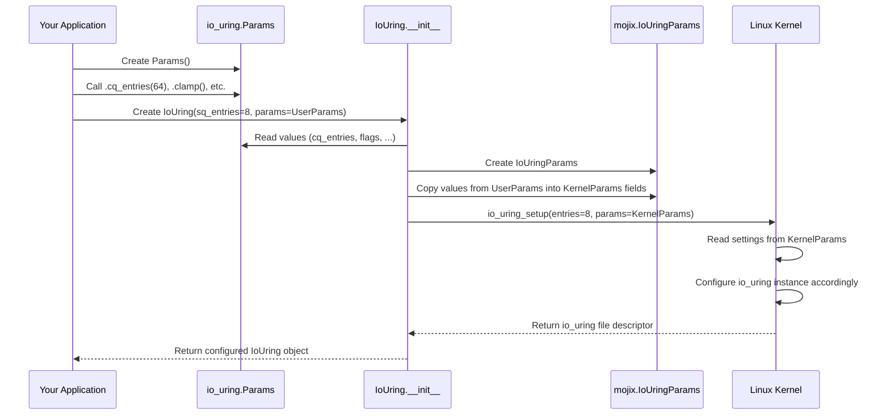

# Chapter 8: Parameters (Params)

Welcome to the final chapter of our introductory tour of `io_uring`! In the [previous chapter](07_buffer_ring__bufring___buf__.md), we explored the efficient [Buffer Ring (BufRing / Buf)](07_buffer_ring__bufring___buf__.md) mechanism for managing data buffers. We've covered how to set up the queues, handle files, create operations, manage memory, and even optimize buffer handling.

But when we first created our main `IoUring` object back in [Chapter 1](01_iouring__queue_pair__.md), we only specified one thing: the number of entries for the [Submission Queue (SQ)](02_submission_queue__sq__.md) (`sq_entries`). What if we want more control over how the `IoUring` instance behaves?

## The Problem: Default Settings Aren't Always Perfect

Imagine getting a new phone or computer. When you first turn it on, it works with default settings. But often, you want to customize it – change the screen brightness, set up Wi-Fi, choose a different background, or adjust performance settings.

Similarly, the basic `IoUring(sq_entries=8)` call sets up an `io_uring` instance with many default configurations chosen by the kernel or the library. These defaults are often sensible, but sometimes you might need to adjust them for your specific application's needs.

For example:
*   What if you expect to have many completed operations ([CQEs](03_completion_queue__cq__.md)) pile up before you can process them? The default [Completion Queue (CQ)](03_completion_queue__cq__.md) size might be too small.
*   What if you want to enable specific kernel optimizations or change how the kernel polls for work?

We need a way to provide these custom settings *before* the `IoUring` instance is fully "turned on".

## The Solution: The `Params` Control Panel

The `io_uring` library provides the `Params` struct for exactly this purpose.

Think of the `Params` struct as the **control panel** or **settings menu** you use when setting up your new `IoUring` "device". Before the `IoUring` instance is created and starts running, you use `Params` to configure various options.

You create a `Params` object, adjust the settings you care about using its methods, and then pass this `Params` object when you create the `IoUring`.

## Using `Params`: Customizing Your `IoUring`

Let's try a common use case: setting a specific size for the [Completion Queue (CQ)](03_completion_queue__cq__.md). By default, the CQ size is often double the SQ size. But maybe you know you'll submit tasks slowly but they might complete quickly, potentially overflowing a smaller default CQ. You can use `Params` to request a larger CQ.

```mojo
from io_uring import IoUring
from io_uring.params import Params # Import the Params struct

fn main() raises:
    # 1. Define the SQ size we want
    let sq_size: UInt32 = 8

    # 2. Create a Params object
    var io_params = Params()

    # 3. Customize the parameters
    #    Let's request a Completion Queue size of 64 entries.
    io_params = io_params.cq_entries(64)
    print("Params configured: Requesting CQ size =", 64)

    # We could configure other settings here too, e.g.:
    # io_params = io_params.clamp() # Ask kernel to clamp values if too high
    # io_params = io_params.dontfork() # Prevent ring fd inheritance on fork

    # 4. Create the IoUring instance, passing our customized params
    var ring = IoUring(sq_entries=sq_size, params=io_params)

    print("IoUring created with custom CQ size!")

    # Now 'ring' is set up with sq_entries=8 (or next power of 2)
    # and cq_entries=64 (or next power of 2, clamped if needed).
```

**Explanation:**

1.  `from io_uring.params import Params`: We import the necessary struct.
2.  `var io_params = Params()`: We create a default `Params` object.
3.  `io_params = io_params.cq_entries(64)`: We use the `.cq_entries()` method on the `Params` object. This tells the parameters object that we want to request a CQ size of 64. It also internally sets a flag (`IoUringSetupFlags.CQSIZE`) to let the kernel know we're providing a specific CQ size. Notice we reassign `io_params` because these methods often follow Mojo's convention of consuming `self` and returning a new instance for chaining.
4.  `var ring = IoUring(sq_entries=sq_size, params=io_params)`: When creating the `IoUring`, we now pass our configured `io_params` object using the `params` keyword argument. The `IoUring.__init__` method will use these parameters during setup.

**Other Available Parameters (Advanced Settings)**

The `Params` struct allows configuring other aspects, often corresponding to flags or options in the underlying `io_uring_setup` system call:

*   **Flags (`.flags`):** You can set flags like `IoUringSetupFlags.IOPOLL` or `IoUringSetupFlags.SQPOLL` to enable kernel-side polling modes (potentially reducing system call overhead but sometimes increasing CPU usage). Or `IoUringSetupFlags.CLAMP` to ask the kernel to silently adjust requested queue sizes if they are invalid, instead of returning an error.
*   **Kernel Threads (`.sq_thread_cpu`, `.sq_thread_idle`):** You can request that the kernel dedicate a thread to polling the [Submission Queue (SQ)](02_submission_queue__sq__.md) (`SQPOLL` flag) and optionally suggest which CPU it should run on (`sq_thread_cpu`) or how long it should sleep when idle (`sq_thread_idle`).
*   **Fork Behavior (`.dontfork()`):** Prevent the `io_uring` file descriptor from being inherited by child processes after a `fork()`.

Think of these like the "Advanced Settings" menu on your device – powerful, but you typically only change them if you have a specific reason and understand the implications.

## Under the Hood: Applying the Settings

What happens when you pass the `Params` object to `IoUring.__init__`?

1.  **User Params:** Your Mojo code creates and configures the user-friendly `io_uring.Params` object (like `io_params` in the example).
2.  **Internal Params:** Inside `IoUring.__init__`, the library takes the values from your `Params` object (`cq_entries`, flags, etc.) and copies them into a different structure: `mojix.io_uring.IoUringParams`. This `IoUringParams` structure directly matches the layout expected by the Linux kernel for the `io_uring_setup` system call.
3.  **System Call:** The library calls the `io_uring_setup` system call, passing the number of SQ entries and a pointer to the populated `IoUringParams` structure.
4.  **Kernel Setup:** The Linux kernel reads the values from the `IoUringParams` structure (your requested CQ size, flags, thread settings) and uses them to configure the new `io_uring` instance precisely as requested.
5.  **Result:** The kernel returns a file descriptor for the newly configured `io_uring` instance. The `IoUring` object wraps this up, ready for use.

Here's a diagram showing how the user parameters flow to the kernel:



Let's look at the simplified code involved. First, the user-facing `Params` struct:

```mojo
# File: io_uring/params.mojo (Simplified Params struct)

from mojix.io_uring import IoUringSetupFlags

@value
struct Params(Defaultable):
    # Stores various configuration flags
    var flags: IoUringSetupFlags
    # Stores the user's requested CQ size (0 means use default)
    var _cq_entries: UInt32
    # ... other fields like sq_thread_cpu, sq_thread_idle, wq_fd ...
    var _dontfork: Bool # Internal flag for dontfork() setting

    fn __init__(out self):
        # Initialize with default values
        self.flags = IoUringSetupFlags.NO_SQARRAY # A default library flag
        self._cq_entries = 0
        # ... initialize other fields to 0 or defaults ...
        self._dontfork = False

    # Method to set the requested CQ size
    fn cq_entries(mut self, value: UInt32) -> ref [self] Self:
        self._cq_entries = value
        # Also set the CQSIZE flag to tell the kernel we provided a value
        self.flags |= IoUringSetupFlags.CQSIZE
        return self

    # Method to set the CLAMP flag
    fn clamp(mut self) -> ref [self] Self:
        self.flags |= IoUringSetupFlags.CLAMP
        return self

    # Method to set the dontfork option
    fn dontfork(mut self) -> ref [self] Self:
        self._dontfork = True
        return self

    # Helper to check if dontfork was requested
    fn is_dontfork(self) -> Bool:
        return self._dontfork

    # ... other methods to set other flags or parameters ...
```

**Explanation:**

*   The `Params` struct holds fields like `flags` and `_cq_entries`.
*   Methods like `.cq_entries()` or `.clamp()` update the corresponding field and potentially set the relevant bit in the `flags` field.
*   It's designed to be built up step-by-step before being passed to `IoUring`.

Now, see how `IoUring.__init__` uses it:

```mojo
# File: io_uring/qp.mojo (Simplified IoUring.__init__ taking Params)

from .params import Params
# Import the kernel-level parameter struct
from mojix.io_uring import IoUringParams, io_sqring_offsets, io_cqring_offsets, IoUringFeatureFlags
# ... other imports ...

struct IoUring[...](Movable):
    # ... fields like _sq, _cq, fd, mem ...

    # Constructor that accepts the user's Params object
    fn __init__(out self, *, sq_entries: UInt32, params: Params) raises:
        # 1. Create an instance of the kernel-level IoUringParams struct
        #    Initialize with some defaults.
        var kernel_params = IoUringParams(
            sq_entries = 0, # Kernel uses the 'sq_entries' arg directly
            cq_entries = params._cq_entries, # Copy requested CQ entries
            flags = params.flags,          # Copy configured flags
            sq_thread_cpu = params.sq_thread_cpu, # Copy thread CPU hint
            sq_thread_idle = params.sq_thread_idle, # Copy thread idle setting
            features = IoUringFeatureFlags(), # Kernel fills this on return
            wq_fd = params.wq_fd,             # Copy workqueue fd
            resv = DTypeArray[DType.uint32, 3](), # Reserved
            sq_off = io_sqring_offsets(),      # Kernel fills offsets
            cq_off = io_cqring_offsets(),      # Kernel fills offsets
        )

        # 2. Pass this kernel_params struct to the lower-level __init__
        #    (This lower-level __init__ eventually calls io_uring_setup)
        self = Self(sq_entries=sq_entries, params=kernel_params)

        # 3. Handle specific post-setup actions based on user params
        if params.is_dontfork():
            # If dontfork was requested, apply it to the memory mapping
            self.mem.dontfork() # Assuming MemoryMapping has a dontfork method

    # Another internal __init__ that takes the kernel-level IoUringParams
    fn __init__(
        out self, *, sq_entries: UInt32, mut params: IoUringParams
    ) raises:
        # ... adds library-specific flags to params.flags ...
        # ... sets up MemoryMapping (self.mem) ...
        # ... calls io_uring_setup(sq_entries, params) to get self.fd ...
        # ... initializes self._sq and self._cq using params and self.mem ...
        # (Details omitted as covered in previous chapters)
        print("Internal init called with kernel params flags:", params.flags)
```

**Explanation:**

*   The `IoUring.__init__` that takes the user `Params` object acts as a translator.
*   It creates the kernel-facing `IoUringParams` struct.
*   It copies the values set by the user (like `params._cq_entries`, `params.flags`) into the corresponding fields of `kernel_params`.
*   It then calls another internal `__init__` (or directly calls `io_uring_setup`) with this `kernel_params` struct.
*   It might also perform follow-up actions based on the user `Params`, like calling `self.mem.dontfork()` if `params.is_dontfork()` was true.

This setup provides a clean separation: a user-friendly `Params` struct for configuration and an internal mechanism to translate those settings into what the kernel expects.

## Conclusion

Congratulations! You've reached the end of this introductory tutorial series on `io_uring`. In this final chapter, you learned about the `Params` struct, which acts as a control panel allowing you to customize the behavior and features of an `IoUring` instance when you create it.

You saw how to:
*   Create a `Params` object.
*   Set specific options like the desired [Completion Queue (CQ)](03_completion_queue__cq__.md) size using methods like `.cq_entries()`.
*   Pass the configured `Params` object during `IoUring` creation.
*   Understand that `Params` allows access to advanced kernel features and flags.

While the default settings are often sufficient, `Params` gives you the power to fine-tune `io_uring` for optimal performance and behavior in your specific application.

We've covered the fundamental building blocks: the `IoUring` queue pair, the [Submission Queue (SQ)](02_submission_queue__sq__.md), the [Completion Queue (CQ)](03_completion_queue__cq__.md), [File Descriptors](04_file_descriptors__fd___ownedfd___iouringfd__.md), [Operation Builders](05_operations__op_builders__.md), [Memory Management](06_memory_management__region___memorymapping__.md), [Buffer Rings](07_buffer_ring__bufring___buf__.md), and finally, Configuration [Parameters](08_parameters__params__.md). We hope this tour has given you a solid foundation for using the `io_uring` library to build high-performance asynchronous applications in Mojo!

---

Generated by [AI Codebase Knowledge Builder](https://github.com/The-Pocket/Tutorial-Codebase-Knowledge)