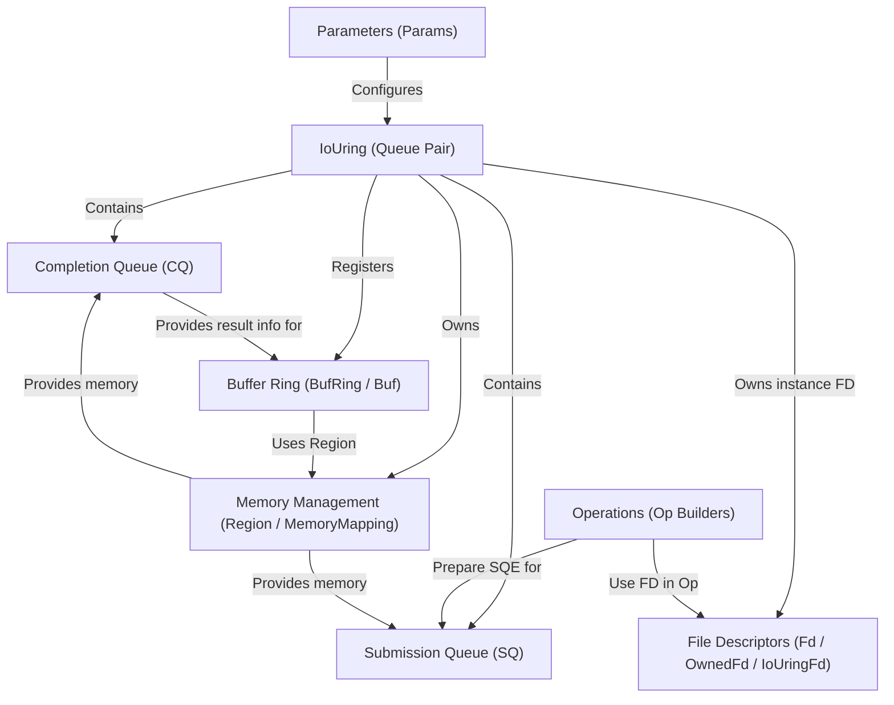

# Tutorial: io_uring

This project provides a Mojo interface for Linux's **io_uring** system, enabling high-performance **asynchronous I/O**.
It centers around the *`IoUring` queue pair*, which uses a *Submission Queue* (`SQ`) to send I/O requests to the kernel and a *Completion Queue* (`CQ`) to receive results efficiently.
Helper structures simplify creating operations and managing resources like memory and file descriptors.

**Source Repository:** [None](None)

## Chapters

1. [IoUring (Queue Pair)
](01_iouring__queue_pair__.md)
2. [Submission Queue (SQ)
](02_submission_queue__sq__.md)
3. [Completion Queue (CQ)
](03_completion_queue__cq__.md)
4. [File Descriptors (Fd / OwnedFd / IoUringFd)
](04_file_descriptors__fd___ownedfd___iouringfd__.md)
5. [Operations (Op Builders)
](05_operations__op_builders__.md)
6. [Memory Management (Region / MemoryMapping)
](06_memory_management__region___memorymapping__.md)
7. [Buffer Ring (BufRing / Buf)
](07_buffer_ring__bufring___buf__.md)
8. [Parameters (Params)
](08_parameters__params__.md)

---

Generated by [AI Codebase Knowledge Builder](https://github.com/The-Pocket/Tutorial-Codebase-Knowledge)