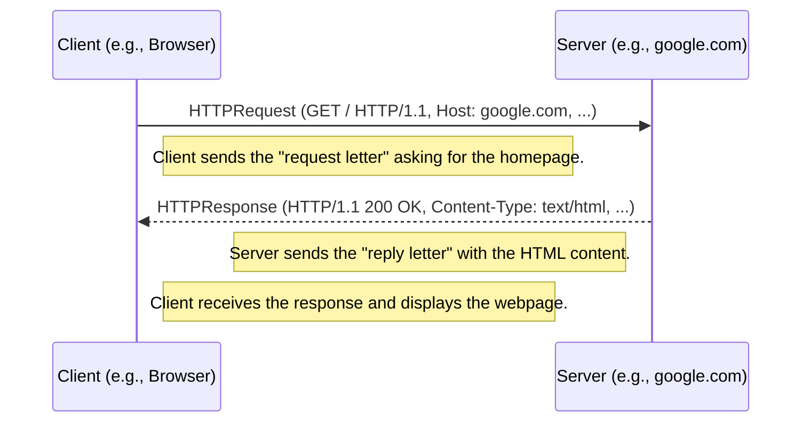

# Chapter 1: HTTP Message (Request/Response)

Welcome to the `lightbug_http` tutorial! We're excited to guide you through building web applications with Mojo.

Imagine you want to get a picture from your friend's online photo album. How do you ask for it, and how does your friend send it back over the internet? The web uses a special kind of "digital letter" system called HTTP (HyperText Transfer Protocol) to handle these conversations. This chapter introduces the fundamental building blocks of this system: **HTTP Messages**.

Think of web communication like sending letters:

1.  You (the **client**, like your web browser) write a **request** letter asking for something (e.g., "Please send me the photo at this specific address").
2.  The server (where the photo album lives) receives your letter.
3.  The server prepares a **response** letter, either containing the photo or explaining why it can't send it (e.g., "Here's the photo!" or "Sorry, photo not found").
4.  The server sends the response letter back to you.

In `lightbug_http`, these digital letters are represented by `HTTPRequest` and `HTTPResponse` objects.

## What is an HTTP Request?

An `HTTPRequest` is the message your application (the client) sends *to* a server. It's like your request letter, containing specific instructions:

*   **Method:** What action do you want to perform? Common methods are:
    *   `GET`: Retrieve data (like getting a webpage or a photo).
    *   `POST`: Send data to the server (like submitting a form).
*   **URI (Uniform Resource Identifier):** The "address" of the resource you want to interact with (e.g., `/photos/cat.jpg`). We'll dive deeper into this in [Chapter 2: URI (Uniform Resource Identifier)](02_uri__uniform_resource_identifier__.md).
*   **Headers:** Extra information or instructions for the server (e.g., "Host: myphotos.com", "Accept: image/jpeg"). Think of these like special notes on your letter. We'll cover headers in detail in [Chapter 3: HTTP Headers](03_http_headers_.md).
*   **Body (Optional):** The actual data you're sending, used mainly with methods like `POST` (e.g., the information you filled into a contact form).

Let's see how you might create a simple `HTTPRequest` in `lightbug_http` to ask for the homepage of "google.com":

```mojo
from lightbug_http import URI, Headers, Header, HTTPRequest

# 1. Specify the address (URI)
var uri = URI.parse("google.com") # We want google.com's main page

# 2. Add extra instructions (Headers)
#    The 'Host' header tells the server which website we want.
var headers = Headers(Header("Host", "google.com"))

# 3. Create the request object (Method is GET by default)
var request = HTTPRequest(uri, headers)

# Now 'request' holds our digital letter, ready to be sent!
print("Request Method:", request.method)
print("Request URI:", request.uri.full_uri)
print("Request Host Header:", request.headers["Host"])
```

*Explanation:*
We first create a `URI` object for "google.com". Then, we create `Headers` including the essential `Host` header. Finally, we combine these into an `HTTPRequest` object. By default, if we don't specify a method, `lightbug_http` assumes it's a `GET` request, which is perfect for fetching a webpage.

## What is an HTTP Response?

An `HTTPResponse` is the message the server sends *back* to the client after receiving and processing an `HTTPRequest`. It's the reply letter:

*   **Status Code & Text:** A number and a short phrase indicating the result (e.g., `200 OK` means success, `404 Not Found` means the requested resource doesn't exist).
*   **Headers:** Extra information from the server (e.g., "Content-Type: text/html", telling the browser the body contains HTML). Again, more in [Chapter 3: HTTP Headers](03_http_headers_.md).
*   **Body (Optional):** The actual content requested (like the HTML code for a webpage, image data, etc.). This is often the main part of the response if the request was successful.

Here's how you might conceptually examine a received `HTTPResponse`:

```mojo
# (Imagine 'response' is an HTTPResponse object received from a server)
# Example based on the client code snippet provided earlier.

# Check the result status
print("Response Status:", response.status_code) # e.g., 200
print("Response Status Text:", response.status_text) # e.g., "OK"

# Look at the server's instructions
print("Response Headers:", response.headers) # Shows all headers

# Get the actual content (if any)
# 'body_raw' contains the raw bytes of the response content.
# 'to_string' helps convert bytes to a readable string (if it's text).
from lightbug_http import to_string
print("Response Body (first 100 chars):", to_string(response.body_raw)[:100])
```

*Explanation:*
After sending a request, a client receives a response. We can check `response.status_code` to see if the request succeeded. We can also inspect `response.headers` for details like the content type and `response.body_raw` to get the actual data sent back by the server.

## How Request and Response Work Together

The client sends a `HTTPRequest`, and the server replies with an `HTTPResponse`. This back-and-forth forms the basis of almost all web interactions.



## Under the Hood: `HTTPRequest` and `HTTPResponse` Structures

How does `lightbug_http` actually store this information? Let's peek at simplified versions of the structures (defined in `lightbug_http/http/request.mojo` and `lightbug_http/http/response.mojo`):

**Simplified `HTTPRequest`:**

```mojo
# From: lightbug_http/http/request.mojo (Simplified)
@value
struct HTTPRequest:
    var headers: Headers         # Stores request headers
    var uri: URI               # The address requested
    var body_raw: Bytes        # Data sent by client (e.g., form data)
    var method: String         # e.g., "GET", "POST"
    var protocol: String       # e.g., "HTTP/1.1"
    # ... other fields omitted for simplicity
```

*Explanation:* This structure holds all the parts of the request letter: the method, the address (`uri`), extra instructions (`headers`), and any attached data (`body_raw`).

**Simplified `HTTPResponse`:**

```mojo
# From: lightbug_http/http/response.mojo (Simplified)
@value
struct HTTPResponse:
    var headers: Headers         # Stores response headers
    var body_raw: Bytes        # Data sent back by server (e.g., HTML)
    var status_code: Int       # e.g., 200, 404
    var status_text: String    # e.g., "OK", "Not Found"
    var protocol: String       # e.g., "HTTP/1.1"
    # ... other fields omitted for simplicity
```

*Explanation:* Similarly, this structure holds the server's reply: the result (`status_code`, `status_text`), its own instructions (`headers`), and the main content (`body_raw`).

**From Text to Objects (and back):**

When a server (using `lightbug_http`) receives data from a [Network Socket & Connection](07_network_socket___connection_.md), it's just a stream of raw bytes (text). The `HTTPRequest.from_bytes` static method reads this text, parses the method, URI, headers, and body according to HTTP rules, and creates an `HTTPRequest` object.

Conversely, when the server needs to send a reply, it constructs an `HTTPResponse` object and then uses its `encode` method (or the `encode` function from `lightbug_http.http`) to convert the object back into the properly formatted text (bytes) to send over the network. The client does the reverse: it `encode`s the `HTTPRequest` to send it and uses `HTTPResponse.from_bytes` to parse the server's reply.

```mojo
# Conceptual representation of encoding/decoding

# Server Side (Receiving Request)
raw_request_bytes = receive_from_network()
request_object = HTTPRequest.from_bytes(..., raw_request_bytes) # Text -> Object

# Server Side (Sending Response)
response_object = create_my_response()
raw_response_bytes = encode(response_object) # Object -> Text
send_to_network(raw_response_bytes)

# ---

# Client Side (Sending Request)
request_object = create_my_request()
raw_request_bytes = encode(request_object) # Object -> Text
send_to_network(raw_request_bytes)

# Client Side (Receiving Response)
raw_response_bytes = receive_from_network()
response_object = HTTPResponse.from_bytes(raw_response_bytes) # Text -> Object
```

This encoding and decoding process allows `lightbug_http` to work with easy-to-use Mojo objects while still communicating using the standard text-based HTTP protocol.

## Conclusion

You've learned about the fundamental "digital letters" of the web: `HTTPRequest` and `HTTPResponse`.

*   An `HTTPRequest` is sent by a client to ask a server for something, specifying the *method*, *URI*, *headers*, and sometimes a *body*.
*   An `HTTPResponse` is the server's reply, containing a *status code*, *headers*, and often a *body* with the requested content.
*   `lightbug_http` provides `HTTPRequest` and `HTTPResponse` structures to represent these messages in your Mojo code, handling the conversion to and from the raw text format used for network communication.

Understanding these messages is crucial because they form the core of all interactions in `lightbug_http`, whether you're building a server or a client.

In the next chapter, we'll take a closer look at the "address" part of the request: the URI.

Next: [Chapter 2: URI (Uniform Resource Identifier)](02_uri__uniform_resource_identifier__.md)

---

Generated by [AI Codebase Knowledge Builder](https://github.com/The-Pocket/Tutorial-Codebase-Knowledge)