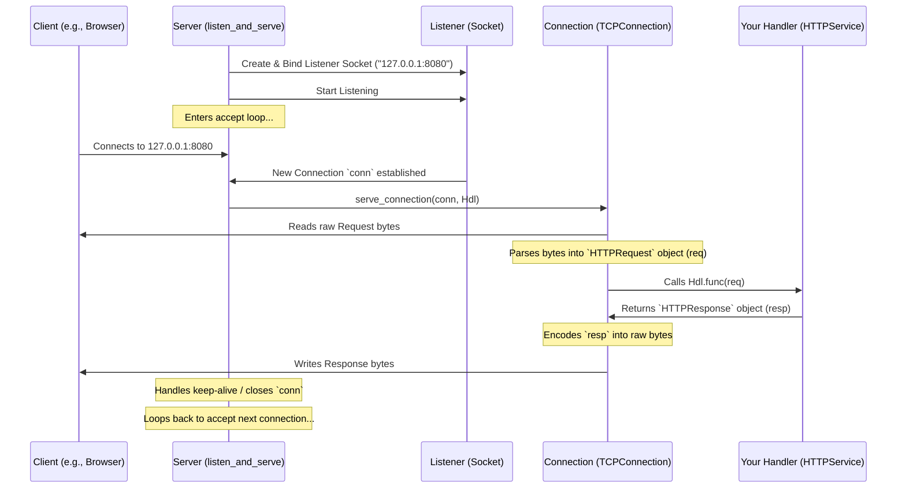

# Chapter 4: HTTP Server

In the previous chapter, [Chapter 3: HTTP Headers](03_http_headers_.md), we learned about the extra information (metadata) that travels with web requests and responses. We now understand what an [HTTP Message (Request/Response)](01_http_message__request_response__.md) looks like, where it's going ([URI (Uniform Resource Identifier)](02_uri__uniform_resource_identifier__.md)), and the special instructions it carries ([HTTP Headers](03_http_headers_.md)).

But how does a program actually *receive* these requests and send back responses? We need something that can listen for incoming calls on the network, manage these conversations, and coordinate the whole process. This is the job of an **HTTP Server**.

## What Problem Does an HTTP Server Solve? Setting Up Shop

Imagine you want to open a restaurant. You need a physical location (an address and building), someone at the door to greet customers (connections), take their orders (requests), send those orders to the kitchen (handler), and deliver the food (responses). Without this setup, customers can't reach you, and you can't serve them.

Similarly, if you want your Mojo application to be reachable over the web, you need a component that can:
1.  "Set up shop" at a specific network address (like `127.0.0.1:8080`).
2.  Listen for incoming "calls" (network connections) from clients (like web browsers).
3.  Accept these connections.
4.  Receive the client's "order" (the `HTTPRequest`).
5.  Pass the order to the right "department" (an [HTTP Service Handler](05_http_service_handler_.md)) to prepare the response.
6.  Send the "meal" (the `HTTPResponse`) back to the client.
7.  Manage multiple connections efficiently.

The `Server` struct in `lightbug_http` is designed to do exactly this. It's like the restaurant's front-of-house manager.

## The `Server` in `lightbug_http`

The `Server` struct (found in `lightbug_http/server.mojo`) is the core component responsible for listening for network traffic and orchestrating the handling of HTTP requests.

Let's see how to create a very basic web server that just listens for requests and uses a simple handler.

**Use Case:** Create a server that listens on your local machine (localhost) on port 8080 and responds to every request with "Hello from Lightbug!".

```mojo
from lightbug_http import Server, HTTPRequest, HTTPResponse, OK
from lightbug_http.service import HTTPService

# 1. Define a simple handler (our "kitchen")
#    This handler will respond to any request with "Hello from Lightbug!"
@value
struct SimpleHandler(HTTPService):
    fn func(mut self, req: HTTPRequest) raises -> HTTPResponse:
        # We don't even need to look at the request ('req') for this simple example.
        # Just return a successful response (OK) with the message.
        return OK("Hello from Lightbug!")

# 2. Create an instance of our handler
var my_handler = SimpleHandler()

# 3. Create an instance of the Server
#    We'll keep default settings for now.
var my_server = Server()

# 4. Tell the server to start listening and use our handler
print("Starting server on http://127.0.0.1:8080 ...")
try:
    # This function will run forever, listening for connections.
    my_server.listen_and_serve("127.0.0.1:8080", my_handler)
except e:
    print("Server error:", e)

```

*Explanation:*
1.  We define a `SimpleHandler` struct that implements the `HTTPService` trait. Its `func` method takes an `HTTPRequest` but ignores it, simply returning a standard "200 OK" response containing the text "Hello from Lightbug!". (We'll learn more about handlers in [Chapter 5: HTTP Service Handler](05_http_service_handler_.md)).
2.  We create an instance of `SimpleHandler`.
3.  We create an instance of the `Server`. We could customize things like the maximum number of connections here, but the defaults are fine for now.
4.  We call `my_server.listen_and_serve()`. This is the crucial step:
    *   It takes the network address (`"127.0.0.1:8080"`) where the server should listen. `127.0.0.1` (or `localhost`) means "this computer", and `8080` is a common port number for development servers.
    *   It takes the `my_handler` instance, which will be used to process incoming requests.
    *   This function starts the server's main loop. It will **block** (not return) and continuously listen for and handle incoming connections until the program is stopped (e.g., by pressing Ctrl+C in the terminal) or an error occurs.

If you run this code, you won't see much happen in the terminal except the "Starting server..." message. But now, if you open a web browser and go to `http://127.0.0.1:8080`, you should see the text "Hello from Lightbug!". The `Server` received your browser's request, passed it to `SimpleHandler`, got the response back, and sent it to your browser.

## Server Configuration

The `Server` can be configured when you create it. Some common options include:

*   `address`: Default address if not specified in `listen_and_serve`.
*   `tcp_keep_alive`: Whether to try and reuse the same network connection for multiple requests from the same client (usually more efficient).
*   `max_concurrent_connections`: How many clients can be connected at the same time.
*   `max_request_body_size`: The largest request body (e.g., file upload) the server will accept, to prevent running out of memory.

```mojo
from lightbug_http import Server
from lightbug_http.error import ErrorHandler

# Example: Create a server with specific settings
var custom_server = Server(
    name="MyWebAppServer", # Give the server a name (used in some headers)
    tcp_keep_alive=True,   # Enable keep-alive connections
    max_request_body_size=10 * 1024 * 1024 # Allow up to 10MB request bodies
)

# You would then use this custom_server with listen_and_serve
# try:
#     var handler = ... # Your handler here
#     custom_server.listen_and_serve("0.0.0.0:80", handler) # Listen on all interfaces, port 80
# except e:
#     print("Server error:", e)
```

*Explanation:*
Here, we create a `Server` instance but provide arguments to customize its behavior, enabling keep-alive connections and setting a larger maximum request body size.

## Under the Hood: What `listen_and_serve` Does

When you call `server.listen_and_serve("127.0.0.1:8080", handler)`, a sequence of events happens behind the scenes:

1.  **Parse Address:** The server parses the `"127.0.0.1:8080"` string to understand the IP address and port number.
2.  **Create Listener Socket:** It uses the underlying operating system functions (via `lightbug_http`'s [Network Socket & Connection](07_network_socket___connection_.md) abstractions) to create a "listening socket". This is like opening the restaurant's front door and telling the system you're ready for customers at this address.
3.  **Bind Socket:** The socket is "bound" to the specified IP address and port, reserving it for this server process.
4.  **Listen:** The server tells the operating system to start listening for incoming connection attempts on this socket.
5.  **Enter `serve` Loop:** The server enters its main loop (`serve` method).
6.  **Accept Connections:** Inside the loop, it calls `listener.accept()`. This call *blocks*, waiting patiently until a client tries to connect. When a client connects (e.g., your browser requests the page), `accept()` returns a *new* socket representing that specific connection (a `TCPConnection` object). This is like the manager greeting a specific customer and opening a dedicated communication line with them.
7.  **Handle Connection:** The server then calls `serve_connection()` passing the new `TCPConnection` and the `handler`.
8.  **Read Request:** `serve_connection` reads the raw bytes sent by the client over the `TCPConnection` until it detects the end of the HTTP headers (`\r\n\r\n`). It might need to read multiple times if the request is large or arrives in pieces.
9.  **Parse Request:** It uses `HTTPRequest.from_bytes` to parse these raw bytes into a structured `HTTPRequest` object (like deciphering the customer's handwritten order).
10. **Call Handler:** It calls `handler.func(request)`, passing the parsed request to your handler code (sending the order to the kitchen).
11. **Get Response:** It receives the `HTTPResponse` object back from the handler (the kitchen returns the prepared meal).
12. **Encode Response:** It uses the `encode` function to convert the `HTTPResponse` object back into the properly formatted HTTP text (bytes) that can be sent over the network.
13. **Write Response:** It writes these response bytes back to the client via the `TCPConnection`.
14. **Connection Management:** It checks the request/response headers (e.g., `Connection: close`) and the server's `tcp_keep_alive` setting to decide whether to close the `TCPConnection` or keep it open to potentially receive another request from the same client.
15. **Loop:** The `serve` loop continues, waiting to `accept()` the next incoming connection.

Here's a simplified diagram showing the flow:



**Diving into the Code (`lightbug_http/server.mojo`):**

The core logic resides in the `Server` struct's methods:

```mojo
# Simplified from lightbug_http/server.mojo

struct Server(Movable):
    # ... configuration fields (name, address, max_connections, etc.) ...
    var _address: String
    var tcp_keep_alive: Bool
    # ...

    fn listen_and_serve[T: HTTPService](mut self, address: String, mut handler: T) raises:
        # Creates the configuration for listening
        var config = ListenConfig()
        # Creates the actual listening socket bound to the address
        var listener = config.listen(address) # Calls socket(), bind(), listen()
        self.set_address(address)
        # Calls the main serving loop
        self.serve(listener^, handler)

    fn serve[T: HTTPService](mut self, owned ln: NoTLSListener, mut handler: T) raises:
        # The main loop that runs forever
        while True:
            # Waits here until a client connects
            var conn = ln.accept() # Returns a TCPConnection object for the client
            # Handles the connection (reading request, calling handler, writing response)
            self.serve_connection(conn, handler) # See below

    fn serve_connection[T: HTTPService](mut self, mut conn: TCPConnection, mut handler: T) raises -> None:
        # Loop to handle multiple requests on one connection (if keep-alive)
        while True:
            var request_buffer = Bytes()
            # Read data from the connection into request_buffer
            # until end-of-headers (\r\n\r\n) is found...
            while not end_of_headers_found(request_buffer):
                bytes_read = conn.read(...) # Read chunk
                if bytes_read == 0: conn.teardown(); return # Client disconnected
                request_buffer.extend(...)
            # ... read body if Content-Length indicates one ...

            # Try to parse the raw bytes into a request object
            var request = HTTPRequest.from_bytes(..., request_buffer)

            # Check if connection should close after this request
            var close_connection = (not self.tcp_keep_alive) or request.connection_close()

            # Call the provided handler function!
            var response = handler.func(request)

            # Add Connection: close header if needed
            if close_connection: response.set_connection_close()

            # Encode the response object back into bytes
            var response_bytes = encode(response^)
            # Send the response bytes back to the client
            _ = conn.write(response_bytes)

            # If connection should close, tear it down and exit the inner loop
            if close_connection:
                conn.teardown()
                break # Exit inner 'while True' loop for this connection

            # Otherwise, loop back to read the next request on this connection
        # End of serve_connection
```

*Explanation:*
This simplified code shows the chain: `listen_and_serve` sets up the `NoTLSListener`, `serve` loops accepting connections from the listener, and `serve_connection` handles the request-response cycle for a single connection. Inside `serve_connection`, it reads raw data, calls `HTTPRequest.from_bytes`, invokes your `handler.func`, encodes the response using `encode`, writes it back, and manages the connection lifecycle based on keep-alive settings.

## Conclusion

You've learned about the crucial role of the **HTTP Server** in web applications.

*   The server acts like a front-of-house manager, listening at a specific network address.
*   It accepts incoming client connections, reads `HTTPRequest`s, and sends back `HTTPResponse`s.
*   In `lightbug_http`, the `Server` struct handles this responsibility.
*   You start the server using `server.listen_and_serve("host:port", handler)`.
*   The server manages the low-level details of network sockets and connection lifecycles, allowing you to focus on processing requests.

The server receives the request, but *what* should it do with it? How does it generate the correct response? That's the job of the `HTTPService` handler, which we'll explore in detail next.

Next: [Chapter 5: HTTP Service Handler](05_http_service_handler_.md)

---

Generated by [AI Codebase Knowledge Builder](https://github.com/The-Pocket/Tutorial-Codebase-Knowledge)