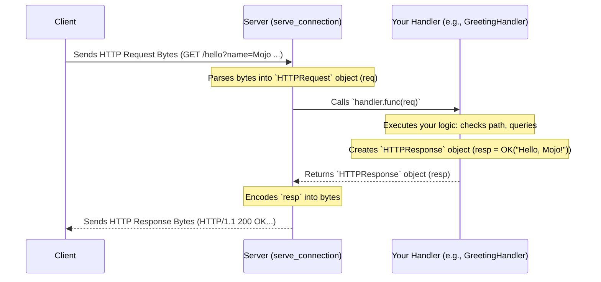

# Chapter 5: HTTP Service Handler

In [Chapter 4: HTTP Server](04_http_server_.md), we learned how the `Server` acts like a restaurant's front-of-house manager. It sets up shop at a network address, greets incoming "customers" (client connections), and takes their "orders" (parses the raw `HTTPRequest` data).

But once the manager has the order, who actually prepares the meal? The manager doesn't cook! They need to pass the order to the kitchen, where a specific chef or department knows how to make that particular dish.

This is where the **HTTP Service Handler** comes in.

## What Problem Does the HTTP Service Handler Solve? The "Chef" in the Kitchen

The `Server` knows *how* to receive requests and send responses, but it doesn't know *what* response to send for any given request. Should it return a webpage? Some data? An image? An error message? This is the *application logic* – the actual purpose of your web application.

We need a dedicated component responsible for:
1.  Receiving the parsed `HTTPRequest` from the `Server`.
2.  Examining the request details (like the requested [URI (Uniform Resource Identifier)](02_uri__uniform_resource_identifier__.md), the HTTP method, any [HTTP Headers](03_http_headers_.md), and the request body).
3.  Performing the necessary actions based on the request (e.g., looking up data in a database, doing calculations, reading a file).
4.  Creating the appropriate `HTTPResponse` (the "meal").
5.  Returning that `HTTPResponse` back to the `Server` to be sent to the client.

In `lightbug_http`, this "chef" role is defined by the `HTTPService` trait.

## The `HTTPService` Trait: A Blueprint for Handling Requests

The `HTTPService` (defined in `lightbug_http/service.mojo`) is not a concrete thing you use directly; it's a **trait**, which is like a blueprint or a contract. It defines a *required capability*: any struct that wants to act as a request handler *must* provide a specific function.

The contract requires implementing just one method:

```mojo
trait HTTPService:
    # This function takes the request and MUST return a response.
    fn func(mut self, req: HTTPRequest) raises -> HTTPResponse:
        ... # Your application logic goes here!
```

*Explanation:*
*   `trait HTTPService:` declares the blueprint.
*   `fn func(mut self, req: HTTPRequest) raises -> HTTPResponse:` This is the core requirement.
    *   It takes `mut self` (allowing the handler to potentially modify its own state, like a counter).
    *   It takes the `HTTPRequest` object (`req`) representing the client's request.
    *   It `raises` because operations like file reading or database access might fail.
    *   It **must** return an `HTTPResponse` object.

As a developer using `lightbug_http`, you don't use the `HTTPService` trait itself. Instead, you **create your own structs that *implement* this trait**. This is where you write the custom code that makes your web application unique.

## Use Case: A Simple Greeting Service

Let's create a simple web service. We want it to:
*   Respond to requests at the path `/hello`.
*   If the URL includes a query parameter like `?name=Mojo`, it should respond with "Hello, Mojo!".
*   If no name parameter is given, it should respond with "Hello, stranger!".
*   For any other path, it should return a "Not Found" error.

**Step 1: Define the Handler Struct implementing `HTTPService`**

We'll create a struct, let's call it `GreetingHandler`, and declare that it implements `HTTPService`. Then, we'll provide the required `func` method.

```mojo
from lightbug_http import HTTPService, HTTPRequest, HTTPResponse, OK, NotFound
from lightbug_http.uri import QueryMap # Needed for query parameters

@value # Make it a value type for simplicity
struct GreetingHandler(HTTPService):

    # Implement the required function from the HTTPService trait
    fn func(mut self, req: HTTPRequest) raises -> HTTPResponse:
        # Check if the requested path is "/hello"
        if req.uri.path == "/hello":
            # Check if a 'name' query parameter exists
            # uri.queries is a dictionary-like QueryMap
            var name = req.uri.queries.get("name") # Returns Optional[String]

            if name:
                # Found a name, use it in the greeting!
                return OK("Hello, " + name.value() + "!")
            else:
                # No name found, use the default greeting
                return OK("Hello, stranger!")
        else:
            # Path was not "/hello", return a 404 Not Found response
            return NotFound("Sorry, I only know the /hello path.")

```

*Explanation:*
1.  We define `GreetingHandler` and specify `(HTTPService)` to indicate it implements the trait.
2.  Inside `func`, we first check `req.uri.path`. The `HTTPRequest` object (`req`) gives us easy access to the parsed [URI (Uniform Resource Identifier)](02_uri__uniform_resource_identifier__.md).
3.  If the path matches, we use `req.uri.queries.get("name")` to look for the "name" query parameter. `get` returns an `Optional[String]`, so we check if it has a value (`if name:`).
4.  Based on whether `name` exists, we construct a success response using `OK()`, which creates a `HTTPResponse` with status code 200 and the provided text body.
5.  If the path doesn't match `/hello`, we return a standard `NotFound()` response (status code 404).

**Step 2: Use the Handler with the Server**

Now, we plug this `GreetingHandler` into the `Server` we learned about in the previous chapter.

```mojo
from lightbug_http import Server

# Assume GreetingHandler is defined as above

fn main() raises:
    # 1. Create an instance of our custom handler
    var my_handler = GreetingHandler()

    # 2. Create a Server instance
    var my_server = Server()

    # 3. Tell the server to listen and use OUR handler
    print("Starting greeting server on http://127.0.0.1:8080 ...")
    print("Try visiting http://127.0.0.1:8080/hello?name=Mojo")
    print("Or http://127.0.0.1:8080/hello")
    print("Or http://127.0.0.1:8080/otherpath")
    try:
        my_server.listen_and_serve("127.0.0.1:8080", my_handler)
    except e:
        print("Server error:", e)

main()
```

*Explanation:*
This is almost identical to the server example in Chapter 4. The key difference is that instead of a `SimpleHandler`, we are passing an instance of our `GreetingHandler` to `listen_and_serve`. Now, when the `Server` receives a request, it will call *our* `GreetingHandler.func` method to decide what response to send.

If you run this code and visit:
*   `http://127.0.0.1:8080/hello?name=Mojo` -> You should see "Hello, Mojo!"
*   `http://127.0.0.1:8080/hello` -> You should see "Hello, stranger!"
*   `http://127.0.0.1:8080/otherpath` -> You should see the "Not Found" message.

## How the Server and Handler Work Together

The interaction is straightforward:

1.  **Client** sends a request (e.g., `GET /hello?name=Mojo HTTP/1.1`).
2.  **[HTTP Server](04_http_server_.md)** (`Server`) accepts the connection, reads the raw bytes, and parses them into an `HTTPRequest` object (`req`).
3.  **Server** calls the `func` method on the handler instance it was given (`my_handler.func(req)`).
4.  **Handler** (`GreetingHandler`) executes its logic inside `func`, examines `req.uri.path` and `req.uri.queries`, and creates an `HTTPResponse` object (`resp`) (e.g., `OK("Hello, Mojo!")`).
5.  **Handler** returns the `resp` object to the Server.
6.  **Server** takes the `resp` object, encodes it into raw HTTP response bytes, and sends it back to the Client.

## Under the Hood: The `Server` Calling `handler.func`

As we saw conceptually in [Chapter 4: HTTP Server](04_http_server_.md), the `Server`'s `serve_connection` method is responsible for the request lifecycle. The crucial step where the handler gets involved is a direct method call:



This delegation is simple but powerful. The `Server` handles all the complex network and HTTP protocol details, while your `HTTPService` implementation focuses purely on the application-specific logic.

**Looking at the Code (`lightbug_http/server.mojo` and `lightbug_http/service.mojo`):**

The `Server.serve_connection` method contains the call:

```mojo
# Simplified snippet from Server.serve_connection in lightbug_http/server.mojo
# (Context: inside the loop handling a single connection)

# ... (Code to read raw bytes and parse into 'request') ...
var request = HTTPRequest.from_bytes(...) # Creates the request object

# ---> THE IMPORTANT CALL <---
# 'handler' is the HTTPService instance passed to listen_and_serve
var response = handler.func(request) # Calls YOUR code!

# ... (Code to encode 'response' and write bytes back to connection) ...
var response_bytes = encode(response^)
_ = conn.write(response_bytes)
```

And the `HTTPService` trait itself (in `lightbug_http/service.mojo`) just defines the required function signature:

```mojo
# From lightbug_http/service.mojo
from lightbug_http.http import HTTPRequest, HTTPResponse

trait HTTPService:
    fn func(mut self, req: HTTPRequest) raises -> HTTPResponse:
        ... # This is the function you must implement
```

`lightbug_http` also provides some pre-built handlers implementing `HTTPService` for common tasks, like `Welcome` (serves static files) or `Printer` (prints request details), which you can look at in `lightbug_http/service.mojo` for more examples.

## Conclusion

You've now learned about the heart of your web application's logic: the **HTTP Service Handler**.

*   It's defined by the `HTTPService` trait, which requires implementing a `func(mut self, req: HTTPRequest) -> HTTPResponse` method.
*   You create custom structs that implement `HTTPService` to define how your application should respond to different requests.
*   The handler examines the incoming `HTTPRequest` (URI, method, headers, body) and performs actions to generate the appropriate `HTTPResponse`.
*   The `Server` delegates the processing of each request to the handler instance you provide via `listen_and_serve`.

This separation keeps the networking code (in the `Server`) distinct from your application code (in your `HTTPService` implementation), making your project cleaner and easier to manage.

So far, we've focused on the server side – receiving and handling requests. But how do you *send* requests from a Mojo application? In the next chapter, we'll explore the client side of things.

Next: [Chapter 6: HTTP Client](06_http_client_.md)

---

Generated by [AI Codebase Knowledge Builder](https://github.com/The-Pocket/Tutorial-Codebase-Knowledge)