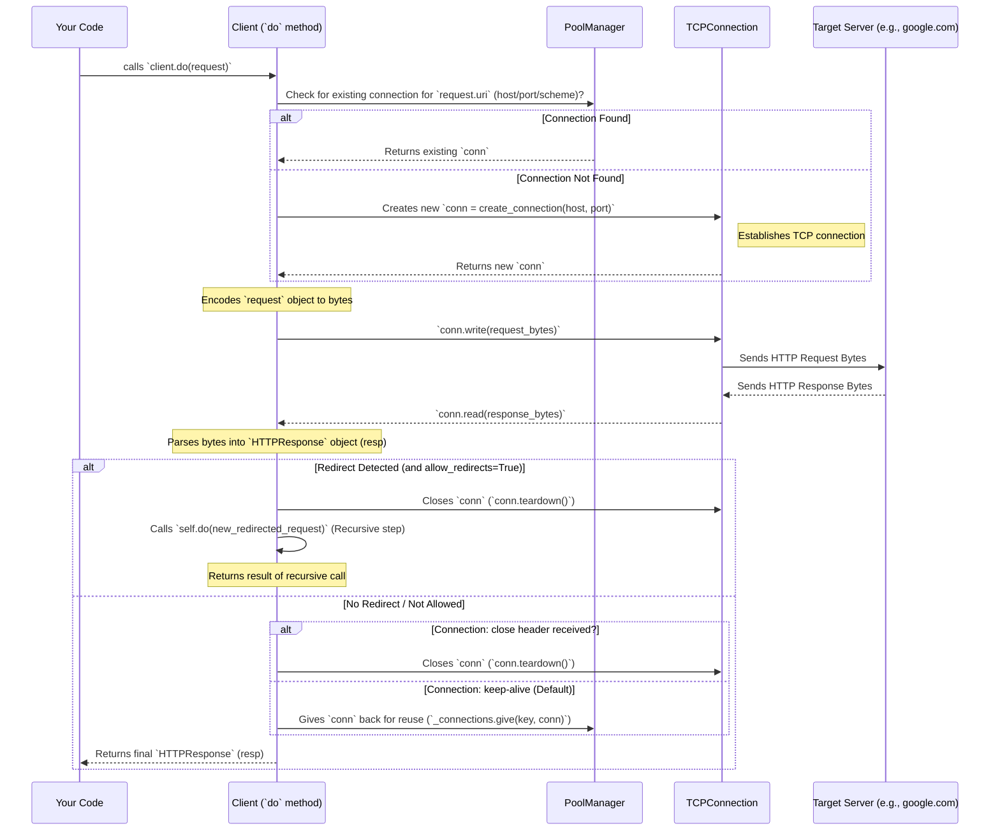

# Chapter 6: HTTP Client

In the previous chapter, [Chapter 5: HTTP Service Handler](05_http_service_handler_.md), we saw how the `HTTPService` acts like the "chef" in our web server, taking a request and preparing the response. Now, let's switch roles. What if our Mojo application needs to *request* information from *another* web server, like fetching a webpage or getting data from an API? For this, we need an **HTTP Client**.

## What Problem Does an HTTP Client Solve? Being the Customer

Imagine you want to order a pizza online. You (the **client**) need to:
1.  Decide what you want (e.g., a large pepperoni pizza - this is your `HTTPRequest`).
2.  Know the pizza place's website address (the `URI`).
3.  Go to the website (establish a connection).
4.  Place your order (send the `HTTPRequest`).
5.  Wait for the delivery (receive the `HTTPResponse`).
6.  Maybe the website sends you to a different page for payment (handling redirects).
7.  Maybe you order often, so the browser remembers the connection to make the next order faster (connection reuse).

An HTTP Client in a programming context does exactly this for your application. It acts like your web browser, but programmatically. When your Mojo app needs to talk to another web service, the `Client` handles all the steps of making the request and getting the response.

**Use Case:** Let's write a simple Mojo program that acts like a basic web browser command-line tool. It will request the homepage of "google.com" and print the response status and the first few lines of the HTML content.

## The `Client` in `lightbug_http`

The `Client` struct (found in `lightbug_http/client.mojo`) is designed to make sending requests and handling responses simple. It takes care of the underlying [Network Socket & Connection](07_network_socket___connection_.md) details for you.

Here's how we can use the `Client` to fetch Google's homepage:

```mojo
from lightbug_http import (
    HTTPRequest,
    HTTPResponse,
    URI,
    Headers,
    Header,
    HeaderKey,
    to_string,
)
from lightbug_http.client import Client

fn main() raises:
    # 1. Create a Client instance (with default settings)
    var client = Client()

    # 2. Prepare the request "order"
    #    We want the main page ("/") of "google.com"
    var uri = URI.parse("http://google.com")
    var headers = Headers(Header(HeaderKey.HOST, "google.com"))
    var request = HTTPRequest(uri, headers) # Default method is GET

    print("Sending request to:", uri.full_uri)

    # 3. Send the request and wait for the response
    var response = client.do(request)

    # 4. Examine the response "delivery"
    print("Response Status:", response.status_code, response.status_text)

    # Print the first 300 characters of the response body (HTML)
    if len(response.body_raw) > 0:
        print("Response Body (first 300 chars):")
        print(to_string(response.body_raw)[:300])
    else:
        print("Response Body: (empty)")

main()
```

*Explanation:*
1.  We import necessary components, including `Client` and the building blocks for an `HTTPRequest` ([Chapter 1: HTTP Message (Request/Response)](01_http_message__request_response__.md)).
2.  We create a `Client()` instance. We can customize it, but defaults are fine here.
3.  We construct an `HTTPRequest` just like in Chapter 1, specifying the `URI` for `http://google.com` and the essential `Host` header.
4.  The key step is `client.do(request)`. This tells the client to perform the entire process: connect to Google's server, send our `request`, wait for Google's reply, and parse that reply into an `HTTPResponse` object.
5.  Finally, we inspect the `response` object, printing its status code and the beginning of its body (`response.body_raw`).

*Expected Output (will vary slightly):*

```
Sending request to: http://google.com/
Response Status: 301 Moved Permanently
Response Body: (empty)
```

Wait, why `301 Moved Permanently` and an empty body? Google automatically redirects requests from `http://google.com` to `https://www.google.com`. Our basic client received this redirect instruction (status 301) and the `Location` header telling it where to go next, but by default, it doesn't automatically *follow* that redirect.

## Handling Redirects and Connections

The `Client` can be configured to handle common complexities:

*   **Following Redirects:** If the server sends back a redirect status code (like 301 or 302) with a new `Location` header, the client can automatically make a *new* request to that new URL.
*   **Connection Reuse (Pooling):** Making a new network connection for every single request can be slow. The `Client` uses an internal `PoolManager` to keep connections open and reuse them if you make multiple requests to the same server quickly. This is like keeping the pizza place's phone number on speed dial.

Let's modify our client to follow redirects:

```mojo
from lightbug_http import (
    HTTPRequest,
    HTTPResponse,
    URI,
    Headers,
    Header,
    HeaderKey,
    to_string,
)
from lightbug_http.client import Client

fn main() raises:
    # 1. Create a Client that ALLOWS redirects
    var client = Client(allow_redirects=True) # <-- Change here!

    # 2. Prepare the request (same as before)
    var uri = URI.parse("http://google.com")
    var headers = Headers(Header(HeaderKey.HOST, "google.com"))
    var request = HTTPRequest(uri, headers)

    print("Sending request to:", uri.full_uri, "(allowing redirects)")

    # 3. Send the request (client will handle redirect internally)
    var response = client.do(request) # This might make multiple actual requests

    # 4. Examine the FINAL response
    print("Final Response Status:", response.status_code, response.status_text)
    if len(response.body_raw) > 0:
        print("Response Body (first 300 chars):")
        print(to_string(response.body_raw)[:300]) # Should now be HTML
    else:
        print("Response Body: (empty)")

main()

```

*Explanation:*
The only change is `Client(allow_redirects=True)`. Now, when `client.do(request)` gets the `301` response from `http://google.com`, it will automatically:
1.  See the `301` status and the `Location: https://www.google.com/` header.
2.  Prepare a *new* `HTTPRequest` for `https://www.google.com/`.
3.  Send *that* request.
4.  Receive the response (likely a `200 OK` with HTML).
5.  Return this *final* response to our `main` function.

*Expected Output (will vary):*

```
Sending request to: http://google.com/ (allowing redirects)
Final Response Status: 200 OK
Response Body (first 300 chars):
<!doctype html><html itemscope="" itemtype="http://schema.org/WebPage" lang="en"><head><meta content="text/html; charset=UTF-8" http-equiv="Content-Type"><meta content="/images/branding/googleg/1x/googleg_standard_color_128dp.png" itemprop="image"><title>Google</title><script nonce="ABCDEFG..." ...
```

Now we get the `200 OK` status and the actual HTML content because the client handled the redirect for us!

## Under the Hood: How `client.do()` Works

What happens inside the `Client` when you call `do()`?

1.  **Parse Destination:** It looks at the `request.uri` to figure out the `host` (e.g., "google.com"), `port` (e.g., 80 for http, 443 for https), and `scheme` (http or https).
2.  **Check Connection Pool:** It creates a unique key (`PoolKey`) based on the host, port, and scheme. It asks its internal `PoolManager` (`self._connections`) if there's already an open, reusable [Network Socket & Connection](07_network_socket___connection_.md) (`TCPConnection`) for this exact destination.
3.  **Get/Create Connection:**
    *   **Reuse:** If the `PoolManager` has a connection, it takes it (`_connections.take(key)`). This is fast!
    *   **Create New:** If not, it calls `create_connection(host, port)` (from `lightbug_http.connection`) to establish a brand new TCP connection to the server. This involves DNS lookup and the TCP handshake.
4.  **Encode Request:** It converts the `HTTPRequest` object into raw bytes using the `encode` function, formatting the method, path, headers, and body according to HTTP rules.
5.  **Send Request:** It writes these request bytes to the chosen `TCPConnection` (`conn.write(...)`).
6.  **Receive Response:** It reads the raw bytes coming back from the server through the `TCPConnection` (`conn.read(...)`). It needs to be smart about reading enough data, potentially in chunks.
7.  **Parse Response:** It uses `HTTPResponse.from_bytes(...)` to parse these raw bytes back into an `HTTPResponse` object.
8.  **Handle Redirects (if `allow_redirects` is True):**
    *   If the `response.status_code` indicates a redirect (3xx) and a `Location` header is present, it updates the original `request`'s URI and Host header and essentially *calls itself* (`self.do(...)`) recursively with the modified request. The connection used for the redirect response is closed.
9.  **Manage Connection:**
    *   If the response indicates `Connection: close`, or if a redirect happened, the client closes the `TCPConnection` (`conn.teardown()`).
    *   Otherwise (usually the default `Connection: keep-alive`), it returns the `TCPConnection` back to the `PoolManager` (`_connections.give(key, conn)`) so it can be reused for a future request to the same server.
10. **Return Response:** It returns the final `HTTPResponse` object to your code.



**Diving into the Code (`lightbug_http/client.mojo`, `lightbug_http/pool_manager.mojo`):**

The `Client` struct holds configuration and the connection pool:

```mojo
# Simplified from lightbug_http/client.mojo
struct Client:
    # Configuration
    var host: String # Default host if not in request URI? (Seems unused in `do`)
    var port: Int    # Default port? (Seems unused in `do`)
    var name: String # Client identifier string
    var allow_redirects: Bool

    # The manager for reusable connections
    var _connections: PoolManager[TCPConnection]

    fn __init__(...):
        # Sets defaults, initializes the PoolManager
        ...

    fn do(mut self, owned request: HTTPRequest) raises -> HTTPResponse:
        # 1. Get host/port/scheme from request.uri
        # 2. Create pool_key = PoolKey(host, port, scheme)

        # 3. Try to get a connection from the pool
        var conn: TCPConnection
        var cached_connection = False
        try:
            conn = self._connections.take(pool_key)
            cached_connection = True
        except: # Key not found
            # Create a new connection if not found in pool
            conn = create_connection(request.uri.host, port)

        # 4. Encode the request
        var request_bytes = encode(request)

        # 5. Send the request bytes
        try:
            _ = conn.write(request_bytes)
        except e:
            # Error handling (maybe retry if cached connection failed)
            ...
            raise e

        # 6. Read the response bytes
        var response_buffer = Bytes(...)
        try:
            _ = conn.read(response_buffer)
        except e:
            # Error handling (maybe retry if cached connection failed)
            ...
            raise e

        # 7. Parse the response bytes
        var response = HTTPResponse.from_bytes(response_buffer, conn)

        # 8. Handle redirects
        if self.allow_redirects and response.is_redirect():
            conn.teardown() # Close connection used for redirect response
            # Recursively call 'do' with updated request for new location
            return self._handle_redirect(request, response)

        # 9. Manage connection lifecycle
        if response.connection_close():
            conn.teardown() # Close connection if server asked
        else:
            # Otherwise, return it to the pool for reuse
            self._connections.give(pool_key, conn)

        # 10. Return the final response
        return response

    fn _handle_redirect(...):
        # Logic to update request URI/Host based on Location header
        # Calls self.do() with the modified request
        ...
```

The `PoolManager` uses a dictionary (`mapping`) to track which connection (`_connections` list index) belongs to which destination (`PoolKey`).

```mojo
# Simplified from lightbug_http/pool_manager.mojo

@value
struct PoolKey(Hashable, ...): # Key for the dictionary
    var host: String
    var port: UInt16
    var scheme: Scheme # http or https

struct PoolManager[ConnectionType: Connection]():
    var _connections: OwningList[ConnectionType] # Stores the actual connections
    var mapping: Dict[PoolKey, Int] # Maps destination key to index in _connections

    fn give(mut self, key: PoolKey, owned value: ConnectionType):
        # Adds 'value' to _connections and records its index in mapping[key]
        # (Or replaces if key already exists)
        ...

    fn take(mut self, key: PoolKey) raises -> ConnectionType:
        # Finds index = mapping[key]
        # Removes connection from _connections at 'index'
        # Removes key from mapping
        # Returns the connection
        ...

    fn clear(mut self): # Called when PoolManager is destroyed
        # Closes all connections in _connections
        ...
```

*Explanation:*
The `Client.do` method orchestrates the entire request lifecycle. It relies on `PoolManager` to efficiently reuse `TCPConnection`s where possible, falling back to `create_connection` when necessary. It encodes the request, sends it, reads/parses the response, handles optional redirects, manages the connection's lifecycle (close or return to pool), and finally returns the result.

## Conclusion

You've learned how to use `lightbug_http` to act as an **HTTP Client**, allowing your Mojo application to request resources from other web servers.

*   The `Client` struct simplifies the process of sending `HTTPRequest`s and receiving `HTTPResponse`s.
*   You create a `Client` and use its `do()` method, passing in your prepared `HTTPRequest`.
*   The client handles connecting, sending, receiving, and parsing.
*   It can optionally handle complexities like following redirects (`allow_redirects=True`).
*   It uses a `PoolManager` internally to reuse connections for better performance.

Now you understand both sides of the HTTP coin: how to build a server that responds to requests ([Chapter 4: HTTP Server](04_http_server_.md), [Chapter 5: HTTP Service Handler](05_http_service_handler_.md)) and how to build a client that sends requests.

The `Client` and `Server` both rely on the ability to establish and manage network communication. In the next chapter, we'll dive deeper into the fundamental building block that makes this possible.

Next: [Chapter 7: Network Socket & Connection](07_network_socket___connection_.md)

---

Generated by [AI Codebase Knowledge Builder](https://github.com/The-Pocket/Tutorial-Codebase-Knowledge)