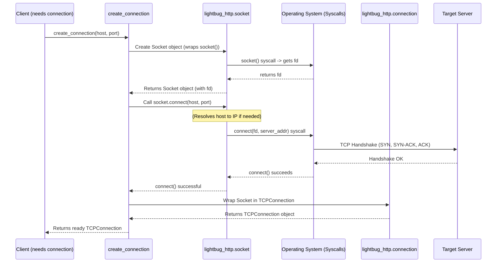
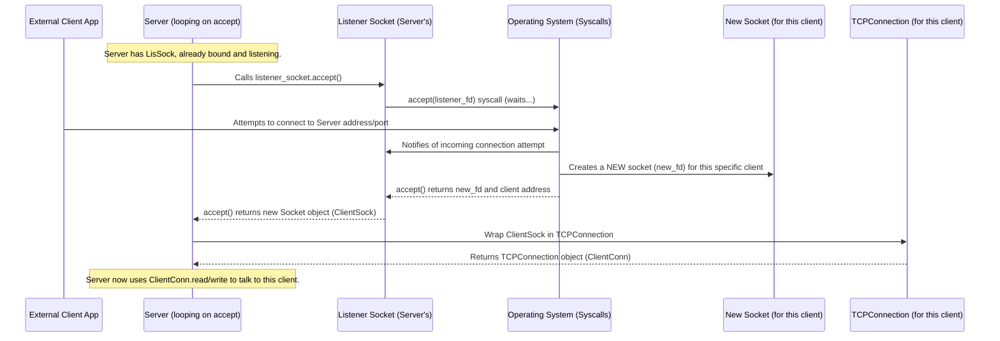

# Chapter 7: Network Socket & Connection

Welcome to the final chapter of the core `lightbug_http` tutorial! In [Chapter 6: HTTP Client](06_http_client_.md), we saw how a `Client` can send requests to servers. Before that, in [Chapter 4: HTTP Server](04_http_server_.md), we learned how a `Server` listens for and responds to requests. But how do the client and server *actually* talk to each other across the internet or even on the same machine? They need a way to establish a communication line and pass data back and forth.

This chapter explores the fundamental building blocks that make network communication possible: **Sockets** and **Connections**.

## What Problem Do Sockets & Connections Solve? The Phone Lines of the Internet

Imagine you want to call a friend. You need a few things:
1.  Your friend needs a phone line connected to their house (**Socket** at their address).
2.  You need your own phone line (**Socket** at your address).
3.  You need to dial their number and establish a call (**Connection**).
4.  Once connected, you can talk and listen through your phone handset (interacting with the **Connection**).

Network communication works very similarly. When your `Client` wants to talk to a `Server`:
*   The `Server` needs to be listening at a specific network address (IP address + Port number). This endpoint where it listens is managed by a **Socket**.
*   The `Client` needs its own network interface to make the "call". It uses its own **Socket** to initiate the communication.
*   When the `Client` successfully reaches the `Server`, a **Connection** is established between their two sockets.
*   Data ([HTTP Message (Request/Response)](01_http_message__request_response__.md) bytes) can then be sent and received over this **Connection**.

In `lightbug_http`, the `Server` and `Client` structures handle setting up these sockets and connections for you automatically for standard HTTP communication. However, understanding the underlying concepts of `Socket` and `Connection` helps clarify what's happening behind the scenes.

## What is a Network Socket? The Endpoint

Think of a **Socket** as a specific endpoint for network communication, like a single phone jack in a specific room at a specific street address. It's a low-level concept provided by your computer's operating system (OS).

*   **Identification:** It's identified internally by the OS using a number called a **File Descriptor** (often abbreviated as `fd`). This `fd` is like the OS's internal reference number for that specific communication endpoint.
*   **Address:** A socket used for internet communication (like TCP/IP) is usually associated with an IP address and a port number (e.g., `127.0.0.1:8080`). This combination uniquely identifies where the endpoint is located on the network.
*   **Low-Level Actions:** The OS provides basic functions (system calls) to work with sockets:
    *   `socket()`: Create a new socket endpoint. (Like installing a new phone jack).
    *   `bind()`: Assign a specific local address (IP and port) to the socket. (Like claiming a specific phone number for that jack).
    *   `listen()`: Tell a bound socket to start listening for incoming connection attempts (Only used by servers. Like turning the ringer on).
    *   `connect()`: Attempt to establish a connection *to* a remote socket (Only used by clients. Like dialing a number).
    *   `accept()`: Accept an incoming connection attempt on a listening socket (Only used by servers. Like picking up the ringing phone). This usually creates a *new* socket just for this specific call.
    *   `send()` / `write()`: Send raw data bytes over the socket. (Like talking into the phone).
    *   `recv()` / `read()`: Receive raw data bytes from the socket. (Like listening on the phone).
    *   `close()`: Terminate the connection and release the socket resources. (Like hanging up the phone).

**The `Socket` Struct in `lightbug_http`:**

`lightbug_http` provides a `Socket` struct (in `lightbug_http/socket.mojo`) that wraps these low-level OS functions. It makes working with sockets a bit easier and safer within Mojo code. You typically won't create these directly for standard HTTP client/server use, but they are used internally.

```mojo
# Simplified concept of the Socket struct
# (Actual definition in lightbug_http/socket.mojo)

struct Socket[...]:
    var fd: Int32 // The OS file descriptor
    var _local_address: AddrType // e.g., TCPAddr("127.0.0.1", 8080)
    var _remote_address: AddrType // e.g., TCPAddr("93.184.216.34", 80)
    var _closed: Bool
    var _connected: Bool

    fn __init__(...) raises:
        # Calls the OS 'socket()' function internally
        self.fd = libc.socket(...)
        ...

    fn bind(mut self, address: String, port: UInt16) raises:
        # Calls the OS 'bind()' function internally
        libc.bind(self.fd, ...)
        ...

    fn connect(mut self, address: String, port: UInt16) raises:
        # Calls the OS 'connect()' function internally
        libc.connect(self.fd, ...)
        ...

    fn accept(self) raises -> Socket[...]:
        # Calls the OS 'accept()' function internally
        var new_fd = libc.accept(self.fd, ...)
        return Socket(fd=new_fd, ...) # Returns a NEW socket for the connection

    fn send(self, buffer: Span[Byte]) raises -> Int:
        # Calls the OS 'send()' function internally
        return libc.send(self.fd, ...)

    fn receive(self, mut buffer: Bytes) raises -> UInt:
        # Calls the OS 'recv()' function internally
        return libc.recv(self.fd, ...)

    fn close(mut self) raises:
        # Calls the OS 'close()' function internally
        libc.close(self.fd)
        ...

    # ... other methods like listen, shutdown, getsockname, getpeername ...
```

*Explanation:*
This simplified structure shows that the `lightbug_http` `Socket` primarily holds the file descriptor (`fd`) and address information. Its methods like `bind`, `connect`, `accept`, `send`, `receive`, and `close` are convenient wrappers around the corresponding low-level operating system calls (represented here as `libc.*`).

## What is a Connection? The Active Conversation

While a `Socket` is the endpoint, a **Connection** represents an active communication channel established *between* two sockets. Think of it as the actual phone call in progress, or perhaps the phone handset you use, which provides a simpler interface (microphone, speaker) than directly manipulating the phone line signals.

*   **Higher-Level Wrapper:** In `lightbug_http`, a `Connection` is a higher-level struct built *on top* of a `Socket`.
*   **Simplifies Interaction:** It provides methods tailored for specific types of communication. For example:
    *   `TCPConnection`: Designed for stream-based communication (like HTTP). It ensures data arrives in order. It might handle buffering internally, making `read` and `write` operations more convenient than raw `send`/`recv`.
    *   `UDPConnection`: Designed for datagram-based communication (sending individual packets).
*   **Manages State:** It often helps manage the state of the communication (e.g., knowing if it's connected, handling cleanup when closed).

**The `TCPConnection` Struct in `lightbug_http`:**

Since HTTP typically uses TCP, the `TCPConnection` (in `lightbug_http/connection.mojo`) is the most relevant connection type for us. It essentially holds a `Socket` and provides a cleaner interface for sending and receiving stream data.

```mojo
# Simplified concept of the TCPConnection struct
# (Actual definition in lightbug_http/connection.mojo)

struct TCPConnection:
    var socket: Socket[TCPAddr] # Holds the underlying socket!

    fn __init__(out self, owned socket: Socket[TCPAddr]):
        # Takes ownership of a connected Socket
        self.socket = socket^

    fn read(self, mut buf: Bytes) raises -> Int:
        # Reads data from the underlying socket into 'buf'
        # Might involve internal buffering or handling stream nuances.
        return self.socket.receive(buf) # Calls socket's receive

    fn write(self, buf: Span[Byte]) raises -> Int:
        # Writes data from 'buf' to the underlying socket.
        # Might handle sending data in chunks if needed.
        return self.socket.send(buf) # Calls socket's send

    fn close(mut self) raises:
        # Closes the underlying socket gracefully.
        self.socket.close()

    fn shutdown(mut self) raises:
        # Partially closes the socket (e.g., stop sending).
        self.socket.shutdown()

    fn teardown(mut self) raises:
        # Fully closes and cleans up the socket.
        self.socket.teardown()

    fn local_addr(self) -> TCPAddr:
        return self.socket.local_address()

    fn remote_addr(self) -> TCPAddr:
        return self.socket.remote_address()
```

*Explanation:*
The `TCPConnection` primarily holds an underlying `Socket`. Its methods like `read` and `write` provide a more convenient way to interact with the stream of data compared to directly using the socket's `receive` and `send`. It delegates the actual low-level work to the contained `socket`.

## How Sockets & Connections are Used in `lightbug_http`

You usually don't need to manually create `Socket`s or `TCPConnection`s when using the standard `Client` and `Server`.

*   **Client Side:** When you call `client.do(request)`, the `Client` internally uses a helper function like `create_connection`. This function:
    1.  Creates a `Socket`.
    2.  Calls the socket's `connect()` method to reach the server.
    3.  Wraps the now-connected `Socket` inside a `TCPConnection`.
    4.  Uses the `TCPConnection`'s `write` method to send the `HTTPRequest` bytes and `read` method to receive the `HTTPResponse` bytes.
    (The `Client` also uses a `PoolManager` to potentially reuse existing `TCPConnection`s instead of creating new ones every time).

*   **Server Side:** When you call `server.listen_and_serve(...)`:
    1.  The `Server` creates a listening `Socket` and calls its `bind()` and `listen()` methods.
    2.  The server then enters a loop calling the listener socket's `accept()` method.
    3.  When a client connects, `accept()` returns a *new* `Socket` specifically for that client.
    4.  The `Server` wraps this new client `Socket` in a `TCPConnection`.
    5.  The `Server` uses *this* `TCPConnection`'s `read` method to get the client's `HTTPRequest` bytes and `write` method to send back the `HTTPResponse` bytes prepared by your [HTTP Service Handler](05_http_service_handler_.md).

## Under the Hood: Establishing Connections

Let's visualize the key moments where sockets and connections come into play.

**1. Client Connecting to Server (`create_connection`):**

When the `Client` needs to talk to a server it hasn't connected to recently:



*Explanation:* `create_connection` uses the `Socket` struct to perform the OS `socket()` and `connect()` calls. Once the socket is connected, it's wrapped in a `TCPConnection` for easier use by the `Client`.

**2. Server Accepting a Client Connection:**

When the `Server` is running and a client tries to connect:



*Explanation:* The server's listening socket waits via the OS `accept()` call. When a client connects, `accept()` provides a *new* socket dedicated to that client. The server wraps this new socket in a `TCPConnection` to manage the conversation.

## Diving into the Code

Let's peek at the simplified structures involved:

**`Socket` (from `lightbug_http/socket.mojo`):**

```mojo
# Simplified Socket struct

struct Socket[AddrType: Addr, ...](...):
    var fd: Int32           # The OS file descriptor
    var socket_type: Int32
    var protocol: Byte
    var _local_address: AddrType
    var _remote_address: AddrType
    var _closed: Bool
    var _connected: Bool

    # Wraps OS 'socket()'
    fn __init__(...) raises: ...

    # Wraps OS 'bind()'
    fn bind(...) raises: ...

    # Wraps OS 'listen()'
    fn listen(...) raises: ...

    # Wraps OS 'connect()'
    fn connect(...) raises: ...

    # Wraps OS 'accept()', returns a NEW Socket
    fn accept(self) raises -> Socket[AddrType]: ...

    # Wraps OS 'send()'
    fn send(...) raises -> Int: ...

    # Wraps OS 'recv()'
    fn receive(...) raises -> UInt: ...

    # Wraps OS 'close()'
    fn close(...) raises: ...

    # Wraps OS 'shutdown()'
    fn shutdown(...) raises: ...
```

*Explanation:* A wrapper around the OS-level socket identified by `fd`, providing methods for common socket operations.

**`TCPConnection` (from `lightbug_http/connection.mojo`):**

```mojo
# Simplified TCPConnection struct

struct TCPConnection:
    var socket: Socket[TCPAddr] # Holds the underlying Socket

    fn __init__(out self, owned socket: Socket[TCPAddr]):
        self.socket = socket^

    # Simplified read - delegates to socket.receive
    fn read(self, mut buf: Bytes) raises -> Int:
        return self.socket.receive(buf)

    # Simplified write - delegates to socket.send
    fn write(self, buf: Span[Byte]) raises -> Int:
        return self.socket.send(buf)

    # Closes the socket
    fn close(mut self) raises:
        self.socket.close()

    # Fully closes and cleans up
    fn teardown(mut self) raises:
        self.socket.teardown()
    ...
```

*Explanation:* A higher-level struct that holds a `Socket` and provides convenient `read` and `write` methods suitable for TCP stream communication.

**`create_connection` (from `lightbug_http/connection.mojo`):**

```mojo
# Simplified create_connection function

fn create_connection(host: String, port: UInt16) raises -> TCPConnection:
    # 1. Create a socket object
    var socket = Socket[TCPAddr]()
    try:
        # 2. Connect the socket to the server
        socket.connect(host, port)
    except e:
        # ... (error handling) ...
        raise Error("Failed to establish a connection...")

    # 3. Wrap the connected socket in a TCPConnection
    return TCPConnection(socket^)
```

*Explanation:* This function demonstrates the client-side process: create a `Socket`, `connect` it, and wrap it in a `TCPConnection`.

**`NoTLSListener.accept` (from `lightbug_http/connection.mojo`):**

```mojo
# Simplified Listener accept method

struct NoTLSListener:
    var socket: Socket[TCPAddr] # The listening socket

    # ... (init, etc.) ...

    fn accept(self) raises -> TCPConnection:
        # 1. Call accept() on the listening socket
        #    This blocks until a client connects and returns a NEW socket for that client.
        var client_socket = self.socket.accept()

        # 2. Wrap the new client socket in a TCPConnection
        return TCPConnection(client_socket^)
```

*Explanation:* This method, used by the server, shows how calling `accept()` on the main listening socket yields a new `Socket` for the incoming client, which is then wrapped in a `TCPConnection` for handling the request.

## Conclusion

You've reached the end of our core journey through `lightbug_http`! In this final chapter, we explored the foundations of network communication:

*   A **Socket** is a low-level operating system endpoint for network communication, identified by a file descriptor (`fd`) and typically bound to an IP address and port. `lightbug_http` provides a `Socket` struct wrapping OS calls.
*   A **Connection** (like `TCPConnection`) is a higher-level abstraction built around a `Socket`, offering a more convenient interface (like `read`/`write`) for established communication channels.
*   The `Client` uses helper functions like `create_connection` to internally manage sockets and connections for outgoing requests.
*   The `Server` uses a listening `Socket`'s `accept()` method to get a new `Socket` for each incoming client, wrapping it in a `TCPConnection` to handle the conversation.

While `lightbug_http` handles the complexities of sockets and connections for basic HTTP tasks, understanding this layered model provides valuable insight into how network applications function under the hood.

With this knowledge of HTTP messages, URIs, headers, servers, handlers, clients, sockets, and connections, you are well-equipped to start building your own web applications and services using `lightbug_http` in Mojo! We encourage you to explore the source code further and experiment with the examples. Happy coding!

---

Generated by [AI Codebase Knowledge Builder](https://github.com/The-Pocket/Tutorial-Codebase-Knowledge)