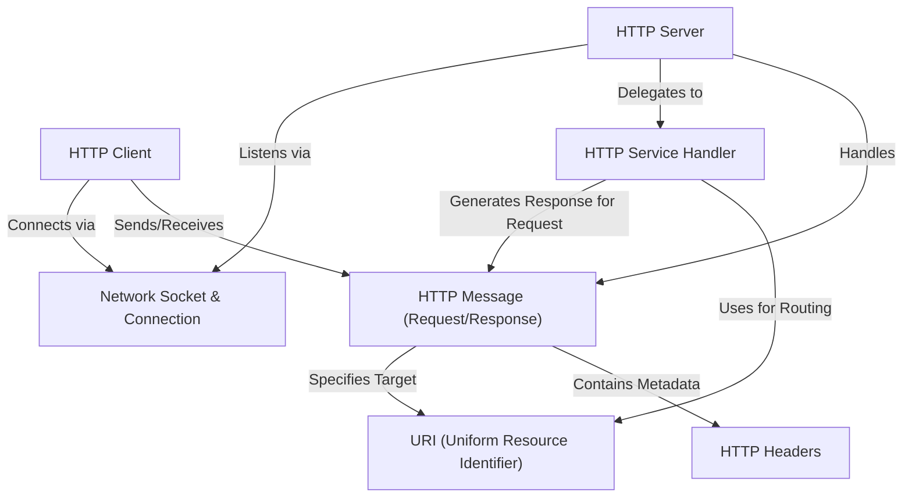

# Tutorial: lightbug_http

`lightbug_http` is a Mojo project for building web applications. It provides tools to create an **HTTP Server** that can *listen* for incoming connections over the network using **Sockets**.
When a **Client** connects, the server reads the **HTTP Request** (containing a **URI** target and **Headers** metadata).
The server then passes this request to a defined **HTTP Service Handler** which processes it and generates an **HTTP Response**.
The project also includes an **HTTP Client** to *send* requests and *receive* responses from servers.

**Source Repository:** [https://github.com/MichaelDPoole/lightbug_http.git](https://github.com/MichaelDPoole/lightbug_http.git)

## Chapters

1. [HTTP Message (Request/Response)
](01_http_message__request_response__.md)
2. [URI (Uniform Resource Identifier)
](02_uri__uniform_resource_identifier__.md)
3. [HTTP Headers
](03_http_headers_.md)
4. [HTTP Server
](04_http_server_.md)
5. [HTTP Service Handler
](05_http_service_handler_.md)
6. [HTTP Client
](06_http_client_.md)
7. [Network Socket & Connection
](07_network_socket___connection_.md)

---

Generated by [AI Codebase Knowledge Builder](https://github.com/The-Pocket/Tutorial-Codebase-Knowledge)