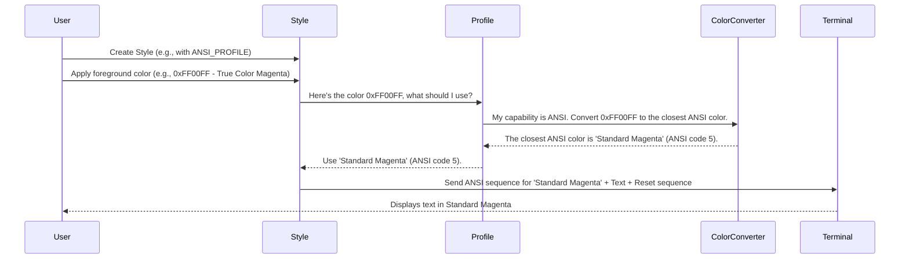

# Chapter 1: Profile Struct

Welcome to the `mist` tutorial! We're excited to help you learn how to add beautiful colors and styles to your terminal applications. Let's start with a fundamental concept: the `Profile`.

## Why Do We Need a Profile?

Imagine you're drawing a picture. If you have a huge box of crayons with millions of colors, you can draw *exactly* the shade you want. But what if you only have a small box with 16 basic colors? Or maybe just a pencil for black and white? You'd have to adapt your drawing, picking the closest available color or just using grayscale.

Terminals (the black boxes where you type commands) are similar!

*   Some modern terminals are like the giant crayon box – they support **True Color** (millions of colors).
*   Others support **256 colors**. Still lots, but not infinite.
*   Older ones might only support the basic 16 **ANSI** colors (like red, green, blue, yellow, etc., plus brighter versions).
*   Some very basic terminals or environments might only support **ASCII** (essentially black and white text, no colors).

If your program tries to show a fancy "hot pink" color, what happens on a terminal that only knows basic "red" and "magenta"? It might look broken or display strange characters.

This is where the `Profile` struct comes in. It acts like an adapter or a graphics setting for your terminal styles.

**The `Profile`'s main job is:**

1.  To know (or let you define) the color capabilities of the terminal you're sending text to.
2.  To automatically translate colors you request into the *best possible match* that the target terminal actually supports.

Think of it like a helpful translator ensuring your color requests make sense, no matter how limited the terminal's "color language" is.

## What are the Different Profiles?

`mist` defines these main profiles, from most capable to least:

1.  `TRUE_COLOR`: Supports millions of colors, usually defined using Hex codes (like `0xFF00FF` for magenta) or RGB values.
2.  `ANSI256`: Supports a specific palette of 256 colors.
3.  `ANSI`: Supports the classic 16 colors (8 basic, 8 bright).
4.  `ASCII`: Supports no colors, just plain text.

By default, when you create a `Style` (which we'll cover in [Chapter 3: Style Struct
](03_style_struct_.md)), `mist` tries to guess the best profile by checking your terminal's environment settings. However, you can also explicitly tell `mist` which profile to use.

## How `Profile` Adapts Colors

Let's see a simple example. We want to display text in a specific purple color, `0xC9A0DC`.

```mojo
import mist

fn main():
    let text = "Hello, Purple World!"
    let fancy_purple: UInt32 = 0xC9A0DC

    // 1. Using a True Color profile (best case)
    // We create a Style, explicitly telling it to use the TRUE_COLOR profile.
    let style_true_color = mist.Style(mist.TRUE_COLOR_PROFILE)
    // We ask for our fancy purple. The profile allows it!
    print(style_true_color.foreground(fancy_purple).render(text))

    // 2. Using an ANSI profile (limited colors)
    // We create a Style using the basic ANSI profile.
    let style_ansi = mist.Style(mist.ANSI_PROFILE)
    // We ask for fancy_purple again.
    // The ANSI profile knows it can't show 0xC9A0DC.
    // It finds the *closest* basic ANSI color (likely standard magenta).
    print(style_ansi.foreground(fancy_purple).render(text))

    // 3. Using an ASCII profile (no colors)
    // We create a Style using the ASCII profile.
    let style_ascii = mist.Style(mist.ASCII_PROFILE)
    // We ask for fancy_purple.
    // The ASCII profile knows it can't show *any* color.
    // It results in plain, uncolored text.
    print(style_ascii.foreground(fancy_purple).render(text))

```

**What happens:**

1.  **True Color Output:** The text "Hello, Purple World!" appears in the exact shade of purple defined by `0xC9A0DC` (if your terminal supports True Color).
2.  **ANSI Output:** The text appears, but the purple will be snapped to the *nearest* of the 16 standard ANSI colors (probably the standard "magenta"). It won't be the *exact* shade `0xC9A0DC`, but it will be the best approximation the ANSI profile can manage.
3.  **ASCII Output:** The text appears completely uncolored, just plain white (or whatever your terminal's default text color is).

The `Profile` ensures that even when you ask for a color the terminal can't display, you still get *reasonable* output instead of errors or garbage characters.

## Specifying Profiles

As shown above, you can pass predefined profiles like `mist.TRUE_COLOR_PROFILE`, `mist.ANSI256_PROFILE`, `mist.ANSI_PROFILE`, or `mist.ASCII_PROFILE` when creating a `Style`:

```mojo
import mist

fn main() raises:
    // Create a style locked to only use the basic 16 ANSI colors
    var ansi_style = mist.Style(mist.ANSI_PROFILE)

    // Even if we ask for a 256-color code (like 55)...
    let text_ansi = ansi_style.foreground(55).render("Hello ANSI")
    // ...the profile converts it to the closest of the 16 ANSI colors.
    print(text_ansi)

    // Create a style that uses *no* color
    var ascii_style = mist.Style(mist.ASCII_PROFILE)

    // Asking for red (ANSI color 1)...
    let text_ascii = ascii_style.foreground(1).render("Hello ASCII")
    // ...results in no color being applied because the profile is ASCII.
    print(text_ascii)
```

If you don't specify a profile, `mist` tries its best to detect it:

```mojo
import mist

fn main():
    // Let mist try to figure out the terminal's capabilities
    var auto_style = mist.Style() // No profile specified

    // This will use 0xFF00FF if the detected profile is True Color,
    // a close approximation if ANSI/ANSI256, or no color if ASCII.
    print(auto_style.magenta().render("Hello Auto-Detected World!"))
```

## Under the Hood: How Conversion Happens

Let's visualize the process when you apply a color using a `Style` that has a `Profile`.



The key step is when the `Style` consults its `Profile`. The `Profile` then uses internal logic (like the functions `hex_to_ansi256` and `ansi256_to_ansi` found in `src/mist/color.mojo` and `src/mist/profile.mojo`) to perform the conversion if necessary.

Here's a glimpse of the kind of logic inside `Profile` (simplified):

```mojo
# Simplified concept from src/mist/profile.mojo

struct Profile:
    var _value: Int # TRUE_COLOR, ANSI256, ANSI, or ASCII

    # This function takes a requested color (like 0xFF00FF)
    # and returns the appropriate color based on the profile.
    fn color(self, value: UInt32) -> AnyColor:
        if self._value == ASCII:
            # If profile is ASCII, return NoColor (no coloring)
            return NoColor()

        if value < 16: # It's already a basic ANSI color (0-15)
            # ANSI, ANSI256, and TRUE_COLOR can all handle this directly
            return ANSIColor(value.cast[DType.uint8]())

        elif value < 256: # It's an ANSI 256 color (16-255)
            if self._value == ANSI:
                # If profile is ANSI, convert 256-color down to 16-color
                let converted_ansi = ansi256_to_ansi(value.cast[DType.uint8]())
                return ANSIColor(converted_ansi)
            else:
                # ANSI256 and TRUE_COLOR profiles can handle this
                return ANSI256Color(value.cast[DType.uint8]())
        else: # It's a True Color (Hex code like 0xFF00FF)
             if self._value == TRUE_COLOR:
                 # True color profile can handle this directly
                 return RGBColor(value)
             elif self._value == ANSI256:
                 # Convert True Color down to closest 256-color
                 let converted_256 = hex_to_ansi256(hue.Color(hex_to_rgb(value)))
                 return ANSI256Color(converted_256)
             else: # Must be ANSI profile
                 # Convert True Color way down to closest 16-color
                 let converted_256 = hex_to_ansi256(hue.Color(hex_to_rgb(value)))
                 let converted_ansi = ansi256_to_ansi(converted_256.value)
                 return ANSIColor(converted_ansi)

```

This internal logic ensures that no matter what color you request and what the terminal supports, `mist` will generate the most appropriate ANSI escape codes to send to the terminal.

## Conclusion

You've learned about the `Profile` struct, the first key piece of `mist`. It acts as an intelligent adapter, understanding the color capabilities of different terminals (True Color, 256, ANSI, ASCII). By automatically converting colors to the best available match, `Profile` ensures your styled text displays reasonably everywhere.

Now that we understand how `mist` handles terminal capabilities, let's dive deeper into how `mist` actually represents the colors themselves.

**Next Up:** [Chapter 2: Color System (AnyColor, ANSIColor, RGBColor, etc.)
](02_color_system__anycolor__ansicolor__rgbcolor__etc___.md)

---

Generated by [AI Codebase Knowledge Builder](https://github.com/The-Pocket/Tutorial-Codebase-Knowledge)