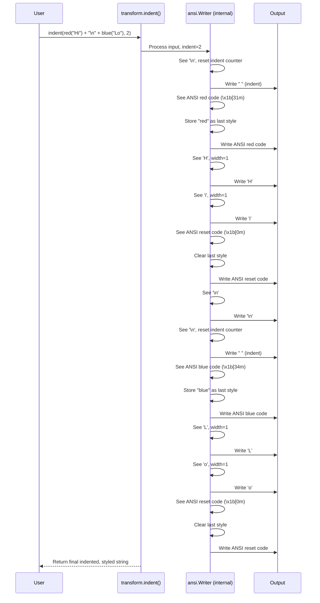

# Chapter 4: Text Transformation (transform modules)

In [Chapter 3: Style Struct](03_style_struct_.md), we learned how to create and apply colors and effects like bold or underline to text using the `Style` struct. This is great for making text visually appealing, but sometimes we need to change the *layout* or *shape* of the text itself, not just its appearance.

## Why Transform Text?

Imagine you have a long piece of text, maybe a description or a log message, that you want to display nicely in the terminal.

*   If it's too long, it might wrap awkwardly or run off the edge of the screen.
*   If you're displaying code or structured text, you might want to indent it consistently.
*   Maybe you want to fit text neatly inside a box or panel, requiring padding or truncation.

Doing this yourself by just adding spaces or cutting strings can be tricky, especially if your text already has colors and styles applied using ANSI codes! If you're not careful, you might break the styling or miscalculate the actual *visible* width of the text (because ANSI codes are invisible).

This is where `mist`'s `transform` modules come in. They provide tools to reshape your text while being **smart about ANSI styling**. It's like having text layout tools that understand the difference between visible characters and invisible formatting instructions.

## What Transformations Are Available?

The `mist.transform` module provides several useful functions:

1.  **Indentation (`indent`)**: Adds a specified number of spaces to the beginning of each line in a block of text.
2.  **Dedentation (`dedent`)**: Removes common leading whitespace from the beginning of each line in a block of text. Useful for cleaning up multi-line string literals in your code.
3.  **Wrapping (`wrap`, `word_wrap`)**: Breaks long lines into shorter ones to fit a specific width.
    *   `wrap`: Breaks lines strictly at the width limit, potentially mid-word.
    *   `word_wrap`: Breaks lines at word boundaries (spaces) near the width limit, trying to keep words intact.
4.  **Padding (`padding`)**: Adds spaces to the *end* of lines to make them reach a certain minimum width.
5.  **Margins (`margin`)**: A combination of `indent` (left margin) and `padding` (right margin).
6.  **Truncation (`truncate`)**: Cuts off text that exceeds a specific width, optionally adding a "tail" string (like "...").

**The Magic Part:** All these functions are designed to work correctly even if your input text contains ANSI color codes from `mist.Style`. They calculate widths based on *visible* characters and preserve the styling across transformations.

## Using Text Transformations

Let's see how to use some of these functions. They are located in the `mist.transform` submodule.

### Indentation (`indent`)

Adds spaces to the start of each line.

```mojo
import mist.transform as transform

fn main():
    let original_text = "First line.\nSecond line."
    let indented_text = transform.indent(original_text, 4) # Indent by 4 spaces

    print("--- Original ---")
    print(original_text)
    print("--- Indented ---")
    print(indented_text)
```

**Output:**

```text
--- Original ---
First line.
Second line.
--- Indented ---
    First line.
    Second line.
```

Notice how `indent` added four spaces before "First line." and four spaces before "Second line.".

### Word Wrapping (`word_wrap`)

Wraps long lines at word boundaries.

```mojo
import mist.transform as transform

fn main():
    let long_text = "This is a very long sentence that needs to be wrapped nicely."
    let wrapped_text = transform.word_wrap(long_text, 20) # Wrap at width 20

    print("--- Original ---")
    print(long_text)
    print("--- Wrapped ---")
    print(wrapped_text)
```

**Output:**

```text
--- Original ---
This is a very long sentence that needs to be wrapped nicely.
--- Wrapped ---
This is a very long
sentence that needs
to be wrapped
nicely.
```

`word_wrap` broke the long sentence into multiple lines, trying to keep lines under 20 characters wide without splitting words.

### Truncation (`truncate`)

Cuts off text that exceeds a certain width.

```mojo
import mist.transform as transform

fn main():
    let long_text = "This text is too long for the available space."
    # Truncate to 20 characters, adding "..."
    let truncated_text = transform.truncate(long_text, 20, tail="...")

    print("--- Original ---")
    print(long_text)
    print("--- Truncated ---")
    print(truncated_text)
```

**Output:**

```text
--- Original ---
This text is too long for the available space.
--- Truncated ---
This text is too ...
```

The text was cut off, and "..." was added. The total visible width (including the tail) aims to be no more than the specified width (20).

### Transformation with Styling

Now for the really cool part: using transformations on *styled* text.

```mojo
import mist
import mist.transform as transform

fn main():
    # Create some styled text using Chapter 3 concepts
    let style = mist.Style().red().bold()
    let part1 = style.render("This is the first part, which is quite long.")
    let part2 = mist.Style().blue().render(" And this is the second part.")
    let styled_text = part1 + part2

    # Let's wrap this styled text
    let wrapped_styled_text = transform.word_wrap(styled_text, 30)

    print("--- Original Styled ---")
    print(styled_text)
    print("\n--- Wrapped Styled ---")
    print(wrapped_styled_text)
```

**Output (Conceptual):**

```text
--- Original Styled ---
[Bold Red Text]This is the first part, which is quite long.[Reset][Blue Text] And this is the second part.[Reset]

--- Wrapped Styled ---
[Bold Red Text]This is the first part,[Reset]
[Bold Red Text]which is quite long.[Reset][Blue Text] And[Reset]
[Blue Text]this is the second part.[Reset]
```

*(Your terminal will show the actual colors and boldness, not the bracketed descriptions)*

Notice how `word_wrap` successfully wrapped the text *and* preserved the colors! The first wrapped line ends in red, the second starts red and ends blue, and the third is blue. The transformation functions are smart enough to handle the invisible ANSI codes mixed in with the text.

## Under the Hood: ANSI-Aware Processing

How do these transformations manage to preserve styling? They don't just treat the input string as plain characters.

1.  **Scanning:** They iterate through the input string byte by byte or codepoint by codepoint.
2.  **ANSI Detection:** They watch for the special ANSI escape character (`\x1b`). When they see it, they know an ANSI sequence (like a color code) is starting.
3.  **State Tracking:** They read the entire ANSI sequence (until the terminating character, usually `m`) but **do not count it towards the visible width**. They often keep track of the *last active* styling sequence (e.g., "make text red and bold").
4.  **Visible Character Processing:** When they encounter a normal, visible character, they calculate its width (using functions like `mist.transform.unicode.char_width`, which knows about wide characters like emojis) and add it to the current line's width count.
5.  **Applying Transformations:** Based on the transformation logic (indenting, wrapping, truncating):
    *   They might insert spaces or newlines.
    *   If they insert a newline, they might need to **re-apply the last active ANSI styling sequence** at the beginning of the *new* line to ensure the style continues.
    *   They copy the relevant visible characters and ANSI sequences to the output buffer.
6.  **Resetting:** Some transformations might add a reset code (`\x1b[0m`) at the end or after certain operations to prevent styles from leaking unintentionally.

Many of the transformation functions use an internal helper struct called `ansi.Writer` (from `src/mist/transform/ansi.mojo`) which encapsulates much of this ANSI-aware processing logic.

Let's visualize `indent` with styled text:



This diagram shows how the internal `ansi.Writer` keeps track of the current style and ensures the indentation is added correctly without breaking the colors across lines.

A simplified peek at the `indenter.Writer._write` logic (from `src/mist/transform/indenter.mojo`):

```mojo
# Simplified concept from src/mist/transform/indenter.mojo
struct Writer:
    var indent: Int
    var ansi_writer: ansi.Writer # The ANSI-aware helper
    var skip_indent: Bool # Flag: already indented this line?
    var in_ansi: Bool # Flag: currently inside an ANSI code?

    fn _write(mut self, text: StringSlice):
        for codepoint in text.codepoints():
            # 1. Check if we are entering/leaving an ANSI sequence
            if codepoint.to_u32() == ansi.ANSI_MARKER_BYTE:
                self.in_ansi = True
            elif self.in_ansi:
                if ansi.is_terminator(codepoint):
                    self.in_ansi = False
            else:
                # 2. If not in ANSI and not yet indented this line...
                if not self.skip_indent:
                    # Add the indentation spaces
                    self.ansi_writer.reset_ansi() # May add reset if needed
                    self.ansi_writer.write(SPACE * self.indent)
                    self.skip_indent = True
                    self.ansi_writer.restore_ansi() # Re-apply last color if any

                # 3. If it's a newline, reset the indent flag for the next line
                if codepoint.to_u32() == NEWLINE_BYTE:
                    self.skip_indent = False

            # 4. Write the current codepoint (visible char or ANSI part)
            # The ansi_writer handles passing ANSI codes through correctly.
            self.ansi_writer.write(codepoint)

```

This snippet illustrates the core logic: checking for ANSI codes, adding indentation *only* when needed (at the start of a line, outside an ANSI code), resetting the flag on newline, and using the `ansi_writer` helper to manage the output buffer and style restoration. Similar logic exists within the writers for `wrap`, `truncate`, `padding`, etc., each tailored to its specific transformation task.

## Conclusion

You've learned about `mist`'s powerful text transformation tools found in the `mist.transform` module. These functions allow you to easily `indent`, `dedent`, `wrap`, `pad`, `margin`, and `truncate` blocks of text.

Most importantly, you saw that these transformations are **ANSI-aware**. They intelligently handle text containing `mist` styling, preserving your colors and effects while correctly calculating visible widths and reshaping the layout. This makes them invaluable for creating well-formatted and visually appealing terminal user interfaces.

So far, we've focused on styling and arranging text *content*. But what about controlling the terminal screen itself?

**Next Up:** [Chapter 5: Terminal Control (terminal/screen)](05_terminal_control__terminal_screen__.md) - Learn how to move the cursor, clear parts of the screen, and manage terminal modes.

---

Generated by [AI Codebase Knowledge Builder](https://github.com/The-Pocket/Tutorial-Codebase-Knowledge)