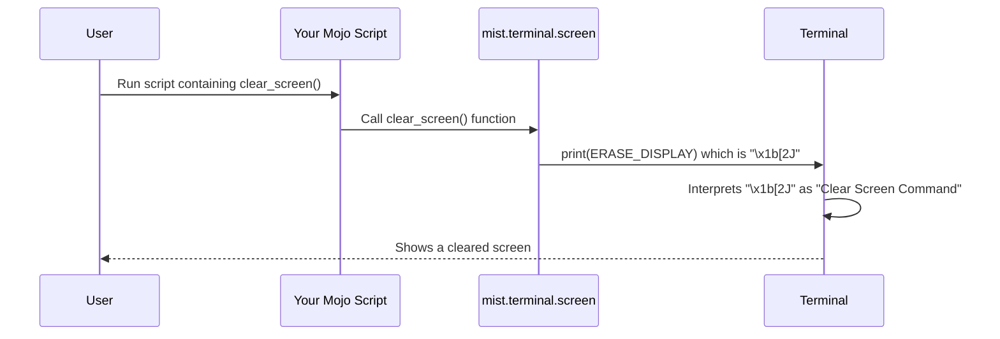

# Chapter 5: Terminal Control (terminal/screen)

In [Chapter 4: Text Transformation (transform modules)](04_text_transformation__transform_modules__.md), we saw how to reshape and layout text, even when it contained colors and styles. That was about manipulating the *content* we print. Now, let's take a step further and learn how to control the *terminal window itself*.

## Why Control the Terminal? The Remote Control Analogy

Imagine your terminal window like a television screen. So far, we've learned how to display styled text on it (like showing colorful movie titles). But what if you want to do more?

*   What if you want to clear the entire screen before showing something new?
*   What if you want to display a loading message that updates itself on the *same line*, instead of printing a new line each time?
*   What if you want to create a full-screen application (like a game or a text editor) that takes over the whole terminal, and then restores the original view when it exits?

These actions go beyond just printing text characters. You need to send special commands *directly to the terminal* to tell it what to do. Think of it like using a **remote control** for your terminal screen. `mist` provides functions that act like the buttons on this remote.

The `mist.terminal.screen` module gives you this "remote control", allowing you to move the cursor, clear parts of the screen, hide the cursor, switch screen modes, and more.

## Your Terminal Remote: Key Functions

Let's look at some of the most common "buttons" on our terminal remote control, provided by `mist.terminal.screen`. These functions usually work by directly printing special command sequences to the terminal.

*(Functions are found in `src/mist/terminal/screen.mojo`)*

### Moving the Cursor

Just like moving a mouse pointer, you can tell the terminal where the *next* character should appear.

*   `move_cursor(row: UInt16, column: Int)`: Moves the cursor to an exact position (row 1, column 1 is the top-left corner).
*   `cursor_up(n: Int)`: Moves the cursor up `n` lines.
*   `cursor_down(n: Int)`: Moves the cursor down `n` lines.
*   `cursor_forward(n: Int)`: Moves the cursor right `n` columns.
*   `cursor_back(n: Int)`: Moves the cursor left `n` columns.

```mojo
from mist.terminal.screen import move_cursor, cursor_forward
from time import sleep

fn main():
    # Move to row 5, column 10
    move_cursor(5, 10)
    print("Here")
    sleep(1.0) # Pause for 1 second

    # Move cursor 5 steps right from "Here"
    cursor_forward(5)
    print("There")
```

**What happens:**
The text "Here" appears roughly in the middle of your screen (row 5, column 10). Then, after a pause, the text "There" appears 5 spaces to the right of "Here" *on the same line*.

### Clearing Parts of the Screen

Sometimes you want to erase things.

*   `clear_screen()`: Clears the entire visible terminal screen and moves the cursor to the top-left (1,1).
*   `clear_line()`: Clears the entire line the cursor is currently on.
*   `clear_line_left()`: Clears the part of the line *to the left* of the cursor.
*   `clear_line_right()`: Clears the part of the line *to the right* of the cursor.

```mojo
from mist.terminal.screen import (
    print, # Use mist's print to handle potential future features
    cursor_back,
    clear_line_right,
    sleep,
)

fn main() raises:
    print("Wait for it...", end="") # end="" prevents a newline
    sleep(2.0)

    # Move cursor back 3 steps (to beginning of '...')
    cursor_back(3)
    # Clear from cursor to end of line
    clear_line_right()
    print("Done!") # Replaces "..." with "Done!"
```

**What happens:**
First, "Wait for it..." appears. After 2 seconds, the "..." disappears and is replaced by "Done!", all on the same line.

### Hiding and Showing the Cursor

For cleaner animations or displays, you might want to hide the blinking cursor.

*   `hide_cursor()`: Makes the cursor invisible.
*   `show_cursor()`: Makes the cursor visible again.

```mojo
from mist.terminal.screen import hide_cursor, show_cursor, sleep

fn main():
    print("Cursor is visible.")
    sleep(2.0)
    hide_cursor()
    print("Cursor is hidden now! Look closely.")
    sleep(3.0)
    show_cursor()
    print("Cursor is back!")
```

**What happens:**
You'll see the first message with a visible cursor. Then the cursor disappears while the second message is printed. Finally, the cursor reappears with the last message. **Important:** Always remember to `show_cursor()` again if you `hide_cursor()`, otherwise the user's cursor might stay hidden after your program finishes!

### Saving and Restoring Cursor Position

Sometimes you need to jump the cursor somewhere else temporarily, print something, and then jump back exactly where you were.

*   `save_cursor_position()`: Remembers the current cursor position.
*   `restore_cursor_position()`: Moves the cursor back to the last saved position.

```mojo
from mist.terminal.screen import (
    save_cursor_position,
    restore_cursor_position,
    move_cursor,
    sleep,
)

fn main():
    print("Starting point.")
    save_cursor_position() # Remember this spot

    move_cursor(10, 1) # Jump down to row 10
    print("Temporary message down here.")
    sleep(2.0)

    restore_cursor_position() # Jump back to after "Starting point."
    print(" Back where we started.")
```

**What happens:**
"Starting point." is printed. Then "Temporary message down here." appears lower down on the screen. After 2 seconds, " Back where we started." appears immediately after "Starting point." on the first line.

### The Alternate Screen Buffer

This is a powerful feature for creating full-screen applications. Imagine the terminal has two screens: the normal one (where your command history lives) and a blank alternate one.

*   `alt_screen()`: Switches to the blank alternate screen. Your previous terminal content disappears (but isn't lost).
*   `exit_alt_screen()`: Switches back to the normal screen, restoring whatever was there before you called `alt_screen()`.

```mojo
from mist.terminal.screen import alt_screen, exit_alt_screen, sleep, move_cursor

fn main():
    print("You are on the normal screen.")
    sleep(2.0)

    alt_screen() # Switch to the alternate screen
    # The previous text is gone!
    move_cursor(1, 1)
    print("Welcome to the alternate screen! (Like a mini-app)")
    sleep(3.0)

    exit_alt_screen() # Switch back
    # Your original "You are on the normal screen." reappears.
    print("...and we're back to the normal screen.")
```

**What happens:**
The terminal shows the first message. Then, the screen clears completely, and the "Welcome..." message appears at the top. After 3 seconds, the screen flips back to how it was before, showing the first message again, and the final "...and we're back" message appears below it. This is perfect for temporary full-screen interfaces.

## Use Case: A Simple Updating Counter

Let's combine a few functions to make a counter that updates itself on the same line.

```mojo
from mist.terminal.screen import (
    cursor_back,
    clear_line_right,
    hide_cursor,
    show_cursor,
    sleep,
)
from time import monotonic

fn main() raises:
    hide_cursor() # Hide cursor for cleaner look
    let start_time = monotonic()
    let duration = 5.0

    while monotonic() - start_time < duration:
        let elapsed = monotonic() - start_time
        let progress_msg = "Elapsed: " + String(elapsed)[0:4] + "s"

        # Print message, clear rest of line (if previous msg was longer)
        print(progress_msg, end="")
        clear_line_right()

        sleep(0.1) # Update roughly 10 times/second

        # Move cursor back to the beginning of the message for next update
        cursor_back(len(progress_msg))

    # Loop finished, print final message
    print("Finished after 5 seconds!", end="")
    clear_line_right() # Clear any leftover numbers
    print() # Print a final newline

    show_cursor() # IMPORTANT: Show cursor again!
```

**What happens:**
You'll see a message like "Elapsed: 0.12s" appear. Then, this message will rapidly update itself *in the same spot* on the line, showing the increasing elapsed time (e.g., "Elapsed: 1.55s", "Elapsed: 3.81s", etc.) for 5 seconds. Finally, it prints "Finished..." and the cursor reappears. This uses `cursor_back` and `clear_line_right` to overwrite the previous message on each update.

## Under the Hood: Sending ANSI Control Codes

How do these Python functions actually control the terminal? They do it the same way styling works: by printing special sequences of characters called **ANSI escape codes** (or Control Sequences).

When your terminal sees the special "Escape" character (`\x1b`) followed by certain other characters (like `[` and letters/numbers), it doesn't print them literally. Instead, it interprets them as commands.

*   `clear_screen()` prints `\x1b[2J`.
*   `hide_cursor()` prints `\x1b[?25l`.
*   `show_cursor()` prints `\x1b[?25h`.
*   `move_cursor(5, 10)` prints `\x1b[5;10H`.

The `mist.terminal.screen` module simply defines these codes as string constants (like `ERASE_DISPLAY = CSI + "2J"`) and provides functions that `print()` these constants.

Let's visualize calling `clear_screen()`:



Looking at the simplified code for `clear_screen` and `move_cursor` in `src/mist/terminal/screen.mojo`:

```mojo
# Simplified concept from src/mist/terminal/screen.mojo

from mist.style import CSI # CSI is the "\x1b[" part

# Sequence definition for clearing the display
alias ERASE_DISPLAY = CSI + "2J"

# Function to generate the move sequence
fn _move_cursor(row: UInt16, column: Int) -> String:
    # Constructs the string like "\x1b[<row>;<col>H"
    return String(CSI, row, ";", column, "H")

# Function users call to clear the screen
fn clear_screen():
    # Prints the predefined command sequence
    print(ERASE_DISPLAY, end="")
    # Also moves cursor to top-left for convenience
    move_cursor(1, 1)

# Function users call to move the cursor
fn move_cursor(row: UInt16, column: Int):
    # Generates the sequence and prints it
    print(_move_cursor(row, column), end="")

```

You can see it's quite straightforward! The module defines the necessary command strings (like `ERASE_DISPLAY`) and provides functions that print them. The `end=""` is often used because these control codes usually shouldn't add extra newlines themselves.

## Conclusion

You've now learned how to use `mist`'s `terminal.screen` module as a remote control for your terminal! You can:

*   Move the cursor precisely (`move_cursor`, `cursor_up`, etc.).
*   Clear the screen or parts of lines (`clear_screen`, `clear_line`).
*   Control cursor visibility (`hide_cursor`, `show_cursor`).
*   Save and restore cursor positions (`save_cursor_position`, `restore_cursor_position`).
*   Use the alternate screen buffer for full-screen applications (`alt_screen`, `exit_alt_screen`).

These tools, combined with the styling from [Chapter 3: Style Struct](03_style_struct_.md) and text transformations from [Chapter 4: Text Transformation (transform modules)](04_text_transformation__transform_modules__.md), allow you to create much more dynamic and interactive command-line interfaces.

We've seen that both styling and terminal control rely heavily on these special ANSI escape codes. But how does `mist` handle parsing and processing these codes internally, especially for things like text transformations?

**Next Up:** [Chapter 6: ANSI Sequence Handling (transform/ansi, SGR)](06_ansi_sequence_handling__transform_ansi__sgr__.md) - Let's peek behind the curtain at how `mist` understands and manages ANSI codes.

---

Generated by [AI Codebase Knowledge Builder](https://github.com/The-Pocket/Tutorial-Codebase-Knowledge)