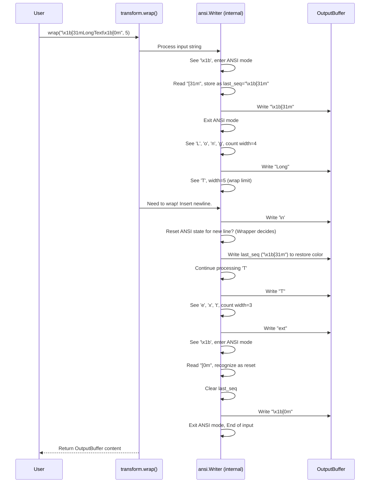

# Chapter 6: ANSI Sequence Handling (transform/ansi, SGR)

In [Chapter 5: Terminal Control (terminal/screen)](05_terminal_control__terminal_screen_.md), we learned how to use special command sequences to control the terminal, like clearing the screen or moving the cursor. We saw that these commands, just like the styling we learned about in [Chapter 3: Style Struct](03_style_struct_.md), are sent using specific codes.

But how does this all work under the hood? How does the terminal know that `\x1b[31m` means "turn the text red" and not just print those literal characters? And more importantly for `mist`, how do functions like text wrapping ([Chapter 4: Text Transformation (transform modules)](04_text_transformation__transform_modules__.md)) manage to manipulate styled text without breaking the colors?

This chapter dives into the low-level "grammar" of terminal styling: **ANSI Escape Sequences**, specifically the **SGR (Select Graphic Rendition)** codes, and how `mist`'s internal tools (`transform/ansi.mojo`) handle them.

## The Secret Code: ANSI Escape Sequences

Imagine you're sending messages to a secret agent (your terminal). Most of the message is plain text that the agent should just display. But sometimes, you need to give secret instructions, like "start using red ink" or "write the next word in bold". You can't just write "use red ink" because that would be displayed! You need a *secret code* to signal these instructions.

**ANSI Escape Sequences** are exactly that secret code for terminals. They are special sequences of characters that most terminals recognize as commands, not as text to be shown on screen.

These sequences almost always start with the **Escape character** (often represented as `\x1b` or `ESC`). This character alerts the terminal: "Hey! What comes next isn't normal text, it's a command!"

## CSI and SGR: Commands for Styling

There are many types of ANSI commands, but the ones `mist` uses most often for styling start with `\x1b[` which is called the **Control Sequence Introducer (CSI)**.

After the `CSI`, there are usually numbers (separated by semicolons `;`) that specify the exact command, followed by a letter that indicates the *type* of command.

For styling text (colors, boldness, italics, etc.), the command type we care about is **Select Graphic Rendition (SGR)**, which ends with the letter `m`.

Here are some examples:

*   `\x1b[31m`: This tells the terminal to set the foreground color to **red** (code `31`).
*   `\x1b[1m`: This tells the terminal to make the text **bold** (code `1`).
*   `\x1b[4m`: This tells the terminal to **underline** the text (code `4`).
*   `\x1b[34;1m`: This combines two codes: set foreground to **blue** (`34`) AND make it **bold** (`1`).
*   `\x1b[0m`: This is the **reset** code. It tells the terminal to turn off *all* styles (bold, underline, colors) and go back to the default look. `mist` automatically adds this at the end of styled text using `.render()`.

These number codes (`31`, `1`, `4`, `0`, etc.) are the **SGR parameters**. `mist` keeps a list of common SGR parameters in the `SGR` struct within `src/mist/style.mojo`.

```mojo
# Found in src/mist/style.mojo
struct SGR:
    """Enum of ANSI SGR (Select Graphic Rendition) sequences."""
    alias RESET = "0"
    alias BOLD = "1"
    alias ITALIC = "3"
    alias UNDERLINE = "4"
    # ... many color codes like ...
    alias RED_FOREGROUND_COLOR = "31"
    alias BLUE_FOREGROUND_COLOR = "34"
    # ... and background colors, bright colors, etc. ...
    alias BRIGHT_RED_FOREGROUND_COLOR = "91"
```
This `SGR` struct provides named constants for the numeric codes, making the `mist` library code easier to read than using raw numbers everywhere.

## The Problem: Manipulating Styled Text

Now, think about what happens if you have styled text, like:

```
Original String: "\x1b[31mImportant\x1b[0m message"
```

This string contains the red code (`\x1b[31m`), the text "Important", and the reset code (`\x1b[0m`), followed by " message". When printed, it looks like: [Red Text]Important[Reset] message.

What if you try to wrap this text to a width of, say, 6 characters? A simple approach might just cut the string after 6 visible characters:

```
Incorrect Wrap Attempt:
Line 1: "\x1b[31mImport"  (Cut after 't')
Line 2: "ant\x1b[0m message" (The rest of the string)
```

This looks okay at first glance. But what happens when you print these two lines?

*   Line 1 will appear red: [Red Text]Import[Reset]
*   Line 2 will appear in the *default* terminal color: ant message

The problem is that the "red" instruction (`\x1b[31m`) is only on the first line. The second line doesn't know it's supposed to continue being red! Also, the reset code (`\x1b[0m`) is now separated from its starting code. This is how styles get broken during text transformations if you're not careful.

## The Solution: `mist`'s ANSI-Aware Tools

This is precisely the problem that `mist`'s internal `transform/ansi.mojo` module solves. It provides tools that understand ANSI escape sequences. The most important tool is the `ansi.Writer` struct.

Think of `ansi.Writer` as a specialized text processor that reads text character by character and knows how to:

1.  **Identify** ANSI escape sequences (like `\x1b[31m`).
2.  **Separate** them from the actual visible text characters.
3.  **Track** the *currently active* style sequence (e.g., "we are currently supposed to be red and bold").
4.  **Process** the visible text (e.g., count its width for wrapping, add indentation spaces).
5.  **Re-apply** the currently active style if needed (e.g., after adding a newline during wrapping, it automatically adds the red code back at the start of the new line).
6.  **Pass through** the ANSI codes correctly so they end up in the output string without being counted as visible characters.

The text transformation functions we saw in [Chapter 4: Text Transformation (transform modules)](04_text_transformation__transform_modules__.md) (like `wrap`, `indent`, `truncate`) all use helpers like `ansi.Writer` internally to handle styled text correctly. You usually don't use `ansi.Writer` directly, but it's the engine making those transformations ANSI-safe.

## Under the Hood: How `ansi.Writer` Works

Let's peek behind the curtain. How does something like `ansi.Writer` actually process styled text?

Imagine we're indenting the string `\x1b[31mRed\x1b[0m\nBlue` by 2 spaces.

1.  **Start:** The indenter (using `ansi.Writer`) needs to add 2 spaces at the start of the line.
2.  **Detect ANSI:** It sees `\x1b`. It knows an ANSI sequence is starting. It switches to "ANSI reading mode".
3.  **Read ANSI:** It reads `[`, `3`, `1`, `m`. It recognizes `m` as the SGR terminator.
4.  **Store Style:** It records `\x1b[31m` as the "last active style". It passes `\x1b[31m` to the output buffer.
5.  **Process Visible:** It sees 'R'. It's not in ANSI mode. This is a visible character. It passes 'R' to the output.
6.  **Process Visible:** It sees 'e'. Passes 'e' to the output.
7.  **Process Visible:** It sees 'd'. Passes 'd' to the output.
8.  **Detect ANSI:** It sees `\x1b`. Switches to ANSI reading mode.
9.  **Read ANSI:** Reads `[`, `0`, `m`. Recognizes the terminator `m`.
10. **Reset Style:** It sees the reset code `0`. It clears its "last active style" memory. It passes `\x1b[0m` to the output.
11. **Process Newline:** It sees `\n`. This is a newline character.
12. **Handle Newline:** The indenter knows a new line is starting. It passes `\n` to the output.
13. **Apply Indent:** Because it's the start of a new line, it adds the required 2 spaces ("  ") to the output.
14. **Check Style:** Does it need to re-apply a style? No, the last style was reset.
15. **Process Visible:** It sees 'B'. Passes 'B' to the output.
16. **Process Visible:** It sees 'l'. Passes 'l' to the output.
17. **Process Visible:** It sees 'u'. Passes 'u' to the output.
18. **Process Visible:** It sees 'e'. Passes 'e' to the output.
19. **End:** The input string is finished.

The final output string would be `  \x1b[31mRed\x1b[0m\n  Blue` (with the first line correctly indented *before* the color code, and the second line also correctly indented).

Here's a simplified sequence diagram showing a text wrapper using `ansi.Writer`:



### Diving into `transform/ansi.mojo`

The actual implementation involves careful state management. Let's look at some simplified concepts from `src/mist/transform/ansi.mojo`:

```mojo
# Simplified concept from src/mist/transform/ansi.mojo

# --- Key Constants ---
alias ANSI_MARKER_BYTE = 0x1b # The Escape character byte
alias SGR_COMMAND = ord('m')   # The byte for the letter 'm'

# --- Helper Function ---
fn is_terminator(c: Codepoint) -> Bool:
    # Checks if a character (like 'm', 'H', 'J') signals the end of an ANSI sequence.
    var rune = c.to_u32()
    return (rune >= 0x40 and rune <= 0x5A) or (rune >= 0x61 and rune <= 0x7A)

# --- The Writer Struct ---
struct Writer:
    var forward: ByteWriter # Where the final output goes
    var ansi: Bool # Are we currently inside an ANSI sequence?
    var ansi_seq: ByteWriter # Temporarily stores the ANSI code being read
    var last_seq: ByteWriter # Stores the last *styling* sequence (like \x1b[31m)

    fn write(mut self, codepoint: Codepoint) -> None:
        # Check if it's the start of an ANSI sequence
        if codepoint.to_u32() == ANSI_MARKER_BYTE:
            self.ansi = True
            self.ansi_seq.reset() # Start collecting the new sequence
            self.ansi_seq.write(codepoint)

        # If we are inside an ANSI sequence...
        elif self.ansi:
            self.ansi_seq.write(codepoint)
            # Check if this character ends the sequence
            if is_terminator(codepoint):
                self.ansi = False # We are done reading the ANSI code

                # If it was a styling sequence ending in 'm'...
                if codepoint.to_u32() == SGR_COMMAND:
                    # Check if it was the RESET code ("\x1b[0m")
                    if self.ansi_seq.as_string_slice().endswith("0m"):
                        self.last_seq.reset() # Forget the last style
                    else:
                        # It was some other style, remember it
                        self.last_seq.reset()
                        self.last_seq.write(self.ansi_seq)

                # Write the complete ANSI sequence to the output
                self.forward.write(self.ansi_seq)

        # Otherwise, it's a normal visible character
        else:
            # Just write the character to the output
            self.forward.write(codepoint)

    # Helper to get the last remembered style
    fn last_sequence(self) -> StringSlice:
        return self.last_seq.as_string_slice()

    # Helper to add a reset code to the output if needed
    fn reset_ansi(mut self) -> None:
        if len(self.last_seq) > 0: # Only add reset if a style was active
             self.forward.write("\x1b[0m")

    # Helper to re-add the last remembered style to the output
    fn restore_ansi(mut self) -> None:
        if len(self.last_seq) > 0:
            self.forward.write(self.last_seq)

```

This simplified view shows the core logic:
*   Using the `ansi` boolean flag to track whether it's currently reading an ANSI code or visible text.
*   Using `ansi_seq` to buffer the code being read.
*   Using `last_seq` to remember the most recent SGR styling code (unless it was a reset).
*   Passing everything (both ANSI codes and visible text) to the `forward` output buffer.
*   Providing `reset_ansi` and `restore_ansi` methods that transformation functions can call when they modify the text structure (like adding a newline) to ensure styles are correctly managed.

## Conclusion

You've now peered into the fundamental mechanism that makes terminal styling work: **ANSI Escape Sequences**. You learned:

*   They are special codes, often starting with `\x1b[` (CSI), that terminals interpret as commands.
*   **SGR** sequences (`...m`) are used for graphic rendition like colors and boldness.
*   Manipulating styled text naively can break the styling.
*   `mist` uses internal tools in `src/mist/transform/ansi.mojo`, particularly the `ansi.Writer`, to parse and handle these sequences intelligently.
*   This allows `mist`'s text transformation functions ([Chapter 4: Text Transformation (transform modules)](04_text_transformation__transform_modules__.md)) to reshape text without destroying the styles applied using the [Style Struct](03_style_struct_.md).

Understanding this foundation helps appreciate how `mist` reliably brings color and style to your terminal applications.

We've seen how styles are applied and managed, but how does `mist` figure out the *closest* color when a terminal doesn't support the exact one you asked for (like converting True Color to basic ANSI)? That involves some color math!

**Next Up:** [Chapter 7: Color Math & Conversion (_hue.mojo)](07_color_math___conversion___hue_mojo__.md) - Let's explore how `mist` calculates color distances and conversions.

---

Generated by [AI Codebase Knowledge Builder](https://github.com/The-Pocket/Tutorial-Codebase-Knowledge)