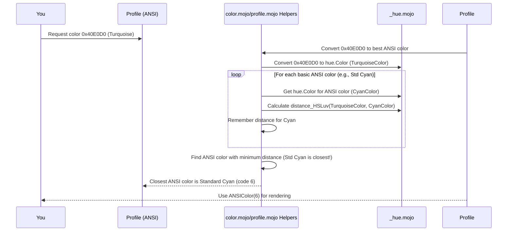

# Chapter 7: Color Math & Conversion (_hue.mojo)

Welcome to the final chapter of our core `mist` tutorial! In [Chapter 6: ANSI Sequence Handling (transform/ansi, SGR)](06_ansi_sequence_handling__transform_ansi__sgr__.md), we saw how `mist` intelligently handles the special ANSI codes used for styling and terminal control, making sure transformations don't break your colors.

But how does `mist` actually figure out the *right* color code to use, especially when you ask for a color that the terminal doesn't directly support? Remember back in [Chapter 1: Profile Struct](01_profile_struct_.md), we saw that asking for a fancy purple (`0xC9A0DC`) on a basic ANSI terminal resulted in standard magenta? How did `mist` know that magenta was the "closest" match?

This magic happens thanks to the color math engine lurking behind the scenes: `_hue.mojo`.

## Why Do We Need Color Math? The "Closest Color" Problem

Imagine you're painting a picture using only a basic set of 16 paint colors (like the ANSI terminal). You have a reference photo with a very specific shade of teal. You look at your 16 colors – maybe you have a basic green and a basic cyan. Which one should you use? You'd visually compare the teal in the photo to your green and cyan paints and pick the one that looks *most similar*.

Computers need to do the same thing! When the [Profile Struct](01_profile_struct_.md) is set to `ANSI` (16 colors) and you request an `RGBColor` like `0x40E0D0` (Turquoise), the `Profile` needs to figure out which of the 16 standard ANSI colors is the *perceptually closest* match.

Doing this reliably requires some color science. Just comparing the Red, Green, and Blue numbers isn't always accurate for predicting how humans perceive similarity. For example, our eyes are more sensitive to changes in green than in blue.

This is where `_hue.mojo` comes in. It provides the mathematical tools to:

1.  **Represent colors** in different ways (called color spaces).
2.  **Convert colors** between these different representations.
3.  **Calculate the *perceptual distance*** between colors – a number that represents how similar or different two colors look to a human eye.

## A Tiny Bit of Color Science (No Scary Math!)

Think of different ways to describe a location:
*   Street Address: "123 Main St" (Like Hex codes: `0x40E0D0`)
*   RGB: "Mix 64 parts Red, 224 parts Green, 208 parts Blue" (Like RGB values)
*   GPS Coordinates: Latitude/Longitude (Like XYZ color space - a standard reference)
*   Perceptual Description: "A bright, slightly greenish-blue" (Like Lab or HSLuv color spaces)

Just like GPS is useful for calculating distances between locations, certain color spaces are better for calculating *visual difference* between colors.

*   **RGB/Hex:** Easy for computers to store and display, but the distance between two RGB points doesn't always match how different they look to us.
*   **XYZ:** A standard reference space, often used as a bridge between other spaces.
*   **Lab / Luv / HSLuv:** These are designed to be **perceptually uniform** (or close to it). This means that if you have two pairs of colors, and the mathematical distance between the colors in the first pair is the *same* as the distance between the colors in the second pair (when measured in Lab/Luv space), then the pairs should *look* about equally different to a human observer.

`_hue.mojo` contains the formulas to convert colors into these perceptual spaces (like Lab and HSLuv) and calculate distances within them.

## What `_hue.mojo` Provides

`_hue.mojo` is `mist`'s internal color science toolkit. You won't usually call its functions directly, but other parts of `mist` rely on it heavily.

Its key components are:

1.  **`hue.Color` Struct:** A way to represent colors internally, usually starting from RGB values but capable of being converted to other spaces. It stores RGB as floating-point numbers for precision during calculations.

    ```mojo
    # Simplified from src/mist/_hue.mojo
    @value
    struct Color:
        var R: Float64 # Red (0.0 to 255.0 usually)
        var G: Float64 # Green
        var B: Float64 # Blue

        # Can be created from RGB bytes or hex
        fn __init__(out self, R: UInt8, G: UInt8, B: UInt8): ...
        fn __init__(out self, hex: UInt32): ...

        # Methods to convert to other spaces
        fn xyz(self) -> (Float64, Float64, Float64): ...
        fn lab(self) -> (Float64, Float64, Float64): ...
        fn luv(self) -> (Float64, Float64, Float64): ...
        fn HSLuv(self) -> (Float64, Float64, Float64): ...

        # Methods to calculate distance to another color
        # Uses perceptual spaces like Lab or HSLuv internally!
        fn distance_lab(self, other: Self) -> Float64: ...
        fn distance_ciede2000(self, other: Self) -> Float64: ... # More accurate
        fn distance_HSLuv(self, c2: Self) -> Float64: ...
    ```
    This struct holds the color data and provides methods to perform conversions and distance calculations using the complex formulas hidden inside `_hue.mojo`.

2.  **Conversion Functions:** Standalone functions and methods within `hue.Color` to translate between spaces (e.g., `xyz_to_lab`, `linear_rgb_to_xyz`, `Color.lab()`).
3.  **Distance Formulas:** Implementations of various color difference equations (like CIE76 (Lab distance), CIE94, CIEDE2000, HSLuv distance).

## How `mist` Uses `_hue.mojo` for Color Degradation

Let's trace how requesting Turquoise (`0x40E0D0`) gets converted to the closest basic ANSI color (likely Cyan, code 6) when using the `ANSI_PROFILE`.

1.  **You:** Call `style.foreground(0x40E0D0)` on a `Style` with `ANSI_PROFILE`.
2.  **Style:** Asks its `Profile` to handle the color `0x40E0D0`.
3.  **Profile:** Knows it needs to end up with an `ANSIColor` (0-15). It might first convert the True Color to the closest ANSI 256 color, and then convert *that* to the closest basic ANSI 16 color. It calls helper functions in `mist/color.mojo` and `mist/profile.mojo` like `hex_to_ansi256` and `ansi256_to_ansi`.
4.  **Conversion Logic (`hex_to_ansi256`):**
    *   Uses `_hue.mojo` to create a `hue.Color` object for the input Turquoise (`0x40E0D0`).
    *   Uses `_hue.mojo` to create `hue.Color` objects for each of the 256 ANSI palette colors.
    *   Uses a distance function from `_hue.mojo` (e.g., `distance_HSLuv`) to calculate the perceptual distance between the input Turquoise and *each* of the 256 palette colors.
    *   Finds the palette color with the *smallest* distance. Let's say it's ANSI 256 code `43`.
    *   Returns `43`.
5.  **Conversion Logic (`ansi256_to_ansi`):**
    *   Receives the intermediate color `43`.
    *   Uses `_hue.mojo` to create a `hue.Color` object for ANSI color `43`.
    *   Uses `_hue.mojo` to create `hue.Color` objects for each of the *basic 16* ANSI colors.
    *   Uses a distance function from `_hue.mojo` (e.g., `distance_HSLuv`) to calculate the perceptual distance between color `43` and *each* of the basic 16 colors.
    *   Finds the basic color with the *smallest* distance. This is likely Standard Cyan (code `6`).
    *   Returns `6`.
6.  **Profile:** Receives the final ANSI code `6`. Wraps it in an `ANSIColor(6)`.
7.  **Style:** Receives `ANSIColor(6)` and uses its `sequence()` method to generate the ANSI code `\x1b[36m` for rendering.

This process ensures that the color chosen is the one that *looks* most similar to the original request, according to perceptual models.

Here's a simplified diagram of that flow:



## Under the Hood: A Glimpse at the Code

You don't need to understand the complex math *inside* `_hue.mojo`. However, seeing how the conversion helpers *use* it can be insightful.

Let's look at a simplified concept of the `ansi256_to_ansi` function from `src/mist/color.mojo`:

```mojo
# Simplified concept from src/mist/color.mojo

import mist._hue as hue
from mist._ansi_colors import ANSI_HEX_CODES # Contains hex codes for 0-255

fn ansi256_to_ansi(value: UInt8) -> UInt8:
    """Converts an ANSI256 color (0-255) to the closest basic ANSI color (0-15)."""

    # 1. Get the input color as a hue.Color object
    # First, get the hex code for the input ANSI 256 value
    let input_hex: UInt32 = ANSI_HEX_CODES[Int(value)]
    # Convert hex to RGB tuple
    let input_rgb: (UInt8, UInt8, UInt8) = hex_to_rgb(input_hex)
    # Create the hue.Color object for the input
    let input_hue_color = hue.Color(input_rgb[0], input_rgb[1], input_rgb[2])

    # 2. Prepare to track the best match
    var best_match_index: UInt8 = 0
    var minimum_distance = hue.MAX_FLOAT64 # Start with a huge distance

    # 3. Loop through the basic 16 ANSI colors (indices 0 to 15)
    alias MAX_BASIC_ANSI = 16
    for i in range(MAX_BASIC_ANSI):
        # Get the hex code for the current basic ANSI color
        let basic_ansi_hex: UInt32 = ANSI_HEX_CODES[i]
        # Convert it to RGB
        let basic_ansi_rgb = hex_to_rgb(basic_ansi_hex)
        # Create a hue.Color object for this basic ANSI color
        let basic_hue_color = hue.Color(basic_ansi_rgb[0], basic_ansi_rgb[1], basic_ansi_rgb[2])

        # 4. Calculate the perceptual distance using _hue.mojo
        # We use HSLuv distance here as an example
        let distance = input_hue_color.distance_HSLuv(basic_hue_color)

        # 5. Check if this is the closest color found so far
        if distance < minimum_distance:
            minimum_distance = distance
            best_match_index = i.cast[DType.uint8]()

            # Optimization: if distance is essentially zero, we found a perfect match
            if distance < 1e-5: # Small tolerance
                 break

    # 6. Return the index (0-15) of the closest basic ANSI color
    return best_match_index
```

This code shows the pattern:
1.  Convert the input color and potential target colors into `hue.Color` objects.
2.  Loop through the target palette (basic 16 ANSI colors).
3.  Use a distance function from `hue.Color` (like `.distance_HSLuv()`) to compare the input to each target.
4.  Keep track of the target color that had the smallest distance.
5.  Return the index of the best match.

The `hex_to_ansi256` function works similarly but compares the input True Color against all 256 colors in the ANSI palette.

## Conclusion

You've reached the end of our journey through the core concepts of `mist`! In this chapter, we uncovered the secrets of `_hue.mojo`, the hidden engine powering `mist`'s color handling:

*   It provides the **mathematical tools** for accurate color conversions and comparisons.
*   It uses **perceptual color spaces** (like Lab, Luv, HSLuv) to calculate how similar colors *look* to humans.
*   Functions like `distance_lab` or `distance_HSLuv` allow `mist` to find the **visually closest** match when degrading colors for terminals with limited palettes (e.g., True Color -> ANSI 256 -> ANSI 16).
*   While you don't use `_hue.mojo` directly, it's essential for the intelligent color mapping performed by the [Profile Struct](01_profile_struct_.md) and [Color System (AnyColor, ANSIColor, RGBColor, etc.)](02_color_system__anycolor__ansicolor__rgbcolor__etc___.md).

This sophisticated color handling ensures that your styled text looks as good as possible, degrading gracefully across different terminal capabilities.

Congratulations! You now have a solid understanding of `mist`'s key components:
*   [Profile Struct](01_profile_struct_.md) (Handling terminal capabilities)
*   [Color System (AnyColor, ANSIColor, RGBColor, etc.)](02_color_system__anycolor__ansicolor__rgbcolor__etc___.md) (Representing colors)
*   [Style Struct](03_style_struct_.md) (Applying colors and effects)
*   [Text Transformation (transform modules)](04_text_transformation__transform_modules__.md) (Reshaping text layout)
*   [Terminal Control (terminal/screen)](05_terminal_control__terminal_screen_.md) (Controlling the cursor and screen)
*   [ANSI Sequence Handling (transform/ansi, SGR)](06_ansi_sequence_handling__transform_ansi__sgr__.md) (The low-level codes)
*   [Color Math & Conversion (_hue.mojo)](07_color_math___conversion___hue_mojo__.md) (Ensuring accurate color mapping)

With these tools, you're well-equipped to start creating beautiful and dynamic terminal applications with `mist`! Happy coding!

---

Generated by [AI Codebase Knowledge Builder](https://github.com/The-Pocket/Tutorial-Codebase-Knowledge)