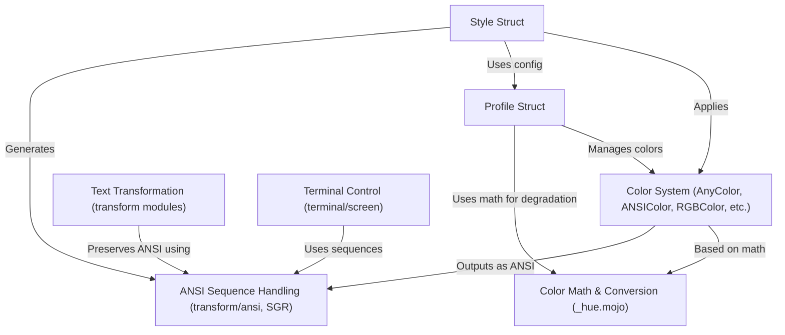

# Tutorial: mist

`mist` is a Mojo library designed to make **styling text** in your terminal easy and flexible. It allows you to add *colors* (like foreground and background) and *effects* (like bold or underline) to text. It also intelligently adapts the output based on the **terminal's capabilities** (e.g., showing the closest available color if the terminal doesn't support the exact one requested). Additionally, it provides tools for manipulating text layout (like wrapping or indenting) while preserving styles, and directly controlling the terminal screen and cursor.

**Source Repository:** [None](None)

## Chapters

1. [Profile Struct
](01_profile_struct_.md)
2. [Color System (AnyColor, ANSIColor, RGBColor, etc.)
](02_color_system__anycolor__ansicolor__rgbcolor__etc___.md)
3. [Style Struct
](03_style_struct_.md)
4. [Text Transformation (transform modules)
](04_text_transformation__transform_modules__.md)
5. [Terminal Control (terminal/screen)
](05_terminal_control__terminal_screen__.md)
6. [ANSI Sequence Handling (transform/ansi, SGR)
](06_ansi_sequence_handling__transform_ansi__sgr__.md)
7. [Color Math & Conversion (_hue.mojo)
](07_color_math___conversion___hue_mojo__.md)

---

Generated by [AI Codebase Knowledge Builder](https://github.com/The-Pocket/Tutorial-Codebase-Knowledge)