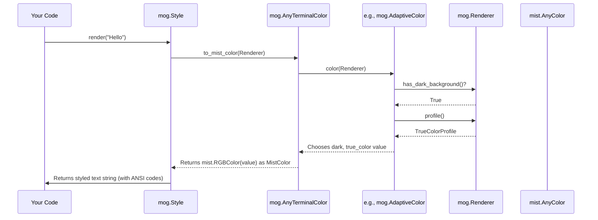

# Chapter 1: TerminalColor (and variants)

Welcome to the `mog` tutorial! We're going to learn how to make text look great in your terminal. Terminals are those text-based windows you might use to run commands. Sometimes, you want to add colors or styles (like bold text) to make information clearer or just more visually appealing.

But terminals can be tricky! Some support millions of colors, others only a few. Some have light backgrounds, others dark. How can we make our text look good everywhere?

That's where `mog`'s color system comes in. Think of it like having different types of paint:

*   Some paints are simple, basic colors (like red, blue).
*   Some paints magically change color depending on the light!
*   Some paints are special mixes, designed to look *just right* under specific lighting conditions.

`mog` provides different "pigments" or ways to define colors, and we'll learn about them in this chapter. Our main goal is to understand how to tell `mog` exactly what color we want, no matter the terminal.

## Meet the Color Crew

`mog` offers several ways to specify colors, designed for different situations. Let's meet them!

### 1. `Color`: The Basic Pigment

This is the simplest way. You can give it a standard web color code (hexadecimal, like `0xFF0000` for red) or a number from 0-255 which corresponds to standard terminal colors (ANSI colors).

```mojo
import mog

fn main():
    // Using a hex code for a nice purple
    let purple = mog.Color(0x7D56F4)

    // Using an ANSI code (21 is often a shade of blue)
    let ansi_blue = mog.Color(21)

    // We'll see how to *use* these colors in the next chapter!
    // For now, just know how to define them.
    print("Defined purple and ansi_blue!")
```

This code defines two colors. `purple` uses a hex code (common in web design), and `ansi_blue` uses a number (common in terminal color schemes). `mog` figures out the best way to show these based on what your terminal supports.

### 2. `ANSIColor`: Just for ANSI

This is a shortcut if you *know* you want to use an ANSI color code (0-255). It's like `Color`, but specifically for those numbers.

```mojo
import mog

fn main():
    // Using ANSIColor for code 21 (often blue)
    let ansi_blue_shortcut = mog.ANSIColor(21)

    // This is the same as:
    let ansi_blue_regular = mog.Color(21)

    print("Defined ansi_blue_shortcut!")

```

Using `mog.ANSIColor(21)` is exactly the same as `mog.Color(21)`. It's just a slightly clearer way to say "I'm using an ANSI code".

### 3. `AdaptiveColor`: The Chameleon

What if you want one color for light terminal backgrounds and another for dark ones? `AdaptiveColor` is your friend! It's like paint that changes color in the sun.

```mojo
import mog

fn main():
    let adaptive_text_color = mog.AdaptiveColor(
        light=0x111111, // Dark gray for light backgrounds
        dark=0xEEEEEE   // Light gray for dark backgrounds
    )

    print("Defined adaptive_text_color!")
    # If your terminal has a dark background, mog will try to use 0xEEEEEE.
    # If it has a light background, mog will try to use 0x111111.
```

Here, `adaptive_text_color` will be dark gray (`0x111111`) if `mog` detects a light terminal background, and light gray (`0xEEEEEE`) if it detects a dark background. This helps ensure your text is always readable.

### 4. `CompleteColor`: The Perfectionist

Sometimes, you want *exact* control. Maybe the automatic color conversion doesn't look quite right. `CompleteColor` lets you specify the *precise* color for different terminal capabilities:

*   `true_color`: For modern terminals supporting millions of colors (hex codes).
*   `ansi256`: For terminals supporting 256 colors (codes 0-255).
*   `ansi`: For older terminals supporting only 16 basic colors (codes 0-15).

```mojo
import mog

fn main():
    let precise_blue = mog.CompleteColor(
        true_color=0x005FFF, // A specific blue for TrueColor terminals
        ansi256=21,         // A standard blue for 256-color terminals
        ansi=4              // The basic blue for 16-color terminals
    )

    print("Defined precise_blue!")
    # mog will pick the best option your terminal supports:
    # - TrueColor terminal? Uses 0x005FFF.
    # - 256-color terminal? Uses ANSI code 21.
    # - 16-color terminal? Uses ANSI code 4.
```

With `CompleteColor`, `mog` won't guess; it will use the exact color you provided for the terminal's level of support.

### 5. `CompleteAdaptiveColor`: The Ultimate Control

This combines the power of `AdaptiveColor` and `CompleteColor`. You specify *precise* colors for each terminal type, *and* you provide different sets for light and dark backgrounds.

```mojo
import mog

fn main():
    let super_color = mog.CompleteAdaptiveColor(
        light=mog.CompleteColor(true_color=0x333333, ansi256=236, ansi=0), // Dark colors for light bg
        dark=mog.CompleteColor(true_color=0xCCCCCC, ansi256=252, ansi=7)   // Light colors for dark bg
    )

    print("Defined super_color!")
    # mog checks background (light/dark) AND color support (TrueColor/256/16)
    # to pick the exact color you specified for that combination.
```

This gives you the most control but requires defining more colors upfront.

### 6. `NoColor`: The Invisibility Cloak

Sometimes, you explicitly want *no* color applied. Maybe you want to reset a color set by something else, or ensure the terminal's default is used.

```mojo
import mog

fn main():
    let no_specific_color = mog.NoColor()

    print("Defined no_specific_color!")
    # This tells mog: "Don't apply any special color here."
```

`NoColor` is useful for ensuring default terminal colors are used for foreground, and that no background color is drawn.

### 7. `AnyTerminalColor`: The Palette

How do we pass these different color types around? We use `AnyTerminalColor`. It's a wrapper that can hold *any* of the color types we just discussed (`Color`, `AdaptiveColor`, `NoColor`, etc.).

When you use methods like `.foreground()` or `.background()` (which we'll see in the [Style](02_style_.md) chapter), they expect an `AnyTerminalColor`. You can usually just pass your specific color type directly, and Mojo handles the conversion implicitly!

```mojo
import mog

fn main():
    // You can create them directly...
    let my_color: mog.AnyTerminalColor = mog.Color(0xFF0000) // Red
    let adaptive: mog.AnyTerminalColor = mog.AdaptiveColor(light=0x0, dark=0xFFFFFF)

    // ...or let Mojo convert implicitly when needed (more common!)
    // Imagine a function expecting AnyTerminalColor:
    fn use_color(color: mog.AnyTerminalColor):
        print("Got a color!")

    use_color(mog.Color(0x00FF00))       // Pass a Color
    use_color(mog.ANSIColor(5))         // Pass an ANSIColor
    use_color(mog.NoColor())            // Pass NoColor
    # ...and so on for all types!
```

You usually don't need to explicitly type `AnyTerminalColor`. Just create the specific color type you need (`Color`, `AdaptiveColor`, etc.), and pass it where an `AnyTerminalColor` is expected.

## How Does `mog` Choose the Right Color? (Under the Hood)

You define a color using one of the types above (like `AdaptiveColor`). When it's time to actually display text, `mog` needs to figure out the final color code to send to the terminal. This involves a few steps:

1.  **The Request:** A styling component (like [Style](02_style_.md), which we'll cover next) asks your `AnyTerminalColor` for the actual color to use. It also provides information about the terminal via a [Renderer](08_renderer_.md) object.
2.  **Checking the Palette:** The `AnyTerminalColor` looks at which specific color type it's holding (e.g., is it a `Color`, an `AdaptiveColor`, etc.?).
3.  **Consulting the Renderer:** The specific color type (e.g., `AdaptiveColor`) uses the [Renderer](08_renderer_.md) to ask questions:
    *   "Does the terminal have a dark background?" (for `AdaptiveColor` and `CompleteAdaptiveColor`)
    *   "What color level does the terminal support (TrueColor, 256, 16)?" (for `CompleteColor` and `CompleteAdaptiveColor`, and implicitly for `Color` and `ANSIColor` to choose the right format)
4.  **Making the Decision:** Based on the answers from the [Renderer](08_renderer_.md) and the definition you provided (e.g., the `light` and `dark` values in `AdaptiveColor`), the color type selects the final color value (like `0xEEEEEE` or `21`).
5.  **Final Conversion:** This final value is converted into a low-level color representation (`mist.AnyColor`) that the underlying `mist` library understands.
6.  **Sending to Terminal:** This `mist.AnyColor` is used to generate the correct sequence of characters (ANSI escape codes) that tells your terminal "display the following text in this color!".

Here's a simplified view of that flow:



Let's peek at some relevant code snippets:

**1. The Wrapper (`AnyTerminalColor`)**

This struct uses a `Variant` to hold any of the possible color types.

```mojo
# From: src/mog/color.mojo
struct AnyTerminalColor:
    # A Variant can hold one of several different types at runtime.
    var value: Variant[
        NoColor,
        Color,
        ANSIColor,
        AdaptiveColor,
        CompleteColor,
        CompleteAdaptiveColor,
    ]
    # ... (initializers allow creating it from specific types) ...

    fn to_mist_color(self, renderer: Renderer) -> mist.AnyColor:
        """Converts AnyTerminalColor to a low-level mist.AnyColor."""
        # Check which type is actually inside the variant...
        if self.value.isa[Color]():
            # ...and call its specific 'color' method.
            return self.value[Color].color(renderer)
        elif self.value.isa[ANSIColor]():
            return self.value[ANSIColor].color(renderer)
        elif self.value.isa[AdaptiveColor]():
            return self.value[AdaptiveColor].color(renderer)
        # ... (checks for other types) ...

        # Default to NoColor if something unexpected happens
        return mist.NoColor()
```

The `to_mist_color` method is key. It figures out what *kind* of color definition you provided (`Color`, `AdaptiveColor`, etc.) and then asks *that specific type* to determine the final `mist.AnyColor` based on the [Renderer](08_renderer_.md).

**2. A Specific Type (`AdaptiveColor`)**

Here's how `AdaptiveColor` uses the [Renderer](08_renderer_.md):

```mojo
# From: src/mog/color.mojo
@value
struct AdaptiveColor(TerminalColor):
    var light: UInt32
    var dark: UInt32

    fn color(self, renderer: Renderer) -> mist.AnyColor:
        # Ask the renderer about the background
        if renderer.has_dark_background():
            # If dark, use the 'dark' value you provided.
            # Color(self.dark) creates a basic Color struct,
            # and its .color() method handles final conversion.
            return Color(self.dark).color(renderer)

        # Otherwise, use the 'light' value.
        return Color(self.light).color(renderer)
```

It simply checks `renderer.has_dark_background()` and then uses the appropriate `light` or `dark` value you defined, passing it to a basic `Color` for the final conversion based on the terminal's profile (TrueColor, 256, etc.).

## Conclusion

You've learned about the different ways `mog` lets you define colors for your terminal text:

*   `Color` / `ANSIColor` for simple, direct colors.
*   `AdaptiveColor` for colors that change based on light/dark backgrounds.
*   `CompleteColor` for precise control across different terminal capabilities.
*   `CompleteAdaptiveColor` for combining adaptive behavior with precise control.
*   `NoColor` to explicitly avoid coloring.
*   `AnyTerminalColor` as the universal wrapper used by `mog`.

Understanding these options allows you to choose the right level of control and adaptability for your needs.

Now that we know how to define the *colors*, how do we actually apply them to text, maybe along with other effects like **bold** or *italics*? That's where the [Style](02_style_.md) object comes in, and it's the topic of our next chapter!

[Next Chapter: Style](02_style_.md)

---

Generated by [AI Codebase Knowledge Builder](https://github.com/The-Pocket/Tutorial-Codebase-Knowledge)