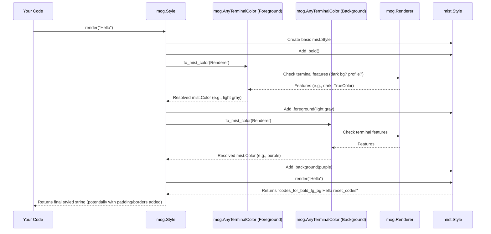

# Chapter 2: Style

In the [previous chapter](01_terminalcolor__and_variants__.md), we learned all about defining colors using `mog`'s different color types, like `Color`, `ANSIColor`, and `AdaptiveColor`. That's like picking out the paints for our artwork. But how do we actually *apply* those paints to our text? What if we also want to make the text **bold**, *italic*, add some space around it, or put a box around it?

That's where `mog.Style` comes in! Think of `Style` as your main toolkit for decorating text. It holds all the instructions for how a piece of text should look – colors, emphasis (like bold/italic), spacing (padding/margin), borders, and alignment.

Let's say we want to display an important message in the terminal, making it **bold** and maybe giving it a nice purple background. `Style` is how we do that.

## Your Text Styling Toolkit: `mog.Style`

The `Style` object is the heart of `mog`'s styling system. Imagine you're a painter:

*   You start with a blank `Style` object (an empty canvas and basic brushes).
*   You use methods like `.bold(True)`, `.foreground(...)`, `.background(...)`, `.padding(...)` to add instructions (choosing specific paints, thicker brushes, deciding how much space to leave around the painting).
*   You chain these methods together, one after another, building up the complete look.
*   Finally, you use the `.render("Your Text")` method to apply all those collected instructions to your actual text (painting the text onto the canvas).

Each time you call a method like `.bold(True)` or `.foreground(...)`, it doesn't change the *original* `Style` object. Instead, it cleverly returns a *new* `Style` object with that specific instruction added. This makes it easy and safe to create variations of styles.

## Making Text Bold and Colorful

Let's try our simple use case: making text bold with a specific foreground (text) color and background color.

```mojo
import mog

fn main():
    # 1. Create a base Style object
    let base_style = mog.Style()

    # 2. Chain methods to add styling rules
    let fancy_style = base_style \
        .bold(True)                     # Make the text bold
        .foreground(mog.Color(0xFAFAFA)) # Set text color to light gray
        .background(mog.Color(0x7D56F4)) # Set background to purple

    # 3. Use the render() method to apply the style to some text
    let styled_text = fancy_style.render("Important Message!")

    # 4. Print the result
    print(styled_text)

    # You can also do it all in one go:
    let another_style = mog.Style() \
        .italic(True) \
        .foreground(mog.Color(0x00FF00)) # Green text
    
    print(another_style.render("Another message"))
```

**Explanation:**

1.  `mog.Style()` creates our initial, empty toolkit.
2.  We then "chain" methods onto it:
    *   `.bold(True)` adds the instruction to make text bold.
    *   `.foreground(mog.Color(0xFAFAFA))` uses a `Color` object (like we learned about in [Chapter 1](01_terminalcolor__and_variants__.md)) to set the text color.
    *   `.background(mog.Color(0x7D56F4))` sets the background color.
    *   Notice the `\` at the end of the lines – this is Mojo syntax to continue a statement on the next line, making the chain easier to read.
3.  `fancy_style.render("Important Message!")` takes the string "Important Message!" and applies all the rules we defined in `fancy_style`. It returns a *new* string that contains special codes (ANSI escape codes) that your terminal understands.
4.  When you `print(styled_text)`, your terminal reads these special codes and displays the text as **bold**, with a light gray foreground and a purple background. The second example shows applying *italic* green text.

## Common Styling Methods

The `Style` object has many methods you can chain. Here are some of the most common ones:

*   **Emphasis:**
    *   `.bold(True)` / `.bold(False)`
    *   `.italic(True)` / `.italic(False)`
    *   `.underline(True)` / `.underline(False)`
    *   `.strikethrough(True)` / `.strikethrough(False)`
    *   `.reverse(True)` (swaps foreground and background colors)
    *   `.blink(True)` (makes text blink, terminal support varies)
    *   `.faint(True)` (makes text dimmer, terminal support varies)
*   **Colors:**
    *   `.foreground(AnyTerminalColor)`: Sets the text color. You can pass any color type from Chapter 1 (e.g., `mog.Color(0xFF0000)`, `mog.AdaptiveColor(...)`).
    *   `.background(AnyTerminalColor)`: Sets the background color.
*   **Spacing (Padding - inside the border):**
    *   `.padding(top, right, bottom, left)`: Sets padding on all sides.
    *   `.padding_top(value)`, `.padding_right(value)`, etc.: Set padding individually.
*   **Spacing (Margin - outside the border):**
    *   `.margin(top, right, bottom, left)`: Sets margin on all sides.
    *   `.margin_top(value)`, `.margin_right(value)`, etc.: Set margin individually.
*   **Size:**
    *   `.width(value)`: Sets a fixed width (padding text with spaces if needed).
    *   `.height(value)`: Sets a fixed height (padding with newlines if needed).
    *   `.max_width(value)`: Truncates lines longer than this width. We'll see more in [Measurement Functions](05_measurement_functions__get_width_get_height_get_dimensions__.md).
    *   `.max_height(value)`: Truncates text taller than this height.
*   **Alignment:**
    *   `.alignment(horizontal, vertical)`: Sets horizontal and vertical alignment using `mog.Position`. We'll cover `Position` in [Chapter 4](04_position_.md).
    *   `.horizontal_alignment(value)`, `.vertical_alignment(value)`: Set alignment individually.
*   **Border:**
    *   `.border(mog.NORMAL_BORDER)`: Adds a border around the text. We'll dive deep into borders in the [next chapter](03_border_.md).
    *   `.border_foreground(AnyTerminalColor)`, `.border_background(AnyTerminalColor)`: Set border colors.

Don't worry about memorizing all of these now! The key idea is that you build up your desired look by chaining these methods onto a `Style` object.

## How `Style.render()` Works (Under the Hood)

When you call `style.render("some text")`, what actually happens?

1.  **Gather Instructions:** The `Style` object looks at all the methods you chained (.bold, .foreground, .padding, etc.) and collects these instructions.
2.  **Prepare Base Style:** It uses an underlying library (`mist`) to create a basic terminal style object.
3.  **Apply Basic Styles:** It applies simple styles like bold, italic, underline directly to the `mist` style.
4.  **Resolve Colors:** For foreground and background colors, it takes the `AnyTerminalColor` you provided (e.g., `mog.AdaptiveColor(...)`) and asks it for the *actual* color code to use. As we saw in Chapter 1, this involves checking the [Renderer](08_renderer_.md) to see if the terminal has a dark background and what color level it supports (TrueColor, 256, 16). The resolved color is then applied to the `mist` style.
5.  **Style the Text:** The `mist` style (now configured with bold, colors, etc.) is used to wrap your input text with the correct ANSI escape codes.
6.  **Handle Spacing & Alignment:** If you set padding, width, or alignment, `mog` calculates how many spaces or newlines are needed and adds them around the styled text. This often involves using the `mist` style again to ensure the padding spaces have the correct background color.
7.  **Apply Border:** If a border was requested, `mog` generates the border characters (like `┌`, `─`, `│`) and styles them using the specified border colors (again, resolving `AnyTerminalColor`s via the [Renderer](08_renderer_.md)). It carefully places the styled text *inside* the border.
8.  **Apply Margins:** If margins were set, `mog` adds blank lines or spaces *outside* the border (or text, if no border). It might color the background of this margin area if `margin_background` was set.
9.  **Handle Max Width/Height:** If `max_width` or `max_height` were set, the potentially multi-line string is truncated at this stage.
10. **Return Final String:** The fully constructed string, complete with all ANSI codes for styling, padding, borders, and margins, is returned.

Here's a simplified diagram showing the core flow for basic styling:



Let's peek at some relevant (simplified) code snippets from `src/mog/style.mojo`:

**1. The `Style` Struct:**

It holds internal state for all the properties you can set.

```mojo
# Simplified from: src/mog/style.mojo
struct Style:
    # Stores which properties are set (like a checklist)
    var _properties: Properties
    # Stores the actual values for boolean properties (bold, italic...)
    var _attrs: Properties
    # Holds foreground/background colors
    var _color: Coloring
    # Holds padding values
    var _padding: Padding
    # Holds margin values and margin background color
    var _margin: Margin
    # Holds the border definition
    var _border: Border
    # Holds border colors
    var _border_color: BorderColor
    # ... other properties like dimensions, alignment ...
    # Knows about the terminal via the Renderer
    var _renderer: Renderer

    # The constructor initializes everything to default (unset) states
    fn __init__(out self, color_profile: Int = -1, *, value: String = ""):
        self._renderer = Renderer(color_profile)
        self._properties = Properties() # All flags off
        self._attrs = Properties()      # All flags off
        self._color = Coloring()        # NoColor by default
        self._padding = Padding()       # Zero padding
        self._margin = Margin()         # Zero margin
        self._border = NO_BORDER        # No border
        # ... initialize others ...

    # Methods like .bold() create a copy and modify it
    fn bold(self, /, value: Bool = True) -> Self:
        var new = self.copy() # Create a copy of the current style
        # Update the internal properties/attributes for 'bold'
        new._set_attribute[PropKey.BOLD](value)
        return new^ # Return the modified copy
```

Notice how `bold()` uses `self.copy()` to create a new `Style` and then modifies that copy using `_set_attribute`. This immutable approach is common in `mog`.

**2. The `render()` Method (Simplified Flow):**

```mojo
# Simplified concept from: src/mog/style.mojo
fn render(self, *texts: *Ts) -> String:
    # 1. Combine input texts
    var input_text = ... # Join texts

    # 2. Get base styler from mist library, configured via Renderer
    var stylers = self._get_styles() # Includes resolving colors

    # 3. Apply basic styles (bold, italic, fg/bg color) to the text
    var result = _apply_styles(input_text, self.uses_space_styler(), stylers)

    # --- If not using the simple 'inline' mode ---
    if not self.get_inline():
        # 4. Add Padding (inside border)
        result = _apply_padding(result, stylers.whitespace) # Simplified

        # 5. Align Text (horizontal/vertical)
        result = _apply_alignment(result, stylers.whitespace) # Simplified

        # 6. Add Border (around padded/aligned text)
        result = self._apply_border(result)

        # 7. Add Margin (outside border)
        result = self._apply_margins(result, inline=False)
    # --- End inline check ---

    # 8. Truncate if max_width/max_height are set
    result = _apply_max_dimensions(result) # Simplified

    # 9. Return the final string with all ANSI codes
    return result^
```

This shows the general order: style the core text first, then add padding, align, add the border, add the margin, and finally truncate. Each step builds upon the previous one.

## Conclusion

You've now learned about `mog.Style`, the central tool for making your terminal text look good!

*   It acts like a **stylesheet** or a **painter's toolkit**.
*   You **chain methods** like `.bold()`, `.foreground()`, `.padding()` to define the appearance.
*   The **`.render()` method** applies all these settings to your text, producing a string with terminal styling codes.
*   It handles colors (using types from [Chapter 1](01_terminalcolor__and_variants__.md)), emphasis, spacing, alignment, and borders.

We briefly mentioned borders, but they have many options! In the next chapter, we'll explore how to create different kinds of boxes and lines around your text using the [Border](03_border_.md) settings.

[Next Chapter: Border](03_border_.md)

---

Generated by [AI Codebase Knowledge Builder](https://github.com/The-Pocket/Tutorial-Codebase-Knowledge)