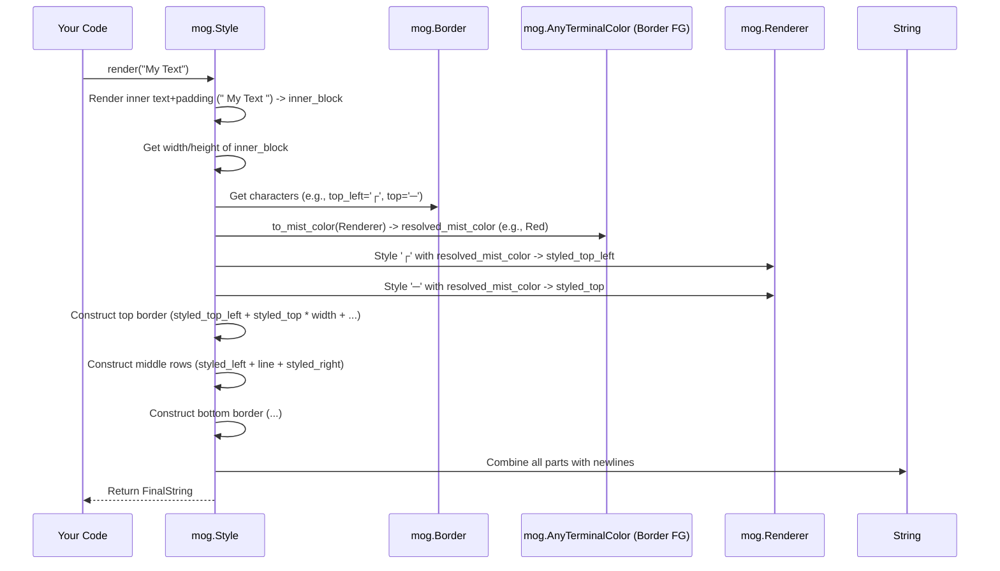

# Chapter 3: Border

In the [previous chapter](02_style_.md), we learned how to use `mog.Style` to make text bold, colorful, and add spacing like padding. We briefly saw the `.border()` method, but didn't dive into it.

Imagine you want to draw attention to a specific message in your terminal by putting a nice box around it. How do you tell `mog` what *kind* of box to draw? Should it use simple dashes and pipes (`-`, `|`), or maybe fancy rounded corners, or even double lines?

This is where the `mog.Border` concept comes in! It lets you define exactly which characters should be used to draw the frame around your styled text.

## What is a Border?

Think of a `mog.Border` as a blueprint or a recipe for drawing a frame. It specifies which character (or string) to use for:

*   **Corners:** Top-left, top-right, bottom-left, bottom-right.
*   **Edges:** The characters that make up the top, bottom, left, and right sides of the box.
*   **Internal Separators (Optional):** Characters used for lines *inside* the box, like those needed for drawing tables (which we'll see in the [Table](07_table_.md) chapter).

Just like choosing a picture frame, you can choose different border styles – simple, ornate, thick, thin, etc.

## Using Predefined Borders

`mog` comes with several ready-made border styles, defined as constants (aliases). This makes it super easy to add common border types.

Let's add a standard box around some text using `mog.NORMAL_BORDER`:

```mojo
import mog

fn main():
    # Create a Style
    let style = mog.Style()

    # Add a normal border using the predefined alias
    let boxed_style = style.border(mog.NORMAL_BORDER)

    # Render the text with the border
    let output = boxed_style.render("Hello, Box!")

    # Print the result
    print(output)
```

**Explanation:**

1.  We create a basic `mog.Style()`.
2.  We chain the `.border()` method, passing it the `mog.NORMAL_BORDER` alias. This tells the style to use the standard single-line box characters.
3.  `.render("Hello, Box!")` applies the style.
4.  When printed, you'll see something like this (the exact characters depend on your terminal's font support):

    ```text
    ┌───────────┐
    │ Hello, Box! │
    └───────────┘
    ```

Let's try a few other predefined styles:

```mojo
import mog

fn main():
    let base_style = mog.Style()

    # Rounded corners
    let rounded_output = base_style.border(mog.ROUNDED_BORDER).render("Rounded")
    print(rounded_output)

    # Double lines
    let double_output = base_style.border(mog.DOUBLE_BORDER).render("Double")
    print(double_output)

    # Thick lines
    let thick_output = base_style.border(mog.THICK_BORDER).render("Thick")
    print(thick_output)

    # Just asterisks
    let star_output = base_style.border(mog.STAR_BORDER).render("Stars")
    print(star_output)
```

**Output (Conceptual):**

```text
╭───────╮
│ Rounded │
╰───────╯

╔══════╗
║ Double ║
╚══════╝

┏━━━━━┓
┃ Thick ┃
┗━━━━━┛

*********
* Stars *
*********
```

These aliases (`NORMAL_BORDER`, `ROUNDED_BORDER`, `DOUBLE_BORDER`, `THICK_BORDER`, `STAR_BORDER`, etc.) provide convenient ways to get common border looks quickly. `mog.NO_BORDER` means no border is drawn (the default), and `mog.HIDDEN_BORDER` draws a border using spaces, which can be useful for layout spacing.

## Customizing Border Colors

What if you want the border lines themselves to be a different color? You can use the `.border_foreground()` and `.border_background()` methods on your `Style` object. These work just like the `.foreground()` and `.background()` methods we saw in [Chapter 2](02_style_.md), but they apply only to the border characters.

```mojo
import mog

fn main():
    # A style with a normal border and a red foreground for the border
    let red_border_style = mog.Style() \
        .border(mog.NORMAL_BORDER) \
        .border_foreground(mog.Color(0xFF0000)) # Red

    print(red_border_style.render("Red Frame"))

    # A style with a thick border, green border foreground, and
    # a faint blue border background
    let fancy_border_style = mog.Style() \
        .border(mog.THICK_BORDER) \
        .border_foreground(mog.Color(0x00FF00)) # Green
        .border_background(mog.Color(0xADD8E6)) # Light Blue

    print(fancy_border_style.render("Fancy Frame"))
```

**Explanation:**

1.  In the first example, `.border_foreground(mog.Color(0xFF0000))` tells `mog` to color the border characters red. The text inside ("Red Frame") will still use the default terminal colors.
2.  In the second example, we set both the foreground (green) and background (light blue) *for the border characters only*.

You can even set different colors for different sides of the border using `.border_top_foreground()`, `.border_right_background()`, etc., or by passing multiple colors to `.border_foreground()`/`.border_background()` (check the `Style` documentation for details if you need that level of control).

## Creating Your Own Border Style (Advanced)

While the predefined aliases cover most cases, you can define your *own* border style by creating a `mog.Border` struct directly. This struct holds strings for each part of the border.

```mojo
import mog

fn main():
    # Define a custom border using simple characters
    let custom_border = mog.Border(
        top="-", bottom="-", left="|", right="|",
        top_left="+", top_right="+",
        bottom_left="+", bottom_right="+"
        # We can omit the 'middle' parts if we don't need them for simple boxes
    )

    # Apply the custom border
    let style = mog.Style().border(custom_border)
    print(style.render("Custom Box"))
```

**Explanation:**

1.  `mog.Border(...)` creates a new border definition.
2.  We provide strings for the edges (`top`, `bottom`, `left`, `right`) and corners (`top_left`, etc.). We used simple `+`, `-`, and `|`.
3.  We pass this `custom_border` object to `style.border()`.

**Output (Conceptual):**

```text
+----------+
| Custom Box |
+----------+
```

This gives you complete control if you need a unique border appearance. The `Border` struct also has fields like `middle`, `middle_left`, `middle_top`, etc., which are used for drawing internal dividing lines, primarily for the [Table](07_table_.md) component.

## How Borders are Drawn (Under the Hood)

When you call `style.render("text")` with a border defined, how does `mog` put it all together?

1.  **Render Inner Content:** First, `mog` renders the actual text ("text") with any padding, alignment, and text styles applied, as discussed in [Chapter 2](02_style_.md). Let's call this the "inner block".
2.  **Get Dimensions:** It measures the width and height of this inner block.
3.  **Select Border Characters:** It looks at the `mog.Border` struct specified in the style (e.g., `mog.NORMAL_BORDER` or your custom one).
4.  **Get Border Colors:** It checks if any `border_foreground` or `border_background` colors were set in the style. It resolves these colors using the [Renderer](08_renderer_.md) just like text colors (checking terminal capabilities and light/dark mode via the [TerminalColor (and variants)](01_terminalcolor__and_variants__.md) system).
5.  **Style Border Characters:** It takes the chosen border characters (e.g., `┌`, `─`, `│`) and applies the resolved border colors using the underlying `mist` library. This produces styled border character strings (e.g., a string containing the ANSI codes to make `┌` red).
6.  **Construct Top Border:** It combines the styled top-left corner, the styled top edge character repeated to match the inner block's width, and the styled top-right corner.
7.  **Construct Middle Rows:** For each line of the inner block, it prepends the styled left edge character and appends the styled right edge character.
8.  **Construct Bottom Border:** It combines the styled bottom-left corner, the styled bottom edge character repeated, and the styled bottom-right corner.
9.  **Combine:** It joins the top border, the modified middle rows, and the bottom border together with newline characters.
10. **Return:** The final string, containing the original text wrapped in the fully styled border, is returned.

Here's a simplified view:



Let's look at the key code structures:

**1. The `Border` Struct (`src/mog/border.mojo`)**

This struct simply holds the characters for each part of the border.

```mojo
# Simplified from: src/mog/border.mojo
@value
struct Border:
    var top: String
    var bottom: String
    var left: String
    var right: String
    var top_left: String
    var top_right: String
    var bottom_left: String
    var bottom_right: String
    # ... other fields for middle separators ...

    # The __init__ allows creating it with specific characters
    fn __init__(
        out self,
        top: String = "", bottom: String = "", left: String = "", right: String = "",
        top_left: String = "", top_right: String = "",
        bottom_left: String = "", bottom_right: String = "",
        # ... other args ...
    ):
        self.top = top
        self.bottom = bottom
        # ... assign others ...
```

**2. Predefined Aliases (`src/mog/border.mojo`)**

These are just instances of the `Border` struct, pre-filled with specific characters.

```mojo
# From: src/mog/border.mojo

# Normal single-line border
alias NORMAL_BORDER = Border(
    top="─", bottom="─", left="│", right="│",
    top_left="┌", top_right="┐", bottom_left="└", bottom_right="┘",
    # ... middle parts for tables ...
)

# Rounded corners
alias ROUNDED_BORDER = Border(
    top="─", bottom="─", left="│", right="│",
    top_left="╭", top_right="╮", bottom_left="╰", bottom_right="╯",
    # ... middle parts ...
)

# No border (all empty strings)
alias NO_BORDER = Border()
```

**3. Applying the Border in `Style.render()` (Simplified Concept from `src/mog/style.mojo`)**

The `render` method calls helper functions like `_apply_border`.

```mojo
# Simplified concept from: src/mog/style.mojo in Style.render()
# ... (render inner text, apply padding/alignment) ...
var inner_block = ...

# If a border is set...
if self.is_set[PropKey.BORDER_STYLE]():
    # ... call the internal function to add the border
    result = self._apply_border(inner_block)
# ... (apply margin, etc.) ...
return result
```

**4. The `_apply_border` Helper (`src/mog/style.mojo`)**

This function does the main work of constructing the border.

```mojo
# Simplified concept from: src/mog/style.mojo
fn _apply_border(self, text: String) -> String:
    # Get the border definition (e.g., NORMAL_BORDER)
    var border = self.get_border_style()
    # Check which sides should be drawn (can be controlled via .border_top(False), etc.)
    var has_top = self.get_border_top()
    # ... check has_left, has_right, has_bottom ...

    # Get dimensions of the inner text
    lines, width = get_lines(text)

    # Prepare styled border pieces using border colors
    var styled_top_left = self._style_border(border.top_left, self.get_border_top_foreground(), ...)
    var styled_top = self._style_border(border.top, self.get_border_top_foreground(), ...)
    # ... style other corners and edges ...

    var result = String()
    # Render top border line
    if has_top:
        result.write(styled_top_left)
        result.write(styled_top * width) # Repeat edge character
        result.write(styled_top_right)
        result.write(NEWLINE)

    # Render middle lines (text lines wrapped with side borders)
    for line in lines:
        if has_left: result.write(styled_left)
        result.write(line)
        if has_right: result.write(styled_right)
        result.write(NEWLINE)

    # Render bottom border line
    if has_bottom:
        result.write(styled_bottom_left)
        # ... render bottom edge ...
        result.write(styled_bottom_right)

    return result^ # (Note: Actual implementation is more complex)

# Helper to style a single border piece
fn _style_border(self, border_char: String, fg: AnyTerminalColor, bg: AnyTerminalColor) -> String:
    # Resolve AnyTerminalColor using the renderer
    var mist_fg = fg.to_mist_color(self._renderer)
    var mist_bg = bg.to_mist_color(self._renderer)
    # Use mist style to apply colors
    return self._renderer.as_mist_style().foreground(mist_fg).background(mist_bg).render(border_char)
```

This simplified view shows how `_apply_border` fetches the border definition, styles the individual characters using `_style_border` (which resolves colors), and then assembles the final bordered string line by line.

## Conclusion

You've learned how to frame your text using `mog.Border`!

*   A `Border` defines the characters used for corners and edges.
*   `mog` provides convenient aliases like `NORMAL_BORDER`, `ROUNDED_BORDER`, and `DOUBLE_BORDER`.
*   You apply borders using `Style().border(...)`.
*   You can color the border lines using `Style().border_foreground(...)` and `Style().border_background(...)`.
*   You can create completely custom border styles by defining your own `mog.Border` struct.

Now that we know how to style text, add padding, and draw borders, how do we control *where* things appear within a space, especially when we set a fixed width or height? That's where alignment comes in, using the [Position](04_position_.md) abstraction, which we'll explore next!

[Next Chapter: Position](04_position_.md)

---

Generated by [AI Codebase Knowledge Builder](https://github.com/The-Pocket/Tutorial-Codebase-Knowledge)