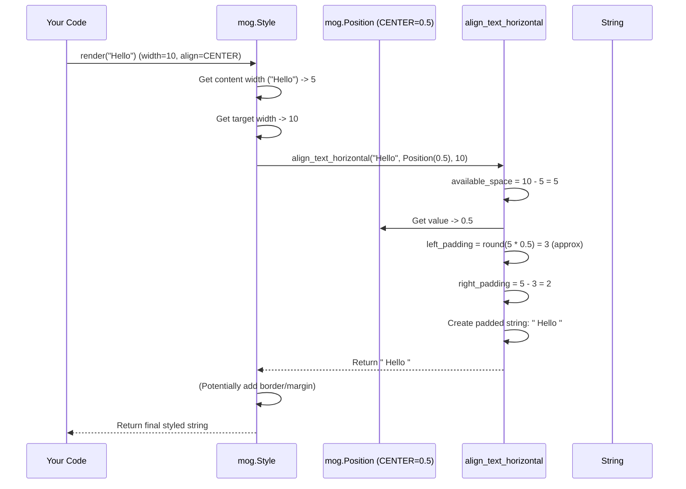

# Chapter 4: Position

In the [previous chapter](03_border_.md), we learned how to draw stylish frames around our text using `mog.Border`. We can now create text that's colored, bold, padded, and even boxed!

But what if we put text inside a box (using `Style.width()` and maybe `Style.border()`) and we don't want it stuck to the left side? Maybe we want to center it horizontally, or push it to the bottom vertically? How do we tell `mog` *where* to place content within a given space?

That's where the `mog.Position` concept comes in. It's a simple but powerful way to specify relative locations.

## Meet `Position`: Your Alignment Guide

Think of `mog.Position` like a slider or a percentage value that tells you how far along an axis something is. It ranges from **0.0** (representing the start, like the left edge or the top edge) to **1.0** (representing the end, like the right edge or the bottom edge).

*   **0.0**: Start (Left / Top)
*   **0.5**: Center (Middle)
*   **1.0**: End (Right / Bottom)
*   **0.25**: 25% of the way from the start.
*   **0.75**: 75% of the way from the start.

It's used mainly for two things:

1.  **Aligning** text within a fixed space (like centering text inside a box set by `Style.width()` or `Style.height()`).
2.  **Joining** different text blocks together at a specific point (which we'll see in [Layout Functions (join_horizontal/join_vertical)](06_layout_functions__join_horizontal_join_vertical__.md)).

### Convenience Constants

Typing `mog.Position(0.0)` or `mog.Position(0.5)` works, but it's not very readable. `mog` provides handy constants (aliases) right inside the `Position` struct to make your code clearer:

*   `mog.Position.LEFT` (Value: 0.0)
*   `mog.Position.RIGHT` (Value: 1.0)
*   `mog.Position.CENTER` (Value: 0.5)
*   `mog.Position.TOP` (Value: 0.0)
*   `mog.Position.BOTTOM` (Value: 1.0)

Notice that `LEFT` and `TOP` both correspond to `0.0`, while `RIGHT` and `BOTTOM` both correspond to `1.0`. `CENTER` is `0.5` for both horizontal and vertical alignment. The context (whether you're aligning horizontally or vertically) determines whether `0.0` means "left" or "top".

## Using `Position` for Alignment

Let's go back to our use case: centering text inside a box. We can use the `Style` object's alignment methods.

*   `.horizontal_alignment(position)`: Controls left/center/right alignment.
*   `.vertical_alignment(position)`: Controls top/center/bottom alignment.
*   `.alignment(horizontal_position, vertical_position)`: Sets both at once.

Here's how to create a fixed-width style and center the text inside it:

```mojo
import mog

fn main():
    # Create a style with a fixed width and a border
    let box_style = mog.Style() \
        .width(20) \
        .border(mog.NORMAL_BORDER)

    # Now, make a version of the style that also centers the text
    let centered_box_style = box_style \
        .horizontal_alignment(mog.Position.CENTER)

    # Render some text using this style
    let output = centered_box_style.render("Centered!")

    print(output)
```

**Explanation:**

1.  `box_style` defines a space 20 characters wide with a border. By default, text inside would be left-aligned.
2.  `centered_box_style` takes the `box_style` and adds `.horizontal_alignment(mog.Position.CENTER)`. This tells `mog` to align the text horizontally in the middle.
3.  `.render("Centered!")` applies the style. The text "Centered!" is shorter than 20 characters, so `mog` adds padding spaces on both sides to center it within the 20-character width before drawing the border.

**Conceptual Output:**

```text
┌────────────────────┐
│      Centered!     │
└────────────────────┘
```

You can also use numerical values if you need alignment that isn't exactly start, center, or end. For example, maybe you want to align text slightly below the top in a fixed-height box:

```mojo
import mog

fn main():
    let tall_box_style = mog.Style() \
        .height(5) \
        .width(15) \
        .border(mog.ROUNDED_BORDER)

    # Align text 20% down from the top
    let slightly_low_style = tall_box_style \
        .vertical_alignment(mog.Position(0.2)) # 20% from the top

    print(slightly_low_style.render("A bit low"))
```

**Conceptual Output:**

```text
╭───────────────╮
│               │
│   A bit low   │
│               │
│               │
╰───────────────╯
```

Here, `vertical_alignment(mog.Position(0.2))` tells `mog` to place the text starting 20% of the way down the available vertical space (inside the padding/border).

## How Alignment Works (Under the Hood)

When you call `style.render("text")` and the style has a fixed width/height and an alignment set, `mog` needs to figure out where to put the text.

1.  **Measure Content:** First, `mog` determines the width and height of the text you provided (after applying basic styles like bold/color, and padding). Let's say the text width is `content_width`.
2.  **Get Target Size:** It looks at the `width` or `height` you set in the `Style`. Let's call this `target_width`.
3.  **Calculate Space:** It calculates the difference: `available_space = target_width - content_width`. This is the total amount of padding (spaces or newlines) needed.
4.  **Get Alignment Position:** It takes the `Position` value you provided (e.g., `mog.Position.CENTER` which is 0.5, or `mog.Position(0.2)`). Let's call this `align_value`.
5.  **Distribute Space:** It uses the `align_value` to decide how to split the `available_space` into padding *before* the content and padding *after* the content.
    *   For horizontal alignment:
        *   `left_padding = round(available_space * align_value)` (approximately)
        *   `right_padding = available_space - left_padding`
    *   For vertical alignment, it calculates `top_padding` and `bottom_padding` similarly using newlines.
    *   Special cases: `LEFT`/`TOP` (`0.0`) put all padding after the content. `RIGHT`/`BOTTOM` (`1.0`) put all padding before the content. `CENTER` (`0.5`) splits padding roughly equally.
6.  **Apply Padding:** It adds the calculated `left_padding` spaces before each line of the text and `right_padding` spaces after each line (or adds `top_padding` newlines before and `bottom_padding` newlines after). This padding is often styled with the background color set in the `Style`.
7.  **Render Final Block:** The text, now correctly positioned within the target width/height using padding, is then potentially wrapped in a border and margins as usual.

Here's a simplified sequence diagram for horizontal centering:



Let's look at some key code structures:

**1. The `Position` Struct (`src/mog/position.mojo`)**

It's a simple struct holding the `Float64` value and defining the useful constants.

```mojo
# Simplified from: src/mog/position.mojo
@value
@register_passable("trivial")
struct Position:
    """Represents a position along an axis (0.0 to 1.0)."""
    var value: Float64

    # --- Constants ---
    alias RIGHT: Position = Self(1.0)
    alias TOP: Position = Self(0.0)
    alias BOTTOM: Position = Self(1.0)
    alias CENTER: Position = Self(0.5)
    alias LEFT: Position = Self(0.0)
    # --- End Constants ---

    @implicit
    fn __init__(out self, value: Float64):
        self.value = value # Store the float value

    # Equality checks based on the value
    fn __eq__(self, other: Self) -> Bool:
        return self.value == other.value
```

**2. Using `Position` in `Style.render()` (Simplified Concept)**

The `render` method calls helper functions for alignment if needed.

```mojo
# Simplified concept from: src/mog/style.mojo in Style.render()

# ... (Apply basic styles, padding) ...
var result = ... # Text after padding

var width = self.get_width()
var height = self.get_height()
var h_align = self.get_horizontal_alignment()
var v_align = self.get_vertical_alignment()

# Apply vertical alignment if height is set
if height > 0:
    result = align_text_vertical(result, v_align, height)

# Apply horizontal alignment if width is set
if width > 0:
    # Get the style to use for padding spaces
    var padding_style = ... # Usually derived from background color
    result = align_text_horizontal(result, h_align, width, padding_style)

# ... (Apply border, margin) ...
return result
```

**3. The Alignment Logic (`src/mog/align.mojo`)**

Here's a simplified look at how `align_text_horizontal` might handle centering:

```mojo
# Simplified concept from: src/mog/align.mojo
fn align_text_horizontal(
    text: String, pos: Position, width: UInt16, style: Optional[mist.Style]
) -> String:

    lines, content_width = get_lines(text) # Get lines and max width of original text
    
    var result = String()
    for line in lines:
        var line_width = printable_rune_width(line)
        var total_padding_needed = max(0, Int(width) - line_width)

        var left_padding = 0
        var right_padding = 0

        if total_padding_needed > 0:
            if pos == Position.LEFT: # 0.0
                right_padding = total_padding_needed
            elif pos == Position.RIGHT: # 1.0
                left_padding = total_padding_needed
            elif pos == Position.CENTER: # 0.5
                left_padding = total_padding_needed / 2
                right_padding = total_padding_needed - left_padding # Remainder on right
            else: # Other values (e.g., 0.2)
                left_padding = Int(round(total_padding_needed * pos.value))
                right_padding = total_padding_needed - left_padding

        # Add styled padding spaces before and after the line
        var styled_left = style.value().render(WHITESPACE * left_padding) if style else WHITESPACE * left_padding
        var styled_right = style.value().render(WHITESPACE * right_padding) if style else WHITESPACE * right_padding
        result.write(styled_left, line, styled_right, NEWLINE)

    # Remove trailing newline
    # ...
    return result^
```
This shows how the `Position` value (`pos.value`) is used to calculate `left_padding` and `right_padding` which are then applied (potentially using a background style for the spaces).

## Conclusion

You've learned about `mog.Position`, a simple yet fundamental concept for controlling placement in `mog`.

*   It represents a relative location along an axis using a `Float64` from **0.0 (start)** to **1.0 (end)**.
*   **0.5** represents the **center**.
*   Constants like `mog.Position.LEFT`, `mog.Position.RIGHT`, `mog.Position.CENTER`, `mog.Position.TOP`, and `mog.Position.BOTTOM` make code readable.
*   It's used with `Style` methods like `.horizontal_alignment()` and `.vertical_alignment()` to position text within fixed dimensions.
*   Internally, it helps `mog` calculate how much padding (spaces or newlines) to add before and after content to achieve the desired alignment.

We've seen how to set fixed widths and heights using `Style`, but how can we know the *actual* size of text *after* styling, padding, and borders have been applied? This is crucial for more complex layouts. In the next chapter, we'll explore the [Measurement Functions (get_width/get_height/get_dimensions)](05_measurement_functions__get_width_get_height_get_dimensions__.md) that let us do just that!

[Next Chapter: Measurement Functions (get_width/get_height/get_dimensions)](05_measurement_functions__get_width_get_height_get_dimensions__.md)

---

Generated by [AI Codebase Knowledge Builder](https://github.com/The-Pocket/Tutorial-Codebase-Knowledge)