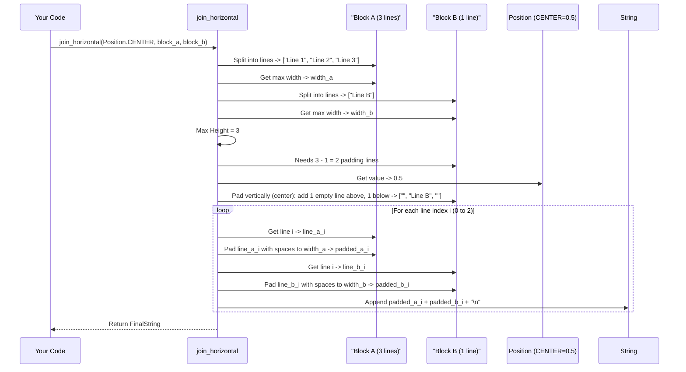

# Chapter 6: Layout Functions (join_horizontal/join_vertical)

In the [previous chapter](05_measurement_functions__get_width_get_height_get_dimensions__.md), we learned how to accurately measure the width and height of our styled terminal text using functions like `get_width` and `get_height`. This is super useful, but measurement is often just a step towards a bigger goal: arranging multiple pieces of text together to create a more complex layout.

Imagine you're designing a dashboard or a fancy report in your terminal. You might have several "widgets" or blocks of information – maybe a status panel, a list of items, and a progress bar. How do you place these blocks next to each other (like columns) or stack them neatly one above the other (like rows)?

That's exactly what `mog`'s layout functions, `join_horizontal` and `join_vertical`, are designed for! Think of them like basic layout tools in a word processor or desktop publishing software. They let you take separate, potentially multi-line, styled text blocks and combine them, controlling how they align with each other.

## Combining Blocks Side-by-Side: `join_horizontal`

The `join_horizontal` function takes two or more strings (which can be the result of `Style.render()`) and places them next to each other, left to right.

But what if the blocks have different heights? For example, one block is 3 lines tall, and the other is 5 lines tall. How should they line up vertically? This is where [Position](04_position_.md) comes back into play!

You pass a `Position` as the *first* argument to `join_horizontal` to specify the vertical alignment:

*   `mog.Position.TOP` (0.0): Aligns the tops of the blocks. Shorter blocks get empty lines added at the bottom.
*   `mog.Position.BOTTOM` (1.0): Aligns the bottoms of the blocks. Shorter blocks get empty lines added at the top.
*   `mog.Position.CENTER` (0.5): Aligns the vertical centers of the blocks. Shorter blocks get empty lines added roughly equally above and below.
*   Other values (e.g., `mog.Position(0.2)`) align proportionally.

Let's try joining two simple boxes with different heights:

```mojo
import mog

fn main():
    # Create two styled blocks (strings) with different heights
    let style = mog.Style().border(mog.NORMAL_BORDER).padding(0, 1)
    let block_a = style.render("Block A\nLine 2\nLine 3") # 3 lines high
    let block_b = style.render("Block B")               # 1 line high

    # Join them horizontally, aligning to the TOP
    let joined_top = mog.join_horizontal(mog.Position.TOP, block_a, block_b)
    print("--- Joined Top ---")
    print(joined_top)

    # Join them horizontally, aligning to the CENTER
    let joined_center = mog.join_horizontal(mog.Position.CENTER, block_a, block_b)
    print("\n--- Joined Center ---")
    print(joined_center)

    # Join them horizontally, aligning to the BOTTOM
    let joined_bottom = mog.join_horizontal(mog.Position.BOTTOM, block_a, block_b)
    print("\n--- Joined Bottom ---")
    print(joined_bottom)
```

**Conceptual Output:**

```text
--- Joined Top ---
┌─────────┐┌─────────┐
│ Block A ││ Block B │
│ Line 2  ││         │
│ Line 3  ││         │
└─────────┘└─────────┘

--- Joined Center ---
┌─────────┐┌─────────┐
│ Block A ││         │
│ Line 2  ││ Block B │
│ Line 3  ││         │
└─────────┘└─────────┘

--- Joined Bottom ---
┌─────────┐┌─────────┐
│ Block A ││         │
│ Line 2  ││         │
│ Line 3  ││ Block B │
└─────────┘└─────────┘
```

**Explanation:**

1.  We create `block_a` (3 lines) and `block_b` (1 line) using `Style.render()`. These are just regular strings containing text and ANSI codes.
2.  `mog.join_horizontal(mog.Position.TOP, block_a, block_b)` places `block_b` next to `block_a`. Since `block_b` is shorter, `join_horizontal` adds blank lines *below* it to match `block_a`'s height, aligning their top edges.
3.  `mog.Position.CENTER` adds blank lines above and below `block_b` to center it vertically relative to `block_a`.
4.  `mog.Position.BOTTOM` adds blank lines *above* `block_b` to align their bottom edges.

`join_horizontal` also ensures that each column has a consistent width based on the widest line within that original block.

## Stacking Blocks Vertically: `join_vertical`

Similarly, `join_vertical` takes two or more strings and stacks them one above the other.

If the blocks have different *widths*, how should they line up horizontally? Again, we use `Position` as the first argument:

*   `mog.Position.LEFT` (0.0): Aligns the left edges. Shorter lines get spaces added to the right.
*   `mog.Position.RIGHT` (1.0): Aligns the right edges. Shorter lines get spaces added to the left.
*   `mog.Position.CENTER` (0.5): Aligns the horizontal centers. Shorter lines get spaces added roughly equally left and right.
*   Other values (e.g., `mog.Position(0.8)`) align proportionally.

Let's try joining two blocks with different widths:

```mojo
import mog

fn main():
    # Create two styled blocks with different widths
    let style = mog.Style().border(mog.ROUNDED_BORDER).padding(0, 1)
    let block_c = style.render("Block C is Wider") # Wider
    let block_d = style.render("Block D")         # Narrower

    # Join them vertically, aligning to the LEFT
    let joined_left = mog.join_vertical(mog.Position.LEFT, block_c, block_d)
    print("--- Joined Left ---")
    print(joined_left)

    # Join them vertically, aligning to the CENTER
    let joined_center = mog.join_vertical(mog.Position.CENTER, block_c, block_d)
    print("\n--- Joined Center ---")
    print(joined_center)

    # Join them vertically, aligning to the RIGHT
    let joined_right = mog.join_vertical(mog.Position.RIGHT, block_c, block_d)
    print("\n--- Joined Right ---")
    print(joined_right)
```

**Conceptual Output:**

```text
--- Joined Left ---
╭─────────────────╮
│ Block C is Wider│
╰─────────────────╯
╭─────────╮
│ Block D │
╰─────────╯

--- Joined Center ---
╭─────────────────╮
│ Block C is Wider│
╰─────────────────╯
    ╭─────────╮
    │ Block D │
    ╰─────────╯

--- Joined Right ---
╭─────────────────╮
│ Block C is Wider│
╰─────────────────╯
          ╭─────────╮
          │ Block D │
          ╰─────────╯
```

**Explanation:**

1.  We create `block_c` (wider) and `block_d` (narrower).
2.  `mog.join_vertical(mog.Position.LEFT, block_c, block_d)` stacks `block_d` below `block_c`. Since `block_d`'s lines are narrower than `block_c`'s widest line, `join_vertical` adds spaces to the *right* of `block_d`'s content to align their left edges visually (within the overall width determined by the widest block).
3.  `mog.Position.CENTER` adds spaces to both sides of `block_d`'s content to center it horizontally relative to `block_c`.
4.  `mog.Position.RIGHT` adds spaces to the *left* of `block_d`'s content to align their right edges.

## How Joining Works (Under the Hood)

Let's look at the process for `join_horizontal`, as it's slightly more complex. `join_vertical` follows a similar pattern but adjusts width instead of height.

When you call `mog.join_horizontal(pos, block_a, block_b, ...)`:

1.  **Split into Lines:** Each input block (`block_a`, `block_b`, etc.) is split into a list of strings, one string per line.
2.  **Measure Blocks:** For each block, the function calculates:
    *   Its maximum line width (using logic similar to `mog.get_width` from [Chapter 5](05_measurement_functions__get_width_get_height_get_dimensions__.md)).
    *   Its height (number of lines).
3.  **Find Max Height:** It finds the overall maximum height among all the blocks being joined.
4.  **Pad Vertically:** For each block that is *shorter* than the maximum height:
    *   It calculates how many empty lines are needed (`max_height - block_height`).
    *   Based on the `Position` (`pos`) provided (TOP, CENTER, BOTTOM), it determines how many empty lines to add *before* the block's content and how many to add *after*.
    *   It adds these empty lines to the block's list of lines, making all blocks have the same number of lines (the `max_height`).
5.  **Pad Horizontally & Combine:** It iterates line by line, from line 0 up to `max_height - 1`:
    *   For the current line number `i`, it takes the `i`-th line from *each* (now vertically padded) block.
    *   For each of these lines, it calculates how much horizontal padding (spaces) is needed to make its width equal to the pre-calculated maximum width for *that specific block* (from step 2). It adds these padding spaces to the right of the line content.
    *   It concatenates (joins together side-by-side) these horizontally padded lines from all blocks.
    *   It adds a newline character (`\n`) at the end (unless it's the very last line).
6.  **Return Result:** The final combined string is returned.

Here's a simplified diagram for `join_horizontal(Position.CENTER, block_a, block_b)` where `block_a` is taller:



`join_vertical` is similar, but it first finds the overall `max_width` across all blocks. Then, for each line within each block, it adds horizontal padding based on the `Position` (LEFT, CENTER, RIGHT) to make the line reach that `max_width` before adding it to the result string followed by a newline.

### Code Dive: `src/mog/join.mojo`

The actual implementation involves handling lists of strings and calculating padding carefully. Let's look at a simplified conceptual structure for `join_horizontal`.

```mojo
# Simplified concept from: src/mog/join.mojo

from mog.position import Position
from mog._extensions import get_lines # Helper to split lines & get max width
from mist.transform.ansi import printable_rune_width # Measures visible width

alias WHITESPACE = " "
alias NEWLINE = "\n"

fn join_horizontal(pos: Position, *strs: String) -> String:
    if len(strs) < 2: return String(strs[0]) if len(strs) == 1 else ""

    var blocks = List[List[String]]() # Will hold lines for each block
    var max_widths = List[Int]()      # Max width for each block
    var max_height = 0

    # 1. Split blocks, measure dimensions
    for s in strs:
        lines, widest = get_lines(s[]) # Our helper from Chapter 5 ideas
        blocks.append(lines)
        max_widths.append(widest)
        if len(lines) > max_height:
            max_height = len(lines)

    # 2. Pad vertically based on Position
    for i in range(len(blocks)):
        var current_height = len(blocks[i])
        if current_height >= max_height: continue # Already tall enough

        var padding_needed = max_height - current_height
        var top_padding = 0
        var bottom_padding = 0

        if pos == Position.TOP:
            bottom_padding = padding_needed
        elif pos == Position.BOTTOM:
            top_padding = padding_needed
        else: # CENTER or other
            top_padding = Int(padding_needed * pos.value) # Approx
            bottom_padding = padding_needed - top_padding

        # Create lists of empty strings for padding
        var top_lines = List[String](capacity=top_padding)
        top_lines.resize(top_padding, "")
        var bottom_lines = List[String](capacity=bottom_padding)
        bottom_lines.resize(bottom_padding, "")

        # Add padding to the block's lines
        var padded_block = top_lines
        padded_block.extend(blocks[i])
        padded_block.extend(bottom_lines)
        blocks[i] = padded_block # Replace original lines with padded lines

    # 3. Merge lines horizontally
    var result = String()
    for line_idx in range(max_height): # All blocks now have max_height lines
        for block_idx in range(len(blocks)):
            var current_line = blocks[block_idx][line_idx]
            # Pad horizontally to this block's max width
            var current_width = printable_rune_width(current_line)
            var horizontal_padding = max_widths[block_idx] - current_width
            result.write(current_line)
            result.write(WHITESPACE * horizontal_padding)

        # Add newline between rows
        if line_idx < max_height - 1:
            result.write(NEWLINE)

    return result^
```

This simplified version shows the main steps: splitting into lines, calculating max dimensions, padding vertically based on `Position`, and then iterating line-by-line to pad horizontally and combine the results. The actual code handles edge cases and uses optimized list operations.

## Conclusion

You've now learned how to arrange multiple styled text blocks using `mog`'s layout functions:

*   `join_horizontal(position, *blocks)` places blocks **side-by-side**, aligning them vertically using the `position` (`TOP`, `CENTER`, `BOTTOM`).
*   `join_vertical(position, *blocks)` places blocks **one above the other**, aligning them horizontally using the `position` (`LEFT`, `CENTER`, `RIGHT`).
*   These functions automatically handle blocks of different sizes by adding appropriate padding (empty lines or spaces).
*   They rely on concepts we've already learned: `Style.render()` to create the blocks, [Position](04_position_.md) for alignment, and accurate measurement ([Chapter 5](05_measurement_functions__get_width_get_height_get_dimensions__.md)) internally.

These layout functions are powerful tools for creating structured terminal interfaces. They form the foundation for more complex components. What if you want to arrange data not just in simple rows or columns, but in a grid with automatic column sizing and borders between cells? That's where the [Table](07_table_.md) component comes in, and we'll explore it in the next chapter!

[Next Chapter: Table](07_table_.md)

---

Generated by [AI Codebase Knowledge Builder](https://github.com/The-Pocket/Tutorial-Codebase-Knowledge)