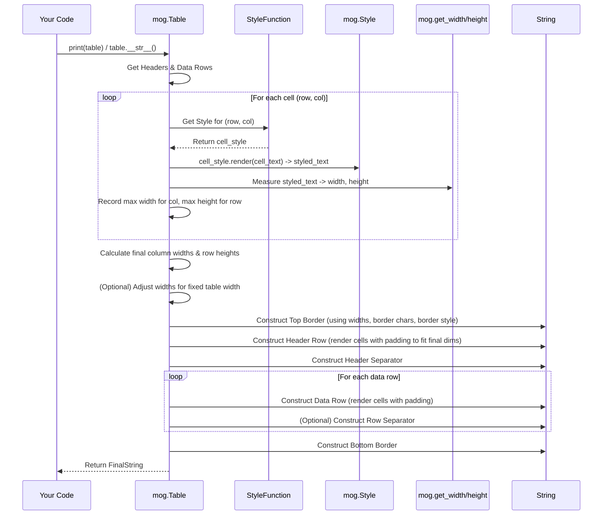

# Chapter 7: Table

In the [previous chapter](06_layout_functions__join_horizontal_join_vertical__.md), we learned how to combine separate styled text blocks using `join_horizontal` and `join_vertical`. That's great for arranging larger components, but what if you have structured data, like a list of items with different attributes, and you want to display it neatly in rows and columns with clear headers?

Imagine trying to line up columns manually using `join_horizontal` – it would get complicated quickly! You'd need to calculate widths, add padding, and manage borders between columns yourself.

That's where `mog.Table` comes in! It's designed specifically for rendering tabular data. Think of it like a mini-spreadsheet generator for your terminal. You give it your data (like rows of text) and some formatting instructions (like which border to use or how to style the header), and it figures out how to arrange everything into a clean, aligned grid with borders.

**Our Goal:** Let's learn how to create a simple table showing programming languages and their creators.

## Meet `mog.Table`

The `mog.Table` object is the main tool for creating tables. Here's the basic workflow:

1.  **Create a Table:** Start with `mog.Table.new()`.
2.  **Set Headers (Optional):** Use `.set_headers("Header1", "Header2", ...)` to define the column titles.
3.  **Add Data Rows:** Use `.row("Value1", "Value2", ...)` for each row of data. You can also add multiple rows at once using `.rows(...)`.
4.  **Customize (Optional):**
    *   Set the border style using `.border(mog.NORMAL_BORDER)` (referencing [Chapter 3: Border](03_border_.md)).
    *   Apply styles to cells using `.set_style(your_style_function)` (referencing [Chapter 2: Style](02_style_.md)).
    *   Control which borders are visible (e.g., `.border_column(True)` to show vertical lines between columns).
5.  **Render:** Simply `print()` the table object.

## Creating a Simple Table

Let's build our language table:

```mojo
import mog

fn main():
    # 1. Create a new table
    var my_table = mog.Table.new()

    # 2. Set the headers
    my_table = my_table.set_headers("Language", "Creator", "Year")

    # 3. Add data rows
    my_table = my_table.row("Python", "Guido van Rossum", "1991")
    my_table = my_table.row("Mojo", "Chris Lattner & Team", "2023")
    my_table = my_table.row("Rust", "Graydon Hoare", "2010")

    # 4. Print the table
    print(my_table)

```

**Explanation:**

1.  `mog.Table.new()` gives us an empty table object.
2.  `.set_headers(...)` defines the text for the top row.
3.  `.row(...)` adds a row of data. Notice how we chain these methods – each method returns a *new*, updated table object, so we reassign it to `my_table`.
4.  `print(my_table)` automatically calls the necessary rendering logic.

**Conceptual Output (Default Look):**

By default, `mog.Table` uses `ROUNDED_BORDER` and some basic settings. The output will look something like this:

```text
╭──────────┬────────────────────────┬──────╮
│ Language │ Creator                │ Year │
├──────────┼────────────────────────┼──────┤
│ Python   │ Guido van Rossum       │ 1991 │
│ Mojo     │ Chris Lattner & Team │ 2023 │
│ Rust     │ Graydon Hoare          │ 2010 │
╰──────────┴────────────────────────┴──────╯
```

Look how `mog` automatically calculated the width needed for each column based on the content (including the headers) and drew the borders!

## Customizing Borders and Styles

Let's make it look a bit different. We can change the border type and apply some simple styling. We'll use a `StyleFunction` – a function that decides the style for *each cell* based on its row and column number.

```mojo
import mog

# Define a function that styles headers differently from data rows
fn simple_styler(row: Int, col: Int) -> mog.Style:
    if row == 0: # Row 0 is the header row
        return mog.Style().bold(True).foreground(mog.Color(0x00FFFF)) # Bold Cyan
    else: # Data rows
        # Make even rows slightly different (row numbers start from 1 for data)
        if row % 2 == 0:
            return mog.Style().foreground(mog.Color(0xAAAAAA)) # Dim Gray
        else:
            return mog.Style() # Default style

fn main():
    # Use the STAR_BORDER this time
    var styled_table = mog.Table.new() \
        .set_headers("Language", "Creator", "Year") \
        .row("Python", "Guido van Rossum", "1991") \
        .row("Mojo", "Chris Lattner & Team", "2023") \
        .row("Rust", "Graydon Hoare", "2010") \
        .set_style(simple_styler) # Apply our styling function
        .border(mog.STAR_BORDER) # Use stars for the border
        .border_column(False)     # Hide vertical lines between columns

    print(styled_table)
```

**Explanation:**

1.  **`simple_styler` function:**
    *   Takes the `row` and `col` number as input.
    *   If `row == 0`, it's the header, so we return a **bold**, cyan [Style](02_style_.md).
    *   Otherwise, it's a data row. We check if the `row` number (starting from 1 for data) is even or odd to alternate styles slightly.
2.  **Table Creation:**
    *   We chain the methods as before.
    *   `.set_style(simple_styler)` tells the table to use our function to style each cell.
    *   `.border(mog.STAR_BORDER)` changes the border characters (using a predefined [Border](03_border_.md)).
    *   `.border_column(False)` tells the table *not* to draw the vertical separator lines between columns.

**Conceptual Output:**

```text
****************************************************
* Language * Creator                * Year         *
****************************************************
* Python   * Guido van Rossum       * 1991         *
* Mojo     * Chris Lattner & Team * 2023         *
* Rust     * Graydon Hoare          * 2010         *
****************************************************
```
(Note: The colors won't show here, but "Language", "Creator", "Year" would be bold and cyan, and the data rows might alternate slightly in color in your terminal).

The `Table` provides many other customization options like `.border_style()`, `.width()`, `.height()`, `.border_row(True)`, etc., allowing fine-grained control over the appearance.

## How `Table` Rendering Works (Under the Hood)

When you `print(my_table)`, a lot happens behind the scenes:

1.  **Gather Data & Headers:** The table collects the header strings and all the data row strings (internally, it often uses a helper structure like `StringData`).
2.  **Apply Initial Styles & Measure:** It iterates through *every* cell (headers and data). For each cell:
    *   It calls your `StyleFunction` (like `simple_styler`) to get the `Style` for that specific `row` and `col`.
    *   It applies this style to the cell's text using `style.render()`.
    *   It measures the `width` and `height` of the *styled* cell text using functions like `get_width` and `get_height` (from [Chapter 5](05_measurement_functions__get_width_get_height_get_dimensions__.md)).
3.  **Calculate Column Widths:** For each column, it finds the maximum width measured across all cells in that column (including the header). This determines the final width for each column.
4.  **Calculate Row Heights:** Similarly, for each row, it finds the maximum height needed for any cell in that row.
5.  **(Optional) Adjust for Fixed Table Width:** If you set a fixed `.width()` on the table, it might need to adjust the calculated column widths (either shrinking wider columns or expanding narrower ones) to meet the target width.
6.  **Render Cells with Padding:** It iterates through the cells again. This time, it renders each cell using its determined `Style`, but also applies padding (using the cell's `Style`) so that each cell's text fits exactly into its final calculated `width` and `height`. This ensures alignment.
7.  **Construct Border Lines:** Based on the `border` settings (`NORMAL_BORDER`, `STAR_BORDER`, etc.) and the visibility flags (`_border_top`, `_border_column`, etc.), it generates the strings for the top border, header separator, row separators (if `_border_row` is true), and bottom border. It uses the calculated column widths to draw the horizontal lines correctly and applies the `_border_style` to the border characters.
8.  **Assemble Final String:** It pieces together the top border, the rendered header row, the header separator, the rendered data rows (potentially with row separators), and the bottom border, adding newlines (`\n`) in the right places.
9.  **Return Result:** The complete string, ready to be printed to the terminal, is returned.

Here’s a simplified view of the process:



## Code Dive: Key Structures

Let's look at simplified versions of the structures involved.

**1. `StringData` (`src/mog/table/rows.mojo`)**

This is a common way the table stores your data internally – basically a list of lists of strings.

```mojo
# Simplified from: src/mog/table/rows.mojo

@value
struct StringData(Data): # Implements the 'Data' trait
    """String-based implementation of the Data Trait."""
    var _rows: List[List[String]]
    var _columns: Int # Tracks max columns seen

    fn __init__(out self, *rows: List[String]):
        # ... (Initializes _rows and _columns) ...

    fn __getitem__(self, row: Int, column: Int) -> String:
        # Basic check (real code might handle out-of-bounds better)
        if row < len(self._rows) and column < len(self._rows[row]):
            return self._rows[row][column]
        return "" # Return empty if out of bounds

    fn rows(self) -> Int:
        return len(self._rows)

    fn columns(self) -> Int:
        return self._columns

    fn append(mut self, row: List[String]):
        self._columns = max(self._columns, len(row))
        self._rows.append(row)
```

**2. `Table` Struct (`src/mog/table/table.mojo`)**

This struct holds all the configuration and data for the table.

```mojo
# Simplified from: src/mog/table/table.mojo
from ..style import Style
from ..border import Border, ROUNDED_BORDER
from .rows import StringData
# ... other imports ...

alias StyleFunction = fn (row: Int, col: Int) -> Style

struct Table:
    var _styler: StyleFunction # Function to style cells
    var _border: Border        # Border character set
    var _border_style: Style   # Style for the border characters
    # --- Flags for border visibility ---
    var _border_top: Bool
    var _border_bottom: Bool
    var _border_left: Bool
    var _border_right: Bool
    var _border_header: Bool # Separator below header
    var _border_column: Bool # Vertical lines between columns
    var _border_row: Bool    # Horizontal lines between rows
    # --- Data ---
    var _headers: List[String]
    var _data: StringData      # Holds the actual table data
    # --- Optional fixed dimensions ---
    var width: Int
    var height: Int

    # Constructor (simplified) - .new() is often used as a helper
    fn __init__(out self, style_function: StyleFunction, border_style: Style, ...):
        self._styler = style_function
        self._border = ROUNDED_BORDER # Default
        self._border_style = border_style
        self._border_top = True # Default visibility
        # ... initialize other fields ...
        self._headers = List[String]()
        self._data = StringData()
        self.width = 0 # No fixed width by default
        self.height = 0

    # Methods like .row(), .set_headers(), .set_style() create a copy and modify it
    fn row(self, *row: String) -> Table:
        var new = self.copy() # Create a copy
        # ... (convert row args to List[String]) ...
        new._data.append(the_row_list) # Append data to the copy
        return new^ # Return the modified copy

    # The rendering logic is often in __str__ or write_to
    fn __str__(self) -> String:
        # This method orchestrates the steps described in the conceptual walkthrough:
        # 1. Gather data (_headers, _data)
        # 2. Measure all styled cells to get initial widths/heights
        # 3. Calculate final column widths (widths = List[Int](...))
        # 4. Calculate final row heights (heights = List[Int](...))
        # 5. Adjust widths if self.width > 0
        # 6. Construct borders (_construct_top_border(widths), ...)
        # 7. Construct styled/padded rows (_construct_headers(widths, ...), _construct_row(...))
        # 8. Assemble into the final string
        var result = String()
        # ... (complex rendering logic calling helper functions) ...
        return result # Return the final assembled table string
```

This simplified view shows that the `Table` struct holds all the configuration options (`_border`, `_styler`, flags) and data (`_headers`, `_data`). Methods like `.row()` modify copies, and the `__str__` method contains the complex logic to measure, calculate dimensions, render cells, draw borders, and assemble the final output string.

## Conclusion

You've learned how `mog.Table` makes displaying structured data in your terminal much easier!

*   It takes **headers** and **rows of data**.
*   It automatically calculates **column widths** and **row heights** based on content.
*   You can customize its appearance using **borders** ([Border](03_border_.md)) and **styles** ([Style](02_style_.md)) applied per cell via a `StyleFunction`.
*   It handles drawing borders **around** the table and optionally **between** rows and columns.
*   Analogy: It's your terminal **spreadsheet generator**.

We've now covered colors, styles, borders, position, measurement, layout functions, and tables. These are the core building blocks for creating sophisticated terminal user interfaces with `mog`. But how does `mog` actually interact with the terminal itself? How does it know things like whether the background is dark or light, or what level of color support the terminal has? That's the job of the [Renderer](08_renderer_.md), which we'll explore in the final chapter.

[Next Chapter: Renderer](08_renderer_.md)

---

Generated by [AI Codebase Knowledge Builder](https://github.com/The-Pocket/Tutorial-Codebase-Knowledge)