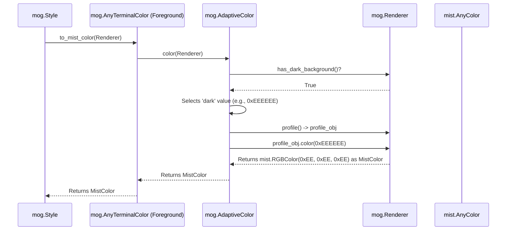

# Chapter 8: Renderer

Welcome to the final chapter of the `mog` tutorial! In the [previous chapter](07_table_.md), we saw how to create nicely formatted tables with borders and styled cells using `mog.Table`. Throughout this tutorial, we've learned how to add colors, styles, borders, and arrange text using various `mog` components.

But we've hinted at a crucial detail: terminals are different! Some have dark backgrounds, others light. Some support millions of colors (True Color), others only 256, or just 16 basic colors. How does `mog` know how to adapt its output to look good (or even work correctly) on *your specific* terminal?

That's the job of the `mog.Renderer`!

## The Terminal's "Display Settings"

Think about the display settings on your computer or phone. You can change the brightness, color theme (light/dark mode), and color accuracy. These settings tell applications how to best display their content on your screen.

The `mog.Renderer` is like those display settings, but for your terminal within the `mog` library. It holds two key pieces of information:

1.  **Color Support (`profile`):** Does the terminal support True Color (millions of colors), 256 colors, just 16 basic ANSI colors, or maybe no colors at all?
2.  **Background Darkness (`dark_background`):** Does the terminal appear to have a dark background (like black or dark blue) or a light background (like white or light gray)?

Why does `mog` need this? Let's revisit some things we learned:

*   **Adaptive Colors:** Remember `mog.AdaptiveColor` from [Chapter 1](01_terminalcolor__and_variants__.md)? It needs to know if the background is light or dark to choose the right text color for readability.
*   **Color Conversion:** Remember `mog.Color`? If you define a True Color hex code like `0x7D56F4` (purple), but the terminal only supports 256 colors, `mog` needs to figure out the *closest* 256-color code to use. It needs to know the terminal's capability level.

The `Renderer` provides this essential context so that `mog` components, especially [Style](02_style_.md) and the [TerminalColor (and variants)](01_terminalcolor__and_variants__.md), can make the right rendering decisions.

## How `mog` Uses the `Renderer`

You generally don't interact with the `Renderer` directly very often as a beginner. Here's how it fits into the picture:

1.  **Style Holds a Renderer:** When you create a `mog.Style()` object (as we did in [Chapter 2](02_style_.md)), it automatically creates a `Renderer` inside itself. By default, this `Renderer` tries to *detect* your terminal's capabilities (color profile and background darkness).
2.  **Color Resolution:** When you use a method like `style.foreground(some_color)` and then call `style.render("text")`, the following happens:
    *   The `Style` object asks the `some_color` object (which is an [AnyTerminalColor](01_terminalcolor__and_variants__.md)) to give it the final color code.
    *   Crucially, the `Style` passes its internal `Renderer` to the color object during this request.
    *   The color object (e.g., an `AdaptiveColor` or a `Color`) uses the information *from the `Renderer`* to decide the final color.
        *   `AdaptiveColor` calls `renderer.has_dark_background()` to choose its `light` or `dark` value.
        *   `Color` calls `renderer.profile.color()` to convert its stored value (like `0x7D56F4`) into the best format supported by the terminal's profile (True Color, 256, or 16 ANSI).

Let's look at `AdaptiveColor` again with this knowledge:

```mojo
import mog

fn main():
    let adaptive_text_color = mog.AdaptiveColor(
        light=0x111111, # Dark gray for light backgrounds
        dark=0xEEEEEE   # Light gray for dark backgrounds
    )

    # Imagine a Style object is using this color
    let style = mog.Style().foreground(adaptive_text_color)

    # When style.render("Hi") is called:
    # 1. style asks adaptive_text_color for the mist.AnyColor, passing its internal Renderer.
    # 2. adaptive_text_color calls renderer.has_dark_background() on that Renderer.
    # 3. If it returns True, adaptive_text_color uses 0xEEEEEE.
    # 4. If it returns False, adaptive_text_color uses 0x111111.
    # 5. This chosen value (e.g., 0xEEEEEE) is then converted using the renderer.profile
    #    to the final mist color type (e.g., mist.RGBColor(0xEE, 0xEE, 0xEE)).
    
    print(style.render("Adaptive Text"))
    # The output will use light gray text if mog detected a dark background,
    # or dark gray text if it detected a light background.
```

The `Renderer` acts as the bridge between your abstract color definitions (`AdaptiveColor`, `Color`) and the concrete reality of the terminal you're running the code in.

## Creating a Renderer (Usually Not Needed!)

Most of the time, `mog.Style()` handles creating the `Renderer` for you, and it tries its best to auto-detect the settings.

However, in some advanced cases (like testing, or if detection fails), you might want to create a `Renderer` explicitly.

```mojo
import mog
import mist # For color profile constants

fn main():
    # Create a renderer explicitly telling it the terminal supports
    # 256 colors and has a light background.
    let explicit_renderer = mog.Renderer(
        profile=mist.profile.ANSI256,
        dark_background=False
    )

    # You could then potentially pass this to a Style's constructor
    # (Note: Style.__init__ takes the profile number, not the object directly sometimes)
    # let specific_style = mog.Style(color_profile=mist.profile.ANSI256)
    # specific_style._renderer.dark_background = False # Manually override background

    print("Created an explicit renderer (usually not needed for beginners)")
    print("Profile:", explicit_renderer.profile._value) # Access underlying value
    print("Dark Background:", explicit_renderer.dark_background)
```

**Explanation:**

*   `mog.Renderer()` creates the renderer.
*   `profile=mist.profile.ANSI256` sets the color support level explicitly. `mist.profile` contains constants like `TRUE_COLOR`, `ANSI256`, `ANSI`, `ASCII`.
*   `dark_background=False` tells it the background is light.

**Again, you typically don't need to do this.** Rely on `mog.Style()`'s default behavior unless you have a specific reason to override it.

## How It Works: Inside the `Renderer`

What happens internally when a color needs to be resolved?

1.  **Request:** A `Style` object starts rendering. It needs to figure out the actual color for, say, the foreground.
2.  **Pass Context:** The `Style` calls the `to_mist_color` method on its foreground `AnyTerminalColor`, passing its internal `Renderer` object as an argument.
3.  **Delegate:** `AnyTerminalColor` checks what specific type it holds (e.g., `AdaptiveColor`, `Color`). It calls the `color` method of that specific type, again passing the `Renderer`.
4.  **Query Renderer:** The specific color type (e.g., `AdaptiveColor`) now uses the `Renderer` to ask questions:
    *   `renderer.has_dark_background()` -> Returns `True` or `False`.
    *   `renderer.profile` -> Returns the `mist.Profile` object indicating color support level.
5.  **Select Value:** Based on the answers, the color type selects the appropriate raw color value (e.g., `AdaptiveColor` picks `0xEEEEEE` because `has_dark_background` was `True`).
6.  **Convert to `mist`:** The selected raw value is converted into the final low-level `mist.AnyColor` format using the `renderer.profile`. For example, `renderer.profile.color(0xEEEEEE)` might return a `mist.RGBColor` if the profile is `TRUE_COLOR`, or a `mist.ANSI256Color` if the profile is `ANSI256`.
7.  **Return:** The final `mist.AnyColor` is returned back up the chain to the `Style`.
8.  **Render:** The `Style` uses this `mist.AnyColor` with the underlying `mist` library to generate the correct ANSI escape codes for the terminal.

Here's a simplified sequence diagram showing `AdaptiveColor` using the `Renderer`:



## Code Dive: Key Structures

Let's look at the simplified code structures involved.

**1. The `Renderer` Struct (`src/mog/renderer.mojo`)**

This struct holds the profile and background information.

```mojo
# Simplified from: src/mog/renderer.mojo
import mist

@value
@register_passable("trivial")
struct Renderer:
    var profile: mist.Profile
    var dark_background: Bool

    # Constructor tries to auto-detect if profile is not given
    fn __init__(
        out self,
        profile: Int = -1, # -1 usually means auto-detect
        *,
        dark_background: Bool = True, # Default assumption or detected value
    ):
        if profile != -1:
            self.profile = mist.Profile(profile) # Use specific profile
        else:
            self.profile = mist.Profile() # Auto-detect profile
        # Note: Actual background detection might be more complex
        self.dark_background = dark_background

    fn has_dark_background(self) -> Bool:
        return self.dark_background

    # Helper to get a mist.Style configured with this renderer's profile
    fn as_mist_style(self) -> mist.Style:
        return mist.Style(self.profile)
```

**2. `Renderer` within `Style` (`src/mog/style.mojo`)**

The `Style` struct includes a `Renderer` instance.

```mojo
# Simplified from: src/mog/style.mojo
struct Style:
    var _renderer: Renderer # Each Style has its own Renderer context
    # ... other style properties like _color, _padding, _border ...

    # The Style constructor initializes the Renderer
    fn __init__(out self, color_profile: Int = -1, *, value: String = ""):
        self._renderer = Renderer(color_profile) # Creates the Renderer
        # ... initialize other fields ...

    # Methods like foreground store the AnyTerminalColor
    fn foreground(self, color: AnyTerminalColor) -> Self:
        var new = self.copy()
        new._color.foreground = color.copy() # Store the color definition
        new._properties.set[PropKey.FOREGROUND](True)
        return new^

    # The render method uses the Renderer when resolving colors
    fn render[*Ts: Writable](self, *texts: *Ts) -> String:
        # ... setup ...

        # When getting colors, it passes self._renderer
        var fg_color_def = self.get_foreground() # Gets the AnyTerminalColor
        var mist_fg = fg_color_def.to_mist_color(self._renderer) # Resolves using the renderer

        var bg_color_def = self.get_background()
        var mist_bg = bg_color_def.to_mist_color(self._renderer)

        # Use mist_fg, mist_bg with mist library to render...
        var styler = self._renderer.as_mist_style() \
            .foreground(mist_fg) \
            .background(mist_bg)
        # ... apply other styles and render text ...
        var result = styler.render(input_text)

        # ... handle padding, borders (which also use the renderer for colors), etc. ...
        return result^
```

**3. `AdaptiveColor` Using the `Renderer` (`src/mog/color.mojo`)**

Here's how `AdaptiveColor` checks the background.

```mojo
# Simplified from: src/mog/color.mojo
@value
struct AdaptiveColor(TerminalColor):
    var light: UInt32
    var dark: UInt32

    fn color(self, renderer: Renderer) -> mist.AnyColor:
        # Ask the passed-in renderer about the background
        if renderer.has_dark_background():
            # Use the dark value if background is dark
            # Convert the chosen value using the renderer's profile
            return renderer.profile.color(self.dark)
        else:
            # Use the light value if background is light
            # Convert the chosen value using the renderer's profile
            return renderer.profile.color(self.light)
```

These snippets illustrate how the `Renderer` instance, typically held within the `Style`, provides the necessary terminal context (`profile`, `dark_background`) that allows color definitions like `AdaptiveColor` to resolve themselves correctly when rendering.

## Conclusion: `mog` Adapts!

And that brings us to the end of our `mog` tutorial!

In this chapter, we learned about the `mog.Renderer`:

*   It acts like the **"display settings"** for `mog`, holding context about the terminal's capabilities.
*   It knows the terminal's **color support** (`profile`: True Color, 256, 16, etc.) and whether it has a **dark background**.
*   `mog.Style` objects contain a `Renderer`, usually auto-detected.
*   [TerminalColor (and variants)](01_terminalcolor__and_variants__.md) use the `Renderer` (passed by `Style`) to choose the right colors and formats for the specific terminal.
*   You usually **don't interact with it directly**, but it's crucial for making `mog`'s output adaptive.

Over these 8 chapters, we've explored the fundamental building blocks of `mog`:

1.  Defining colors with [TerminalColor (and variants)](01_terminalcolor__and_variants__.md).
2.  Applying colors, emphasis, padding, and more with [Style](02_style_.md).
3.  Drawing frames using [Border](03_border_.md).
4.  Aligning content with [Position](04_position_.md).
5.  Accurately measuring terminal text with [Measurement Functions](05_measurement_functions__get_width_get_height_get_dimensions__.md).
6.  Arranging blocks using [Layout Functions](06_layout_functions__join_horizontal_join_vertical__.md).
7.  Displaying structured data with [Table](07_table_.md).
8.  Understanding terminal adaptation via the [Renderer](08_renderer_.md).

With these tools, you're now equipped to start creating more expressive and visually appealing command-line interfaces and outputs using `mog` in Mojo! Happy coding!

---

Generated by [AI Codebase Knowledge Builder](https://github.com/The-Pocket/Tutorial-Codebase-Knowledge)