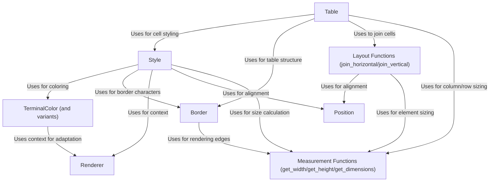

# Tutorial: mog

`mog` is a Mojo library for creating *beautiful* and *complex* text-based user interfaces in your terminal.
It lets you define the **Style** (colors, padding, borders, alignment) of text elements, much like CSS for the web.
You can arrange these styled elements using **Layout Functions** or structure data neatly using a **Table**.
It handles terminal capabilities like color support (**Renderer**, **TerminalColor**) and accurately measures text (**Measurement Functions**) to ensure things look right.

**Source Repository:** [None](None)

## Chapters

1. [TerminalColor (and variants)
](01_terminalcolor__and_variants__.md)
2. [Style
](02_style_.md)
3. [Border
](03_border_.md)
4. [Position
](04_position_.md)
5. [Measurement Functions (get_width/get_height/get_dimensions)
](05_measurement_functions__get_width_get_height_get_dimensions__.md)
6. [Layout Functions (join_horizontal/join_vertical)
](06_layout_functions__join_horizontal_join_vertical__.md)
7. [Table
](07_table_.md)
8. [Renderer
](08_renderer_.md)

---

Generated by [AI Codebase Knowledge Builder](https://github.com/The-Pocket/Tutorial-Codebase-Knowledge)