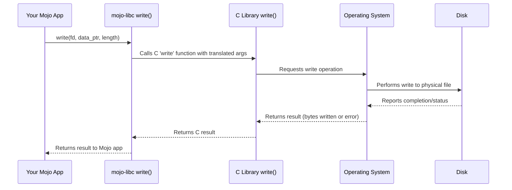

# Chapter 1: File I/O Wrappers (`open`, `close`, `read`, `write`)

Welcome to your first step into the `mojo-libc` library! This library helps your Mojo programs talk to the underlying operating system using familiar functions from the C standard library (libc).

Imagine your computer's files are stored in filing cabinets. To work with a specific document (a file), you need to perform some basic actions: find the right drawer, **open** it, **read** the document or **write** something new on it, and finally, **close** the drawer.

That's exactly what this chapter is about! We'll explore how `mojo-libc` provides Mojo functions that wrap these fundamental C file operations: `open`, `read`, `write`, and `close`. These are the essential verbs your program uses to interact with files.

## Why Do We Need Wrappers?

Operating systems provide low-level functions (often written in C) to manage files. Mojo, being a systems programming language, needs a way to use these functions. Instead of you having to figure out the complex details of calling C code directly for every file operation, `mojo-libc` provides convenient Mojo "wrappers". These wrappers handle the translation, making it much easier to work with files from your Mojo code.

## The Basic File Actions

Let's look at the four core functions:

1.  **`open(path, flags, ...)`**: Like finding and opening the drawer. You tell it the *path* (the name and location) of the file you want to access and the *flags* (how you want to open it - e.g., just for reading, for writing, or both? Should it create the file if it doesn't exist?). If successful, the operating system gives you back a special number called a **file descriptor** (often abbreviated as **FD**). Think of this FD as a temporary handle or ticket for the opened file. We'll learn more about these in [Chapter 2: File Descriptors (FD)](02_file_descriptors__fd__.md).

2.  **`read(fd, buffer, count)`**: Like reading the document in the open drawer. You give it the **file descriptor (`fd`)** you got from `open`, a place (`buffer`) to put the data you read, and how much data (`count`) you want to read. It reads the data from the file into your buffer.

3.  **`write(fd, buffer, count)`**: Like writing on the document. You provide the **file descriptor (`fd`)**, the data (`buffer`) you want to write, and how much data (`count`) to write. It writes your data into the file.

4.  **`close(fd)`**: Like closing the drawer. You give it the **file descriptor (`fd`)** you're finished with. This tells the operating system you no longer need access to the file, releasing the handle and any resources associated with it. It's important to always close files when you're done!

## Use Case: Writing "Hello, Mojo!" to a File

Let's make this concrete. We want to write the text "Hello, Mojo!" into a new file called `hello.txt`. Here's how we can do it using `mojo-libc`:

```mojo
from libc import open, write, close, c_void
from libc import O_WRONLY, O_CREAT # Flags for opening
from sys.ffi import c_char

fn main() raises:
    # 1. Define the file path and the message
    let file_path = "hello.txt"
    let message = "Hello, Mojo!\n"

    # Need pointers to C-style strings for the C functions
    let path_ptr = file_path.unsafe_cstr_ptr()
    let message_ptr = message.unsafe_cstr_ptr()

    # 2. Open the file for writing, create it if it doesn't exist
    #    0o644 sets file permissions (read/write for owner, read for others)
    let flags = O_WRONLY | O_CREAT
    let mode = 0o644
    let fd = open(path_ptr, flags, mode)

    # Always check for errors! open returns -1 on failure.
    if fd == -1:
        print("Error: Failed to open file")
        return

    # 3. Write the message to the file
    #    We need to cast the message pointer to a generic void pointer
    let bytes_to_write = len(message)
    let bytes_written = write(fd, message_ptr.bitcast[c_void](), bytes_to_write)

    if bytes_written != bytes_to_write:
        print("Error: Failed to write entire message")
        # Still need to close the file even if write failed partially
        _ = close(fd)
        return

    # 4. Close the file
    let close_result = close(fd)
    if close_result == -1:
        print("Error: Failed to close file")
    else:
        print("Successfully wrote to", file_path)

```

**Explanation:**

1.  We define our filename (`hello.txt`) and the text (`Hello, Mojo!\n`) we want to write. We get `unsafe_cstr_ptr()` versions because the underlying C functions expect C-style strings (pointers to characters).
2.  We call `open()`.
    *   `path_ptr`: Points to our filename "hello.txt".
    *   `flags`: We combine `O_WRONLY` (open for writing only) and `O_CREAT` (create the file if it doesn't exist) using the `|` (bitwise OR) operator. These constants are provided by `mojo-libc`.
    *   `mode`: `0o644` is a standard way to specify file permissions (owner can read/write, others can only read). This is only needed when `O_CREAT` is used.
    *   The result `fd` is our file descriptor (an integer). We check if it's `-1`, which indicates an error.
3.  We call `write()`.
    *   `fd`: The file descriptor we just got.
    *   `message_ptr.bitcast[c_void]()`: We provide a pointer to our message. The C `write` function expects a `void*` (a generic pointer), so we `bitcast` our character pointer.
    *   `len(message)`: We tell `write` how many bytes to write.
    *   We check if the number of `bytes_written` matches what we intended.
4.  Finally, we call `close(fd)` to release the file handle. We check its return value for errors too.

**Expected Output:**

After running this code, you won't see "Hello, Mojo!" printed to your console. Instead, you will find a new file named `hello.txt` in the same directory where you ran the program. If you open `hello.txt` with a text editor, it will contain:

```
Hello, Mojo!
```

## How It Works Under the Hood

These Mojo functions (`open`, `write`, `close`, etc.) in `mojo-libc` are essentially thin **wrappers** around the actual C library functions provided by your operating system. They don't reimplement the logic of writing to a disk themselves.

Think of `mojo-libc` as a helpful librarian. Your Mojo program goes to the librarian (`mojo-libc`) and says, "I want to write this data to that file." The librarian (`mojo-libc`) understands Mojo, takes the request, translates it into the language the operating system's file management department (the C library) understands, and passes it along. The C library then interacts directly with the operating system kernel to perform the disk operation.

Here's a simplified view of what happens when you call `write`:



Let's peek at the `mojo-libc` source code for the `write` wrapper (simplified):

```mojo
# --- File: src/libc/_libc.mojo ---

# ... other definitions ...
from sys.ffi import external_call, c_int, c_ssize_t, c_void, FD, c_size_t
from memory import UnsafePointer

# ... other definitions ...

fn write(fildes: FD, buf: UnsafePointer[c_void], nbyte: c_size_t) -> c_ssize_t:
    """Libc POSIX `write` function wrapper... (docstring omitted) """
    return external_call["write", c_ssize_t, FD, UnsafePointer[c_void], c_size_t](
        fildes, buf, nbyte
    )
```

**Explanation:**

*   The Mojo function `write` takes arguments like the file descriptor (`fildes`), a buffer pointer (`buf`), and the number of bytes (`nbyte`). Notice the types match what C expects (like `FD` which is an alias for `c_int`, `UnsafePointer[c_void]`).
*   The core of the wrapper is `external_call[...]`. This is a special Mojo feature for calling external C functions. We'll dive deeper into this in [Chapter 8: C Function Bindings (`external_call`)](08_c_function_bindings___external_call___.md).
*   `"write"`: This tells `external_call` the *name* of the C function to call.
*   The types that follow (`c_ssize_t, FD, ...`): These specify the return type and argument types of the C function, allowing Mojo to correctly pass data back and forth.
*   `(fildes, buf, nbyte)`: These are the arguments passed to the C function.

So, `mojo-libc`'s role here is to provide a nice Mojo function signature and use `external_call` to bridge the gap to the underlying C function, handling the necessary type conversions.

## Conclusion

In this chapter, we learned about the fundamental file I/O operations: `open`, `read`, `write`, and `close`. We saw how `mojo-libc` provides convenient Mojo wrappers for these standard C library functions, allowing us to interact with files directly from Mojo. We used these functions to write a simple message to a file.

We also briefly touched upon the concept of a **file descriptor**, the numerical handle returned by `open` and used by subsequent operations. This little number is quite important, and understanding it better is key to mastering file and network operations.

Ready to learn more about file descriptors? Let's move on to the next chapter!

**Next:** [Chapter 2: File Descriptors (FD)](02_file_descriptors__fd__.md)

---

Generated by [AI Codebase Knowledge Builder](https://github.com/The-Pocket/Tutorial-Codebase-Knowledge)