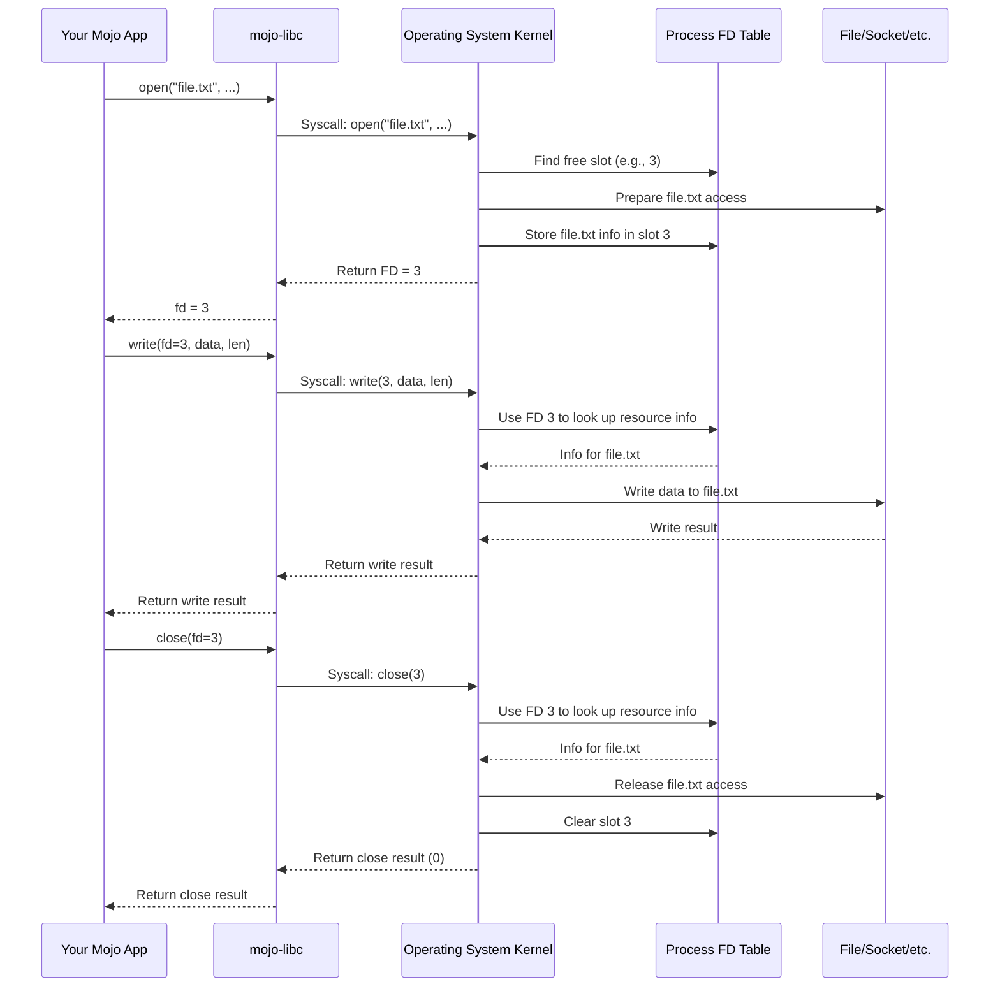

# Chapter 2: File Descriptors (FD)

In [Chapter 1: File I/O Wrappers (`open`, `close`, `read`, `write`)](01_file_i_o_wrappers___open____close____read____write___.md), we saw how functions like `open` give us a way to access a file, and functions like `read`, `write`, and `close` let us interact with that opened file. But how does `read` know *which* file to read from if our program has multiple files open? How does `close` know *which* file to close?

The answer is a simple but powerful concept: the **File Descriptor**, often shortened to **FD**.

## What's a File Descriptor? The Coat Check Ticket Analogy

Imagine you're at a fancy event and need to check your coat. You hand your coat to the attendant, and they give you a small plastic ticket with a unique number on it, say "42". Your coat is safely stored, and the attendant now knows that ticket "42" corresponds to *your* specific coat. When you want your coat back, you don't describe it ("the blue wool one"); you just hand over ticket "42". The attendant uses the number to quickly find and retrieve your coat.

A File Descriptor (FD) works exactly like that coat check ticket!

*   **You (Your Program):** You want to work with a resource (like a file or a network connection).
*   **The Coat Check Attendant (Operating System):** Manages all the resources.
*   **Your Coat (The File/Resource):** The actual file on disk, a network connection, or another I/O resource.
*   **The Ticket (The File Descriptor):** A simple, non-negative integer (like 0, 1, 2, 3, 42, ...).

When you call a function like `open` (to open a file) or `socket` (to create a network endpoint - more on this later!), the operating system prepares the resource for you. If successful, it doesn't give you the whole resource directly. Instead, it gives you back a **File Descriptor (FD)** – that small, unique integer (your ticket).

From then on, whenever you want to perform an action on that specific resource (like reading from the file using `read`, writing to it using `write`, or telling the OS you're done using `close`), you just provide the FD. The operating system uses this number to look up the actual resource you mean and performs the action.

So, a **File Descriptor is a small integer representing an open file, socket, or other I/O resource managed by the operating system.**

## Revisiting Chapter 1's Example

Let's look back at the code from Chapter 1 where we wrote "Hello, Mojo!" to `hello.txt`. Pay close attention to the variable `fd`:

```mojo
from libc import open, write, close, c_void
from libc import O_WRONLY, O_CREAT
from sys.ffi import c_char

fn main() raises:
    let file_path = "hello.txt"
    let message = "Hello, Mojo!\n"
    let path_ptr = file_path.unsafe_cstr_ptr()
    let message_ptr = message.unsafe_cstr_ptr()

    # 1. Get the "ticket" (FD) from the OS
    let flags = O_WRONLY | O_CREAT
    let mode = 0o644
    let fd = open(path_ptr, flags, mode) # <--- fd is assigned here!

    if fd == -1: # -1 means OS couldn't give us a ticket (error)
        print("Error: Failed to open file")
        return

    # 2. Use the ticket (fd) to write
    let bytes_to_write = len(message)
    let bytes_written = write(fd, # <--- Use fd here
                              message_ptr.bitcast[c_void](),
                              bytes_to_write)

    if bytes_written != bytes_to_write:
        print("Error: Failed to write entire message")
        _ = close(fd) # Still need to return the ticket if write failed
        return

    # 3. Return the ticket (fd) when done
    let close_result = close(fd) # <--- Use fd here
    if close_result == -1:
        print("Error: Failed to close file")
    else:
        print("Successfully wrote to", file_path)
```

**Explanation:**

1.  `let fd = open(...)`: We ask the OS to open (or create) `hello.txt` for writing. If the OS succeeds, it gives us back an integer, which we store in the variable `fd`. This `fd` is our File Descriptor, our unique "ticket" for `hello.txt`.
2.  `write(fd, ...)`: We want to write our message. We tell the `write` function *which* opened resource to write to by passing it the `fd` we got from `open`. The OS uses this `fd` to find the correct file (`hello.txt`) and writes the data.
3.  `close(fd)`: We're finished with the file. We tell the `close` function which resource we're done with by passing the `fd`. The OS uses the `fd` to find the associated file, releases it, and makes the `fd` number available for reuse later. It's like returning your coat check ticket.

If we had opened multiple files, each `open` call would (hopefully) return a *different* FD. We would then use the specific FD for each file when calling `read`, `write`, or `close`.

## Standard File Descriptors: 0, 1, and 2

When your program starts, the operating system automatically opens three "files" for you and gives you predefined File Descriptors for them:

*   **FD 0: Standard Input (stdin)**: Usually connected to your keyboard. When you read from FD 0, you typically get input typed by the user.
*   **FD 1: Standard Output (stdout)**: Usually connected to your console/terminal screen. When you write to FD 1, the text appears on the screen. `print()` often writes here behind the scenes.
*   **FD 2: Standard Error (stderr)**: Also usually connected to your console/terminal screen. This is conventionally used for printing error messages, separating them from normal output.

`mojo-libc` provides convenient aliases for these: `FD_STDIN`, `FD_STDOUT`, and `FD_STDERR`.

Let's try writing directly to Standard Output (FD 1):

```mojo
from libc import write, c_void, FD_STDOUT
from sys.ffi import c_char

fn main() raises:
    let message = "Writing directly to stdout!\n"
    let message_ptr = message.unsafe_cstr_ptr()
    let message_len = len(message)

    # Write the message using the standard output file descriptor (1)
    let bytes_written = write(FD_STDOUT, # Use the pre-defined FD 1
                              message_ptr.bitcast[c_void](),
                              message_len)

    if bytes_written != message_len:
        # Writing to stderr (FD 2) would be more typical for errors,
        # but we'll keep it simple here.
        print("Error writing to stdout")
```

**Expected Output (on your console):**

```
Writing directly to stdout!
```

This code doesn't `open` anything because FD 1 (stdout) is already open when the program starts. We just use the `write` function with the `FD_STDOUT` alias (which is just the integer `1`) to send our text to the console.

## How Does the OS Manage FDs? (Under the Hood)

Okay, FDs are integers, but how does the OS *really* use them?

Think of the operating system keeping a special list or table for *each running program*. This table is called the **File Descriptor Table**. Each entry in this table can hold information about one specific open resource (like which file it is, the current reading/writing position, whether it was opened for reading or writing, etc.).

1.  **`open()` Called:** When your program calls `open("myfile.txt", ...)`, the OS kernel:
    *   Finds the actual file `myfile.txt` on the disk.
    *   Performs checks (e.g., does the file exist? do you have permission?).
    *   Finds the *lowest-numbered unused slot* in your program's File Descriptor Table (e.g., maybe slot 3 is free, since 0, 1, and 2 are stdin/stdout/stderr).
    *   Fills that slot (slot 3) with information about the opened `myfile.txt`.
    *   Returns the slot number (the integer `3`) back to your program as the File Descriptor.

2.  **`write(3, ...)` Called:** When your program calls `write(3, data, length)`:
    *   The OS kernel takes the FD `3`.
    *   It looks directly at slot `3` in your program's File Descriptor Table.
    *   It finds the information about `myfile.txt` stored there.
    *   It performs the write operation on `myfile.txt` using that information.
    *   It returns the result (bytes written or error) back to your program.

3.  **`close(3)` Called:** When your program calls `close(3)`:
    *   The OS kernel looks at slot `3` in the table.
    *   It performs cleanup actions (like saving any buffered data to disk).
    *   It clears slot `3`, making the number `3` available for future `open` calls.
    *   The connection between FD `3` and `myfile.txt` is broken.

This table lookup using the integer FD is very efficient, which is why FDs are fundamental to Unix-like operating systems (like Linux and macOS).

Here's a simplified diagram:



In `mojo-libc`, the `FD` type is simply an alias for the C integer type `c_int`, reflecting that it's just a number.

```mojo
# --- File: src/libc/_libc.mojo ---

# ... other C type aliases ...
alias c_int = Int32 # (or Int64 depending on system)

# ... other definitions ...

alias FD = c_int # <--- The File Descriptor type is just an integer
alias FD_STDIN: FD = 0
alias FD_STDOUT: FD = 1
alias FD_STDERR: FD = 2

# ... rest of the file ...
```

## Conclusion

File Descriptors are the simple integer "tickets" that operating systems use to manage open files and other I/O resources for your program. Functions like `open` give you an FD, and functions like `read`, `write`, and `close` use that FD to know which resource you're talking about. Understanding FDs is crucial because they are used not only for files but also extensively in network programming (for sockets), which we'll start exploring soon. You've also learned about the standard FDs (0, 1, 2) for interacting with the console.

Now that we understand how the OS identifies resources using FDs, let's start looking at how we identify *network destinations*.

**Next:** [Chapter 3: Address Resolution (`getaddrinfo`)](03_address_resolution___getaddrinfo___.md)

---

Generated by [AI Codebase Knowledge Builder](https://github.com/The-Pocket/Tutorial-Codebase-Knowledge)