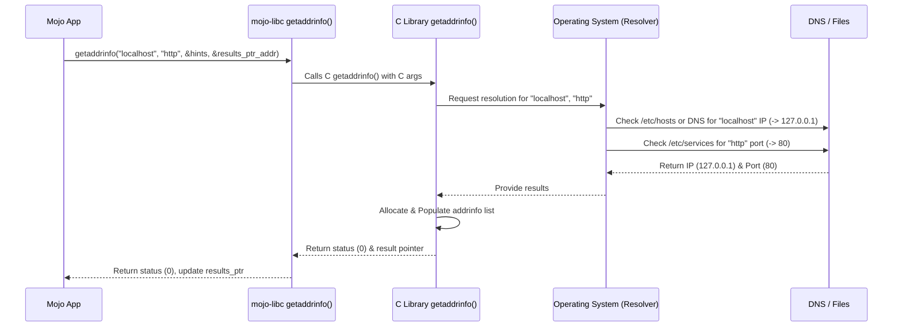

# Chapter 3: Address Resolution (`getaddrinfo`)

In the [previous chapter](02_file_descriptors__fd__.md), we learned about File Descriptors (FDs) – the integer "tickets" the operating system uses to manage open files and other resources. Now, we're shifting gears towards network communication.

Imagine you want to visit a friend's website, say `www.example.com`. You type this friendly name into your browser. But computers on the internet don't find each other using names like `www.example.com`. They use numerical addresses called **IP addresses** (like `93.184.216.34`) and specific **port numbers** for different services (like port `80` for standard web traffic - HTTP).

How does your computer translate the human-friendly name `www.example.com` into the computer-friendly `93.184.216.34` and port `80`? That's where **address resolution** comes in!

## What's the Problem? Names vs. Numbers

*   **Humans like:** Names (e.g., `google.com`, `localhost`) and service types (e.g., `http`, `ftp`).
*   **Computers need:** Numerical IP addresses (e.g., `172.217.160.142`, `127.0.0.1`, or longer IPv6 addresses) and numerical port numbers (e.g., `80`, `443`, `21`).

We need a way to bridge this gap. Think of it like using a phone book or directory assistance. You know the name of the person or business you want to call, but you need their phone number to actually make the call.

## The Solution: `getaddrinfo` - The Internet's Directory Assistance

The `mojo-libc` library provides a wrapper around the standard C function `getaddrinfo`. This function acts like that directory assistance service for the internet.

You give `getaddrinfo`:

1.  A **hostname** (like `"www.example.com"` or `"localhost"`).
2.  A **service name** (like `"http"`, `"https"` or a specific port number as a string, like `"8080"`).
3.  Optionally, some **hints** about the kind of address you prefer (e.g., "I only want IPv4 addresses" or "I'm planning to set up a server").

And `getaddrinfo` gives you back:

1.  A list of possible network address structures containing the numerical IP addresses and port numbers that match your request.

Why a *list*? Sometimes a single hostname can point to multiple IP addresses (for backup servers or balancing traffic), or it might have both an older IPv4 address and a newer IPv6 address. `getaddrinfo` finds all suitable options based on your hints.

These address structures are formatted in a way that other network functions (like `socket`, `bind`, and `connect`, which we'll see in [Chapter 6: Socket API Wrappers](06_socket_api_wrappers_.md)) can understand and use directly.

## Use Case: Finding the Address of "localhost" for HTTP

Let's try to find the network address information for connecting to a web server running on our own machine ("localhost") using the standard HTTP port.

**1. Setting Up Hints**

First, we need to tell `getaddrinfo` what kind of address we're looking for. We use a special structure called `addrinfo` for this. We'll create one and fill in some hints.

```mojo
from libc import addrinfo, AF_INET, SOCK_STREAM, AI_PASSIVE
from memory import UnsafePointer

fn main() raises:
    # Create an addrinfo struct to hold our hints
    var hints = addrinfo()

    # Specify the kind of address we want:
    # AF_INET means we want an IPv4 address.
    # Use AF_UNSPEC if you accept either IPv4 or IPv6.
    hints.ai_family = AF_INET

    # Specify the socket type:
    # SOCK_STREAM usually means TCP (reliable connection).
    # Use SOCK_DGRAM for UDP (faster, less reliable).
    hints.ai_socktype = SOCK_STREAM

    # Optional: AI_PASSIVE is used if we plan to *listen* for connections
    # (like a server). Leave it out or set to 0 if we plan to *connect*
    # (like a client). We'll include it here for demonstration.
    hints.ai_flags = AI_PASSIVE

    print("Hints prepared.")
    # The rest of the hints fields are initialized to zero/null by default.

    # ... (code to call getaddrinfo goes here) ...
```

**Explanation:**

*   We create an `addrinfo` variable named `hints`.
*   `hints.ai_family = AF_INET`: We're specifically asking for IPv4 addresses (`AF_INET`). `AF_INET6` would be for IPv6, and `AF_UNSPEC` means either is fine.
*   `hints.ai_socktype = SOCK_STREAM`: We want an address suitable for a reliable, connection-based protocol like TCP (which is what HTTP typically uses).
*   `hints.ai_flags = AI_PASSIVE`: This hint is usually for servers that will `bind` to an address and `listen` for incoming connections. If you were writing a client that *connects* out, you'd likely omit this flag.
*   Constants like `AF_INET`, `SOCK_STREAM`, `AI_PASSIVE` are provided by `mojo-libc`.

**2. Calling `getaddrinfo`**

Now we call the `getaddrinfo` function, passing our hostname, service name, and the hints we just prepared. We also need a place to store the results. `getaddrinfo` expects a *pointer to a pointer* for the results, which sounds tricky but just means we give it the memory location of a variable where it can put the address of the first result structure it finds.

```mojo
from libc import (
    addrinfo, AF_INET, SOCK_STREAM, AI_PASSIVE, getaddrinfo, gai_strerror, c_char
)
from memory import UnsafePointer, Pointer

# (Assuming hints are set up as above)
fn main() raises:
    var hints = addrinfo()
    hints.ai_family = AF_INET
    hints.ai_socktype = SOCK_STREAM
    hints.ai_flags = AI_PASSIVE

    # Hostname and Service Name (as C strings)
    let host = "localhost"
    let service = "http"
    let host_ptr = host.unsafe_cstr_ptr()
    let service_ptr = service.unsafe_cstr_ptr()

    # A variable to hold the pointer to the results list
    var results_ptr = UnsafePointer[addrinfo]()

    # Call getaddrinfo
    let status = getaddrinfo(
        host_ptr,                       # Hostname ("localhost")
        service_ptr,                    # Service ("http")
        UnsafePointer.address_of(hints), # Pointer to our hints
        UnsafePointer.address_of(results_ptr) # Where to put the result pointer
    )

    # Check for errors
    if status != 0:
        let error_msg_ptr = gai_strerror(status)
        print("getaddrinfo error:", String(error_msg_ptr))
        return
    else:
        print("getaddrinfo succeeded!")

    # If successful, results_ptr now points to the first addrinfo structure
    # in a linked list of results.

    # IMPORTANT: In real C code, you MUST call freeaddrinfo(results_ptr)
    # when done to release the memory allocated by getaddrinfo.
    # mojo-libc currently doesn't expose freeaddrinfo, so managing this
    # memory requires care or future library updates.
    # For this example, we'll just print success and exit.

```

**Explanation:**

1.  We define our `host` ("localhost") and `service` ("http"). We get C-style string pointers (`unsafe_cstr_ptr()`) because the underlying C function needs them.
2.  We declare `results_ptr` of type `UnsafePointer[addrinfo]`. This variable will eventually hold the memory address of the first result.
3.  We call `getaddrinfo`.
    *   We pass the C string pointers for the host and service.
    *   We pass the memory address (`UnsafePointer.address_of()`) of our `hints` structure.
    *   We pass the memory address of our `results_ptr` variable. This is the pointer-to-a-pointer part. `getaddrinfo` will *modify* `results_ptr` to make it point to the list of results it creates.
4.  We check the integer `status` returned by `getaddrinfo`. A value of `0` means success.
5.  If `status` is not `0`, it's an error code. We use `gai_strerror(status)` to get a human-readable error message and print it.
6.  If `status` is `0`, the call was successful! `results_ptr` now points to the first `addrinfo` structure in a linked list containing the resolved addresses.

**Expected Output:**

```
Hints prepared.
getaddrinfo succeeded!
```

*(Note: We aren't printing the actual address yet, just confirming the function call worked).*

**3. Understanding the Results (Briefly)**

If `getaddrinfo` succeeds, `results_ptr` points to an `addrinfo` structure. This structure contains fields like:

*   `ai_family`: The address family (e.g., `AF_INET`).
*   `ai_socktype`: The socket type (e.g., `SOCK_STREAM`).
*   `ai_protocol`: The protocol (often `0`).
*   `ai_addrlen`: The length of the address structure below.
*   `ai_addr`: A pointer to the actual network address structure (like `sockaddr_in` for IPv4). This is what functions like `connect` or `bind` need! We'll explore these `sockaddr` structures in [Chapter 4: Network Address Representation (`sockaddr`, `in_addr`, etc.)](04_network_address_representation___sockaddr____in_addr___etc___.md).
*   `ai_canonname`: A pointer to the canonical (official) hostname, if requested.
*   `ai_next`: A pointer to the *next* `addrinfo` structure in the list, or a null pointer if this is the last one.

You would typically loop through this linked list (`current = current.ai_next`) trying each address until you successfully create a socket and connect/bind. For simplicity, we're skipping that loop here.

## How It Works Under the Hood

What happens when you call `mojo-libc`'s `getaddrinfo`?

1.  **Your Mojo App:** Calls the `getaddrinfo` function provided by `mojo-libc`.
2.  **`mojo-libc` Wrapper:** This Mojo function takes your Mojo arguments (like `String`s) and prepares them for the C world (e.g., getting `UnsafePointer[c_char]` from a `String`). It then uses Mojo's `external_call` mechanism (see [Chapter 8: C Function Bindings (`external_call`)](08_c_function_bindings___external_call___.md)) to invoke the actual `getaddrinfo` function present in your system's C library (libc).
3.  **C Library (`getaddrinfo`):** This is the real workhorse. It talks to the operating system's network name resolution services.
4.  **Operating System Resolver:** The OS figures out the IP address. This might involve:
    *   Checking a local configuration file (like `/etc/hosts` on Linux/macOS).
    *   Contacting a Domain Name System (DNS) server over the network.
    *   Looking up the service name (like "http") in a local service database (like `/etc/services`) to find the corresponding port number (80).
5.  **Results Assembly:** The C library receives the numerical IP addresses and port numbers from the OS. It allocates memory to create one or more `addrinfo` structures, links them together in a list, and fills them with the results.
6.  **Return:** The C library returns `0` for success (or an error code) and sets the results pointer (the one you passed the address of) to point to the head of the newly created list.
7.  **Back to Mojo:** `mojo-libc` receives the status code and the pointer, returning the status code to your Mojo application. Your `results_ptr` variable now holds the address of the results.

Here's a simplified view:



Let's look at the `mojo-libc` wrapper code itself (simplified):

```mojo
# --- File: src/libc/_libc.mojo ---

# ... other definitions ...
from sys.ffi import external_call, c_int, c_char
from memory import UnsafePointer

# ... addrinfo struct definition ...

fn getaddrinfo(
    nodename: UnsafePointer[c_char],          # Hostname (C string)
    servname: UnsafePointer[c_char],          # Service name (C string)
    hints: UnsafePointer[addrinfo],           # Pointer to hints struct
    res: UnsafePointer[UnsafePointer[addrinfo]] # Pointer to result pointer
) -> c_int:                                   # Return status code
    """Libc POSIX `getaddrinfo` function wrapper... (docstring omitted) """
    return external_call[
        "getaddrinfo",                       # Name of C function
        c_int,                               # Return type of C function
        UnsafePointer[c_char],               # Type of arg 1
        UnsafePointer[c_char],               # Type of arg 2
        UnsafePointer[addrinfo],             # Type of arg 3
        UnsafePointer[UnsafePointer[addrinfo]], # Type of arg 4
    ](nodename, servname, hints, res)          # Pass arguments

# ... other functions ...
```

**Explanation:**

*   The Mojo `getaddrinfo` function signature mirrors the C function's expected types (using `UnsafePointer` for C pointers, `c_char` for C characters, `c_int` for C integers, etc.).
*   `external_call[...]` is the core. It specifies:
    *   `"getaddrinfo"`: The name of the C function to call.
    *   `c_int`: The expected return type from the C function.
    *   The list of types following it: The expected types of the arguments for the C function.
*   The arguments passed (`nodename, servname, hints, res`) are forwarded to the C function.

`mojo-libc` provides the bridge, making the powerful C `getaddrinfo` function usable from Mojo.

## Conclusion

In this chapter, we learned about the crucial concept of address resolution – translating human-friendly hostnames and service names into the numerical IP addresses and port numbers computers need for network communication. We saw how `mojo-libc` provides the `getaddrinfo` function, our "directory assistance" for the internet, to perform this translation. We walked through setting up hints, calling the function, and understanding the basics of the results it provides.

This step is fundamental because before you can create a network connection (using sockets), you need the specific numerical address of the machine and service you want to talk to. `getaddrinfo` is the standard way to get that address.

The results from `getaddrinfo` come in the form of `addrinfo` structures, which contain pointers to the actual network address data (`sockaddr` structures). How are these addresses actually represented in memory? Let's find out in the next chapter!

**Next:** [Chapter 4: Network Address Representation (`sockaddr`, `in_addr`, etc.)](04_network_address_representation___sockaddr____in_addr___etc___.md)

---

Generated by [AI Codebase Knowledge Builder](https://github.com/The-Pocket/Tutorial-Codebase-Knowledge)