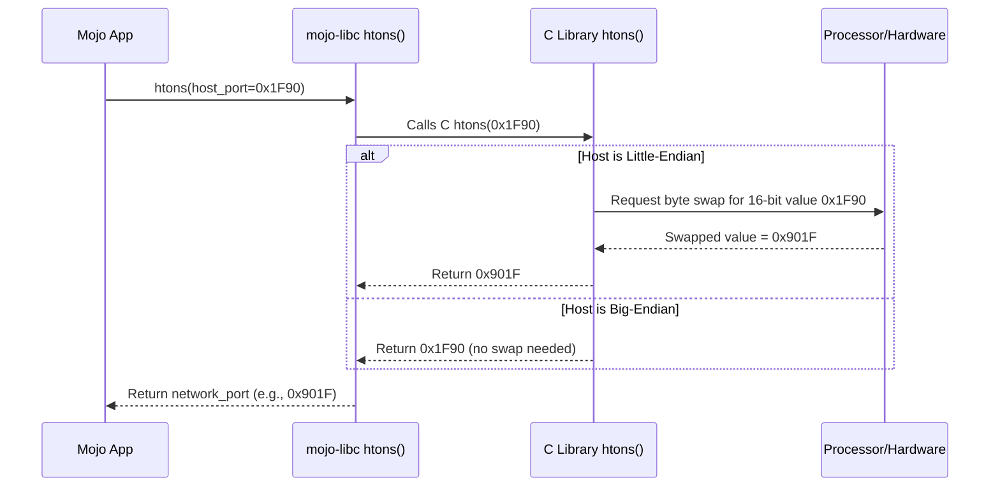

# Chapter 5: Network Byte Order Conversion (`htonl`, `htons`, `ntohl`, `ntohs`)

In [Chapter 4: Network Address Representation (`sockaddr`, `in_addr`, etc.)](04_network_address_representation___sockaddr____in_addr___etc___.md), we saw how network addresses like IP addresses and port numbers are stored in specific structures like `sockaddr_in`. We noted that the numbers within these structures need to be in a special format called "network byte order". But what exactly is that, and why is it needed?

Imagine you and a friend are writing down a large number, say, one thousand two hundred thirty-four. You might write "1234" (most significant digit first), but maybe your friend comes from a place where they write "4321" (least significant digit first). If you exchange notes without agreeing on a format, you'll misunderstand each other!

Computers face a similar problem when storing numbers larger than a single byte (like 16-bit port numbers or 32-bit IPv4 addresses).

## The Problem: Different Computers, Different Byte Orders (Endianness)

A single byte (8 bits) is simple. But how does a computer store the number `1234` (which needs more than one byte) in its memory? Let's say it uses two bytes (16 bits). In hexadecimal, `1234` is `0x04D2` (04 is the most significant byte, D2 is the least significant byte).

There are two common ways computers might store these two bytes in memory:

1.  **Big-Endian:** Stores the *most* significant byte (`04`) first, at the lower memory address, followed by the least significant byte (`D2`). Like writing "1234".
    *   Memory: `[04]` `[D2]`

2.  **Little-Endian:** Stores the *least* significant byte (`D2`) first, at the lower memory address, followed by the most significant byte (`04`). Like writing "4321" (if digits were bytes).
    *   Memory: `[D2]` `[04]`

Most modern computers (like those with x86/x64 processors from Intel or AMD) are Little-Endian. However, some older systems and certain network hardware might be Big-Endian.

This difference in "endianness" or **byte order** is internal to the computer and usually doesn't matter *until* computers need to exchange multi-byte numbers over a network. If a Little-Endian machine sends `0x04D2` by sending `D2` then `04`, a Big-Endian machine receiving it would interpret it as `0xD204`, which is the number `53764` – completely wrong!

## The Solution: Network Byte Order (Always Big-Endian!)

To avoid confusion, the internet protocols established a standard convention: **Network Byte Order**. All multi-byte numerical values (like IP addresses and port numbers) sent across a network *must* be in **Big-Endian** format.

Think of it as the "English" of number representation on the internet. Regardless of whether your computer natively speaks "Little-Endian English" or "Big-Endian English", when it talks on the network, it must translate its numbers into the standard "Big-Endian Network English".

## The Translation Tools: `htonl`, `htons`, `ntohl`, `ntohs`

How do we perform this translation between our computer's native format ("host" order) and the standard network format ("network" order)? `mojo-libc` provides wrappers for four standard C functions:

*   **`htons`**: **H**ost **to** **N**etwork **S**hort (16-bit)
    *   Use this for 16-bit values like port numbers (`in_port_t`).
    *   Converts a 16-bit number from your computer's native byte order to network byte order (Big-Endian).

*   **`htonl`**: **H**ost **to** **N**etwork **L**ong (32-bit)
    *   Use this for 32-bit values like IPv4 addresses (`in_addr_t`).
    *   Converts a 32-bit number from your computer's native byte order to network byte order (Big-Endian).

*   **`ntohs`**: **N**etwork **to** **H**ost **S**hort (16-bit)
    *   Use this for 16-bit values *received* from the network (e.g., reading a port number from a `sockaddr_in`).
    *   Converts a 16-bit number from network byte order (Big-Endian) to your computer's native byte order.

*   **`ntohl`**: **N**etwork **to** **H**ost **L**ong (32-bit)
    *   Use this for 32-bit values *received* from the network (e.g., reading an IPv4 address from a `sockaddr_in`).
    *   Converts a 32-bit number from network byte order (Big-Endian) to your computer's native byte order.

**Key Idea:**
*   Before sending data or storing it in network address structures (`sockaddr_in`), use `hton` functions (`htons`, `htonl`).
*   After receiving data or reading it from network address structures, use `ntoh` functions (`ntohs`, `ntohl`).

## Use Case: Preparing a `sockaddr_in` for `connect`

Let's say we want to connect to a server running on our local machine (`127.0.0.1`) on port `8080`. We need to create a `sockaddr_in` structure to pass to the `connect` function (which we'll see in [Chapter 6: Socket API Wrappers](06_socket_api_wrappers_.md)).

**1. Get Host Values:**
First, we have our address information in the "host" representation - the way we normally think about them:
*   Port: `8080` (a 16-bit number)
*   IP Address: `127.0.0.1`. This corresponds to the 32-bit number `0x7F000001` (or `2130706433` in decimal).

```mojo
from libc import c_ushort, c_uint

# Our port number (needs 16 bits)
let host_port: c_ushort = 8080

# Our IP address as a 32-bit number
# 127.0.0.1 -> (127 * 2^24) + (0 * 2^16) + (0 * 2^8) + (1 * 2^0)
#          -> 2130706433 (decimal)
#          -> 0x7F000001 (hex)
let host_ip_addr: c_uint = 0x7F000001

print("Host Port:", host_port)
print("Host IP (hex):", hex(host_ip_addr))
```

**Explanation:**
We define our target port and IP address using standard Mojo integer types (`c_ushort` for 16-bit, `c_uint` for 32-bit). These values are in our computer's native ("host") byte order.

**2. Convert to Network Byte Order:**
Now, we use `htons` and `htonl` to convert these host values to network byte order.

```mojo
from libc import c_ushort, c_uint, htons, htonl

let host_port: c_ushort = 8080
let host_ip_addr: c_uint = 0x7F000001

# Convert port using htons (Host-to-Network-Short)
let network_port = htons(host_port)

# Convert IP address using htonl (Host-to-Network-Long)
let network_ip_addr = htonl(host_ip_addr)

print("Network Port (raw):", network_port) # Output might look weird!
print("Network IP (raw):", network_ip_addr) # Output might look weird!
# We'll print hex values to see the byte swap if it happens
print("Network Port (hex):", hex(network_port))
print("Network IP (hex):", hex(network_ip_addr))
```

**Explanation:**
*   `htons(host_port)` takes the 16-bit host port `8080` (hex `0x1F90`) and converts it to network byte order. If the host is Little-Endian, the result will be `0x901F`. If the host is Big-Endian, it will remain `0x1F90`.
*   `htonl(host_ip_addr)` takes the 32-bit host IP `0x7F000001` and converts it to network byte order. If the host is Little-Endian, the result will be `0x0100007F`. If Big-Endian, it stays `0x7F000001`.
*   The raw decimal printout might look like a completely different number because the byte order changed! Printing in hex makes the byte swapping (if any) more obvious.

**3. Populate the `sockaddr_in` Structure:**
Finally, we use these *network byte order* values when filling our `sockaddr_in` structure.

```mojo
from libc import (
    c_ushort, c_uint, htons, htonl, sockaddr_in, in_addr, AF_INET, c_char
)
from utils import StaticTuple

let host_port: c_ushort = 8080
let host_ip_addr: c_uint = 0x7F000001

let network_port = htons(host_port)
let network_ip_addr = htonl(host_ip_addr)

# Create the IPv4 address structure (in_addr)
var ip_struct = in_addr(network_ip_addr) # Use the network-order IP

# Create the full IPv4 socket address structure (sockaddr_in)
var address = sockaddr_in(
    sin_family=AF_INET,     # Set the address family to IPv4
    sin_port=network_port,  # Use the network-order port
    sin_addr=ip_struct,     # Use the in_addr struct we just made
    sin_zero=StaticTuple[c_char, 8]() # Zero out the padding
)

print("sockaddr_in created with network byte order values.")
# Now 'address' is ready to be used with functions like connect() or bind()
```

**Explanation:**
We create the `in_addr` struct using the `network_ip_addr`. Then, we create the `sockaddr_in` structure, making sure to place the `network_port` in the `sin_port` field and our `ip_struct` (which contains the network-order IP) in the `sin_addr` field. The `sin_family` is set to `AF_INET`, and the `sin_zero` padding is cleared. This `address` variable now holds the address and port in the standard format expected by C networking functions.

**Using `ntohs` and `ntohl`:**
If we *received* a `sockaddr_in` structure (e.g., from `accept` when a client connects to our server), we would do the reverse:
1.  Extract `sin_port` and `sin_addr.s_addr`.
2.  Call `ntohs()` on the extracted port to convert it back to host order for display or use.
3.  Call `ntohl()` on the extracted `s_addr` to convert the IP address back to host order.

## How It Works Under the Hood

These byte conversion functions are usually highly optimized.

1.  **Your Mojo App:** Calls `htons(port_number)` or `htonl(ip_address)` from `mojo-libc`.
2.  **`mojo-libc` Wrapper:** Uses `external_call` to invoke the corresponding C library function (`htons` or `htonl`).
3.  **C Library Function (`htons`/`htonl`):** This is where the magic happens.
    *   The C library knows the native "endianness" of the computer it was compiled for.
    *   It checks if the host byte order is the *same* as network byte order (Big-Endian).
    *   **If Same (Host is Big-Endian):** The function does nothing! It just returns the original value.
    *   **If Different (Host is Little-Endian):** The function performs a **byte swap**. For `htons` (16-bit), it swaps the first byte with the second. For `htonl` (32-bit), it reverses the order of all four bytes (byte 1 <-> byte 4, byte 2 <-> byte 3). This is often done using very fast processor instructions.
4.  **Return:** The C library returns the (potentially byte-swapped) value.
5.  **Back to Mojo:** `mojo-libc` returns the value to your application, now guaranteed to be in network byte order.

The `ntohs` and `ntohl` functions work identically, performing a swap only if the host is Little-Endian.



Let's peek at a `mojo-libc` wrapper:

```mojo
# --- File: src/libc/_libc.mojo ---
from sys.ffi import external_call, c_ushort

# ... other definitions ...

fn htons(hostshort: c_ushort) -> c_ushort:
    """Libc POSIX `htons` function... (docstring omitted) """
    # Calls the C function named "htons"
    # Expects a c_ushort argument, returns a c_ushort
    return external_call["htons", c_ushort, c_ushort](hostshort)

# ... wrappers for htonl, ntohs, ntohl are similar ...
```

**Explanation:**
The Mojo wrapper `htons` takes a `c_ushort` (16-bit unsigned integer). It uses `external_call` to call the C function named `"htons"`. It tells `external_call` that the C function returns a `c_ushort` and takes a single `c_ushort` argument. It simply passes the `hostshort` value through. The actual byte swapping logic resides within the C library's implementation of `htons`.

## Conclusion

We've learned about the difference between host byte order (which can be Big-Endian or Little-Endian) and the standard Network Byte Order (always Big-Endian). This difference is crucial for ensuring multi-byte numbers like IP addresses and port numbers are interpreted correctly when sent over a network.

We saw how `mojo-libc` provides the essential conversion functions:
*   `htons`/`htonl` to convert *to* network order before sending or storing in address structures.
*   `ntohs`/`ntohl` to convert *from* network order after receiving.

Using these functions correctly ensures your network application communicates reliably with others, regardless of the underlying computer architecture.

Now that we understand addresses (`sockaddr`), how to find them (`getaddrinfo`), and how to format the numbers within them (network byte order conversion), we're finally ready to look at the functions that actually create and manage network connections: the socket API wrappers.

**Next:** [Chapter 6: Socket API Wrappers](06_socket_api_wrappers_.md)

---

Generated by [AI Codebase Knowledge Builder](https://github.com/The-Pocket/Tutorial-Codebase-Knowledge)