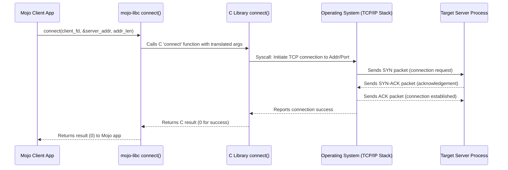

# Chapter 6: Socket API Wrappers

Welcome back! In [Chapter 5: Network Byte Order Conversion (`htonl`, `htons`, `ntohl`, `ntohs`)](05_network_byte_order_conversion___htonl____htons____ntohl____ntohs___.md), we learned how to correctly format numbers like IP addresses and port numbers for network use. We now understand how to find addresses ([Chapter 3: Address Resolution (`getaddrinfo`)](03_address_resolution___getaddrinfo___.md)) and how they are structured ([Chapter 4: Network Address Representation (`sockaddr`, `in_addr`, etc.)](04_network_address_representation___sockaddr____in_addr___etc___.md)).

But how do we actually *use* these addresses to make connections, send data, and receive data over the network? We need a set of tools to manage the communication endpoints themselves. This chapter introduces the **Socket API Wrappers** in `mojo-libc` – the functions that let your Mojo program interact with the network, much like C programs do.

## Motivation: Talking Over the Network

Imagine you want your Mojo program to act like a web browser fetching a webpage, or like a simple chat server waiting for clients to connect. You need a way to:

1.  Create a communication endpoint (like installing a phone line).
2.  For servers, assign a specific address (like a phone number) to that endpoint and wait for incoming calls.
3.  For clients, dial the number of a server to establish a connection.
4.  Send and receive messages over the established connection.
5.  Hang up or disconnect the line when finished.

The standard C "socket API" provides functions for all these steps. `mojo-libc` wraps these C functions, making them available to your Mojo code. These wrappers are the core toolkit for network programming in Mojo using `mojo-libc`.

## The Core Networking Toolkit

Think of these functions as the verbs of network communication:

1.  **`socket(domain, type, protocol)`**: Creates a new communication endpoint (a socket).
    *   `domain`: Specifies the communication domain (e.g., `AF_INET` for IPv4 internet, `AF_INET6` for IPv6).
    *   `type`: Specifies the communication semantics (e.g., `SOCK_STREAM` for reliable TCP, `SOCK_DGRAM` for faster UDP).
    *   `protocol`: Usually `0` to let the system choose the appropriate protocol based on domain and type.
    *   **Returns:** A [File Descriptor (FD)](02_file_descriptors__fd__.md) representing the new socket, or `-1` on error. (Like getting a new, unlisted phone line installed).

2.  **`bind(sockfd, addr, addrlen)`**: Assigns a local address (IP address and port) to a socket. Usually used by servers.
    *   `sockfd`: The socket FD returned by `socket()`.
    *   `addr`: A pointer to a `sockaddr` structure (like `sockaddr_in`) containing the IP address and port number (in network byte order!).
    *   `addrlen`: The size of the address structure.
    *   **Returns:** `0` on success, `-1` on error. (Like assigning a specific phone number to your new line).

3.  **`listen(sockfd, backlog)`**: Marks a socket (that has been bound) as passive, ready to accept incoming connection requests. Only for connection-oriented servers (like TCP).
    *   `sockfd`: The socket FD.
    *   `backlog`: The maximum number of pending connections the system should queue up while your server is busy.
    *   **Returns:** `0` on success, `-1` on error. (Like turning the ringer on for your phone line).

4.  **`accept(sockfd, addr, addrlen)`**: Waits for an incoming connection on a listening socket and accepts it.
    *   `sockfd`: The listening socket FD.
    *   `addr`: A pointer to a `sockaddr` structure where the address of the connecting client will be stored.
    *   `addrlen`: A pointer to a variable holding the size of the address structure (will be updated with the actual client address size).
    *   **Returns:** A *new* socket FD representing the actual connection to the client, or `-1` on error. The original socket `sockfd` keeps listening. (Like answering the ringing phone; you now have a connection to the caller on a new line, while your main line is still ready for more calls).

5.  **`connect(sockfd, addr, addrlen)`**: Establishes a connection to a remote address. Used by clients.
    *   `sockfd`: The local socket FD created by `socket()`.
    *   `addr`: A pointer to a `sockaddr` structure containing the destination IP address and port.
    *   `addrlen`: The size of the address structure.
    *   **Returns:** `0` on success, `-1` on error. (Like dialing a phone number and waiting for the other side to pick up).

6.  **`send(sockfd, buf, len, flags)`**: Sends data over a connected socket.
    *   `sockfd`: The connected socket FD (from `accept` or `connect`).
    *   `buf`: A pointer to the data buffer to send.
    *   `len`: The number of bytes to send.
    *   `flags`: Options (usually `0`).
    *   **Returns:** The number of bytes actually sent, or `-1` on error. (Like talking into the phone).

7.  **`recv(sockfd, buf, len, flags)`**: Receives data from a connected socket.
    *   `sockfd`: The connected socket FD.
    *   `buf`: A pointer to a buffer where the received data will be stored.
    *   `len`: The maximum number of bytes to receive into the buffer.
    *   `flags`: Options (usually `0`).
    *   **Returns:** The number of bytes received (can be 0 if the other side closed the connection), or `-1` on error. (Like listening on the phone).

8.  **`setsockopt(sockfd, level, optname, optval, optlen)`**: Sets various options for a socket (e.g., allowing address reuse `SO_REUSEADDR`). We won't detail this here, but it's useful for fine-tuning.

9.  **`shutdown(sockfd, how)`**: Disables sends and/or receives on a socket. Useful for gracefully closing connections.
    *   `sockfd`: The socket FD.
    *   `how`: Specifies what to shut down (`SHUT_RD` for reading, `SHUT_WR` for writing, `SHUT_RDWR` for both).
    *   **Returns:** `0` on success, `-1` on error. (Like gently hanging up the phone, maybe signaling you're done talking but can still listen).

10. **`close(sockfd)`**: Releases the socket file descriptor and associated resources. (Covered in [Chapter 1: File I/O Wrappers (`open`, `close`, `read`, `write`)](01_file_i_o_wrappers___open____close____read____write___.md) but also applies to sockets). (Like fully disconnecting the phone line).

## Use Case: A Minimal "Hello" Client and Server

Let's build the simplest possible network interaction: a client connects to a server, the server accepts, and then both immediately close the connection.

**Server (`server.mojo`)**

```mojo
from libc import (
    socket, bind, listen, accept, close, sockaddr, sockaddr_in,
    AF_INET, SOCK_STREAM, htons, c_char
)
from memory import UnsafePointer, Pointer, sizeof
from utils import StaticTuple

fn main() raises:
    let port: Int = 8080
    print("Starting server on port", port)

    # 1. Create a socket (Get a phone line)
    let listen_fd = socket(AF_INET, SOCK_STREAM, 0)
    if listen_fd == -1:
        print("Error: socket() failed")
        return

    # 2. Prepare the address to bind to (localhost:8080)
    #    Remember Chapter 4 & 5: Need sockaddr_in with network byte order!
    var server_addr = sockaddr_in()
    server_addr.sin_family = AF_INET
    server_addr.sin_port = htons(port.to_int16()) # Network byte order!
    server_addr.sin_addr.s_addr = htonl(0x7F000001) # localhost (127.0.0.1)
    # (Padding `sin_zero` is implicitly zeroed)

    # Need a generic sockaddr pointer for bind()
    let server_addr_ptr = UnsafePointer.address_of(server_addr)
                        .bitcast[sockaddr]()

    # 3. Bind the socket to the address (Assign a phone number)
    let bind_res = bind(listen_fd, server_addr_ptr, sizeof[sockaddr_in]())
    if bind_res == -1:
        print("Error: bind() failed")
        _ = close(listen_fd)
        return

    # 4. Listen for incoming connections (Turn the ringer on)
    let backlog = 1 # Only allow 1 pending connection
    let listen_res = listen(listen_fd, backlog)
    if listen_res == -1:
        print("Error: listen() failed")
        _ = close(listen_fd)
        return

    print("Server listening...")

    # 5. Accept a connection (Answer the phone)
    #    We need variables to store client address info, though unused here
    var client_addr = sockaddr_in()
    var client_addr_len = sizeof[sockaddr_in]().to_int32() # Must be Int32 for POSIX
    let client_addr_gen_ptr = UnsafePointer.address_of(client_addr)
                              .bitcast[sockaddr]()
    let client_addr_len_ptr = Pointer.address_of(client_addr_len)

    let conn_fd = accept(listen_fd,
                         client_addr_gen_ptr,
                         client_addr_len_ptr.bitcast[UInt32]()) # accept expects uint32_t*
    if conn_fd == -1:
        print("Error: accept() failed")
    else:
        print("Connection accepted! Client FD:", conn_fd)
        # In a real server, we'd recv/send here using conn_fd
        _ = close(conn_fd) # Close the *client* connection FD

    # 6. Close the listening socket (Disconnect the main line)
    _ = close(listen_fd)
    print("Server shut down.")

```

**Client (`client.mojo`)**

```mojo
from libc import (
    socket, connect, close, sockaddr, sockaddr_in,
    AF_INET, SOCK_STREAM, htons, htonl, c_char
)
from memory import UnsafePointer, sizeof
from utils import StaticTuple

fn main() raises:
    let server_ip_str = "127.0.0.1"
    let server_port: Int = 8080
    print("Connecting to", server_ip_str, "port", server_port)

    # 1. Create a socket (Get a phone line)
    let client_fd = socket(AF_INET, SOCK_STREAM, 0)
    if client_fd == -1:
        print("Error: socket() failed")
        return

    # 2. Prepare the server's address
    var server_addr = sockaddr_in()
    server_addr.sin_family = AF_INET
    server_addr.sin_port = htons(server_port.to_int16()) # Network order!
    server_addr.sin_addr.s_addr = htonl(0x7F000001) # 127.0.0.1

    let server_addr_ptr = UnsafePointer.address_of(server_addr)
                        .bitcast[sockaddr]()

    # 3. Connect to the server (Dial the number)
    let connect_res = connect(client_fd, server_addr_ptr, sizeof[sockaddr_in]())

    if connect_res == -1:
        print("Error: connect() failed")
    else:
        print("Connected successfully! Socket FD:", client_fd)
        # In a real client, we'd send/recv here using client_fd

    # 4. Close the socket (Hang up)
    _ = close(client_fd)
    print("Connection closed.")

```

**Running the Example:**

1.  Run the server: `mojo server.mojo`
2.  In another terminal, run the client: `mojo client.mojo`

**Expected Output:**

*Server Terminal:*

```
Starting server on port 8080
Server listening...
Connection accepted! Client FD: [some number, e.g., 4]
Server shut down.
```

*Client Terminal:*

```
Connecting to 127.0.0.1 port 8080
Connected successfully! Socket FD: [some number, e.g., 3]
Connection closed.
```

**Explanation:**

*   Both programs start by creating a `socket` using `AF_INET` (IPv4) and `SOCK_STREAM` (TCP).
*   They prepare a `sockaddr_in` structure with the target address and port, ensuring values are in network byte order using `htons` and `htonl`.
*   The **server** then uses `bind` to claim the address `127.0.0.1:8080`, `listen` to wait for connections, and `accept` to block until the client connects. `accept` returns a *new* file descriptor (`conn_fd`) for the specific connection.
*   The **client** uses `connect` to initiate the connection to the server's address.
*   Both programs then `close` their respective socket FDs (the server closes both the connection FD and the original listening FD).

This example shows the basic lifecycle of creating, establishing, and closing a network connection using the core socket API wrappers.

## How It Works Under the Hood

Just like the file I/O functions in [Chapter 1](01_file_i_o_wrappers___open____close____read____write___.md), these socket functions in `mojo-libc` are wrappers around the corresponding C library functions provided by the operating system. They use Mojo's `external_call` mechanism (which we'll explore more in [Chapter 8: C Function Bindings (`external_call`)](08_c_function_bindings___external_call___.md)) to invoke the C code.

Let's trace a client `connect` call:



Here's a look at the simplified `mojo-libc` wrapper for `socket`:

```mojo
# --- File: src/libc/_libc.mojo ---
from sys.ffi import external_call, c_int
from libc import FD # FD is an alias for c_int

# ... other definitions ...

fn socket(domain: c_int, type: c_int, protocol: c_int) -> FD:
    """Libc POSIX `socket` function wrapper... (docstring omitted) """
    # Calls the C function named "socket"
    # Returns an FD (c_int), takes three c_int arguments
    return external_call["socket", FD, c_int, c_int, c_int](
        domain, type, protocol
    )

# ... wrappers for bind, listen, accept, connect, etc. are similar ...
```

The Mojo function `socket` takes Mojo integers (`c_int`) representing the domain, type, and protocol. It uses `external_call` to invoke the C function `"socket"`, specifying the return type (`FD`) and argument types (`c_int, c_int, c_int`), and passes the arguments along. `mojo-libc` handles the bridge between your Mojo code and the operating system's networking capabilities.

## Conclusion

In this chapter, we explored the core `mojo-libc` wrappers for the C socket API. We learned about the essential functions for network programming:

*   `socket`: Create an endpoint.
*   `bind`, `listen`, `accept`: Server-side operations to prepare for and receive connections.
*   `connect`: Client-side operation to establish a connection.
*   `send`, `recv`: Transmitting data over a connection.
*   `shutdown`, `close`: Terminating connections and releasing resources.

We saw a minimal client-server example demonstrating the basic flow of setting up and tearing down a TCP connection. These wrappers provide the fundamental building blocks you need to write network-aware applications in Mojo.

Underlying all these operations are specific data types (like `c_int`, `sockaddr`, `c_char`) that bridge the gap between Mojo and C. How does `mojo-libc` define these types? Let's dive into that next.

**Next:** [Chapter 7: C Data Types & Aliases](07_c_data_types___aliases_.md)

---

Generated by [AI Codebase Knowledge Builder](https://github.com/The-Pocket/Tutorial-Codebase-Knowledge)