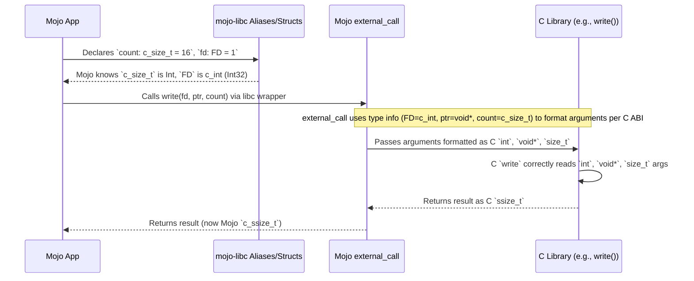

# Chapter 7: C Data Types & Aliases

Welcome back! In the [previous chapter](06_socket_api_wrappers_.md), we saw how `mojo-libc` provides functions like `socket`, `bind`, `connect`, `send`, and `recv` to perform network operations. When calling these functions (and the file functions from [Chapter 1](01_file_i_o_wrappers___open____close____read____write___.md)), we passed arguments like file descriptors (`FD`), buffer pointers (`UnsafePointer[c_void]`), byte counts (`c_size_t`), and address structures (`sockaddr_in`).

But where do these special types like `FD`, `c_size_t`, `sockaddr_in` come from, and why do we need them? Why not just use standard Mojo types like `Int` or `String`?

This chapter introduces the **C Data Types and Aliases** provided by `mojo-libc`. They are the essential "translation layer" that ensures your Mojo data is formatted exactly how the underlying C functions expect it.

## Motivation: Speaking the Same Language (Data Format)

Imagine you're sending a package overseas. You need to fill out a customs form. The form asks for the weight in kilograms, the value in Euros, and the dimensions in centimeters. You might know these values in pounds, dollars, and inches, but you *must* convert them to the format required by the form (kilograms, Euros, centimeters) for the package to be processed correctly.

Calling C functions from Mojo is similar. C functions, especially those in the standard C library (libc), have very specific expectations about the *size* and *layout* of the data you pass to them.

*   A C function might expect an integer to be exactly 32 bits (`int` or `int32_t` in C). Mojo's `Int` might be 64 bits on your system.
*   A C function might expect a specific data structure (like `sockaddr_in`) with fields laid out in memory in a precise order. Mojo needs to create a structure with the exact same layout.
*   C code uses conventional names for types (like `size_t` for sizes, `ssize_t` for signed sizes, `char` for characters/bytes).

`mojo-libc` solves this by providing Mojo definitions that **mirror** these C types and structures. It gives you Mojo-sized containers specifically shaped to hold C-style data, ensuring compatibility when calling C functions.

## Use Case: Passing the Right Size to `write`

Let's look back at the `write` function from [Chapter 1](01_file_i_o_wrappers___open____close____read____write___.md). Its C signature typically looks like this:

```c
// C Function Signature
ssize_t write(int fildes, const void *buf, size_t nbyte);
```

This means:
*   It expects the file descriptor (`fildes`) as a C `int`.
*   It expects the buffer (`buf`) as a pointer to raw bytes (`void *`).
*   It expects the number of bytes to write (`nbyte`) as a `size_t` type.
*   It returns the number of bytes written (or -1 on error) as an `ssize_t` type.

To call this safely from Mojo using `mojo-libc`, we need to use Mojo types that correspond exactly to C's `int`, `void *`, `size_t`, and `ssize_t`.

## Core Concepts: Mojo Mirrors for C Types

`mojo-libc` provides these mirrors in two main ways: **type aliases** for basic C types and **struct definitions** for complex C structures.

**1. Fundamental Type Aliases (The Basic Units)**

For common C types, `mojo-libc` defines simple aliases that map C names to appropriate Mojo primitive types. Think of these as giving Mojo's built-in types C-style nicknames.

Here are some crucial ones found in `src/libc/_libc.mojo`:

```mojo
# --- File: src/libc/_libc.mojo (Simplified Snippets) ---

# Basic Integer Types
alias c_int = Int32     # Represents C's 'int' (often 32-bit)
alias c_uint = UInt32    # Represents C's 'unsigned int'
alias c_short = Int16    # Represents C's 'short'
alias c_ushort = UInt16   # Represents C's 'unsigned short'
alias c_long = Int64     # Represents C's 'long' (often 64-bit)
alias c_ulong = UInt64   # Represents C's 'unsigned long'

# Character Type (often used for bytes)
alias c_char = Int8     # Represents C's 'char' (can be signed or unsigned)

# Size Types (Crucially, these match the platform's C definition)
# Mojo's 'Int' automatically matches the platform's word size (32 or 64 bit)
alias c_size_t = Int     # Represents C's 'size_t' (for sizes/counts)
alias c_ssize_t = Int    # Represents C's 'ssize_t' (for signed sizes/results)

# Void Type (used for raw memory pointers)
alias c_void = UInt8    # Often aliased to byte type for pointer casting

# File Descriptor Alias (for clarity)
alias FD = c_int        # File Descriptors are just C integers
```

**Explanation:**

*   `alias c_int = Int32`: Tells Mojo that whenever you use the name `c_int`, it should treat it as a 32-bit signed integer (`Int32`). This matches the common size of `int` in C APIs.
*   `alias c_size_t = Int`: This is important. `size_t` in C is an unsigned integer type used for sizes, and its exact bit width depends on the system (32-bit or 64-bit). Mojo's `Int` conveniently matches the system's word size, so this alias makes `c_size_t` correctly sized for the platform you're compiling on. `c_ssize_t` is the signed version.
*   `alias FD = c_int`: While an `FD` is just an integer, giving it the specific name `FD` makes the code much clearer and matches C conventions. It signals the *purpose* of the integer.

When you declare a variable in Mojo using these aliases, like `var count: c_size_t`, Mojo knows the exact size and type expected by the corresponding C function argument.

**2. Struct Definitions (The Complex Blueprints)**

For more complex C data like `sockaddr_in` (from [Chapter 4](04_network_address_representation___sockaddr____in_addr___etc___.md)) or `addrinfo` (from [Chapter 3](03_address_resolution___getaddrinfo___.md)), `mojo-libc` defines Mojo `@value` structs. These structs are carefully crafted to have the **exact same memory layout** as their C counterparts.

```mojo
# --- File: src/libc/_libc.mojo (Simplified Snippets) ---

# Recall from Chapter 4:
@value
@register_passable("trivial")
struct in_addr:
    # Field name 's_addr' matches C struct
    # Field type 'in_addr_t' (aliased to c_uint) matches C type
    var s_addr: in_addr_t

@value
@register_passable("trivial")
struct sockaddr_in:
    # Fields match the C struct 'sockaddr_in' in order and type
    var sin_family: sa_family_t # Aliased to c_ushort
    var sin_port: in_port_t     # Aliased to c_ushort
    var sin_addr: in_addr       # Uses the nested 'in_addr' Mojo struct
    var sin_zero: StaticTuple[c_char, 8] # Padding to match C size

# Recall from Chapter 3:
@value
@register_passable("trivial")
struct addrinfo:
    var ai_flags: c_int
    var ai_family: c_int
    var ai_socktype: c_int
    var ai_protocol: c_int
    var ai_addrlen: socklen_t # Alias for c_uint usually
    # Pointers use UnsafePointer with the appropriate C type alias
    var ai_addr: UnsafePointer[sockaddr]
    var ai_canonname: UnsafePointer[c_char]
    var ai_next: UnsafePointer[c_void] # Points to next addrinfo or null
    # ... (constructor omitted for brevity) ...
```

**Explanation:**

*   `@value` and `@register_passable("trivial")`: These decorators tell Mojo to treat these structs as simple data containers whose layout should match the declaration order, suitable for passing to C functions.
*   **Field Names:** The field names (`sin_family`, `sin_port`, `s_addr`, `ai_flags`, etc.) directly correspond to the field names in the standard C structures.
*   **Field Types:** The types used for the fields are the `mojo-libc` C type aliases (`c_int`, `c_ushort`, `in_addr_t`, etc.) or nested Mojo structs (`in_addr`) that themselves match the C layout. Pointers use `UnsafePointer` with the appropriate C target type (e.g., `UnsafePointer[sockaddr]`).
*   **Order and Padding:** The order of fields and any necessary padding (`sin_zero`) are defined to precisely match the memory footprint expected by C code.

When you create an instance of `sockaddr_in` or `addrinfo` in Mojo, it allocates memory and arranges the data exactly as a C compiler would for the corresponding C struct.

## Solving the Use Case: Calling `write` Correctly

Now let's rewrite a simple `write` call, explicitly using the correct `mojo-libc` types:

```mojo
from libc import write, close, c_void, c_size_t, c_ssize_t, FD, FD_STDOUT
from memory import UnsafePointer

fn main() raises:
    let message = "Using C types!\n"
    let msg_ptr = message.unsafe_cstr_ptr()

    // Explicitly use FD (alias for c_int) for the file descriptor
    let fd: FD = FD_STDOUT # Standard Output

    // Explicitly use UnsafePointer[c_void] for the buffer
    // Need bitcast as msg_ptr is UnsafePointer[c_char]
    let buffer_ptr: UnsafePointer[c_void] = msg_ptr.bitcast[c_void]()

    // Explicitly use c_size_t (alias for Int) for the count
    let bytes_to_write: c_size_t = len(message)

    // Call write - arguments match the expected C types
    let bytes_written_result: c_ssize_t = write(fd, buffer_ptr, bytes_to_write)

    // Check the result (which is c_ssize_t)
    if bytes_written_result == -1:
         print("Error writing to stdout")
    elif bytes_written_result != bytes_to_write:
         print("Warning: Partial write to stdout")
    else:
         print("Successfully wrote", bytes_written_result, "bytes to stdout.")

    # close() also expects an FD
    # Note: Usually, you don't close standard streams like FD_STDOUT
    # let close_result: c_int = close(fd)
```

**Explanation:**

By using `FD`, `UnsafePointer[c_void]`, `c_size_t`, and receiving a `c_ssize_t`, we provide the data to the `write` wrapper (and ultimately to the underlying C `write` function) in the exact format it requires. There's no ambiguity about sizes or types.

**Expected Output:**

```
Successfully wrote 16 bytes to stdout.
```
(The text "Using C types!\n" will also appear on your console because it was written to FD 1).

## How It Works Under the Hood: Matching Blueprints

These aliases and structs act as blueprints for the Mojo compiler.

1.  **Declaration:** When you write `var my_int: c_int` or `var addr: sockaddr_in`, Mojo consults the `mojo-libc` definitions. It sees `c_int` is `Int32` and allocates 32 bits. It sees `sockaddr_in` has specific fields of specific types (`c_ushort`, `c_ushort`, `in_addr`, padding) and allocates memory precisely matching that layout (e.g., 16 bytes total for `sockaddr_in`).
2.  **Function Call:** When you call a `mojo-libc` wrapper function like `write(fd, buffer_ptr, bytes_to_write)`:
    *   The wrapper function's signature also uses these C type aliases (`FD`, `UnsafePointer[c_void]`, `c_size_t`).
    *   The wrapper uses Mojo's `external_call` mechanism (covered in [Chapter 8](08_c_function_bindings___external_call___.md)).
    *   `external_call` uses the type information from the aliases and structs to place the argument values onto the call stack or into registers exactly as the C function ABI (Application Binary Interface) requires.
3.  **C Function Execution:** The C library function (`write` in this case) receives the arguments. Because Mojo formatted them according to the C blueprint, the C function correctly interprets the `FD` as a C `int`, the pointer as a `void*`, and the count as a `size_t`.



The C type aliases and struct definitions in `mojo-libc` are the critical link ensuring this smooth translation between the Mojo world and the C world. They are the shared language specification for data.

## Conclusion

In this chapter, we learned why specific C data types and aliases are necessary when interfacing with C libraries from Mojo. We saw how `mojo-libc` provides:

*   **Type Aliases** (`c_int`, `c_size_t`, `FD`, etc.) that map C type names to appropriate Mojo primitive types, ensuring correct size and interpretation.
*   **Struct Definitions** (`sockaddr_in`, `addrinfo`, etc.) using `@value` that precisely mirror the memory layout of C structures.

These definitions act as essential "blueprints" or a "shared dictionary," guaranteeing that data passed between Mojo and C functions is understood correctly by both sides. They are fundamental to the success of any C interoperability library like `mojo-libc`.

But how do the `mojo-libc` wrapper functions actually *make* the call to the underlying C functions using these types? That's the job of Mojo's powerful `external_call` feature, which we'll explore next.

**Next:** [Chapter 8: C Function Bindings (`external_call`)](08_c_function_bindings___external_call___.md)

---

Generated by [AI Codebase Knowledge Builder](https://github.com/The-Pocket/Tutorial-Codebase-Knowledge)