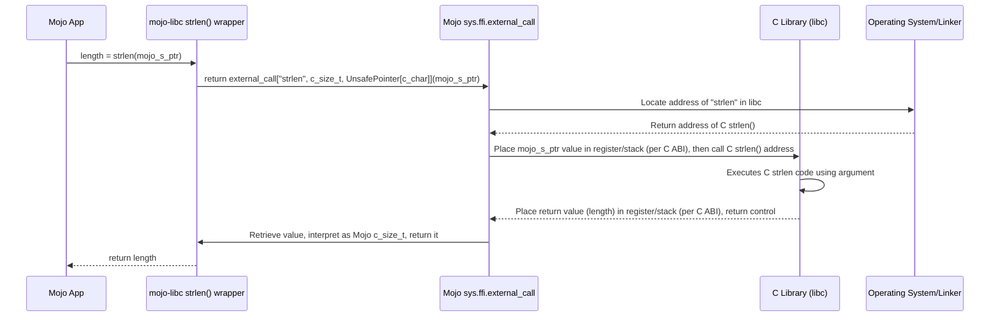

# Chapter 8: C Function Bindings (`external_call`)

Welcome to the final chapter in our foundational tour of `mojo-libc`! In [Chapter 7: C Data Types & Aliases](07_c_data_types___aliases_.md), we saw how `mojo-libc` defines Mojo types (like `c_int`, `c_size_t`, `sockaddr_in`) that perfectly match the size and layout expected by C functions. We used these types when calling `mojo-libc` functions like `write`, `socket`, or `htonl`.

But how do those `mojo-libc` functions *actually* call the underlying C functions provided by your operating system? If `mojo-libc`'s `write` function is just a wrapper, what does the wrapping itself look like? How does Mojo "reach out" and execute code from a different language like C?

This chapter unveils the core mechanism that makes this possible: Mojo's built-in **`external_call`** feature. This is the fundamental bridge, the universal translator, that allows Mojo to directly interact with pre-existing C code.

## Motivation: Crossing the Bridge to C

Imagine Mojo and C are two different cities that speak different languages. The C city has many useful services (the C standard library, libc) that the Mojo city wants to use, like handling files, networking, and managing memory.

How can a resident of Mojo city make a request to a service in C city? They need a special translation service located at the bridge between the cities. This translation service needs to know:

1.  Which specific C service (function) to contact.
2.  What language (data types) the C service expects for the request.
3.  What language (return type) the C service will use for its reply.

Mojo's `external_call` is exactly this translation service at the bridge. It allows your Mojo code to specify all the necessary details to safely and correctly call a function written in C. All the helpful functions provided by `mojo-libc` (like `open`, `close`, `read`, `write`, `socket`, `bind`, `connect`, `htonl`, `htons`, etc.) use `external_call` under the hood to do their work.

## Use Case: Looking Inside `strlen`

Let's take a simple example. The C standard library provides a function called `strlen` that calculates the length of a C-style string (a sequence of characters ending in a null byte). Its C signature is:

```c
// C function signature
size_t strlen(const char *s);
```

This means:
*   It's named `strlen`.
*   It takes one argument: `s`, which is a pointer (`*`) to a constant (`const`) character (`char`).
*   It returns a value of type `size_t` (which represents the size, usually an unsigned integer).

`mojo-libc` provides a convenient Mojo wrapper for this function. Let's see how `mojo-libc` *defines* this wrapper using `external_call`:

```mojo
# --- File: src/libc/_libc.mojo (Simplified) ---
from sys.ffi import external_call, c_char
from memory import UnsafePointer
from libc import c_size_t # Alias for Int (size_t)

fn strlen(s: UnsafePointer[c_char]) -> c_size_t:
    """Libc POSIX `strlen` function wrapper... (docstring) """
    # This is the core: calling the C function!
    return external_call["strlen", c_size_t, UnsafePointer[c_char]](s)
```

**Explanation:**

*   We define a Mojo function `strlen` that takes an `UnsafePointer[c_char]` (Mojo's equivalent of `const char *`) and returns a `c_size_t` (Mojo's alias matching C's `size_t`).
*   The *entire* implementation is the `external_call[...]` line. This single line is the bridge to the C function.

## Key Concept: `external_call` Syntax Explained

The `external_call` construct looks a bit different from a regular function call. Let's break down its structure:

```
external_call["c_function_name", ReturnType, Arg1Type, Arg2Type, ...](arg1, arg2, ...)
```

It has two main parts:

1.  **The Specification (`[...]`)**: This part *describes* the C function you want to call.
    *   `"c_function_name"`: A **string literal** containing the exact name of the C function as it exists in the compiled C library (e.g., `"strlen"`, `"write"`, `"socket"`).
    *   `ReturnType`: The Mojo type (using aliases from [Chapter 7: C Data Types & Aliases](07_c_data_types___aliases_.md)) that corresponds to the return type of the C function. For `strlen`, this is `c_size_t`.
    *   `ArgXType`: A comma-separated list of Mojo types (again, using C aliases) that correspond to the types of the arguments the C function expects, *in the correct order*. For `strlen`, there's only one: `UnsafePointer[c_char]`.

2.  **The Invocation (`(...)`)**: This part *calls* the C function, passing the actual arguments.
    *   `arg1, arg2, ...`: The Mojo variables or values you want to pass to the C function. These values must match the types specified in the `ArgXType` list in the specification part. For `strlen`, we pass the Mojo variable `s`.

**Analogy: The Universal Translator**

Think of `external_call` like using a universal translator device:

*   `"c_function_name"`: You tell the translator the *name* of the person (C function) you want to talk to.
*   `ReturnType`: You tell the translator what kind of *answer* you expect back (e.g., a number, a yes/no).
*   `ArgXType`: You tell the translator what kind of *information* the other person needs (e.g., they need a name, then an age).
*   `(arg1, arg2, ...)`: You give the translator the *actual information* (your name, your age) to pass along.

The translator (`external_call`) then handles the details of making the connection and ensuring the conversation happens correctly according to the specified types.

## Applying `external_call` to Other Examples

Let's look at the `htons` wrapper from [Chapter 5: Network Byte Order Conversion (`htonl`, `htons`, `ntohl`, `ntohs`)](05_network_byte_order_conversion___htonl____htons____ntohl____ntohs___.md).

The C function signature is:
```c
// C function signature
uint16_t htons(uint16_t hostshort);
```
*   Name: `htons`
*   Argument: `hostshort` of type `uint16_t` (unsigned 16-bit integer)
*   Return Type: `uint16_t`

Here's the `mojo-libc` wrapper using `external_call`:

```mojo
# --- File: src/libc/_libc.mojo (Simplified) ---
from sys.ffi import external_call
from libc import c_ushort # Alias for UInt16 (uint16_t)

fn htons(hostshort: c_ushort) -> c_ushort:
    """Libc POSIX `htons` function wrapper... (docstring) """
    # Specify C function name, return type, argument type
    return external_call["htons", c_ushort, c_ushort](hostshort)
    #                                          ^       ^
    #                                          |       Argument Type
    #                                          Return Type
```

**Explanation:**

*   `"htons"`: Specifies the C function name.
*   `c_ushort`: Specifies the return type (matches C `uint16_t`).
*   `c_ushort`: Specifies the type of the single argument (matches C `uint16_t`).
*   `(hostshort)`: Passes the Mojo variable `hostshort` as the argument.

You can see the pattern: the `mojo-libc` function defines a nice Mojo interface, and its body consists almost entirely of an `external_call` that perfectly mirrors the signature of the underlying C function using the C type aliases.

## How It Works Under the Hood: Mojo Meets C ABI

What actually happens when Mojo executes an `external_call` line?

1.  **Lookup:** Mojo looks at the function name string (e.g., `"strlen"`). It asks the operating system's dynamic linker/loader to find the memory address where the compiled C code for the `strlen` function resides (usually within the standard C library, `libc`, which is already loaded into your program's memory space).
2.  **ABI Compliance:** Mojo examines the specified return and argument types (`c_size_t`, `UnsafePointer[c_char]`). It consults the system's **Application Binary Interface (ABI)** rules. The ABI is a set of conventions for the specific operating system and processor architecture that dictates *how* function arguments should be passed (e.g., put the first integer argument in register `rdi`, the second in `rsi`, put floating-point arguments in specific floating-point registers, put larger structures on the stack) and *how* the return value should be passed back (e.g., put the integer result in register `rax`).
3.  **Argument Marshaling:** Mojo takes the Mojo argument values you provided (e.g., the pointer value in the variable `s`) and places them into the correct CPU registers or memory locations on the call stack, exactly as defined by the C ABI for the specified types.
4.  **Function Call:** Mojo executes a low-level processor instruction to jump to the memory address of the C function (`strlen`) found in step 1.
5.  **C Execution:** The C function code runs. Because the arguments were placed according to the ABI rules, the C code finds them where it expects them.
6.  **Return Value:** The C function places its return value (the calculated string length) into the designated register or stack location, again according to the ABI. It then executes an instruction to return control back to the Mojo code.
7.  **Result Unmarshaling:** Mojo retrieves the return value from the ABI-defined location. It interprets this raw value as the specified Mojo `ReturnType` (`c_size_t`).
8.  **Return to Caller:** The `external_call` expression evaluates to this resulting Mojo value, which is then returned by the `mojo-libc` wrapper function (e.g., `strlen`).

This process ensures that Mojo and C can communicate seamlessly, respecting the low-level conventions defined by the system's C ABI.

Here's a simplified diagram illustrating the `strlen` call:



Essentially, almost every function in `mojo-libc` that interacts with the operating system (file I/O, networking, byte swapping, etc.) is a relatively thin wrapper containing an `external_call` configured with the correct C function name and the corresponding Mojo type aliases for its arguments and return value.

## Conclusion

In this chapter, we uncovered the magic behind `mojo-libc`: the `external_call` feature. We learned:

*   `external_call` is Mojo's built-in mechanism for calling functions written in C.
*   It acts as a bridge, requiring the C function's name, return type, and argument types to be specified using Mojo equivalents.
*   It takes Mojo arguments and passes them to the C function according to the system's C Application Binary Interface (ABI).
*   It retrieves the C function's return value and makes it available to Mojo.
*   The wrappers in `mojo-libc` heavily rely on `external_call` to expose C standard library functionality to Mojo programs.

Understanding `external_call` shows you how Mojo achieves low-level systems programming capabilities by directly leveraging the vast ecosystem of existing C libraries. While `mojo-libc` provides convenient wrappers for common libc functions, `external_call` gives you the power to bind *any* C function if needed.

This chapter concludes our exploration of the fundamental concepts within the `mojo-libc` project. You've learned about file operations, file descriptors, address resolution, network address representation, byte order conversion, the socket API, C data type mapping, and finally, the `external_call` binding mechanism that ties it all together. With this foundation, you should be well-equipped to understand and use `mojo-libc` for various system-level tasks in Mojo!

---

Generated by [AI Codebase Knowledge Builder](https://github.com/The-Pocket/Tutorial-Codebase-Knowledge)