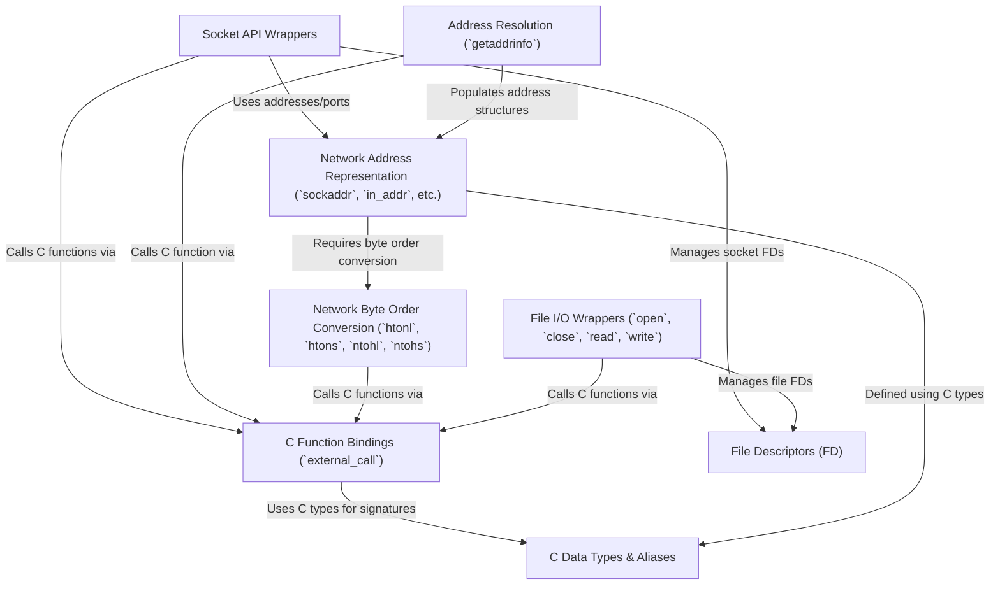

# Tutorial: mojo-libc

`mojo-libc` provides a way for *Mojo* programs to use standard **C library functions** (`libc`).
It acts as a bridge, allowing Mojo code to perform low-level tasks like **network communication** (creating sockets, connecting, sending/receiving data) and **file operations** (opening, reading, writing files) by calling existing, well-tested C functions.
It defines necessary **C data types** and wrappers around common C APIs.

**Source Repository:** [None](None)

## Chapters

1. [File I/O Wrappers (`open`, `close`, `read`, `write`)
](01_file_i_o_wrappers___open____close____read____write___.md)
2. [File Descriptors (FD)
](02_file_descriptors__fd__.md)
3. [Address Resolution (`getaddrinfo`)
](03_address_resolution___getaddrinfo___.md)
4. [Network Address Representation (`sockaddr`, `in_addr`, etc.)
](04_network_address_representation___sockaddr____in_addr___etc___.md)
5. [Network Byte Order Conversion (`htonl`, `htons`, `ntohl`, `ntohs`)
](05_network_byte_order_conversion___htonl____htons____ntohl____ntohs___.md)
6. [Socket API Wrappers
](06_socket_api_wrappers_.md)
7. [C Data Types & Aliases
](07_c_data_types___aliases_.md)
8. [C Function Bindings (`external_call`)
](08_c_function_bindings___external_call___.md)

---

Generated by [AI Codebase Knowledge Builder](https://github.com/The-Pocket/Tutorial-Codebase-Knowledge)