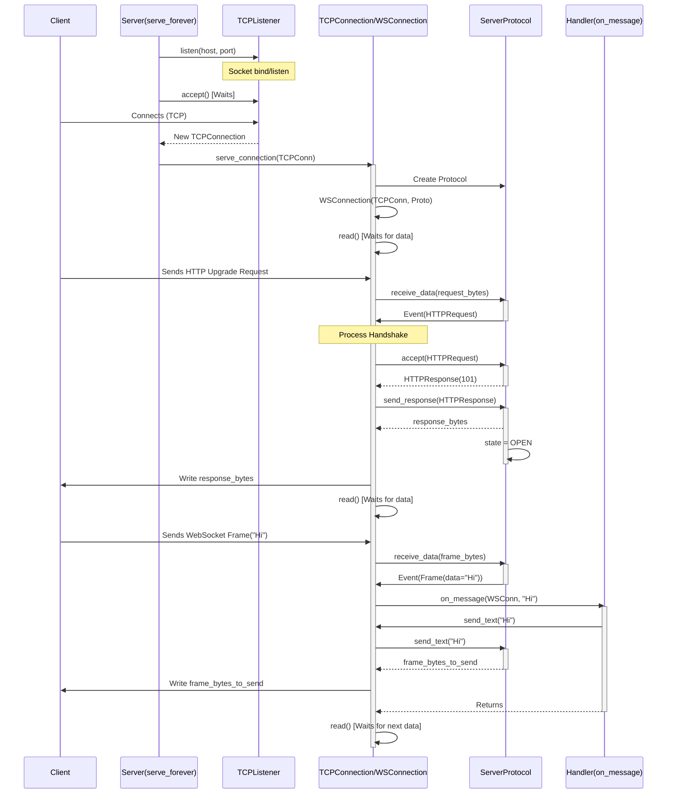

# Chapter 1: Server (Sync)

Welcome to the `mojo-websockets` tutorial! This is the very first chapter, and we'll start with something fundamental: creating a WebSocket server.

**What's the Problem?**

Imagine you want to build a real-time chat application, a live notification system, or an online game. In these scenarios, the server needs to be able to push information to clients *without* the client constantly asking ("polling") for updates. Clients also need to send information to the server. This two-way, persistent communication is what WebSockets are great for!

But how do you build the "server" part – the program that listens for these WebSocket connections and talks back? That's what the `Server (Sync)` abstraction helps us with.

**Our Goal: An Echo Server**

We'll start with a simple goal: create an "echo" server. Whatever message a client sends to our server, the server will immediately send the exact same message back to that client. Think of it like talking to a very polite parrot!

**Analogy: The Dedicated Phone Line**

Think of the `Server (Sync)` like setting up a special phone line (`ws://your-address:port`) just for WebSocket calls:

1.  **The Phone Line (`Server` & `TCPListener`):** You set up a specific address and port number where clients can "call in". The `Server` manages this, using a lower-level component called a [TCPListener](06_tcpconnection_.md) to actually listen for the incoming network rings (connections).
2.  **Answering the Call (Accepting Connections):** When a client tries to connect, the `TCPListener` "picks up the phone", establishing a [TCPConnection](06_tcpconnection_.md).
3.  **Speaking WebSocket (`ServerProtocol`):** Once connected, you need to speak the WebSocket language. This involves a special greeting (the "handshake") and rules for how messages are packaged ("framing"). The [Protocol (Server/Client)](03_protocol__server_client__.md) handles these rules.
4.  **The Conversation Logic (`handler` function):** You need to decide *what* to say back when the client sends a message. This is your custom logic, provided as a function (we call it the `handler`). For our echo server, the logic is simple: repeat whatever the client said.

**Setting up the Echo Server**

Let's see how we can build our echo server using `mojo-websockets`. We'll use the `serve` function, which bundles up the creation and running of the server.

```mojo
# File: examples/echo/server.mojo

from websockets.aliases import Bytes
# Import the 'serve' function and the connection object
from websockets.sync.server import serve, WSConnection

# This is our 'handler' function!
fn on_message(conn: WSConnection, data: Bytes) raises -> None:
    # Convert the received bytes to a string for printing
    str_received = String(data)
    print("<<< ", str_received) # Log what we received

    # Send the same message back as text
    conn.send_text(str_received)
    print(">>> ", str_received) # Log what we sent

fn main() raises:
    # Create and run the server using a 'with' block
    # It listens on IP 127.0.0.1 (localhost) and port 8001
    # We pass our 'on_message' function as the handler
    with serve(on_message, "127.0.0.1", 8001) as server:
        # This keeps the server running indefinitely,
        # listening for and handling connections
        server.serve_forever()

```

**Breaking Down the Code:**

1.  **`on_message(conn: WSConnection, data: Bytes)`:**
    *   This is the heart of our echo logic – our `handler` function.
    *   `conn: WSConnection`: Represents the specific connection to the client who sent the message. Think of it as the direct line to *that* caller.
    *   `data: Bytes`: The actual message content received from the client, as raw bytes.
    *   `String(data)`: We convert the bytes to a readable string.
    *   `conn.send_text(str_received)`: This is how we send a message back *to that specific client* over the WebSocket connection.
    *   `print(...)`: Just logging to our server's console so we can see what's happening.

2.  **`main()`:**
    *   `with serve(on_message, "127.0.0.1", 8001) as server:`: This is the magic line!
        *   `serve(...)`: A helper function that creates a `Server` instance for us.
        *   `on_message`: We tell the server to use our `on_message` function whenever a message arrives on any connection.
        *   `"127.0.0.1"`: The IP address to listen on. `127.0.0.1` means "this computer" (localhost).
        *   `8001`: The port number to listen on. Clients will need to connect to `ws://127.0.0.1:8001`.
        *   `with ... as server:`: This sets up the server and ensures it's properly shut down later (using `__enter__` and `__exit__`).
    *   `server.serve_forever()`: This starts the server's main loop. It will:
        *   Print something like `🔥 Listening on ws://127.0.0.1:8001`.
        *   Wait for clients to connect.
        *   Handle connections and messages according to our `on_message` handler.
        *   Keep running until you stop the program (e.g., by pressing Ctrl+C).

**Running the Server:**

If you run this code, it will wait patiently. You'll need a WebSocket client (which we'll cover in the [next chapter](02_client__sync__.md)) to connect to `ws://127.0.0.1:8001`. When the client sends "Hello!", the server console will show:

```
<<<  Hello!
>>>  Hello!
```

And the client will receive the "Hello!" message back.

**Under the Hood: How `serve_forever()` Works**

What actually happens when you call `server.serve_forever()`? Let's peek behind the curtain.

1.  **Listening Setup:** The `serve` function (or `Server` initialization) creates a `ListenConfig`. `serve_forever` then calls `ListenConfig.listen(host, port)`. This function asks the operating system for a network listening point (a socket), binds it to the specified IP (`127.0.0.1`) and port (`8001`), and tells it to start listening for incoming connection attempts. It wraps this low-level socket in a more convenient [TCPListener](06_tcpconnection_.md) object.

    ```mojo
    # Simplified view inside ListenConfig.listen() (from net.mojo)
    fn listen(mut self, host: String, port: Int) raises -> TCPListener:
        # ... create a low-level socket ...
        socket = Socket[TCPAddr]()
        # ... set options like SO_REUSEADDR ...
        # ... bind the socket to the host and port ...
        socket.bind(addr.ip, addr.port)
        # ... tell the socket to listen for connections ...
        socket.listen(128) # Allow up to 128 pending connections
        # ... wrap it in our TCPListener ...
        var listener = TCPListener(socket^)
        print("🔥 Listening on ...")
        return listener^
    ```

2.  **Waiting for Connections:** The `serve_forever` method then enters a loop that repeatedly calls `listener.accept()`. This function *blocks* (waits) until a client actually tries to connect. When a client connects, `accept()` returns a [TCPConnection](06_tcpconnection_.md) object representing this specific, new connection.

    ```mojo
    # Simplified view inside Server.serve() (called by serve_forever)
    fn serve(mut self, owned ln: TCPListener) raises:
        while True: # Loop forever
            # Wait here until a client connects
            var conn = ln.accept()
            # Once connected, handle this specific connection
            self.serve_connection(conn)
    ```

3.  **Handling a Single Connection:** For each new `TCPConnection`, the `serve_connection` method takes over.
    *   It creates a dedicated [ServerProtocol](03_protocol__server_client__.md) instance. This object will manage the WebSocket state (connecting, open, closed) and rules for *this specific client*.
    *   It creates a `WSConnection` which bundles the `TCPConnection` and `ServerProtocol` together for easier use in the handler.
    *   It enters *another* loop, specifically for reading data from *this* client.

    ```mojo
    # Simplified view inside Server.serve_connection()
    fn serve_connection(mut self, mut conn: TCPConnection) raises -> None:
        # Create a protocol instance for this connection
        protocol = ServerProtocol()
        # Create the wrapper connection object
        wsconn = WSConnection(conn, protocol)

        while True: # Loop for this connection
            # Read data from the client into buffer 'b'
            var b = Bytes(capacity=DEFAULT_BUFFER_SIZE)
            try:
                _ = wsconn.read(b) # This reads from TCPConnection
                                # and feeds data to ServerProtocol
            except e:
                # Handle errors (e.g., client disconnected)
                conn.teardown() # Close the connection
                return # Exit this connection's loop

            # Check if the protocol parser found an error
            if protocol.get_parser_exc():
                # Handle protocol errors
                conn.teardown()
                return

            # Is this the first message (the handshake)?
            if protocol.get_state() == CONNECTING:
                # ... Handle WebSocket handshake ...
                # (Extract HTTPRequest, validate, send HTTPResponse)
                # If successful, protocol state becomes OPEN
                # (See diagram below)
            else: # Connection is OPEN, handle data frames
                # Let the handler process the received data
                self.handle_read(protocol, wsconn, b)

            # ... maybe check if connection should close ...
    ```

4.  **The Handshake & Data Exchange:**
    *   **Handshake:** When the first data arrives (`protocol.get_state() == CONNECTING`), the `ServerProtocol` parses it as an HTTP Upgrade request. It checks headers like `Upgrade: websocket`, `Connection: Upgrade`, and `Sec-WebSocket-Key`. If everything is valid, it generates the `Sec-WebSocket-Accept` response header and sends back an HTTP 101 Switching Protocols response using `conn.write()`. The protocol state then changes to `OPEN`.
    *   **Data:** Once `OPEN`, subsequent calls to `wsconn.read(b)` feed data into the `ServerProtocol`, which parses WebSocket [Frames](05_frame_.md). When a complete data frame is parsed, `protocol.events_received()` will contain a `Frame` event. The `handle_read` method retrieves this event and calls *your* `handler` function (`on_message` in our example) with the `WSConnection` and the frame's data. Your handler then likely uses `wsconn.send_text()` or `send_binary()`, which tells the `ServerProtocol` to create an outgoing frame, and `conn.write()` sends it back to the client.

**Visualizing the Flow (Sequence Diagram):**

This diagram shows the simplified interaction when a client connects, sends one message, and gets an echo back.



**Conclusion**

You've just learned the basics of creating a synchronous WebSocket server with `mojo-websockets`! We saw how the `Server` uses a [TCPListener](06_tcpconnection_.md) to accept incoming connections and how a [ServerProtocol](03_protocol__server_client__.md) manages the WebSocket handshake and message framing for each connection. Most importantly, you learned how to provide a custom `handler` function to define your server's specific behavior when messages arrive.

Now that we have a server waiting, how do we write a program to *connect* to it and send messages? That's exactly what we'll cover in the next chapter!

Ready to build the client? Let's move on to [Chapter 2: Client (Sync)](02_client__sync__.md).

---

Generated by [AI Codebase Knowledge Builder](https://github.com/The-Pocket/Tutorial-Codebase-Knowledge)