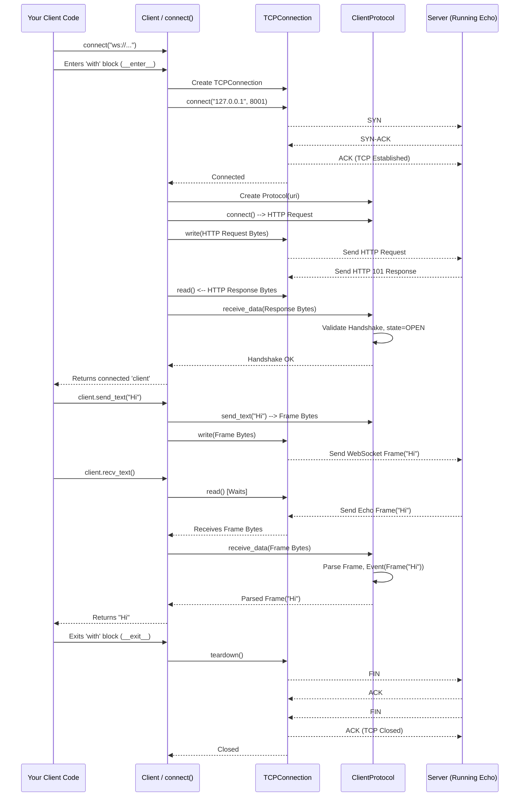

# Chapter 2: Client (Sync)

In [Chapter 1: Server (Sync)](01_server__sync__.md), we learned how to build a WebSocket server – our friendly echo parrot waiting for someone to talk to it. Now, we need to build the other side: the program that *initiates* the conversation, connects to the server, and sends messages. This is where the `Client (Sync)` comes in!

**What's the Problem?**

We have our echo server running, waiting for connections on `ws://127.0.0.1:8001`. How do we write a Mojo program that can:

1.  Find and connect to this specific server address?
2.  Speak the special WebSocket "language" to establish the connection (the handshake)?
3.  Send messages (like "Hello!") to the server?
4.  Receive messages back from the server (expecting "Hello!" back from our echo server)?

That's exactly what the `Client (Sync)` abstraction helps us do. It's the tool for making WebSocket calls *from* your program *to* a server.

**Analogy: Making the Phone Call**

If the `Server` was like setting up a dedicated WebSocket phone line (Chapter 1), the `Client` is like your telephone used to *dial* that specific number:

1.  **Dialing the Number (`Client` & URI):** You know the server's address (`ws://127.0.0.1:8001`). You tell the `Client` this address (URI).
2.  **Making the Connection (`TCPConnection`):** The `Client` uses a lower-level tool, the [TCPConnection](06_tcpconnection_.md), to establish the basic network link to the server's address and port – like the phone network connecting your call.
3.  **The WebSocket Greeting (`ClientProtocol`):** Once the basic line is open, the `Client` needs to initiate the special WebSocket handshake. It uses the [Protocol (Server/Client)](03_protocol__server_client__.md) (specifically, the client-side rules) to send the correct "Upgrade" request headers. It also listens for and validates the server's "Switching Protocols" response.
4.  **Having the Conversation (`send_text`, `recv`):** After the handshake, the connection is open! You can use methods like `send_text()` to send messages and `recv()` (or `recv_text()`) to receive messages, all according to the WebSocket protocol rules managed by the `ClientProtocol`.

**Connecting to Our Echo Server**

Let's write a simple client program to talk to the echo server we built in Chapter 1. We'll use the `connect` function, which gives us a `Client` object ready to use.

```mojo
# File: examples/echo/client.mojo
# Make sure the echo server from Chapter 1 is running first!

# Import the 'connect' function
from websockets.sync.client import connect

fn main() raises:
    print("Attempting to connect to ws://127.0.0.1:8001...")
    # Use 'with' to manage the connection lifecycle
    # It automatically connects and closes the connection
    with connect("ws://127.0.0.1:8001") as client:
        print("Connection successful!")

        # Get input from the user
        message_to_send = input("Enter a message to send: ")

        # Send the message as text
        print(">>> Sending:", message_to_send)
        client.send_text(message_to_send)

        # Wait to receive a message back (blocking)
        print("<<< Waiting for echo...")
        received_message = client.recv_text() # Use recv_text for strings

        # Print the received message
        print("<<< Received:", received_message)

    print("Connection closed.") # Happens automatically when 'with' block ends
```

**Running the Client (and Server):**

1.  Make sure the `server.mojo` code from Chapter 1 is running in one terminal. You should see `🔥 Listening on ws://127.0.0.1:8001`.
2.  Run this `client.mojo` code in another terminal.

**Expected Interaction:**

*Client Terminal:*
```
Attempting to connect to ws://127.0.0.1:8001...
Connection successful!
Enter a message to send: Hello Mojo! <--- You type this and press Enter
>>> Sending: Hello Mojo!
<<< Waiting for echo...
<<< Received: Hello Mojo!
Connection closed.
```

*Server Terminal (from Chapter 1):*
```
🔥 Listening on ws://127.0.0.1:8001
Ready to accept connections...
<<<  Hello Mojo!
>>>  Hello Mojo!
```

**Breaking Down the Client Code:**

1.  **`from websockets.sync.client import connect`**: Imports the necessary function to create our client connection.
2.  **`with connect("ws://127.0.0.1:8001") as client:`**: This is the core line.
    *   `connect("ws://...")`: Creates a `Client` object configured for the server address.
    *   `with ... as client:`: This is crucial! It uses a "context manager".
        *   When the `with` block starts, it automatically calls the client's internal `__enter__` method. This performs the [TCPConnection](06_tcpconnection_.md) and the WebSocket handshake. If the connection fails, it raises an error here.
        *   If successful, it gives you the connected `client` object to use inside the block.
        *   When the `with` block ends (normally or due to an error), it automatically calls the client's `__exit__` method, which closes the WebSocket connection and the underlying [TCPConnection](06_tcpconnection_.md). This ensures resources are cleaned up.
3.  **`message_to_send = input(...)`**: Standard Mojo function to get text input from the user typing in the terminal.
4.  **`client.send_text(message_to_send)`**: Sends the user's message to the server over the established WebSocket connection. It packages the string into a WebSocket text [Frame](05_frame_.md) behind the scenes.
5.  **`received_message = client.recv_text()`**: This *waits* (blocks) until the client receives a complete text message from the server. It then returns the content as a `String`. If the server sent binary data, you'd use `client.recv()` which returns `Bytes`.
6.  **`print(...)`**: We print what we send and receive to see the interaction.

**Under the Hood: What Happens During `connect` and `send`/`recv`?**

Let's trace the steps when you run the client code:

1.  **`connect("ws://...")`:** Creates a `Client` struct instance, parsing the URI (`ws://127.0.0.1:8001`) to know the host (`127.0.0.1`), port (`8001`), and scheme (`ws`). It also initializes a [ClientProtocol](03_protocol__server_client__.md) object, which knows the client-side rules of WebSocket.
2.  **`with ...` Enters:** The `Client`'s `__enter__` method is called.
    *   **TCP Connect:** It creates a [TCPConnection](06_tcpconnection_.md) object and calls its `connect()` method, telling the operating system to establish a raw TCP link to the server's IP and port.
    *   **Handshake Request:** It asks the `ClientProtocol` to generate the HTTP handshake request (`protocol.connect()`). This looks something like:
        ```http
        GET / HTTP/1.1
        Host: 127.0.0.1:8001
        Upgrade: websocket
        Connection: Upgrade
        Sec-WebSocket-Key: dGhlIHNhbXBsZSBub25jZQ==  # Randomly generated key
        Sec-WebSocket-Version: 13
        # ... other headers potentially ...

        ```
    *   **Send Request:** It sends these request bytes over the `TCPConnection` (`conn.write(...)`).
    *   **Receive Response:** It waits to read data back from the server (`conn.read(...)`).
    *   **Process Response:** It feeds the received bytes (expecting the server's HTTP 101 response) into the `ClientProtocol` (`protocol.receive_data(...)`). The protocol validates the `Sec-WebSocket-Accept` header and checks the status code.
    *   **Connection Open:** If the handshake is valid, the `ClientProtocol` state changes to `OPEN`. The `__enter__` method finishes, returning the `client` object.
3.  **`client.send_text("Hello")`:**
    *   You call `send_text`.
    *   This tells the `ClientProtocol` to create a WebSocket text [Frame](05_frame_.md) containing "Hello". The protocol adds framing bytes and might mask the payload (a client requirement).
    *   The resulting bytes for the frame are sent over the `TCPConnection` (`conn.write(...)`).
4.  **`client.recv_text()`:**
    *   You call `recv_text`.
    *   This calls `conn.read(...)`, which waits for data to arrive from the server on the `TCPConnection`.
    *   The received bytes (containing the echo frame from the server) are fed into the `ClientProtocol` (`protocol.receive_data(...)`).
    *   The `ClientProtocol` parses the incoming WebSocket frame(s).
    *   Once a complete text message frame is parsed, `recv_text` extracts its payload, converts it to a `String`, and returns it.
5.  **`with ...` Exits:** The `Client`'s `__exit__` method is called.
    *   It might send a WebSocket close frame (optional, but good practice).
    *   It calls `conn.teardown()` on the [TCPConnection](06_tcpconnection_.md) to close the network connection gracefully.

**Visualizing the Flow (Sequence Diagram):**



**Deeper Dive into Code (`__enter__`)**

Let's peek inside a simplified version of the `Client.__enter__` method (from `src/websockets/sync/client.mojo`):

```mojo
# Simplified from Client.__enter__ in src/websockets/sync/client.mojo

fn __enter__(mut self) raises -> Self:
    # 1. Establish TCP Connection
    # self.conn is a TCPConnection created in __init__
    self.conn.connect(self.uri.get_hostname(), self.uri.get_port()) # Blocks until connected

    # 2. Prepare WebSocket Handshake Request
    # self.protocol is a ClientProtocol created in __init__
    conn_req: HTTPRequest = self.protocol.connect() # Gets HTTP GET request object
    logger.debug("Sending connection request...")
    self.protocol.send_request(conn_req) # Converts request to bytes

    # 3. Send Handshake Request
    data_to_send = self.protocol.data_to_send() # Get bytes generated above
    _ = self.conn.write(data_to_send) # Send bytes over TCP

    # 4. Read Handshake Response
    response_bytes = Bytes(capacity=DEFAULT_BUFFER_SIZE)
    bytes_received = self.conn.read(response_bytes) # Blocks, waits for server reply
    logger.debug("Bytes received: ", bytes_received)

    # 5. Process Handshake Response
    # Feed received bytes into the protocol state machine
    receive_data(self.protocol, response_bytes) # protocol.receive_data is called internally

    # 6. Check for Handshake Errors
    # The protocol checks headers (e.g., Sec-WebSocket-Accept)
    if self.protocol.get_handshake_exc():
        err = self.protocol.get_handshake_exc().value()
        logger.error("Handshake failed:", String(err))
        self.close() # Clean up connection if handshake fails
        raise err

    # 7. Success! Return the connected client object
    return self
```

And how `send_text` works:

```mojo
# Simplified from Client.send_text in src/websockets/sync/client.mojo
from websockets.protocol.base import send_text as proto_send_text

fn send_text(mut self, message: String) raises -> None:
    # 1. Tell the protocol to prepare a text frame
    proto_send_text(self.protocol, str_to_bytes(message)) # protocol generates frame bytes

    # 2. Get the bytes to send from the protocol
    bytes_to_send = self.protocol.data_to_send()

    # 3. Send the frame bytes over TCP
    _ = self.conn.write(bytes_to_send)
```

Similarly, `recv_text` involves `self.conn.read()`, feeding the data into `receive_data(self.protocol, ...)` and then extracting the processed events (like a `Frame` event) from the protocol.

**Conclusion**

You've now learned how to use the `Client (Sync)` abstraction in `mojo-websockets` to connect to a WebSocket server, send messages, and receive replies. We saw how the `connect()` function and the `with` statement simplify the process of establishing the [TCPConnection](06_tcpconnection_.md), performing the handshake via the [ClientProtocol](03_protocol__server_client__.md), and ensuring the connection is closed properly.

We've looked at both the server and client sides. But what exactly is this "WebSocket protocol" they are speaking? How are messages framed, and how does the handshake work in detail? That's governed by the `Protocol` abstraction, which we'll explore next.

Ready to dive into the language of WebSockets? Let's move on to [Chapter 3: Protocol (Server/Client)](03_protocol__server_client__.md).

---

Generated by [AI Codebase Knowledge Builder](https://github.com/The-Pocket/Tutorial-Codebase-Knowledge)