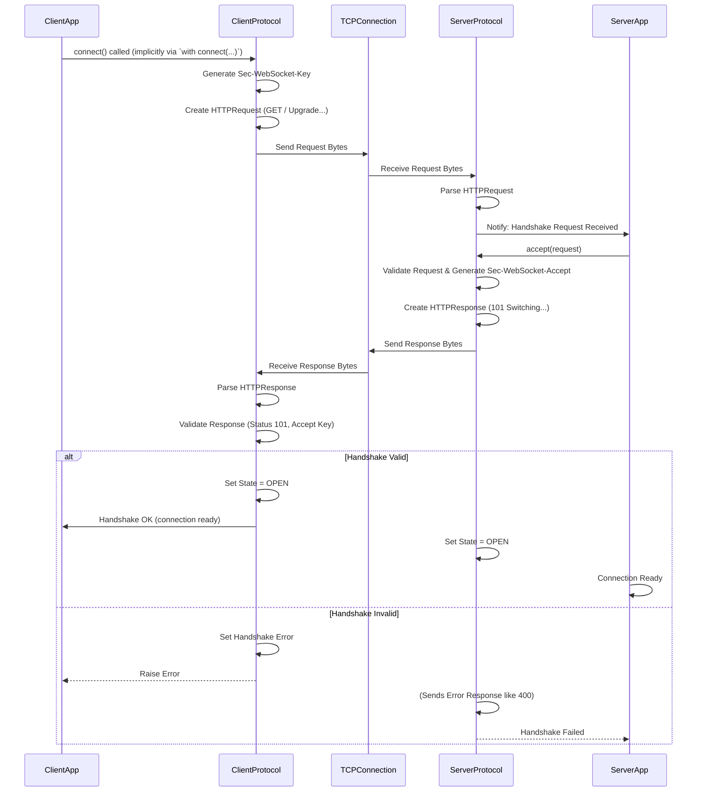

# Chapter 3: Protocol (Server/Client)

In [Chapter 1: Server (Sync)](01_server__sync__.md) and [Chapter 2: Client (Sync)](02_client__sync__.md), we successfully built a simple echo server and a client that could talk to it. We saw how the server accepted connections and the client initiated them. But *how* did they know how to talk "WebSocket"? How did the connection switch from a normal HTTP request to a persistent WebSocket connection? And how were messages sent back and forth reliably?

**What's the Problem?**

Imagine two people trying to have a conversation, but they speak different languages and have different cultural norms for greeting each other. They need a translator and a set of rules (etiquette) to understand each other and communicate effectively.

Similarly, when a client wants to establish a WebSocket connection with a server, they need to follow specific rules:

1.  **The Greeting (Handshake):** A special "hello" procedure to switch from the standard web protocol (HTTP) to the WebSocket protocol.
2.  **Packaging Messages (Framing):** A specific way to wrap messages so the other side knows where one message ends and the next begins, and what type of message it is (text, binary, control signal).
3.  **Keeping the Conversation Going (Pings/Pongs):** A way to check if the other side is still there, even if no messages are being sent.
4.  **Saying Goodbye (Closing Handshake):** A polite way to end the connection.

Managing all these rules and the state of the conversation (Are we greeting? Are we talking? Are we saying goodbye?) is the job of the **Protocol**.

**Our Goal: Understanding the Rule-Keeper**

In this chapter, we'll peek behind the scenes of the `Server` and `Client` we used before. We'll understand the role of the `Protocol` abstraction – the brain managing the WebSocket conversation rules.

**Analogy: The Translator and Rule-Keeper**

Think of the `Protocol` object like a dedicated translator and etiquette expert assigned to *each* specific phone call (connection):

*   **Translator:** It takes the raw bytes coming over the network ([TCPConnection](06_tcpconnection_.md)) and interprets them according to WebSocket rules, turning them into meaningful events (like "handshake request received" or "text message received"). It also takes the messages you want to send (like "Hello!") and packages them correctly (framing) into bytes to be sent over the network.
*   **Rule-Keeper:** It ensures both sides follow the WebSocket etiquette.
    *   Did the client perform the handshake correctly?
    *   Did the server respond correctly?
    *   If a "PING" message arrives (like asking "Are you still there?"), the protocol automatically prepares a "PONG" response ("Yes, I'm here!").
    *   It keeps track of the connection's current phase (connecting, open, closing, closed).

**Meet the `ServerProtocol` and `ClientProtocol`**

Because the client *initiates* the handshake and the server *responds* to it, their roles are slightly different, especially at the beginning. `mojo-websockets` provides two specialized protocol handlers:

1.  **`ServerProtocol`:** Used by the `Server` (Chapter 1). Its job is to:
    *   Listen for the client's initial HTTP Upgrade request.
    *   Validate the request headers (like `Upgrade: websocket`, `Sec-WebSocket-Key`).
    *   Generate the correct `Sec-WebSocket-Accept` response key.
    *   Send back the HTTP 101 "Switching Protocols" response.
    *   Parse incoming data frames sent *by the client* (which must be "masked" - a security feature).
    *   Send unmasked frames *to the client*.
    *   Respond to PINGs.

2.  **`ClientProtocol`:** Used by the `Client` (Chapter 2). Its job is to:
    *   Generate the initial HTTP Upgrade request with the necessary headers (including a random `Sec-WebSocket-Key`).
    *   Send the request to the server.
    *   Receive the server's HTTP 101 response.
    *   Validate the response headers (especially `Sec-WebSocket-Accept` to ensure the server understood the key).
    *   Parse incoming data frames sent *by the server* (which are unmasked).
    *   Send "masked" frames *to the server*.
    *   Respond to PINGs.

Both `ServerProtocol` and `ClientProtocol` are built upon a common foundation, defined by the `Protocol` trait (think of it like a blueprint or interface in other languages). This trait outlines the essential capabilities any WebSocket protocol handler must have, like managing state, processing incoming data, and preparing outgoing data.

```mojo
# File: src/websockets/protocol/__init__.mojo (Conceptual)

# Define constants for connection states
alias CONNECTING = 0
alias OPEN = 1
alias CLOSING = 2
alias CLOSED = 3

# Define constants for sides
alias SERVER = 0
alias CLIENT = 1

# Define the 'blueprint' for protocol handlers
trait Protocol:
    alias side: Int # Will be SERVER or CLIENT

    # --- State Management ---
    fn get_state(self) -> Int: ...
    fn set_state(mut self, state: Int): ...

    # --- Data Handling ---
    # Process incoming bytes
    fn receive_data(mut self, data: Bytes) raises: ... # Simplified view
    # Get events parsed from incoming data (e.g., Frame, HTTPRequest)
    fn events_received(mut self) -> List[Event]: ...
    # Prepare outgoing data (frames) to be sent
    fn data_to_send(mut self) -> Bytes: ...
    # Queue data to be sent (used internally by send_text etc.)
    fn write_data(mut self, data: Bytes) -> None: ...

    # --- Handshake Handling ---
    fn get_handshake_exc(self) -> Optional[Error]: ... # Check for handshake errors

    # --- Frame Handling ---
    fn get_parser_exc(self) -> Optional[Error]: ... # Check for frame parsing errors
    # ... other methods for managing fragmented messages, close codes etc. ...
```

This `Protocol` trait ensures that both the `ServerProtocol` and `ClientProtocol` offer a consistent way for the higher-level `Server` and `Client` abstractions to interact with them, even though their internal logic for handshakes and frame masking differs.

**How Does the Protocol Work? A Step-by-Step Look**

Let's revisit our echo example and see the protocol's role.

**1. The Handshake (Connecting)**

*   **Client Side (`ClientProtocol`)**:
    1.  When `connect()` is called (Chapter 2), it creates a `ClientProtocol`.
    2.  The protocol generates a unique `Sec-WebSocket-Key`.
    3.  It constructs an [HTTPRequest](04_httprequest___httpresponse_.md) object with headers like `Upgrade: websocket`, `Connection: Upgrade`, and the generated key.
    4.  It serializes this request into bytes using `protocol.send_request()` and `protocol.data_to_send()`.
    5.  These bytes are sent over the [TCPConnection](06_tcpconnection_.md).
    6.  The client waits for response bytes.
    7.  Received bytes are fed into `protocol.receive_data()`.
    8.  The protocol parses these bytes as an [HTTPResponse](04_httprequest___httpresponse_.md).
    9.  It validates the status code (must be 101) and the `Sec-WebSocket-Accept` header (must match the key it sent). `protocol.process_response()` does this.
    10. If valid, `protocol.set_state(OPEN)`. If not, `protocol.set_handshake_exc()` is set with an error.

*   **Server Side (`ServerProtocol`)**:
    1.  When the server accepts a [TCPConnection](06_tcpconnection_.md) (Chapter 1), it creates a `ServerProtocol`.
    2.  It waits for incoming bytes.
    3.  Received bytes (the client's request) are fed into `protocol.receive_data()`.
    4.  The protocol parses these bytes into an [HTTPRequest](04_httprequest___httpresponse_.md) object. `protocol.events_received()` would yield this request.
    5.  The server logic calls `protocol.accept(request)`.
    6.  `accept()` validates the request headers (`Upgrade`, `Connection`, `Sec-WebSocket-Key`, etc.).
    7.  If valid, it calculates the correct `Sec-WebSocket-Accept` value from the client's key.
    8.  It constructs an [HTTPResponse](04_httprequest___httpresponse_.md) with status 101 and the calculated accept key.
    9.  The server logic calls `protocol.send_response(response)`.
    10. The protocol serializes the response into bytes and provides them via `protocol.data_to_send()`.
    11. These bytes are sent over the [TCPConnection](06_tcpconnection_.md).
    12. `protocol.set_state(OPEN)`. If validation failed, a different response (e.g., 400 Bad Request) is sent, and the state doesn't become OPEN.

**2. Sending & Receiving Messages (Open State)**

*   **Sending (e.g., Client sends "Hello")**:
    1.  Application calls `client.send_text("Hello")`.
    2.  This calls the underlying `protocol.send_text(b"Hello")` (simplified).
    3.  The `ClientProtocol` creates a text [Frame](05_frame_.md) object containing "Hello".
    4.  It *masks* the frame's payload data (a security requirement for clients).
    5.  It serializes the complete masked frame into bytes (`frame.serialize(mask=True)`).
    6.  It queues these bytes using `protocol.write_data()`.
    7.  The `client` retrieves these bytes via `protocol.data_to_send()` and sends them over the [TCPConnection](06_tcpconnection_.md).

*   **Receiving (e.g., Server receives "Hello")**:
    1.  Bytes arrive on the server's [TCPConnection](06_tcpconnection_.md).
    2.  These bytes are fed into `server_protocol.receive_data(bytes)`.
    3.  The `ServerProtocol` uses its internal [StreamReader](07_streamreader_.md) to buffer the bytes.
    4.  It tries to parse a complete [Frame](05_frame_.md) from the buffered data (`Frame.parse(..., mask=True)`). Since it's a server, it expects and unmasks the payload.
    5.  Once a complete frame is parsed, the protocol processes it (`protocol.receive_frame()`).
        *   If it's a PING, it automatically queues a PONG frame via `protocol.write_data()`.
        *   If it's a data frame (Text/Binary), it queues a `Frame` event.
    6.  The server application calls `protocol.events_received()` and gets the `Frame("Hello")` event.
    7.  The application's handler (`on_message`) is called with the frame's data.

*   **Echoing Back (Server sends "Hello")**:
    1.  The server handler calls `conn.send_text("Hello")`.
    2.  This calls `server_protocol.send_text(b"Hello")`.
    3.  The `ServerProtocol` creates a text [Frame](05_frame_.md).
    4.  It serializes the frame *without* masking (`frame.serialize(mask=False)`).
    5.  Bytes are queued via `protocol.write_data()`.
    6.  The server retrieves bytes via `protocol.data_to_send()` and sends them.

*   **Receiving Echo (Client receives "Hello")**:
    1.  Bytes arrive on the client's [TCPConnection](06_tcpconnection_.md).
    2.  Bytes fed into `client_protocol.receive_data(bytes)`.
    3.  `ClientProtocol` parses a complete [Frame](05_frame_.md) (`Frame.parse(..., mask=False)`), expecting unmasked data from the server.
    4.  Protocol processes the frame (`protocol.receive_frame()`).
    5.  Protocol queues a `Frame("Hello")` event.
    6.  Application call to `client.recv_text()` retrieves this event via `protocol.events_received()` and returns the data "Hello".

**Visualizing the Handshake (Simplified)**



**Diving into the Code (Simplified Examples)**

Let's look at how the `ServerProtocol` handles accepting a connection.

```mojo
# Simplified from: src/websockets/protocol/server.mojo

from websockets.http import HTTPRequest, HTTPResponse, Headers, Header
from websockets.utils.handshake import ws_accept_key # Calculates accept key
# ... other imports ...

struct ServerProtocol(Protocol):
    # ... other fields ...

    # This function validates the client request and creates the response
    fn accept(mut self, request: HTTPRequest) raises -> HTTPResponse:
        try:
            # 1. Check essential headers exist
            if "Upgrade" not in request.headers:
                raise Error("Missing 'Upgrade' header")
            if "Connection" not in request.headers:
                raise Error("Missing 'Connection' header")
            if "Sec-WebSocket-Key" not in request.headers:
                raise Error("Missing 'Sec-WebSocket-Key' header")

            # 2. Check header values are correct
            if request.headers["upgrade"].lower() != "websocket":
                 raise Error("Upgrade header not 'websocket'")
            # ... other checks (Connection, Version) ...

            # 3. Get the client's key
            var client_key = request.headers["Sec-WebSocket-Key"]

            # 4. Calculate the server's response key
            var accept_key = ws_accept_key(client_key)

            # 5. Build the success response headers
            var headers = Headers(
                Header("Upgrade", "websocket"),
                Header("Connection", "Upgrade"),
                Header("Sec-WebSocket-Accept", accept_key),
                # ... other headers like Date ...
            )
            # 6. Return the 101 Switching Protocols response object
            return HTTPResponse(101, "Switching Protocols", headers, Bytes())

        except e:
            # If any check fails, prepare an error response (e.g., 400)
            self.set_handshake_exc(e) # Record the error
            body = String(e)
            return self.reject(400, "Bad Request", body) # reject() builds error response

    # This function takes the response (success or error) and prepares bytes
    fn send_response(mut self, response: HTTPResponse) raises -> None:
        # Convert the HTTPResponse object to bytes
        response_bytes = encode(response)
        self.write_data(response_bytes) # Queue bytes for sending

        if response.status_code == 101:
            # If successful handshake, change state to OPEN
            self.set_state(OPEN)
        else:
            # If handshake failed, ensure error is noted and prepare to close
            if self.handshake_exc is None:
                 self.set_handshake_exc(Error("Handshake failed"))
            send_eof(self) # Signal connection close
            discard(self) # Ignore further incoming data
```

And how the `ClientProtocol` initiates the handshake:

```mojo
# Simplified from: src/websockets/protocol/client.mojo

from websockets.http import HTTPRequest, Headers, Header, build_host_header
from websockets.utils.uri import URI
from base64 import b64encode
from websockets.utils.bytes import gen_token # Generates random bytes
# ... other imports ...

struct ClientProtocol(Protocol):
    var key: String # Stores the generated key
    var wsuri: URI # Stores the target URI
    # ... other fields ...

    # Generates the handshake request object
    fn connect(self) raises -> HTTPRequest:
        # Build basic headers
        host_header = build_host_header(self.wsuri.get_hostname(), ...)
        var headers = Headers(
            Header("Host", host_header),
            Header("Upgrade", "websocket"),
            Header("Connection", "Upgrade"),
            Header("Sec-WebSocket-Key", self.key), # Use the stored random key
            Header("Sec-WebSocket-Version", "13"),
            # ... maybe Origin, Authorization headers ...
        )
        # Return the HTTPRequest object (method is GET implicitly)
        return HTTPRequest(self.wsuri, headers=headers)

    # Called after receiving response bytes from the server
    fn process_response(mut self, response: HTTPResponse) raises -> None:
        # 1. Check status code
        if response.status_code != 101:
            raise Error("Server returned status {}".format(response.status_code))

        # 2. Check essential headers
        if "Upgrade" not in response.headers or response.headers["Upgrade"].lower() != "websocket":
             raise Error("Invalid Upgrade header in response")
        if "Connection" not in response.headers or response.headers["Connection"].lower() != "upgrade":
             raise Error("Invalid Connection header in response")

        # 3. Validate the Sec-WebSocket-Accept key
        if "Sec-WebSocket-Accept" not in response.headers:
             raise Error("Missing Sec-WebSocket-Accept header")

        server_accept_key = response.headers["Sec-WebSocket-Accept"]
        expected_accept_key = ws_accept_key(self.key) # Calculate expected key

        if server_accept_key != expected_accept_key:
             raise Error("Invalid Sec-WebSocket-Accept key")

        # 4. If all checks pass, connection is open!
        self.set_state(OPEN)
```

These snippets show how the `Protocol` implementations handle the specific rules of the WebSocket handshake for their respective sides (Client or Server), relying on helper functions for tasks like calculating keys (`ws_accept_key`) or encoding/decoding HTTP messages ([HTTPRequest](04_httprequest___httpresponse_.md) / [HTTPResponse](04_httprequest___httpresponse_.md)). They manage the internal `state` and record any `handshake_exc` if things go wrong. Similar logic exists within the protocol for parsing and generating data [Frames](05_frame_.md) once the connection is `OPEN`.

**Conclusion**

The `Protocol` (specifically `ServerProtocol` and `ClientProtocol`) is the engine that drives a WebSocket connection, acting as both a translator and a rule-keeper. It manages the crucial handshake process to switch from HTTP to WebSocket, handles the framing and parsing of messages according to strict rules, takes care of essential maintenance like PING/PONG, and tracks the overall connection state. While the `Server` and `Client` abstractions provide a user-friendly way to interact with WebSockets, the `Protocol` is doing the heavy lifting behind the scenes to ensure correct and reliable communication.

We've seen how the handshake involves exchanging specific [HTTPRequest](04_httprequest___httpresponse_.md) and [HTTPResponse](04_httprequest___httpresponse_.md) messages. In the next chapter, we'll take a closer look at these HTTP objects themselves.

Ready to examine the handshake messages? Let's move on to [Chapter 4: HTTPRequest / HTTPResponse](04_httprequest___httpresponse_.md).

---

Generated by [AI Codebase Knowledge Builder](https://github.com/The-Pocket/Tutorial-Codebase-Knowledge)