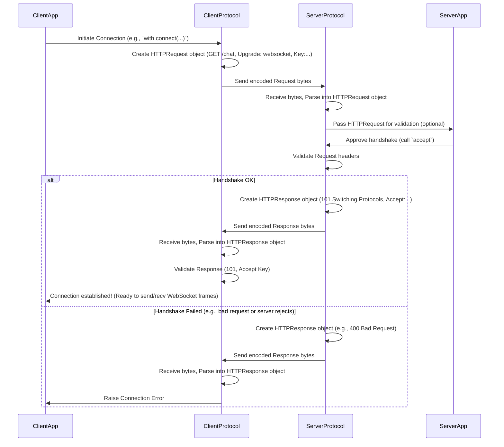

# Chapter 4: HTTPRequest / HTTPResponse

In the [previous chapter](03_protocol__server_client__.md), we learned about the `Protocol` layer, the rule-keeper for WebSocket conversations. We saw that the very first step in establishing a WebSocket connection is a special "handshake" procedure. But what does this handshake actually look like over the network?

**What's the Problem?**

WebSockets cleverly reuse the existing infrastructure of the web (ports 80 and 443). This means a WebSocket connection has to *start* like a normal web request (using HTTP) before it can "switch protocols" to the WebSocket format. How do we represent these initial HTTP messages?

Imagine you call a company's main phone line (HTTP) and ask to be transferred to a special direct line (WebSocket). You need a standard way to make that request ("Please transfer me to the WebSocket department!") and a standard way for them to reply ("Okay, switching you now!" or "Sorry, that department isn't available.").

That's where `HTTPRequest` and `HTTPResponse` come in. They define the structure for these initial "asking to switch" and "replying" messages used in the WebSocket handshake.

**Analogy: The Official Forms**

Think of `HTTPRequest` and `HTTPResponse` like standardized paper forms used *only* for the initial agreement to switch communication methods:

1.  **The Request Form (`HTTPRequest`):** The client fills out a specific form saying:
    *   "I want to talk to this address (`Host: server.example.com`)."
    *   "I'd like to upgrade to the 'websocket' protocol (`Upgrade: websocket`)."
    *   "Please keep this connection open for the upgrade (`Connection: Upgrade`)."
    *   "Here's a secret code to prove I'm initiating this (`Sec-WebSocket-Key: ...random string...`)."
    *   "I understand version 13 of the rules (`Sec-WebSocket-Version: 13`)."
    The client sends this form to the server.

2.  **The Response Form (`HTTPResponse`):** The server receives the client's form.
    *   It checks if it understands and agrees to the request.
    *   If yes, it fills out a response form saying:
        *   "Okay, Request Granted (Status: `101 Switching Protocols`)."
        *   "Yes, we are upgrading to 'websocket' (`Upgrade: websocket`)."
        *   "Yes, we'll keep this connection open (`Connection: Upgrade`)."
        *   "I've processed your secret code, here's the proof (`Sec-WebSocket-Accept: ...calculated string...`)."
    *   If no (e.g., something was wrong with the request), it sends back a different form like "Bad Request (Status: `400 Bad Request`)".
    The server sends its response form back to the client.

Only after the client receives the "101 Switching Protocols" response form is the connection officially switched to WebSocket.

**What are `HTTPRequest` and `HTTPResponse`?**

They are Mojo `struct`s (data structures) defined in the `websockets.http` module. They hold the different parts of a standard HTTP message:

*   **`HTTPRequest`:**
    *   `method`: The action requested (Always "GET" for WebSocket handshakes).
    *   `uri`: The target resource (e.g., `/chat`). Includes host, port, path.
    *   `protocol`: The HTTP version (usually "HTTP/1.1").
    *   `headers`: A collection of key-value pairs (like `Upgrade`, `Connection`, `Sec-WebSocket-Key`). This is where the special WebSocket instructions go.
    *   `body_raw`: The message content (usually empty for WebSocket handshake requests).

*   **`HTTPResponse`:**
    *   `status_code`: A number indicating the result (e.g., `101` for success, `400` for errors).
    *   `status_text`: A short description of the status code (e.g., "Switching Protocols", "Bad Request").
    *   `protocol`: The HTTP version (usually "HTTP/1.1").
    *   `headers`: Key-value pairs replying to the client (like `Upgrade`, `Connection`, `Sec-WebSocket-Accept`).
    *   `body_raw`: The message content (usually empty for a successful `101` response, might contain error details for others).

**How `mojo-websockets` Uses Them (Behind the Scenes)**

You, as a user of the `Server` or `Client` from Chapters 1 and 2, usually *don't* need to create or parse these `HTTPRequest`/`HTTPResponse` objects manually for WebSockets. The [Protocol (Server/Client)](03_protocol__server_client__.md) layer handles it for you:

*   **`ClientProtocol`:**
    1.  *Creates* an `HTTPRequest` object with all the necessary handshake headers (like `Upgrade: websocket`, `Sec-WebSocket-Key`).
    2.  Turns this object into bytes to send over the [TCPConnection](06_tcpconnection_.md).
    3.  Receives bytes back from the server.
    4.  *Parses* these bytes into an `HTTPResponse` object.
    5.  Checks the `status_code` (must be 101) and validates the `Sec-WebSocket-Accept` header.

*   **`ServerProtocol`:**
    1.  Receives bytes from the client.
    2.  *Parses* these bytes into an `HTTPRequest` object.
    3.  Validates the headers (`Upgrade`, `Connection`, `Sec-WebSocket-Key`, etc.).
    4.  If valid, *creates* an `HTTPResponse` object with `status_code = 101` and the calculated `Sec-WebSocket-Accept` header.
    5.  If invalid, creates an `HTTPResponse` with an error status code (e.g., 400).
    6.  Turns the response object into bytes to send back over the [TCPConnection](06_tcpconnection_.md).

**Example Handshake Messages (Conceptual)**

Let's imagine the data these structs might hold during a handshake:

*Client Sends (`HTTPRequest` generated by `ClientProtocol`):*

```http
GET /chat HTTP/1.1                  # method='GET', uri='/chat', protocol='HTTP/1.1'
Host: server.example.com:8001       # headers['Host']
Upgrade: websocket                 # headers['Upgrade']
Connection: Upgrade                # headers['Connection']
Sec-WebSocket-Key: dGhlIHNhbXBsZSBub25jZQ== # headers['Sec-WebSocket-Key']
Sec-WebSocket-Version: 13          # headers['Sec-WebSocket-Version']
Origin: http://client.example.com   # headers['Origin'] (optional)

# (Empty Body)
```

*Server Responds Successfully (`HTTPResponse` generated by `ServerProtocol`):*

```http
HTTP/1.1 101 Switching Protocols    # protocol='HTTP/1.1', status_code=101, status_text='...'
Upgrade: websocket                 # headers['Upgrade']
Connection: Upgrade                # headers['Connection']
Sec-WebSocket-Accept: s3pPLMBiTxaQ9kYGzzhZRbK+xOo= # headers['Sec-WebSocket-Accept'] (Calculated)
Date: Thu, 01 Jan 2024 00:00:00 GMT # headers['Date']

# (Empty Body)
```

**Under the Hood: The Handshake Flow**

The sequence diagram from Chapter 3 showed the `Protocol` managing the handshake. Let's refine it slightly to emphasize the `HTTPRequest` and `HTTPResponse` objects being created and parsed internally.



This shows that the `HTTPRequest` and `HTTPResponse` structs act as temporary containers for the handshake information, used by the `Protocol` implementations.

**A Peek at the Code (`src/websockets/http.mojo`)**

While you don't usually interact with them directly for WebSockets, here's a highly simplified view of what the structs might look like:

```mojo
# Simplified from src/websockets/http.mojo

from websockets.aliases import Bytes
from websockets.utils.uri import URI
from collections import Dict # Used by Headers

# Represents multiple HTTP headers
@value
struct Headers:
    var _inner: Dict[String, String]
    # ... methods to get/set headers (case-insensitive keys) ...
    fn __init__(...): ...
    fn __getitem__(self, key: String) raises -> String: ...
    fn __setitem__(mut self, key: String, value: String): ...
    # ...

# Represents an HTTP request message
@value
struct HTTPRequest:
    var headers: Headers # The collection of headers
    var uri: URI       # Target URI (path, host, etc.)
    var body_raw: Bytes # The message body (usually empty for WS)

    var method: String   # e.g., "GET"
    var protocol: String # e.g., "HTTP/1.1"

    fn __init__(...): ... # Constructor
    fn encode(owned self) -> Bytes: ... # Turns the object into bytes
    # ...

# Represents an HTTP response message
@value
struct HTTPResponse:
    var headers: Headers # The collection of headers
    var body_raw: Bytes # The message body (usually empty for 101)

    var status_code: Int    # e.g., 101 or 400
    var status_text: String # e.g., "Switching Protocols"
    var protocol: String    # e.g., "HTTP/1.1"

    fn __init__(...): ... # Constructor
    fn encode(owned self) -> Bytes: ... # Turns the object into bytes
    @staticmethod
    fn from_bytes(b: Span[Byte]) raises -> HTTPResponse: ... # Parses bytes
    # ...
```

Key takeaways:

*   They store the distinct parts of an HTTP message (method/status, URI, protocol version, headers, body).
*   The `Headers` struct manages the key-value header pairs.
*   They have methods like `encode()` to turn the structured data into raw bytes suitable for sending over a network connection, and static methods like `from_bytes()` (or internal parsers) to do the reverse. The [Protocol (Server/Client)](03_protocol__server_client__.md) uses these methods internally during the handshake.

**Conclusion**

`HTTPRequest` and `HTTPResponse` are fundamental building blocks for web communication, and they play a crucial, though often hidden, role in initiating a WebSocket connection. They define the format for the essential handshake messages exchanged between client and server to agree upon upgrading the connection from standard HTTP to the persistent, two-way WebSocket protocol. While `mojo-websockets` handles the creation and parsing of these messages for you during the handshake, understanding their structure helps clarify exactly how a WebSocket connection begins.

Now that the handshake is complete and the connection is *switched* to WebSocket, how are the actual real-time messages (like our chat messages) sent back and forth? They aren't `HTTPRequest`s or `HTTPResponse`s anymore. Instead, they use a different format called **Frames**.

Ready to learn about the structure of WebSocket messages themselves? Let's move on to [Chapter 5: Frame](05_frame_.md).

---

Generated by [AI Codebase Knowledge Builder](https://github.com/The-Pocket/Tutorial-Codebase-Knowledge)