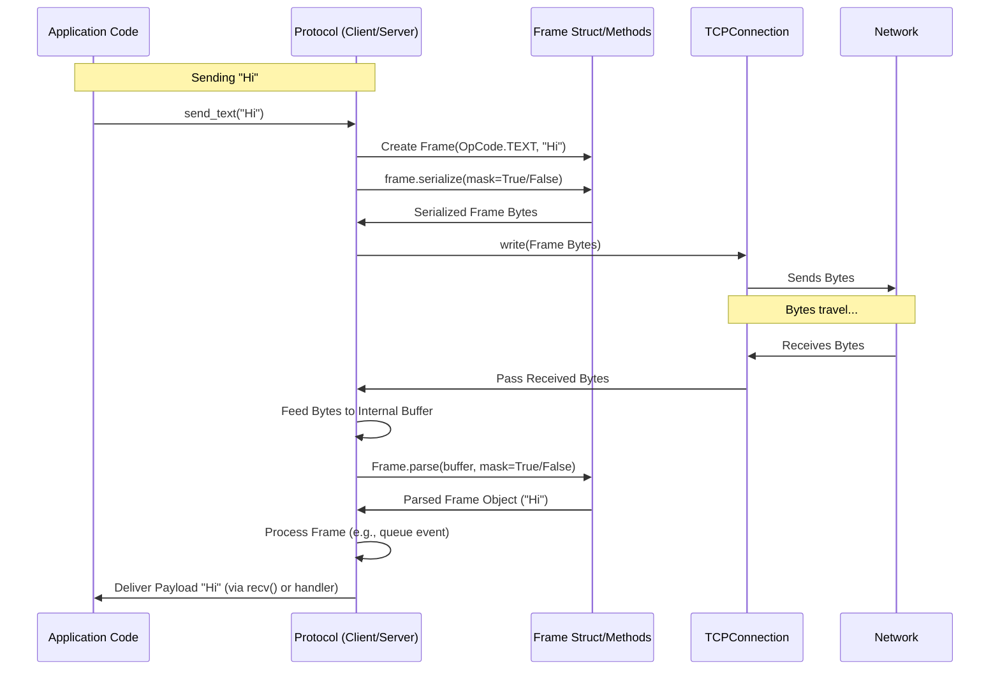

# Chapter 5: Frame

In [Chapter 4: HTTPRequest / HTTPResponse](04_httprequest___httpresponse_.md), we saw how the initial WebSocket connection is established using a special handshake that looks like standard HTTP messages. But once that handshake is successful and the connection is "upgraded" to WebSocket, how do the client and server actually exchange messages like chat text or game updates? They don't use `HTTPRequest` or `HTTPResponse` anymore. Instead, they use **Frames**.

**What's the Problem?**

Imagine you're sending a long letter through the postal service. You can't just dump a continuous stream of words onto the conveyor belt! You need to put your message into envelopes. These envelopes tell the postal service (and the recipient):

*   Where one message ends and the next begins.
*   What kind of message it is (a letter, a bill, a postcard).
*   Maybe some special instructions (like "Fragile" or "Final Part").

Similarly, WebSocket communication needs a way to package data. Sending raw, continuous bytes over the network would make it impossible to know where one message stops and another starts, or what type of data is being sent. How do we know if we received a complete chat message, or just the first half? How does the server tell the client "I'm closing the connection" versus sending actual application data?

This is where the `Frame` concept comes in. It defines the standard "envelope" for all WebSocket communication after the initial handshake.

**Analogy: The Special WebSocket Envelopes**

Think of a WebSocket `Frame` as a special, standardized envelope used for sending messages over an open WebSocket connection:

1.  **The Envelope Itself (`Frame` struct):** A defined structure that holds the message parts.
2.  **Instructions on the Envelope:**
    *   **Is this the last envelope for this message? (`FIN` bit):** A checkbox marked "Final" (`FIN=1`) or "More Coming" (`FIN=0`). This allows sending large messages in smaller chunks (fragmentation).
    *   **What type of content is inside? (`opcode`):** A label indicating the type, like "Text Message" (`TEXT`), "Binary Data" (`BINARY`), "Are you still there?" (`PING`), "Yes, I'm here!" (`PONG`), or "Let's hang up" (`CLOSE`).
    *   **Reserved Flags (`RSV1`, `RSV2`, `RSV3`):** Extra checkboxes for future extensions (usually unmarked).
    *   **(Client-to-Server Secret Code - `MASK` bit & `Masking Key`):** When the client sends an envelope to the server, it scrambles the content using a secret key included on the envelope. This is a security measure to prevent certain attacks. The server uses the key to unscramble it. Server-to-client envelopes aren't scrambled this way.
3.  **The Content Inside (`Payload Data`):** The actual message bytes (text, binary data, control information).

The `Frame` struct in `mojo-websockets` represents these envelopes. It defines how data is structured for sending and how received bytes are interpreted according to the WebSocket standard (RFC 6455).

**Key Parts of a Frame**

Let's look closer at the important labels on our WebSocket envelope:

*   **`FIN` (Final Fragment):** A single bit (0 or 1).
    *   `1` (True): This frame contains the complete message, or the very last piece of a fragmented message.
    *   `0` (False): This frame is part of a larger message, and more frames will follow.
*   **`Opcode` (Operation Code):** A small number telling the receiver what the frame represents. Common opcodes include:
    *   `0x01` (`TEXT`): The payload is UTF-8 encoded text data (like a chat message).
    *   `0x02` (`BINARY`): The payload is arbitrary binary data (like an image or game state).
    *   `0x08` (`CLOSE`): A request to close the connection. The payload might contain a status code and reason.
    *   `0x09` (`PING`): A "poke" to check if the other side is alive. The payload is arbitrary data that the receiver should send back in a PONG frame.
    *   `0x0A` (`PONG`): The response to a PING frame, usually containing the same payload as the PING it's responding to.
    *   `0x00` (`CONTINUATION`): This frame continues the data from the previous frame (used when `FIN=0`). Its payload is the same type (Text or Binary) as the initial frame of the fragmented message.
*   **`Payload Data`:** The actual content of the message. Its length is also encoded in the frame header.
*   **`Masking` (Client-to-Server only):**
    *   `MASK` bit: `1` if the payload is masked (client-to-server), `0` otherwise (server-to-client).
    *   `Masking Key`: A 4-byte random key used for masking/unmasking. Included only if `MASK=1`.

**How Frames Are Used (You Usually Don't Touch Them Directly!)**

The good news for beginners is that you typically *don't* need to manually create `Frame` objects or parse their bytes. The `mojo-websockets` library handles this complexity for you within the [Protocol (Server/Client)](03_protocol__server_client__.md) layer.

*   **When you send:**
    *   You call `client.send_text("Hello!")` or `conn.send_binary(image_bytes)`.
    *   The `Client` or `WSConnection` tells the associated `Protocol` object.
    *   The `Protocol` creates the appropriate `Frame` struct (e.g., `opcode=TEXT`, `fin=True`, `data=b"Hello!"`).
    *   The `Protocol` calls the `Frame`'s `serialize()` method, which turns the `Frame` object into the raw bytes needed for the network (including headers, length, opcode, and masking if needed).
    *   These bytes are queued up and eventually sent over the [TCPConnection](06_tcpconnection_.md).
*   **When you receive:**
    *   Raw bytes arrive on the [TCPConnection](06_tcpconnection_.md).
    *   These bytes are fed into the `Protocol` object's `receive_data()` method.
    *   The `Protocol` uses its internal buffer ([StreamReader](07_streamreader_.md)) and the static `Frame.parse()` method to read the incoming bytes.
    *   `Frame.parse()` decodes the frame header (FIN, opcode, length, mask), reads the payload, and unmasks it if necessary.
    *   It reconstructs a `Frame` object from the bytes.
    *   The `Protocol` processes this `Frame` object (e.g., automatically responding to PINGs, handling CLOSE frames, assembling fragmented messages).
    *   For data frames (`TEXT`, `BINARY`), the `Protocol` makes the payload data available.
    *   Your call to `client.recv_text()` or the server's handler getting called with `data` retrieves this payload.

**Under the Hood: Sending and Receiving a Frame**

Let's trace what happens when a client sends "Hi" and the server receives it.

1.  **Client App:** Calls `client.send_text("Hi")`.
2.  **Client Protocol:**
    *   Creates `Frame(opcode=OpCode.OP_TEXT, data=b"Hi", fin=True)`.
    *   Calls `frame.serialize(mask=True)`.
    *   Generates a 4-byte mask key (e.g., `\x1a\x2b\x3c\x4d`).
    *   Applies the mask to `b"Hi"` (e.g., `b"\x1a" ^ b"H"`, `b"\x2b" ^ b"i"`, ...).
    *   Constructs the byte sequence: `[Header Byte 1 (FIN=1, Opcode=1)] [Header Byte 2 (Mask=1, Len=2)] [Mask Key (4 bytes)] [Masked Payload (2 bytes)]`.
    *   Queues these bytes for sending.
3.  **Client TCPConnection:** Sends the bytes over the network.
4.  **Server TCPConnection:** Receives the bytes.
5.  **Server Protocol:**
    *   Feeds bytes into `receive_data()`.
    *   Calls `Frame.parse(..., mask=True)` on the internal buffer.
    *   `Frame.parse()` reads Header Byte 1: `FIN=1`, `Opcode=1`.
    *   Reads Header Byte 2: `Mask=1`, `Length=2`.
    *   Reads the 4-byte Mask Key.
    *   Reads the 2-byte masked Payload.
    *   Unmasks the payload using the key.
    *   Creates `Frame(opcode=OpCode.OP_TEXT, data=b"Hi", fin=True)`.
    *   Adds the `Frame` event to its received events queue.
6.  **Server App (Handler):** The server framework retrieves the `Frame` event and calls your `on_message(conn, data)` handler with `data=b"Hi"`.

**Visualizing the Flow (Simplified Frame Send/Receive)**



**A Peek at the Code (`src/websockets/frames.mojo`)**

Here's a simplified look at the `Frame` struct:

```mojo
# Simplified from src/websockets/frames.mojo

from websockets.aliases import Bytes

# Define constants for common opcodes
struct OpCode:
    alias OP_CONT = 0x00
    alias OP_TEXT = 0x01
    alias OP_BINARY = 0x02
    alias OP_CLOSE = 0x08
    alias OP_PING = 0x09
    alias OP_PONG = 0x0A
    # ...

# The Frame structure itself
@value
struct Frame:
    var opcode: Int     # Type of frame (e.g., OpCode.OP_TEXT)
    var data: Bytes    # The actual payload data
    var fin: Bool      # Is this the final frame? (True/False)
    # Reserved bits (usually False)
    var rsv1: Bool
    var rsv2: Bool
    var rsv3: Bool

    # Constructor to create a frame
    fn __init__(out self, opcode: Int, data: Bytes, fin: Bool = True):
        self.opcode = opcode
        self.data = data
        self.fin = fin
        self.rsv1 = False
        self.rsv2 = False
        self.rsv3 = False

    # Method to turn the Frame object into bytes for sending
    fn serialize(self, *, mask: Bool) raises -> Bytes:
        # 1. Check if frame is valid (e.g., control frames aren't fragmented)
        self.check()

        # 2. Build the first header byte (FIN, RSV bits, Opcode)
        head1 = (0b10000000 if self.fin else 0) | self.opcode # Simplified

        # 3. Build the second header byte (Mask bit, Payload Length)
        length = len(self.data)
        head2 = (0b10000000 if mask else 0)
        # ... logic to handle different length encodings (short, medium, long) ...
        # For simplicity, assume length < 126
        head2 |= length

        # 4. Prepare output buffer
        output = ByteWriter(...)
        output.write_bytes(pack["!BB"](head1, head2)) # Write first two bytes

        # 5. Add mask key and mask payload if needed
        payload_to_write = self.data
        if mask:
            mask_bytes = gen_mask() # Generate 4 random bytes
            output.write_bytes(mask_bytes)
            payload_to_write = apply_mask(self.data, mask_bytes) # XOR payload

        # 6. Write the (masked) payload
        output.write_bytes(payload_to_write)

        return output.consume() # Return the final bytes

    # Static method to parse bytes from a stream into a Frame object
    @staticmethod
    fn parse[T: Streamable](
        stream_ptr: UnsafePointer[T], *, mask: Bool
    ) raises -> Optional[Frame]:

        # 1. Read first two header bytes
        header_bytes = stream_ptr[].read_exact(2)? # Reads 2 bytes or returns None
        head1, head2 = unpack("!BB", header_bytes)

        # 2. Decode FIN, RSV, Opcode from head1
        fin = (head1 & 0b10000000) != 0
        opcode = Int(head1 & 0b00001111)
        # ... check RSV bits are 0 ...

        # 3. Decode Mask bit and Payload Length from head2
        is_masked = (head2 & 0b10000000) != 0
        if is_masked != mask: raise Error("Incorrect masking") # Server expects mask, Client expects none
        length = head2 & 0b01111111
        # ... logic to read longer length fields if length is 126 or 127 ...

        # 4. Read mask key (if masked)
        mask_key: Bytes = Bytes()
        if is_masked:
            mask_key = stream_ptr[].read_exact(4)?

        # 5. Read payload data
        payload_bytes = stream_ptr[].read_exact(length)?

        # 6. Unmask payload data (if masked)
        if is_masked:
            payload_bytes = apply_mask(payload_bytes, mask_key)

        # 7. Create and return the Frame object
        frame = Frame(opcode, payload_bytes, fin)
        frame.check() # Final validation
        return frame

# Helper function to XOR data with mask
fn apply_mask(data: Bytes, mask: Bytes) raises -> Bytes:
    # ... implementation using XOR ...
    return masked_data
```

This simplified code illustrates:

*   The `Frame` struct holds the core information (`fin`, `opcode`, `data`).
*   `serialize()` packs this information into bytes according to the WebSocket standard, handling masking if required (client-side).
*   `parse()` reads bytes from an input stream ([StreamReader](07_streamreader_.md)), unpacks the header information, reads the payload, unmasks it if required (server-side), and reconstructs the `Frame` object.

**Conclusion**

Frames are the fundamental unit of communication in an active WebSocket connection. They act like special envelopes, packaging data with crucial metadata: whether it's the final piece (`FIN`), what type of data it is (`opcode` - Text, Binary, Ping, Pong, Close), and the data itself (`Payload`). While you typically interact with higher-level methods like `send_text()` and `recv_text()`, understanding frames helps clarify how WebSocket messages are structured and processed "under the hood" by the [Protocol (Server/Client)](03_protocol__server_client__.md). These frames are ultimately transmitted over the network using a basic transport mechanism.

How are these frame bytes actually sent and received over the internet? That's the job of the underlying network connection. Let's explore that next.

Ready to dive into the network layer? Let's move on to [Chapter 6: TCPConnection](06_tcpconnection_.md).

---

Generated by [AI Codebase Knowledge Builder](https://github.com/The-Pocket/Tutorial-Codebase-Knowledge)