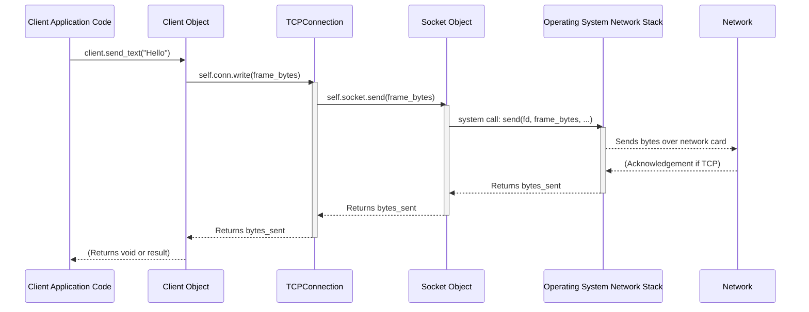

# Chapter 6: TCPConnection

In the [previous chapter on Frames](05_frame_.md), we learned how WebSocket messages are packaged into standardized "envelopes" called Frames after the initial handshake. But how do these frames, or even the initial [HTTPRequest / HTTPResponse](04_httprequest___httpresponse_.md) handshake messages, actually travel across the internet between the client and the server? They need a reliable pathway.

**What's the Problem?**

Imagine you want to have a phone call. You can't just start talking into the air and hope the other person hears you! First, you need to dial their number, they need to pick up, and a connection needs to be established. Only *then* can you start speaking and listening over that open line.

Similarly, before a WebSocket client and server can exchange handshake messages or data frames, they need a stable, established network connection between them. This connection needs to provide a way to reliably send streams of bytes in both directions. How do we represent this established "open phone line" in our code?

That's the role of the `TCPConnection`!

**Our Goal: Understanding the Network Pipe**

In this chapter, we'll understand the `TCPConnection` abstraction. It represents the actual, active network connection – the digital equivalent of the open phone line after the call has been successfully connected. It's the fundamental pipe through which all communication flows.

**Analogy: The Open Phone Line**

Think about these steps in making a phone call:

1.  **Dialing:** The [Client (Sync)](02_client__sync__.md) initiates the connection attempt.
2.  **Ringing & Answering:** The [Server (Sync)](01_server__sync__.md)'s internal `TCPListener` waits for and accepts incoming calls.
3.  **The Established Connection:** Once the call connects, you have an open line. This is the `TCPConnection`. You can now speak (send data) and listen (receive data) over this line.

The `TCPConnection` object in `mojo-websockets` represents this established connection. It's built on top of a lower-level concept called a `Socket` (which directly talks to the operating system's network features), but `TCPConnection` provides a simpler interface focused on the established connection.

**What is `TCPConnection`?**

*   **Represents an Active Connection:** It's not about listening for connections or initiating them; it's about the connection *after* it's been made.
*   **Built on `Socket`:** It wraps the lower-level `Socket` object, hiding some complexities.
*   **Provides Simple I/O:** Its main job is to give you easy ways to send (`write()`) and receive (`read()`) streams of bytes over the established network path.
*   **Used by Server and Client:**
    *   When a `Server` accepts a new client connection using its internal `TCPListener`, the listener returns a `TCPConnection` representing that specific client's connection. The `Server` then uses this `TCPConnection` to read the handshake request and subsequent frames from that client, and to write the handshake response and outgoing frames back to them.
    *   When a `Client` successfully connects to a server (inside the `connect()` function or `with` block), it creates and uses a `TCPConnection` internally to send the handshake request and frames, and to read the server's response and incoming frames.

**How `TCPConnection` is Used (Behind the Scenes)**

You, as a user of the high-level `Server` and `Client`, usually won't create or directly manage `TCPConnection` objects yourself. However, they are working constantly behind the scenes.

*   **Server Side:** Remember the `serve_connection` method from Chapter 1's "Under the Hood"?
    ```mojo
    # Simplified view inside Server.serve_connection() from Chapter 1
    fn serve_connection(mut self, mut conn: TCPConnection) raises -> None:
        # 'conn' IS the TCPConnection for this specific client!
        protocol = ServerProtocol()
        wsconn = WSConnection(conn, protocol) # WSConnection wraps the TCPConnection

        while True:
            var b = Bytes(capacity=DEFAULT_BUFFER_SIZE)
            try:
                # This implicitly calls conn.read(b) via wsconn.read()
                _ = wsconn.read(b)
            # ... handle errors, feed data to protocol ...
            # ... protocol.send_response() / handler calls conn.send_text() ...
            # ... these eventually call conn.write(...) ...
    ```
    The `conn: TCPConnection` passed into this function *is* the established connection to one specific client. All reading and writing for that client happen through this object (often wrapped by `WSConnection`).

*   **Client Side:** Remember the `Client.__enter__` method from Chapter 2's "Under the Hood"?
    ```mojo
    # Simplified from Client.__enter__ in src/websockets/sync/client.mojo (Chapter 2)
    fn __enter__(mut self) raises -> Self:
        # self.conn is a TCPConnection
        # 1. Establish the connection:
        self.conn.connect(self.uri.get_hostname(), self.uri.get_port())

        # ... Prepare handshake request (HTTPRequest) ...
        # 3. Send Handshake Request using the connection:
        data_to_send = self.protocol.data_to_send()
        _ = self.conn.write(data_to_send) # <-- Writing via TCPConnection

        # 4. Read Handshake Response using the connection:
        response_bytes = Bytes(capacity=DEFAULT_BUFFER_SIZE)
        bytes_received = self.conn.read(response_bytes) # <-- Reading via TCPConnection
        # ... Process response ...
        return self
    ```
    The `Client` struct holds a `TCPConnection` (`self.conn`). It uses `self.conn.connect()` to establish the connection, then `self.conn.write()` to send the handshake, and `self.conn.read()` to receive the response. Later calls like `client.send_text()` and `client.recv_text()` also use this same `self.conn` internally.

**Key `TCPConnection` Methods**

The `TCPConnection` provides a few core methods for interacting with the network connection:

1.  **`write(buf: Span[Byte]) raises -> Int`**:
    *   **What it does:** Takes a sequence of bytes (`buf`) and attempts to send them over the network to the connected peer.
    *   **Analogy:** Speaking into the open phone line.
    *   **Returns:** The number of bytes successfully sent (it might be less than the total if the network buffer is full, though often it sends all).
    *   **Used for:** Sending serialized [HTTPRequest](04_httprequest___httpresponse_.md)/[HTTPResponse](04_httprequest___httpresponse_.md) messages during the handshake, and sending serialized WebSocket [Frames](05_frame_.md) afterwards.

2.  **`read(mut buf: Bytes) raises -> Int`**:
    *   **What it does:** Waits for data to arrive from the connected peer and reads it into the provided `buf` (a mutable `Bytes` object). It will read *up to* the capacity of the buffer.
    *   **Analogy:** Listening for the other person to speak on the phone line.
    *   **Returns:** The number of bytes actually read into the buffer. This could be 0 if the other side closed the connection gracefully.
    *   **Used for:** Reading the incoming handshake messages and subsequent WebSocket frames.

3.  **`teardown(mut self) raises`**:
    *   **What it does:** Closes the connection properly. This involves potentially shutting down the underlying socket gracefully (telling the OS you're done sending/receiving) and then closing the socket resource itself.
    *   **Analogy:** Hanging up the phone politely.
    *   **Used by:** The `Server` when a client disconnects or an error occurs, and by the `Client` when its `with` block finishes (in the `__exit__` method).

**Under the Hood: `TCPConnection` and `Socket`**

The `TCPConnection` itself doesn't perform the raw network operations directly. It acts as a manager and convenient wrapper around an even lower-level object: the `Socket`.

1.  **`TCPConnection` holds a `Socket`:** Inside the `TCPConnection` struct, there's a field usually called `socket` which is an instance of the `Socket` struct.
2.  **`Socket` talks to the OS:** The `Socket` struct (often defined in `src/websockets/socket.mojo`) contains the actual *file descriptor* (a number the operating system uses to identify the connection) and methods that make direct calls to the operating system's networking functions (like `send()`, `recv()`, `connect()`, `bind()`, `listen()`, `close()` from the standard C library or OS equivalents).
3.  **Delegation:** When you call `tcp_connection.read()`, it typically calls `self.socket.receive()`. When you call `tcp_connection.write()`, it calls `self.socket.send()`. When you call `tcp_connection.teardown()`, it calls `self.socket.shutdown()` and/or `self.socket.close()`.

This layering allows `TCPConnection` to provide a cleaner interface focused on an *established* stream connection, while `Socket` handles the nitty-gritty details of OS interaction.

**Visualizing the Interaction**

Here's how the layers interact when, for example, the Client sends data:


The `TCPConnection` acts as a bridge between the application logic (via `Client` or `Server`) and the low-level `Socket` operations.

**A Peek at the Code (`src/websockets/net.mojo`)**

Let's look at a simplified structure of `TCPConnection`:

```mojo
# Simplified from src/websockets/net.mojo

from websockets.socket import Socket # The lower-level socket
from websockets.net import TCPAddr  # Represents IP/Port address
from websockets.aliases import Bytes
from memory import Span

# The TCPConnection structure
struct TCPConnection:
    # Holds the underlying Socket object
    var socket: Socket[TCPAddr]

    # Constructor (often gets a socket from listener.accept() or creates a new one for client)
    fn __init__(out self, owned socket: Socket[TCPAddr]):
        self.socket = socket^

    # Method to establish connection (used by Client)
    fn connect(mut self, host: String, port: Int) raises:
        # Delegates to the socket's connect method
        self.socket.connect(host, port)

    # Method to read data
    fn read(self, mut buf: Bytes) raises -> Int:
        try:
            # Delegates to the socket's receive method
            bytes_read = self.socket.receive(buf)
            return bytes_read
        except e:
            # Handle potential errors like connection closed (EOF)
            logger.error("TCPConnection.read failed:", e)
            raise e

    # Method to write data
    fn write(self, buf: Span[Byte]) raises -> Int:
        try:
            # Delegates to the socket's send method
            bytes_sent = self.socket.send(buf)
            return bytes_sent
        except e:
            logger.error("TCPConnection.write failed:", e)
            raise e

    # Method to close the connection
    fn teardown(mut self) raises:
        # Delegates to the socket's teardown method
        # (which might call socket.shutdown() then socket.close())
        self.socket.teardown()

    # Helper to check if closed
    fn is_closed(self) -> Bool:
        return self.socket._closed # Accesses internal state of the Socket

    # ... methods to get local/remote address (delegates to socket) ...
```

This shows how `TCPConnection` primarily acts as a manager for a `Socket` object, providing the essential `read`, `write`, and `teardown` operations for an established connection by calling the corresponding methods on its internal `socket`.

**Conclusion**

The `TCPConnection` is a vital abstraction in `mojo-websockets`. It represents the established, active network communication channel between a client and server – the open phone line. While often used indirectly through the `Server` and `Client` objects, it provides the fundamental `read()` and `write()` methods necessary to send and receive byte streams (containing handshake messages or WebSocket frames) over the network. It achieves this by managing and simplifying interactions with the lower-level `Socket` object, which handles the direct communication with the operating system's networking capabilities.

Now that we know how bytes are sent and received over the `TCPConnection`, how does the library efficiently process the incoming stream of bytes, especially when trying to parse structured data like WebSocket [Frames](05_frame_.md) that might arrive in pieces? That's where the `StreamReader` comes in handy.

Ready to see how incoming data is buffered and parsed? Let's move on to [Chapter 7: StreamReader](07_streamreader_.md).

---

Generated by [AI Codebase Knowledge Builder](https://github.com/The-Pocket/Tutorial-Codebase-Knowledge)