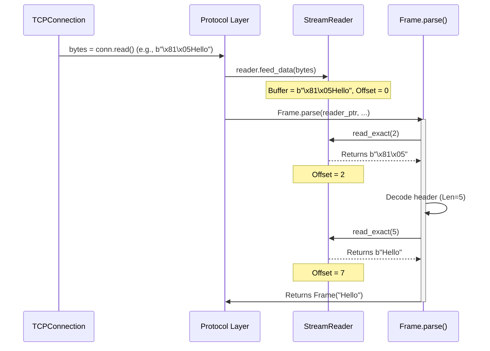

# Chapter 7: StreamReader

In the [previous chapter](06_tcpconnection_.md), we saw how the `TCPConnection` provides the fundamental "pipe" for sending and receiving raw streams of bytes over the network. But network data often arrives like a continuous flow of characters on a ticker tape, not in neat, pre-packaged messages.

**What's the Problem?**

Imagine you receive a long message over the phone, but the person speaks without pauses. To understand it, you need to figure out where sentences end, or maybe you only need the first 10 words. Reading directly from the raw network stream ([TCPConnection](06_tcpconnection_.md)) is like trying to understand that continuous speech:

*   You might read too much data, getting part of the *next* message accidentally.
*   You might read too little, not having the full message part you need yet (like only half a WebSocket frame header).
*   You might have to wait inefficiently for *exactly* the right number of bytes.

We need a more efficient way to handle this incoming stream, allowing us to read just what we need, when we need it, without getting stuck or making mistakes. For example, during the WebSocket handshake, the server needs to read the client's request line-by-line until it finds a blank line. Then, for WebSocket frames, it needs to read a fixed number of header bytes, figure out the payload length from the header, and then read *exactly* that many payload bytes. How can we do this reliably with a raw stream?

**Our Goal: The Efficient Mail Sorter**

This is where the `StreamReader` comes in! It acts like an efficient mail sorter for the raw byte stream arriving over the network connection.

**Analogy: The Mail Sorter**

Think of the bytes arriving from the [TCPConnection](06_tcpconnection_.md) as a continuous flood of letters pouring into a mail room. The `StreamReader` is like a helpful sorter sitting next to the mail chute:

1.  **Collecting Mail (`feed_data`):** As letters (bytes) arrive, the sorter puts them into a temporary holding bin (an internal buffer).
2.  **Sorting & Retrieving (`read_exact`, `read_line`):** You can ask the sorter for specific mail:
    *   "Give me *exactly* the next 5 letters" (`read_exact(5)`). The sorter checks the bin. If 5 letters are there, they give them to you. If not, they say "Not enough letters yet, check back later" (`None`).
    *   "Give me all letters up to the end of the current sentence (marked by a period '.')" (`read_line()` - using newline `\n` as the marker). The sorter scans the bin for a period. If found, they give you all letters up to and including the period. If not found yet, they say "No complete sentence yet, check back later" (`None`).
3.  **Knowing When the Mail Stops (`feed_eof`, `at_eof`):** The sorter also knows when the mail delivery for the day has completely finished (`feed_eof`). If you ask for letters after that, and there aren't enough in the bin, the sorter knows no more are coming and can tell you definitively ("End of mail, couldn't find what you asked for" - `EOFError`).

The `StreamReader` buffers incoming data and provides convenient methods to read structured pieces from that buffer without the hassle of handling partial reads directly from the network.

**How Does `StreamReader` Work?**

1.  **Initialization:** A `StreamReader` starts with an empty internal buffer (`buffer: Bytes`) and a read position marker (`offset: Int`, initially 0).
2.  **Feeding Data:** When bytes arrive from the [TCPConnection](06_tcpconnection_.md) (e.g., inside the `Protocol`'s `receive_data` method), they are added to the *end* of the `StreamReader`'s buffer using `reader.feed_data(new_bytes)`.
3.  **Reading Data:** When code needs to parse the data (e.g., `Frame.parse()` needs the frame header), it calls methods on the `StreamReader`:
    *   `reader.read_exact(n)`: Checks if there are at least `n` bytes in the buffer *after* the current `offset`.
        *   If yes: It returns those `n` bytes and moves the `offset` forward by `n`.
        *   If no (but `eof` is false): It returns `None`, indicating more data might arrive later.
        *   If no (and `eof` is true): It raises an `EOFError` because the required data will never arrive.
    *   `reader.read_line(m)`: Scans the buffer *after* the current `offset` for a newline character (`\n`), up to a maximum of `m` bytes.
        *   If found: It returns all bytes from the `offset` up to and including the `\n`, and moves the `offset` past the `\n`.
        *   If not found (but `eof` is false): It returns `None`.
        *   If not found (and `eof` is true): It raises an `EOFError`.
4.  **End of Stream:** When the [TCPConnection](06_tcpconnection_.md) is closed by the other side, the code signals this to the `StreamReader` using `reader.feed_eof()`. This sets an internal `eof` flag to `True`.

**How `mojo-websockets` Uses `StreamReader` (Behind the Scenes)**

You typically don't use `StreamReader` directly when using the high-level `Server` or `Client`. It's used internally by the [Protocol (Server/Client)](03_protocol__server_client__.md) implementations (`ServerProtocol`, `ClientProtocol`).

*   Each `ServerProtocol` or `ClientProtocol` instance contains its own `StreamReader` (`self.reader`).
*   When the `Server` or `Client` reads bytes from the [TCPConnection](06_tcpconnection_.md) (`conn.read(...)`), it passes these bytes to the protocol using `protocol.receive_data(bytes)`.
*   Inside `protocol.receive_data()`, these bytes are simply added to the internal buffer using `self.reader.feed_data(bytes)`.
*   When the protocol needs to parse something (like an HTTP header line during the handshake, or a WebSocket [Frame](05_frame_.md) header), the parsing logic (e.g., `HTTPRequest.from_bytes` or `Frame.parse`) interacts with `self.reader` using methods like `read_line()` or `read_exact()`.

This buffering strategy decouples the reading of raw bytes from the network from the parsing of logical messages.

**Key `StreamReader` Methods**

Let's look at the most important methods from `src/websockets/streams.mojo`:

1.  **`feed_data(mut self, data: Bytes) raises -> None`**:
    *   Adds the provided `data` to the end of the internal buffer.
    *   Think: The mail sorter putting newly arrived letters into the bin.
    ```mojo
    # Example Usage (inside Protocol layer usually)
    var reader = StreamReader()
    var chunk1 = b"Hello\nWo"
    reader.feed_data(chunk1) # Buffer now contains "Hello\nWo"
    var chunk2 = b"rld\n"
    reader.feed_data(chunk2) # Buffer now contains "Hello\nWorld\n"
    ```

2.  **`read_exact(mut self, n: Int) raises -> Optional[Bytes]`**:
    *   Tries to read exactly `n` bytes from the current position (`offset`) in the buffer.
    *   Returns `Optional[Bytes]`:
        *   `Bytes` containing the `n` bytes if successful (and advances `offset`).
        *   `None` if fewer than `n` bytes are currently available *after* `offset` (and the stream hasn't ended).
    *   Raises `EOFError` if the stream has ended (`eof == True`) and fewer than `n` bytes remain.
    *   Think: Asking the sorter for exactly 5 letters.
    ```mojo
    var reader = StreamReader()
    reader.feed_data(b"FrameHeaderPayload")

    # Try to read 11 bytes for the header
    header = reader.read_exact(11)? # Use ? for optional unwrap
    print(String(header)) # Output: FrameHeader

    # Try to read 7 bytes for the payload
    payload = reader.read_exact(7)?
    print(String(payload)) # Output: Payload

    # Try to read 1 more byte - not enough data yet
    extra = reader.read_exact(1)
    if not extra:
        print("Not enough data yet for 'extra'") # Output: Not enough data yet for 'extra'

    # Now signal end of stream
    reader.feed_eof()
    # Try reading again - now it's an error
    try:
        extra = reader.read_exact(1)
    except e:
        print(e) # Output: EOFError: stream ends after 0 bytes, expected 1 bytes
    ```
    *Explanation:* We successfully read the header and payload. When we try to read more, `read_exact` returns `None` initially. After `feed_eof`, trying again raises an `EOFError` because no more data will ever arrive.*

3.  **`read_line(mut self, m: Int) raises -> Optional[Bytes]`**:
    *   Tries to read bytes from the current `offset` until a newline character (`\n`) is found, up to a maximum of `m` bytes (safety limit).
    *   Returns `Optional[Bytes]`:
        *   `Bytes` containing the line (including `\n`) if successful (and advances `offset`).
        *   `None` if no `\n` is found within the available buffered data (and the stream hasn't ended).
    *   Raises `EOFError` if the stream ends before finding `\n`. Raises `RuntimeError` if the line exceeds `m` bytes.
    *   Think: Asking the sorter for the next sentence ending with a period.
    ```mojo
    var reader = StreamReader()
    reader.feed_data(b"GET / HTTP/1.1\r\nHost:") # Note: HTTP uses \r\n

    # Read the first line (request line), max 100 bytes
    # We'll pretend \n is the only delimiter for simplicity here
    request_line = reader.read_line(100)? # Note: Real HTTP parsing handles \r\n
    print(String(request_line)) # Output: GET / HTTP/1.1\n (if \n was present)

    # Try to read the next line (Host header) - only "Host:" is buffered
    host_line = reader.read_line(100)
    if not host_line:
        print("Incomplete Host line") # Output: Incomplete Host line

    reader.feed_data(b" example.com\r\n\r\n") # Feed rest of Host line and blank line

    host_line = reader.read_line(100)?
    print(String(host_line)) # Output: Host: example.com\n (if \n was present)

    blank_line = reader.read_line(100)?
    print(len(blank_line)) # Output: 1 (or 2 if \r\n considered) - the blank line
    ```
    *Explanation:* We read the request line. The Host line isn't complete initially, so `read_line` returns `None`. After feeding more data, we successfully read the Host line and the blank line marking the end of HTTP headers.*

**Under the Hood: Buffering and Parsing**

Let's visualize how the `Protocol` uses `StreamReader` to parse an incoming WebSocket frame.

1.  **Data Arrival:** `TCPConnection` receives bytes (e.g., `b"\x81\x05Hello"`, a complete text frame "Hello").
2.  **Feeding the Reader:** `protocol.receive_data(b"\x81\x05Hello")` calls `reader.feed_data(b"\x81\x05Hello")`. The reader's buffer now holds these bytes.
3.  **Parsing Begins:** The protocol logic calls `Frame.parse(reader_ptr, mask=...)`.
4.  **Reading Header:** `Frame.parse` needs the first 2 header bytes. It calls `reader.read_exact(2)`. The reader returns `b"\x81\x05"` and advances its internal `offset` to 2.
5.  **Decoding Header:** `Frame.parse` decodes `b"\x81\x05"`: FIN=1, Opcode=1 (TEXT), Mask=0, Length=5.
6.  **Reading Payload:** `Frame.parse` now knows it needs 5 payload bytes. It calls `reader.read_exact(5)`. The reader returns `b"Hello"` and advances its `offset` to 7 (2 + 5).
7.  **Parsing Complete:** `Frame.parse` creates the `Frame` object and returns it. The `StreamReader`'s buffer still technically holds `b"\x81\x05Hello"`, but the `offset` indicates all of it has been consumed. Future `feed_data` calls will append, and future reads will start from offset 7. (Internal buffer cleanup might happen later).



**A Peek at the Code (`src/websockets/streams.mojo`)**

Here's a highly simplified view of the `StreamReader` struct and two methods:

```mojo
# Simplified from src/websockets/streams.mojo

from collections import Optional
from websockets.aliases import Bytes, DEFAULT_BUFFER_SIZE

struct StreamReader:
    """Stream reader."""
    var buffer: Bytes # The internal data buffer
    var eof: Bool      # Has the end of the stream been signalled?
    var offset: Int    # Current reading position within the buffer

    fn __init__(out self):
        self.buffer = Bytes(capacity=DEFAULT_BUFFER_SIZE)
        self.offset = 0
        self.eof = False

    fn feed_data(mut self, data: Bytes) raises -> None:
        """Add data to the buffer."""
        if self.eof:
            raise Error("EOFError: stream ended")
        # In reality, might need to handle buffer resizing or compaction
        self.buffer += data

    fn read_exact(mut self, n: Int) raises -> Optional[Bytes]:
        """Read exactly n bytes if available."""
        remaining_in_buffer = len(self.buffer) - self.offset
        if remaining_in_buffer < n:
            # Not enough bytes currently in buffer
            if self.eof:
                # And no more will ever arrive
                raise Error(
                    "EOFError: stream ends after {} bytes, expected {} bytes"
                    .format(remaining_in_buffer, n)
                )
            else:
                # Might arrive later
                return None

        # Enough bytes are available!
        start = self.offset
        end = self.offset + n
        result = self.buffer[start : end] # Get the slice of bytes
        self.offset = end # Advance the read position
        return result

    # read_line() is more complex, involving searching for EOL (\n)
    # ... other methods like read_line, at_eof, feed_eof ...
```
This shows the core components: the `buffer` to hold data, the `offset` to track reading progress, and the logic in `read_exact` to check available data against the request before returning bytes or indicating `None` or `EOFError`.

**Conclusion**

The `StreamReader` is a crucial internal helper in `mojo-websockets`. It efficiently buffers incoming data from the raw network stream ([TCPConnection](06_tcpconnection_.md)) and provides convenient methods (`read_exact`, `read_line`) for the [Protocol (Server/Client)](03_protocol__server_client__.md) layer to parse structured messages like HTTP requests/responses and WebSocket [Frames](05_frame_.md) without needing to worry about partial network reads. By acting as an intelligent "mail sorter", it simplifies the process of consuming data from the network reliably.

This chapter concludes our tour of the main abstractions in `mojo-websockets`! We've seen how to set up a [Server (Sync)](01_server__sync__.md) and [Client (Sync)](02_client__sync__.md), how the [Protocol (Server/Client)](03_protocol__server_client__.md) manages the WebSocket rules using [HTTPRequest / HTTPResponse](04_httprequest___httpresponse_.md) for the handshake and [Frames](05_frame_.md) for messages, how data travels over the [TCPConnection](06_tcpconnection_.md), and finally, how the `StreamReader` helps parse the incoming byte stream. You now have a solid foundation for understanding how `mojo-websockets` works!

---

Generated by [AI Codebase Knowledge Builder](https://github.com/The-Pocket/Tutorial-Codebase-Knowledge)