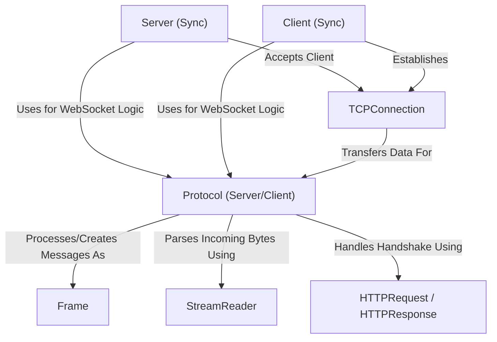

# Tutorial: mojo-websockets

`mojo-websockets` is a library for Mojo 🔥 that lets your applications perform **real-time**, *two-way communication* over the web.
Think of things like live chat, notifications, or real-time game updates.
It provides tools to build both **WebSocket servers** (that listen for connections) and **WebSocket clients** (that connect to servers), handling the complex *WebSocket protocol* rules for you.

**Source Repository:** [https://github.com/msaelices/mojo-websockets.git](https://github.com/msaelices/mojo-websockets.git)

## Chapters

1. [Server (Sync)
](01_server__sync__.md)
2. [Client (Sync)
](02_client__sync__.md)
3. [Protocol (Server/Client)
](03_protocol__server_client__.md)
4. [HTTPRequest / HTTPResponse
](04_httprequest___httpresponse_.md)
5. [Frame
](05_frame_.md)
6. [TCPConnection
](06_tcpconnection_.md)
7. [StreamReader
](07_streamreader_.md)

---

Generated by [AI Codebase Knowledge Builder](https://github.com/The-Pocket/Tutorial-Codebase-Knowledge)