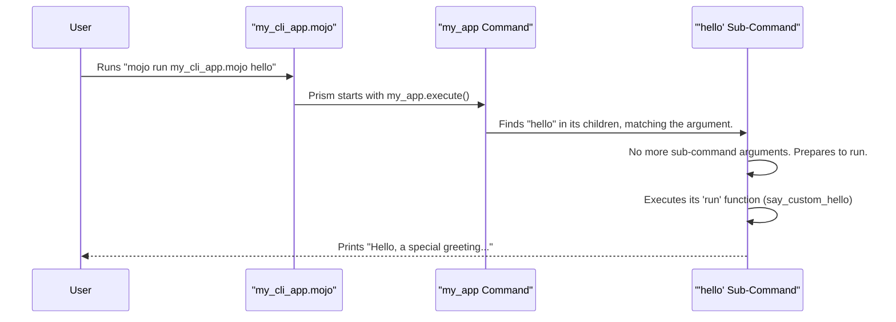

# Chapter 1: Command

Welcome to the Prism tutorial! We're excited to help you build powerful command-line interface (CLI) applications with Mojo. In this first chapter, we'll explore the most fundamental building block in Prism: the **Command**.

Imagine you want to create a program that can do several different things. For example, a program that can `greet` you, or maybe `calculate` something, or `show-config`. How do you tell your program *which* specific task to perform when you run it from your terminal? This is where `Command` comes in.

Think of a `Command` as a recipe for a specific task your program can perform.
Just like a recipe has:
*   A **name** (e.g., "Bake a Cake")
*   A short **description** (e.g., "A delicious vanilla cake recipe")
*   **Instructions** (the actual steps to bake the cake)

A Prism `Command` defines:
*   Its `name` (how you'll call it from the terminal, like `greet`)
*   Its `usage` (a short description of what it does)
*   A `run` function (the Mojo code that gets executed for this task)

Commands are the heart of your CLI application, defining all the actions it can take.

## Your First Command: A Simple Greeter

Let's build a very simple command that just prints a greeting.

First, you need a Mojo function that will contain the logic for our command. This function will always take a `Context` argument (we'll learn more about [Context](05_context_.md) in a later chapter, but for now, just know it's needed).

```mojo
from prism import Command, Context

// This is the "instruction" part of our recipe
fn say_hello(ctx: Context) -> None:
    print("Hello from your first Prism command!")
```
This function, `say_hello`, is what we want to run when our command is invoked.

Now, let's create a `Command` "recipe" for this:

```mojo
fn main():
    // Define our command
    var greeter_command = Command(
        name="greet",  // The name users will type
        usage="Prints a friendly greeting.", // A helpful description
        run=say_hello  // The function to execute
    )

    // Tell Prism to process command-line arguments and run the command
    greeter_command.execute()
```
In this `main` function:
1.  We create an instance of `Command`.
2.  We give it a `name`, "greet". This is what users would type in their terminal (e.g., `your_program greet`).
3.  We provide a `usage` string, which is helpful for users to understand what the command does.
4.  Crucially, we link our `say_hello` function to the `run` parameter.
5.  Finally, `greeter_command.execute()` tells Prism to look at the arguments passed to the program when it was run, find the appropriate command, and execute its `run` function.

If you save this code as `my_greeter.mojo` and run it like this:
```sh
mojo run my_greeter.mojo greet
```
Or even just:
```sh
mojo run my_greeter.mojo
```
(Because `greet` is the only command defined at the root level, Prism will default to it if no other subcommand is specified.)

The output will be:
```
Hello from your first Prism command!
```
Congratulations! You've just created and executed your first Prism command.

## Commands with Sub-Commands: Building a Hierarchy

Just like a cookbook might have a main recipe for "Sunday Roast" which then refers to sub-recipes like "Roast Potatoes" and "Make Gravy," Prism `Command`s can have **child commands** (or sub-commands).

This allows you to build complex, multi-level applications. Think of common tools like `git`: you have `git commit`, `git push`, `git branch ls`. Here, `git` is the main command, and `commit`, `push`, `branch` are sub-commands. `ls` is then a sub-command of `branch`.

Let's extend our greeter. Suppose we want a main application command, and a specific `hello` sub-command.

```mojo
from memory import ArcPointer // We'll use this for child commands
from prism import Command, Context

// Function for the root command (if no sub-command is given)
fn app_info(ctx: Context) -> None:
    print("Welcome to My Awesome App! Try the 'hello' sub-command.")

// Function for the 'hello' sub-command
fn say_custom_hello(ctx: Context) -> None:
    print("Hello, a special greeting from the 'hello' sub-command!")

fn main():
    // 1. Define the "sub-recipe" (child command)
    // We wrap child commands in ArcPointer for memory management
    var hello_sub = ArcPointer(
        Command(
            name="hello",
            usage="Prints a special greeting.",
            run=say_custom_hello
        )
    )

    // 2. Define the main "recipe" (root command)
    var my_app = Command(
        name="my_app_cli", // A name for our application's root command
        usage="A demo application with sub-commands.",
        run=app_info,     // Runs if no sub-command is matched
        children=List[ArcPointer[Command]](hello_sub) // Add our sub-command
    )

    my_app.execute()
```

Let's break this down:
1.  We have two functions: `app_info` (for the root command) and `say_custom_hello` (for our sub-command).
2.  `hello_sub`: This is our child command named "hello". Notice it's wrapped in `ArcPointer`. This is a Mojo feature for managing shared data, which is useful when a parent command holds references to child commands.
3.  `my_app`: This is our root command.
    *   It has its own `name`, `usage`, and `run` function (`app_info`). This `run` function will be executed if the user runs the program without specifying the `hello` sub-command.
    *   The key new part is `children=List[ArcPointer[Command]](hello_sub)`. This tells Prism that `my_app` has a sub-command called `hello_sub`.

Now, if you save this as `my_cli_app.mojo`:

*   Running `mojo run my_cli_app.mojo` will execute `app_info`:
    ```
    Welcome to My Awesome App! Try the 'hello' sub-command.
    ```
*   Running `mojo run my_cli_app.mojo hello` will execute `say_custom_hello`:
    ```
    Hello, a special greeting from the 'hello' sub-command!
    ```

You can see how you can build up a tree of commands to create sophisticated CLI tools!

## Under the Hood: How `Command.execute()` Works

When you call `my_command.execute()`, Prism goes through a few steps:

1.  **Argument Parsing**: Prism looks at the arguments you typed on the command line after your program's name (e.g., `hello` in `mojo run my_cli_app.mojo hello`).
2.  **Command Traversal**:
    *   It starts with the root `Command` (the one you called `execute()` on).
    *   It checks if the first argument matches the `name` (or one of the `aliases`, which we haven't covered yet) of any of its `children`.
    *   If a child command matches, Prism then considers *that* child command and looks at the *next* argument to see if it matches any of *its* children.
    *   This process continues until it finds the most specific command that matches the sequence of arguments, or it runs out of arguments.
3.  **Context Creation**: Prism gathers information, like any remaining arguments that weren't part of a command name, and bundles it into a `Context` object. You'll learn more about this in the [Context](05_context_.md) chapter.
4.  **Flag Parsing**: If your command expects any options (like `--verbose` or `-f output.txt`), Prism parses these. We'll dedicate Chapter 2 to [Flag](02_flag_.md)s.
5.  **Execution**: Finally, Prism calls the `run` function (or `raising_run` if it's a function that can raise errors) associated with the identified command, passing it the `Context`.

Here's a simplified view of what happens for `my_cli_app hello`:



### A Glimpse into the Code (`src/prism/command.mojo`)

The `Command` itself is a `struct` in Mojo, defined in `src/prism/command.mojo`. Here are some key fields:

```mojo
// Simplified from src/prism/command.mojo

@value
struct Command:
    var name: String
    // The name of the command.

    var usage: String
    // Description of the command.

    var run: Optional[CmdFn]
    // A function to run when the command is executed.
    // CmdFn is an alias for: fn (ctx: Context) -> None

    var children: List[ArcPointer[Self]]
    // Child commands. 'Self' here refers to the Command struct itself.

    // ... many other fields for advanced features ...

    fn __init__(
        out self,
        name: String,
        usage: String,
        *,
        run: Optional[CmdFn] = None,
        children: List[ArcPointer[Self]] = List[ArcPointer[Self]](),
        // ... other parameters for flags, help, version, etc. ...
    ):
        // A command needs something to do!
        if not run and not raising_run: // 'raising_run' is for functions that can error
            panic("A command must have a run or raising_run function.")

        self.name = name
        self.usage = usage
        self.run = run
        self.children = children
        // ... initialization of other fields ...
```
The `__init__` function is where a `Command` is constructed. You can see it takes the `name`, `usage`, `run` function, and `children` we've been using. An important detail is that a `Command` *must* have a `run` function (or a `raising_run` variant for functions that can produce errors); otherwise, Prism will `panic` because the command wouldn't know what to do!

The `execute()` method orchestrates the argument parsing and command dispatch:

```mojo
// Conceptual simplification from src/prism/command.mojo
fn execute(self) -> None:
    // 1. Get arguments from the command line (e.g., from `sys.argv()`)
    var input_args = parse_args_from_command_line(argv())

    // 2. Figure out which specific command to run based on these arguments
    // This involves traversing the command tree (root and children)
    var command_to_run: Self
    var remaining_args_for_command: List[String]
    command_to_run, remaining_args_for_command = self._parse_command_from_args(input_args)

    // 3. (Flags would be parsed here - more in Chapter 2: Flag)

    // 4. Create a Context object (more in Chapter 5: Context)
    var ctx = Context(remaining_args_for_command, ArcPointer(command_to_run))

    // 5. If a 'run' function is defined for this command, call it!
    if command_to_run.run:
        command_to_run.run.value()(ctx)
    elif command_to_run.raising_run:
        // Handle functions that can raise errors
        try:
            command_to_run.raising_run.value()(ctx)
        except e:
            self.exit(e) // Handle errors (more on this later)
    // ... logic for help, version flags, pre/post run hooks ...
```
The `_parse_command_from_args` internal method is responsible for walking down the command tree (from parent to children) based on the input arguments to find the target command.

## Conclusion

You've now learned about the `Command`, the fundamental building block of a Prism CLI application. You know how to:
*   Define a simple command with a `name`, `usage` description, and a `run` function.
*   Nest commands by creating `children` to build more complex applications.
*   Use `execute()` to kick off Prism's argument parsing and command execution.

A `Command` is like a recipe: it tells your program *what* to do. But recipes often have ingredients or options, right? "Bake a Cake *with chocolate frosting*" or "Bake a Cake *for 12 people*". In the next chapter, we'll learn how to add these kinds of options to our commands using [Flag](02_flag_.md)s.

---

Generated by [AI Codebase Knowledge Builder](https://github.com/The-Pocket/Tutorial-Codebase-Knowledge)