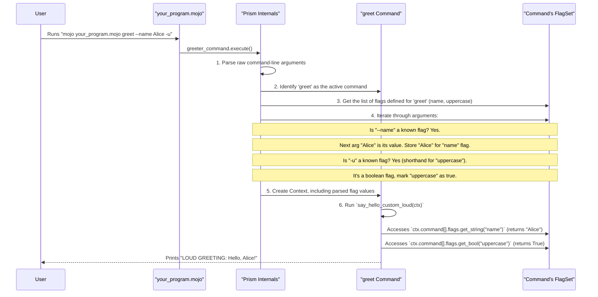

# Chapter 2: Flag

Welcome back! In [Chapter 1: Command](01_command_.md), we learned how to create basic commands and even structure them with sub-commands. Our commands knew *what* to do. But what if we want to change *how* they do it? For instance, telling our `greet` command to shout, or to greet a specific person? This is where `Flag`s come into play!

## What's a Flag, Anyway?

Imagine you're ordering a pizza. The base command is "order pizza." But you want options:
*   `--pepperoni` (add pepperoni)
*   `--extra-cheese` (add extra cheese)
*   `--delivery-time="7 PM"` (set a specific delivery time)

Or think about setting an oven:
*   `bake_cake --temperature=350` (set the temperature)
*   `bake_cake --timer=45` (set the timer for 45 minutes)

In the world of command-line interfaces (CLIs), **Flags** are these options or switches. They modify a command's behavior. When you run a program from your terminal, you can pass these flags to customize what the program does.

A `Flag` in Prism has a few key characteristics:
*   **Name**: The full name of the flag (e.g., "verbose", "output-file"). You usually type this with two hyphens: `--verbose`.
*   **Shorthand** (optional): A single-letter abbreviation (e.g., "v" for "verbose"). You type this with one hyphen: `-v`.
*   **Type**: What kind of value the flag expects.
    *   `Boolean`: A simple on/off switch (e.g., `--force` either is there or isn't).
    *   `String`: Text (e.g., `--message "Hello there"`).
    *   `Number`: An integer or a decimal (e.g., `--count 10`).
*   **Default Value**: What value the flag takes if the user doesn't provide it.
*   **Usage Description**: A short explanation of what the flag does, which is super helpful for users.

Prism uses flags to allow users to customize how your commands operate, making your CLI tools much more flexible!

## Enhancing Our Greeter with Flags

Let's take our simple `greet` command from Chapter 1 and add some options. We want to:
1.  Allow the user to specify a name to greet.
2.  Add an option to make the greeting LOUD (uppercase).

### Step 1: The Basic Command (Recap)

First, let's remember our basic `say_hello` function and `Command`:

```mojo
from prism import Command, Context, Flag // ✨ New: Import Flag!

fn say_hello(ctx: Context) -> None:
    print("Hello from your Prism command!")

fn main():
    var greeter_command = Command(
        name="greet",
        usage="Prints a friendly greeting.",
        run=say_hello
        // We'll add flags here soon!
    )
    greeter_command.execute()
```
If you run `mojo run your_program.mojo greet`, it prints "Hello from your Prism command!".

### Step 2: Adding a "Name" Flag (String Flag)

Let's add a flag so users can specify who to greet, like `your_program greet --name Alice`.

We'll modify our `main` function to define a `Flag`. Prism provides handy static methods on the `Flag` struct for different types, like `Flag.string()`, `Flag.bool()`, etc.

```mojo
// ... (imports and say_hello function remain the same for now) ...

fn main():
    var greeter_command = Command(
        name="greet",
        usage="Prints a friendly greeting.",
        run=say_hello_custom, // We'll update this function next
        flags=List[Flag]( // ✨ Define a list of flags
            Flag.string( // ✨ Create a string flag
                name="name",
                shorthand="n", // Users can use -n
                usage="The name of the person to greet.",
                default=String("World") // Default if no name is given
            )
        )
    )
    greeter_command.execute()
```
Here's what's new:
*   We added a `flags` parameter to our `Command`. It takes a `List[Flag]`.
*   Inside the list, we created a `Flag` using `Flag.string()`:
    *   `name="name"`: The full flag name is `--name`.
    *   `shorthand="n"`: An alias, `-n`.
    *   `usage`: A helpful description.
    *   `default=String("World")`: If the user doesn't provide a name, it defaults to "World".

Now, let's update our `say_hello` function (renamed to `say_hello_custom`) to use this flag. Flag values are accessed through the `Context` object (`ctx`) that's passed to your `run` function.

```mojo
from prism import Command, Context, Flag

fn say_hello_custom(ctx: Context) -> None:
    // Access the 'name' flag's value
    // ctx.command[] gives us the current command being run.
    // .flags allows access to its FlagSet (more in next chapter!)
    // .get_string("name") retrieves the string value.
    // It returns an Optional[String], so we use .value() if present.
    var name_to_greet = ctx.command[].flags.get_string("name").value_or("World")

    print("Hello, " + name_to_greet + "!")

fn main():
    var greeter_command = Command(
        name="greet",
        usage="Prints a friendly greeting.",
        run=say_hello_custom,
        flags=List[Flag](
            Flag.string(
                name="name",
                shorthand="n",
                usage="The name of the person to greet.",
                default=String("World")
            )
        )
    )
    greeter_command.execute()
```
In `say_hello_custom`:
*   `ctx.command[].flags.get_string("name")` tries to get the value of the "name" flag.
*   This returns an `Optional[String]`. We use `.value_or("World")` to get the provided name, or "World" if the flag wasn't used or had no value.

Let's try it out!
*   `mojo run your_program.mojo greet`
    Output: `Hello, World!`
*   `mojo run your_program.mojo greet --name Alice`
    Output: `Hello, Alice!`
*   `mojo run your_program.mojo greet -n Bob`
    Output: `Hello, Bob!`

Awesome! Our command is now more flexible.

### Step 3: Adding an "Uppercase" Flag (Boolean Flag)

Now, let's add a flag to make the greeting uppercase, like `your_program greet --uppercase`. This is a boolean flag – it's either present (true) or absent (false).

```mojo
from prism import Command, Context, Flag

fn say_hello_custom_loud(ctx: Context) -> None:
    var name_to_greet = ctx.command[].flags.get_string("name").value_or("World")
    var make_loud = ctx.command[].flags.get_bool("uppercase").value_or(False) // Default to False

    var greeting = "Hello, " + name_to_greet + "!"
    if make_loud:
        // In a real app, you'd use a string uppercase function.
        // For simplicity, we'll just add a note.
        greeting = "LOUD GREETING: " + greeting
    print(greeting)

fn main():
    var greeter_command = Command(
        name="greet",
        usage="Prints a friendly greeting.",
        run=say_hello_custom_loud,
        flags=List[Flag](
            Flag.string(
                name="name", shorthand="n", usage="Person to greet.", default=String("World")
            ),
            Flag.bool( // ✨ Create a boolean flag
                name="uppercase",
                shorthand="u", // Users can use -u
                usage="Print the greeting in uppercase.",
                default=False // Default is false (not uppercase)
            )
        )
    )
    greeter_command.execute()
```
Changes:
1.  In `main`, we added `Flag.bool()` for "uppercase".
    *   `name="uppercase"` (or `-u` for shorthand).
    *   `default=False`: By default, the greeting is not uppercase.
2.  In `say_hello_custom_loud`, we get the boolean flag value:
    *   `ctx.command[].flags.get_bool("uppercase").value_or(False)` retrieves the boolean value, defaulting to `False`.
    *   We then use an `if` statement to modify the greeting.

Let's test:
*   `mojo run your_program.mojo greet --name Alice`
    Output: `Hello, Alice!`
*   `mojo run your_program.mojo greet --name Alice --uppercase`
    Output: `LOUD GREETING: Hello, Alice!`
*   `mojo run your_program.mojo greet -n Bob -u`
    Output: `LOUD GREETING: Hello, Bob!`

It works! We can now combine flags to customize our command.

### Common Flag Types

Prism supports many common flag types through static methods on `Flag`:
*   `Flag.string(...)`
*   `Flag.bool(...)`
*   `Flag.int(...)`, `Flag.int8(...)`, ..., `Flag.int64(...)`
*   `Flag.uint(...)`, `Flag.uint8(...)`, ..., `Flag.uint64(...)`
*   `Flag.float16(...)`, `Flag.float32(...)`, `Flag.float64(...)`
*   `Flag.string_list(...)` (for flags that can appear multiple times or take comma-separated values)
*   And more!

Each of these methods takes common parameters like `name`, `shorthand`, `usage`, and `default`.

## Under the Hood: Flag Definition and Parsing

Let's peek at how Prism handles flags internally.

### The `Flag` Struct

The `Flag` itself is a struct, defined in `src/prism/flag.mojo`. Here are some key fields (simplified):

```mojo
// Simplified from src/prism/flag.mojo
@value
struct Flag:
    var name: String                 // e.g., "username"
    var shorthand: String            // e.g., "u"
    var usage: String                // e.g., "Your username for login"
    var value: Optional[String]      // The actual value provided by the user (parsed as string initially)
    var default: Optional[String]    // e.g., "guest"
    var type: FType                  // e.g., FType.String, FType.Bool
    var changed: Bool                // True if the user provided this flag
    var required: Bool               // If the flag must be provided
    var persistent: Bool             // If the flag applies to subcommands too

    // Constructor used by Flag.string(), Flag.bool(), etc.
    fn __init__(
        out self,
        name: String,
        type: FType,
        *,
        shorthand: String = "",
        usage: String = "",
        default: Optional[String] = None,
        // ... other parameters ...
    ):
        self.name = name
        self.shorthand = shorthand
        self.usage = usage
        self.default = default
        self.type = type
        self.value = None // Initially no value
        self.changed = False
        // ...
```
When you call `Flag.string(name="config", default=String("dev.conf"))`, it ultimately calls this `__init__` function, setting up the `Flag` with its properties. The `type` field (an `FType` enum) is crucial for Prism to know how to interpret and convert the flag's value.

The static methods like `Flag.string()`, `Flag.bool()` are convenient helpers:
```mojo
// Simplified from src/prism/flag.mojo
@value
struct Flag:
    // ... other fields ...

    @staticmethod
    fn string(
        name: String,
        usage: String,
        shorthand: String = "",
        default: Optional[String] = None,
        // ... other options ...
    ) -> Flag:
        return Flag( // Calls the main __init__
            name=name,
            shorthand=shorthand,
            usage=usage,
            default=default,
            type=FType.String, // Sets the correct type!
            // ...
        )

    @staticmethod
    fn bool(
        name: String,
        usage: String,
        shorthand: String = "",
        default: Optional[Bool] = None, // Takes a Bool for default
        // ...
    ) -> Flag:
        var default_str_val: Optional[String]
        if default:
            default_str_val = String(default.value()) // Converts Bool to String for internal storage
        else:
            default_str_val = None

        return Flag(
            name=name,
            shorthand=shorthand,
            usage=usage,
            default=default_str_val,
            type=FType.Bool, // Sets the type to Bool!
            // ...
        )
    // ... and similar static methods for other types ...
```
These static methods make defining flags clean and type-safe at the point of definition.

### How Prism Parses Flags

When you call `my_command.execute()`, part of its job (as mentioned in [Chapter 1: Command](01_command_.md)) is to parse flags. Here's a simplified flow:



1.  **Argument Tokenization**: Prism splits the command-line input (e.g., `greet --name Alice -u`) into tokens.
2.  **Command Resolution**: It first identifies the command to be run (e.g., `greet`).
3.  **Flag Parsing Loop**: Prism then iterates over the remaining arguments.
    *   If an argument starts with `--` (e.g., `--name`), it looks for a flag with that name.
        *   For flags expecting a value (like string or number), it checks if the value is provided like `--name=Alice` or as the next argument `--name Alice`.
    *   If an argument starts with `-` (e.g., `-n` or `-u`):
        *   It can be a single shorthand (`-n Alice`).
        *   It can be a group of boolean shorthands (`-xvf`, equivalent to `-x -v -f`).
    *   Boolean flags (like `--uppercase` or `-u`) are set to `true` if present. If they have a `default=True`, then *not* providing them means they are `false` (this is less common but possible).
4.  **Value Storage**: The parsed values (or default values if a flag wasn't provided) are stored, associated with their respective `Flag` objects. These `Flag` objects are managed by a [FlagSet](03_flagset_.md), which we'll explore in the next chapter.
5.  **Context Population**: These values are made accessible through the `Context` object passed to your command's `run` function. Methods like `ctx.command[].flags.get_string("name")` then retrieve these stored and correctly typed values.

This process ensures that by the time your `run` function executes, all the flags have been processed, and their values are readily available.

## Conclusion

You've now unlocked a powerful way to make your Prism commands interactive and configurable using **Flags**! You've learned:
*   What flags are and why they're useful (like options for a pizza!).
*   The components of a flag: name, shorthand, type, default value, and usage.
*   How to define flags (e.g., `Flag.string()`, `Flag.bool()`) and add them to your `Command` using the `flags` parameter.
*   How to access flag values within your command's `run` function using the `Context` (e.g., `ctx.command[].flags.get_string("myflag")`).
*   A glimpse into how Prism defines `Flag`s and parses them from the command line.

Flags are individual options. But how does a command manage a whole collection of them? And how does it retrieve their values so conveniently? That's where the [FlagSet](03_flagset_.md) comes in, and we'll dive into it in the next chapter!

---

Generated by [AI Codebase Knowledge Builder](https://github.com/The-Pocket/Tutorial-Codebase-Knowledge)