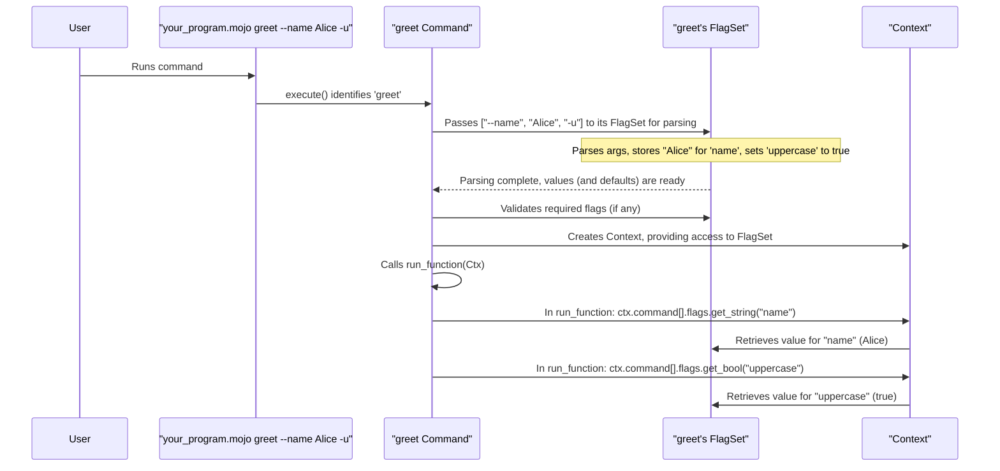

# Chapter 3: FlagSet - Your Command's Control Panel

In [Chapter 2: Flag](02_flag_.md), we learned how to add individual options (Flags) like `--name` or `--uppercase` to our commands. This made our `greet` command much more flexible! But how does a `Command` keep track of all its defined `Flag`s? And how does it magically know the value of `--name` when you type `your_program greet --name Alice`?

Meet the **`FlagSet`**! It's the unsung hero working behind the scenes.

## What is a FlagSet?

Imagine a `FlagSet` as the dedicated **control panel** for a specific `Command`.
*   Our `greet` command has one control panel.
*   If we had a `calculate` command, it would have its *own*, separate control panel.

This control panel (`FlagSet`) is responsible for:
1.  **Holding all the dials and switches**: It knows about every single `Flag` that has been defined for its `Command`. For our greeter, it knows about the `--name` (string) flag and the `--uppercase` (boolean) flag.
2.  **Reading the user's input**: When you run `your_program greet --name Alice -u`, the `FlagSet` looks at `"--name Alice"` and `"-u"`.
3.  **Matching inputs to controls**: It figures out that `"--name"` corresponds to the "name" `Flag` and `"-u"` corresponds to the "uppercase" `Flag`.
4.  **Extracting values**: It sees "Alice" as the value for the "name" `Flag`, and notes that "uppercase" is switched on.
5.  **Applying defaults**: If you just run `your_program greet`, and the "name" `Flag` has a default value of "World", the `FlagSet` makes sure "World" is used.
6.  **Validation**: It can check if a `Flag` marked as "required" was actually provided by the user. It can also handle more complex rules, like "if you use flag A, you can't use flag B" (we'll touch on this more in [Flag Groups](07_flag_groups_.md)).
7.  **Making values available**: Finally, it provides these parsed values (like "Alice" for name, and `true` for uppercase) to your command's `run` function, so your code can use them.

You generally don't create or interact with a `FlagSet` directly. When you define `Flag`s for a `Command`, Prism automatically sets up a `FlagSet` for that command.

## How `FlagSet` Works with Your Command

Remember our `greet` command from the previous chapter?

```mojo
from prism import Command, Context, Flag

fn say_hello_custom_loud(ctx: Context) -> None:
    // How does this work? Via the FlagSet!
    var name_to_greet = ctx.command[].flags.get_string("name").value_or("World")
    var make_loud = ctx.command[].flags.get_bool("uppercase").value_or(False)

    var greeting = "Hello, " + name_to_greet + "!"
    if make_loud:
        greeting = "LOUD GREETING: " + greeting
    print(greeting)

fn main():
    var greeter_command = Command(
        name="greet",
        usage="Prints a friendly greeting.",
        run=say_hello_custom_loud,
        flags=List[Flag]( // These flags are given to the Command's FlagSet
            Flag.string(
                name="name", shorthand="n", usage="Person to greet.", default=String("World")
            ),
            Flag.bool(
                name="uppercase", shorthand="u", usage="Print loud greeting.", default=False
            )
        )
    )
    greeter_command.execute()
```

Let's break down this line from `say_hello_custom_loud`:
`var name_to_greet = ctx.command[].flags.get_string("name").value_or("World")`

1.  `ctx`: This is the [Context](05_context_.md) object, which carries information about the current command execution.
2.  `ctx.command[]`: This gives you a reference to the `Command` object that is currently being executed (in our case, the `greeter_command`).
3.  `.flags`: Aha! Every `Command` object in Prism has a `flags` property, and this property *is* its `FlagSet` instance. So, `ctx.command[].flags` is the "control panel" for our `greeter_command`.
4.  `.get_string("name")`: Now we're talking to the `FlagSet`. We're asking it: "Please get me the value of the string flag named 'name'." The `FlagSet` looks up the "name" flag, checks if the user provided a value, or uses the default, and returns it as an `Optional[String]`.

So, when you define `flags=List[Flag](...)` in your `Command`, Prism takes that list and uses it to initialize the `Command`'s internal `FlagSet`.

## The Parsing Process: A Central Role for FlagSet

When you call `my_command.execute()`, a sequence of events unfolds, and the `FlagSet` is a key player:

1.  **Argument Input**: Prism gets the arguments you typed on the command line (e.g., `greet --name Alice -u`).
2.  **Command Identification**: Prism figures out which command to run. In `my_app greet --name Alice`, it first identifies `greet` as the target command (as we saw in [Chapter 1: Command](01_command_.md)).
3.  **Hand-off to FlagSet**: The `greet` command then passes the remaining arguments (`--name Alice -u`) to its `FlagSet`.
4.  **FlagSet Parses**: The `FlagSet` for the `greet` command now does its main job. It has a method (internally called `from_args`) that:
    *   Looks at `"--name"`. It knows this is a defined `Flag`.
    *   Sees that "name" expects a value, so it takes the next part, `"Alice"`, as its value.
    *   Stores "Alice" internally for the "name" `Flag`.
    *   Looks at `"-u"`. It recognizes this as the shorthand for the "uppercase" `Flag`.
    *   Since "uppercase" is a boolean flag, it marks it as `true`.
    *   If any flags weren't provided by the user, their default values are noted.
5.  **Validation (Optional but Important)**:
    *   The `FlagSet` checks if all `required` flags were provided. If not, it can signal an error.
    *   It also checks for [Flag Groups](07_flag_groups_.md) rules (e.g., mutually exclusive flags).
6.  **Context Population**: The successfully parsed flag values (or their defaults) are then made available through the `Context` object.
7.  **Execution**: Your command's `run` function is called with this `Context`. Now, when you ask `ctx.command[].flags.get_string("name")`, it retrieves the value ("Alice" or the default) that the `FlagSet` worked out.

Here's a simplified diagram of this interaction:



## Key Responsibilities of `FlagSet`

The `FlagSet` isn't just a passive container. It actively manages flags:

*   **Parsing Arguments (`from_args`)**: This is its core. It understands various flag formats (`--flag value`, `--flag=value`, `-f value`, combined shorthands like `-abc`). It separates flag arguments from positional arguments.
*   **Providing Typed Values (e.g., `get_string`, `get_bool`, `get_int`)**: You ask for a `String`, you get a `String` (or an `Optional[String]`). You ask for a `Bool`, you get a `Bool`. The `FlagSet` handles the conversion from the raw text on the command line to the correct Mojo type.
*   **Handling Defaults**: If a `Flag` wasn't specified by the user, methods like `get_string("myflag").value_or("default_val")` will easily fall back to the `Flag`'s defined default value because the `FlagSet` ensures this information is correctly managed.
*   **Validation**:
    *   **Required Flags**: If you define a `Flag` as `required=True` (more on this later), the `FlagSet` has a method `validate_required_flags()` that Prism calls to ensure the user provided it. If not, Prism will typically show an error and exit.
    *   **Flag Groups**: `FlagSet` also has `validate_flag_groups()` to enforce rules like "flags A and B must be used together" or "flags X and Y cannot be used at the same time." We'll explore this in the [Flag Groups](07_flag_groups_.md) chapter.

## Under the Hood: A Peek at `src/prism/_flag_set.mojo`

You don't need to know the deep internals to use Prism, but a little insight can be helpful! The `FlagSet` is defined as a `struct` in `src/prism/_flag_set.mojo`.

```mojo
// Simplified from src/prism/_flag_set.mojo
@value
struct FlagSet:
    var flags: List[Flag] // A list to hold all Flag objects for a command

    // When a Command is created, its list of Flags
    // is used to initialize this 'flags' list.
    fn __init__(out self, flags: List[Flag] = List[Flag]()):
        self.flags = flags

    // ... many other methods ...
```
The `flags` field is simply a `List` containing all the `Flag` objects you defined for the `Command`.

### The `from_args` Method (Conceptual)

The `from_args` method is the engine room for flag parsing. When your command runs, Prism calls this method on the command's `FlagSet`, giving it the raw arguments from the command line (like `"--verbose"`, `"--output"`, `"file.txt"`). `from_args` then:
1.  Goes through each argument.
2.  If it sees something like `"--output"` or `"-o"`, it looks for a `Flag` named "output" (or with shorthand "o") in its list of known flags.
3.  If that flag needs a value (like our "output" flag, which expects a filename), it grabs the next argument (`"file.txt"`) or the part after an equals sign (`--output=file.txt`) as its value.
4.  It stores this value (e.g., "file.txt") inside the "output" `Flag` object and marks that `Flag` object as "changed" (meaning the user explicitly set it).
5.  For boolean flags like `"--verbose"`, it just marks the `Flag` object as "changed" (which implies `true`).
6.  Any arguments that aren't recognized as flags or their values are collected and returned as *positional arguments*.

### Getter Methods (e.g., `get_string`, `get_bool`)

When your code calls `ctx.command[].flags.get_string("name")`:
1.  The `FlagSet` (via `self.flags`) looks through its internal list of `Flag` objects.
2.  It finds the `Flag` whose `name` is "name".
3.  It checks if the user provided a value for this flag (i.e., if the `Flag` object was marked "changed" and has a value stored by `from_args`).
    *   If yes, it returns that value (e.g., "Alice").
    *   If no, it looks up the `default` value that was defined for this `Flag` when you created it (e.g., "World") and returns that.
4.  The `get_string` method also ensures (internally) that the flag it found was indeed defined as a string flag. If you tried `get_int("name")` on a string flag, it would typically lead to an issue or return `None`. Similar logic applies to `get_bool`, `get_int`, etc., each handling type-specific conversions (e.g., "true" string to `Bool` True).

These getter methods provide a convenient and type-safe way to access flag values.

## Conclusion

The `FlagSet` is like the diligent stage manager for your command's options. It takes the list of `Flag`s you define, expertly parses the user's command-line input, handles default values, performs crucial validations, and then makes all the flag values neatly available to your command's logic via the `Context`.

While you mostly interact with it indirectly through `ctx.command[].flags.get_...()`, understanding its role helps demystify how Prism connects your flag definitions to the values your command receives.

Now that we know how commands and their options are handled, what about helping your users understand how to use your CLI? Many CLIs have built-in help messages (`--help`) and version information (`--version`). In the next chapter, we'll see how Prism makes [Help & Version Handling](04_help___version_handling_.md) straightforward.

---

Generated by [AI Codebase Knowledge Builder](https://github.com/The-Pocket/Tutorial-Codebase-Knowledge)