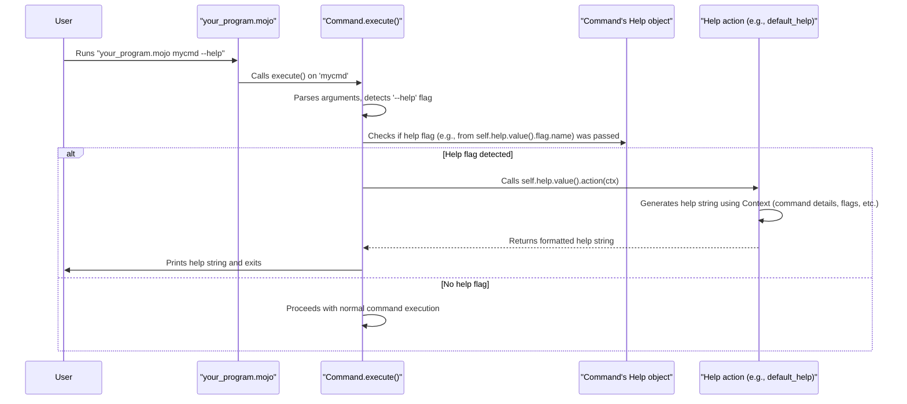
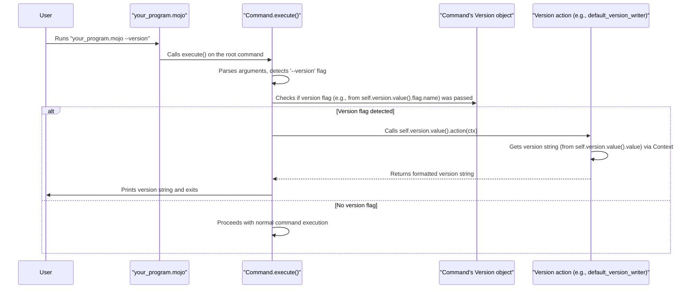

# Chapter 4: Help & Version Handling

Welcome back! In [Chapter 3: FlagSet - Your Command's Control Panel](03_flagset_.md), we saw how a `Command` manages its various options (`Flag`s) using a `FlagSet`. Now, imagine you've built a fantastic new CLI tool. How will your users learn to use it? What if they want to know which version of your tool they're running?

This is where **Help & Version Handling** comes in. Think of it like this: every good appliance comes with a user manual, and often has a label telling you its model number. Similarly, good CLI tools provide:
*   A built-in manual: Usually accessed with `--help` or `-h`.
*   An "about" section: Typically shown with `--version` or `-v`.

Prism can automatically generate these for your `Command`s, saving you the effort of implementing this common (but crucial!) functionality yourself.

## Why Do We Need Automatic Help and Version?

Let's say you've created a command `my_tool analyze --input data.txt`.
*   A new user might type `my_tool --help` to see what `my_tool` can do and what commands are available.
*   Or, they might type `my_tool analyze --help` to understand the specific options for the `analyze` command, like what kind of input it expects.
*   If they encounter a bug, they might want to report `my_tool --version` so developers know exactly which release they're using.

Manually writing the code to parse for `--help` and `--version` flags, format the messages, and display them for every single command and sub-command would be very repetitive. Prism handles this for you!

## Prism to the Rescue: Automatic Help

By default, every Prism `Command` you create automatically understands the `--help` and `-h` flags. When a user runs your command with one of these flags, Prism will display a neatly formatted help message and then exit. You don't have to do anything special to enable this basic help!

Let's revisit a simple command:

```mojo
from prism import Command, Context, Flag

fn do_processing(ctx: Context) -> None:
    print("Doing some important processing...")

fn main():
    var process_command = Command(
        name="process",
        usage="Processes important data files.",
        run=do_processing,
        flags=List[Flag](
            Flag.string(name="input", shorthand="i", usage="Input file to process")
        )
    )
    process_command.execute()
```

If you save this as `my_processor.mojo` and run:
```sh
mojo run my_processor.mojo process --help
```

Prism will automatically generate and display output similar to this (the exact formatting might vary slightly):

```
Usage: process [OPTIONS] [ARGS]...

Processes important data files.

Options:
  -i, --input    Input file to process
  --help, -h     Displays help information about the command.
```

Notice:
*   It shows the `usage` string we provided.
*   It lists the `flags` we defined (`--input`, `-i`).
*   It automatically includes the `--help` and `-h` options in the help message itself!

This happens because the `Command` struct has a `help` field, which by default is initialized with a `Help` object that knows how to do this.

## Displaying Version Information

Similarly, Prism can automatically handle `--version` (or `-v`). To enable this, you need to tell your `Command` what its version is.

```mojo
from prism import Command, Context, Version // ✨ New: Import Version!

fn do_nothing(ctx: Context) -> None:
    print("My tool is running.")

fn main():
    var my_tool_cmd = Command(
        name="mytool",
        usage="A fantastic tool that does things.",
        run=do_nothing,
        version=Version("1.0.2") // ✨ Provide the version string
    )
    my_tool_cmd.execute()
```
Here, we've added `version=Version("1.0.2")` when creating our `Command`. The `Version` struct holds your command's version information.

Now, if you save this as `my_cli.mojo` and run:
```sh
mojo run my_cli.mojo --version
```

Prism will display:
```
mytool: 1.0.2
```
And then exit. If you run `mojo run my_cli.mojo -v`, you'll get the same result.

It's that simple! By providing a `Version` object with your version string, Prism takes care of the rest.

## Customizing Help and Version Behavior

While the defaults are great, Prism allows for customization.

### Customizing the Help Flag

What if you want your help flag to be `--info` instead of `--help`? You can configure the `Help` object:

```mojo
from prism import Command, Context, Flag, Help // ✨ Import Help

fn show_status(ctx: Context) -> None:
    print("System status: OK")

fn main():
    var status_cmd = Command(
        name="status",
        usage="Shows the current system status.",
        run=show_status,
        help=Help( // ✨ Customize Help
            flag=Flag.bool(
                name="info", // New long name
                shorthand="i", // New shorthand
                usage="Display detailed information."
            )
        )
    )
    status_cmd.execute()
```
In this example:
1.  We import `Help` and `Flag`.
2.  When creating the `Command`, we pass a `Help` instance to the `help` parameter.
3.  Inside `Help(...)`, we provide our own `Flag` for help: `name="info"`, `shorthand="i"`.

Now, running `mojo run my_status_app.mojo status --info` (or `-i`) will display the help message. The default `--help` and `-h` will no longer be automatically active for help (unless `-i` conflicts and you define another flag as `-h` or `--help`).

Prism also allows you to provide a completely custom function to generate the help text if the default formatting isn't what you need, by passing an `action` function to `Help()`. This is more advanced, but good to know it's possible!

### Customizing the Version Display

You can also customize the version flag and even how the version is displayed.

```mojo
from prism import Command, Context, Flag, Version // ✨ Import Version & Flag

fn main_app_logic(ctx: Context) -> None:
    print("Application is running...")

// A custom function to format the version output
fn custom_version_formatter(ctx: Context) -> String:
    let app_name = ctx.command[].name
    let ver = ctx.command[].version.value().value // Get the version string
    return "Application: " + app_name + ", Version: " + ver + " (custom format)"

fn main():
    var my_app = Command(
        name="super_app",
        usage="A super application.",
        run=main_app_logic,
        version=Version( // ✨ Customize Version
            "v2.5-beta", // The version string
            flag=Flag.bool(
                name="app-version", // New long name
                shorthand="V",      // New shorthand (note: uppercase V)
                usage="Show application version details."
            ),
            action=custom_version_formatter // ✨ Our custom display function
        )
    )
    my_app.execute()
```
Here:
1.  We define `custom_version_formatter` which takes a `Context` and returns a `String`. It accesses the command's name and version string via the `Context`.
2.  In `Command`, for the `version` parameter, we create a `Version` object:
    *   We provide the version string `"v2.5-beta"`.
    *   We specify a custom `Flag` (`--app-version`, `-V`).
    *   We set `action=custom_version_formatter` to use our custom display logic.

Now, running `mojo run my_custom_app.mojo --app-version` (or `-V`) will output:
```
Application: super_app, Version: v2.5-beta (custom format)
```

## Under the Hood: How Prism Handles Help and Version

When you call `my_command.execute()`, Prism performs several steps. If it detects that a help or version flag has been used, it triggers special logic.

### Help Request Flow

Let's trace what happens for a `--help` request:



1.  **Argument Parsing**: `Command.execute()` parses the command-line arguments.
2.  **Help Flag Detection**: It specifically checks if the flag associated with "help" (by default `--help` or `-h`, or your custom one) is present.
3.  **Action Invocation**:
    *   If the help flag is found, Prism *does not* run your command's normal `run` function.
    *   Instead, it calls the `action` function stored within the `Command`'s `help` configuration (an instance of the `Help` struct).
    *   By default, this action is `default_help` (from `src/prism/help.mojo`).
4.  **Help Generation**: The `action` function (e.g., `default_help`) receives the `Context`. It uses information from `ctx.command[]` (like `usage`, `flags`, `children`) to construct the help message string.
5.  **Output & Exit**: The generated help string is printed to the console, and the program exits.

### Version Request Flow

The flow for `--version` is very similar:


1.  **Argument Parsing**: `Command.execute()` parses arguments.
2.  **Version Flag Detection**: It checks for the version flag.
3.  **Action Invocation**: If found, it calls the `action` function from the `Command`'s `version` configuration (an instance of the `Version` struct). The default is `default_version_writer` (from `src/prism/version.mojo`).
4.  **Version Retrieval & Formatting**: This `action` function uses the `Context` to access the `version` string you provided and formats it for display.
5.  **Output & Exit**: The version information is printed, and the program exits.

### Key Code Pointers

*   **`Help` Struct (`src/prism/help.mojo`)**:
    ```mojo
    // Simplified from src/prism/help.mojo
    @value
    struct Help:
        var flag: Flag // The flag that triggers help (e.g., --help, -h)
        var action: HelpFn // Function to generate help text

        fn __init__(
            out self,
            *,
            flag: Flag = Flag.bool(name="help", shorthand="h", ...),
            action: HelpFn = default_help,
        ):
            self.flag = flag
            self.action = action
    ```
    When you create a `Command`, if you don't provide a `help` argument, it gets this default `Help` configuration. `default_help` is a function in the same file that knows how to build a standard help message.

*   **`Version` Struct (`src/prism/version.mojo`)**:
    ```mojo
    // Simplified from src/prism/version.mojo
    @value
    struct Version:
        var value: String // The actual version string, e.g., "1.0.0"
        var flag: Flag    // The flag that triggers version display
        var action: VersionFn // Function to display version info

        fn __init__(
            out self,
            version: String, // The version string is mandatory
            *,
            flag: Flag = Flag.bool(name="version", shorthand="v", ...),
            action: VersionFn = default_version_writer,
        ):
            self.value = version
            self.flag = flag
            self.action = action
    ```
    If you pass a `version` string to your `Command` constructor (like `version=Version("1.0")`), it initializes this struct. `default_version_writer` simply prints the command name and `self.value`.

*   **`Command` Struct (`src/prism/command.mojo`)**:
    The `Command` struct itself stores these configurations:
    ```mojo
    // Simplified from src/prism/command.mojo
    @value
    struct Command:
        // ... other fields ...
        var help: Optional[Help]
        var version: Optional[Version]
        // ...

        fn __init__(
            out self,
            name: String,
            usage: String,
            *,
            help: Optional[Help] = Help(), // Default Help object
            version: Optional[Version] = None, // No version by default
            // ...
        ):
            // ...
            self.help = help
            self.version = version
            // ...
            // Important: The help and version flags are added to the command's FlagSet
            if help:
                self.flags.append(help.value().flag)
            if version:
                self.flags.append(version.value().flag)
            // ...
    ```
    Inside `Command.execute()`:
    ```mojo
    // Conceptual simplification from Command.execute()
    fn execute(self) -> None:
        // ... (argument parsing, command finding) ...
        var ctx = Context(remaining_args, command_ptr)

        // Check if the help flag was passed
        if self.help: // Check if Help is configured
            // Get the name of the help flag (e.g., "help")
            let help_flag_name = self.help.value().flag.name
            // Check if that flag was actually parsed as true
            if command_ptr[].flags.get_bool(help_flag_name):
                self.output_writer(self.help.value().action(ctx)) // Call help action
                return // Exit early

        // Check if the version flag was passed
        if self.version: // Check if Version is configured
            let version_flag_name = self.version.value().flag.name
            if command_ptr[].flags.get_bool(version_flag_name).value_or(False):
                self.output_writer(self.version.value().action(ctx)) // Call version action
                return // Exit early

        // ... (normal command execution if no help/version flag) ...
    ```
    This logic in `execute()` is what short-circuits the normal command flow to display help or version information.

## Conclusion

You've now seen how Prism significantly simplifies making your CLI applications user-friendly by providing automatic and configurable **Help & Version Handling**.
*   Your commands get `--help` / `-h` for free.
*   You can easily add `--version` / `-v` by providing a version string.
*   You can customize the flags and the display logic for both help and version messages.

This means less boilerplate code for you and a more standard, intuitive experience for your users. Both the help and version action functions receive a `Context` object. This `Context` is a powerful carrier of information about the current state of your command's execution. In the next chapter, we'll dive deep into the [Context](05_context_.md) and understand all the useful data it provides.

---

Generated by [AI Codebase Knowledge Builder](https://github.com/The-Pocket/Tutorial-Codebase-Knowledge)