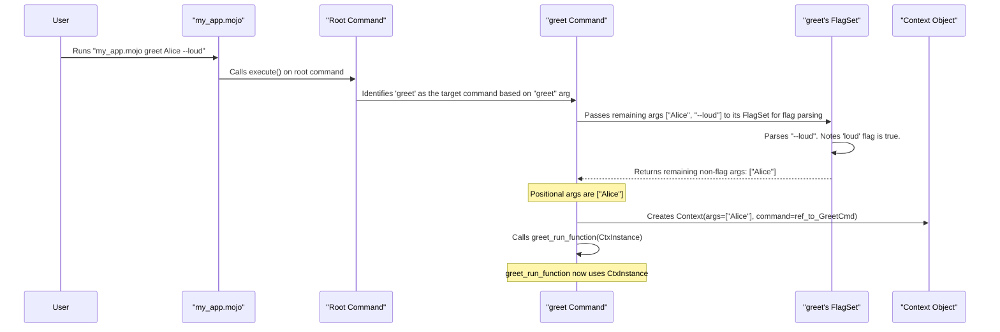

# Chapter 5: Context

Welcome to Chapter 5! In [Chapter 4: Help & Version Handling](04_help___version_handling_.md), we saw that functions responsible for displaying help or version information received a `Context` argument. We've actually seen this `Context` argument in the `run` functions of our `Command`s since [Chapter 1: Command](01_command_.md). It's time to officially meet the `Context` and understand what it does!

Imagine you're a chef about to cook a specific dish (your `Command`'s `run` function). Before you start, your assistant hands you a **briefcase**. This briefcase doesn't contain cooking ingredients directly, but it holds crucial information for your task. This is exactly what the `Context` is in Prism!

## What is a Context? The Command's Briefcase

The **`Context`** is like that briefcase handed to a `Command`'s function (like its `run` function, or pre/post run hooks) right when it's time to execute. This briefcase contains essential information the function needs to do its job:

1.  **A reference to the `Command` itself**: Think of this as a card in the briefcase saying, "You are Chef Gordon, and here's your profile." This allows the function to know which command it's part of, access its name, its `usage` description, or even its [FlagSet](03_flagset_.md) to check flag values.
2.  **The list of positional arguments**: These are the "extra instructions" or "ingredients" given to the command *after* its name and any flags have been sorted out. For example, if you run `my_cli process_file data.txt report.pdf --verbose`, the `Context` for `process_file` would contain `["data.txt", "report.pdf"]` as positional arguments.

So, any function that a command runs receives this `Context` to access these details.

## Using the Context in Your Command

Let's build a simple command that tells us its own name and lists any positional arguments it received.

```mojo
from memory import ArcPointer
from prism import Command, Context, Flag

// This function will be run by our command
fn show_command_info(ctx: Context) -> None:
    // 1. Access the Command object itself from the Context
    let current_command = ctx.command[]

    // Print the command's name
    print("Hello! I am the '" + current_command.name + "' command.")

    // 2. Access the list of positional arguments from the Context
    let positional_args = ctx.args
    if len(positional_args) > 0:
        print("You gave me these positional arguments:")
        for arg in positional_args:
            print("- " + arg[])
    else:
        print("You didn't provide any positional arguments.")

    // You can also access flags via the command in the context
    if current_command.flags.get_bool("details").value_or(False):
        print("Detailed view enabled via flag!")


fn main():
    var my_command = Command(
        name="info-dump",
        usage="Dumps information about itself and its arguments.",
        run=show_command_info,
        flags=List[Flag](
            Flag.bool(name="details", shorthand="d", usage="Show extra details.")
        )
    )
    my_command.execute()
```

Let's break down `show_command_info(ctx: Context)`:
1.  `let current_command = ctx.command[]`: We get the actual `Command` object (our `info-dump` command) from `ctx.command`. `ctx.command` is an `ArcPointer[Command]`, so we use `[]` to dereference it and get the `Command` struct.
2.  `print("Hello! I am the '" + current_command.name + "' command.")`: We can now access properties of the `Command`, like its `name`.
3.  `let positional_args = ctx.args`: We get the list of positional arguments directly from `ctx.args`. This is a `List[String]`.
4.  We then loop through `positional_args` and print each one.
5.  `if current_command.flags.get_bool("details").value_or(False)`: We can also access the command's [FlagSet](03_flagset_.md) (and thus its flags) through `current_command.flags`. This is how commands typically retrieve flag values.

Now, let's see what happens when we run this:

*   **Scenario 1: No positional arguments**
    ```sh
    mojo run your_program.mojo info-dump
    ```
    Output:
    ```
    Hello! I am the 'info-dump' command.
    You didn't provide any positional arguments.
    ```

*   **Scenario 2: With positional arguments**
    ```sh
    mojo run your_program.mojo info-dump apple banana
    ```
    Output:
    ```
    Hello! I am the 'info-dump' command.
    You gave me these positional arguments:
    - apple
    - banana
    ```

*   **Scenario 3: With positional arguments and a flag**
    ```sh
    mojo run your_program.mojo info-dump apple --details banana
    ```
    Output:
    ```
    Hello! I am the 'info-dump' command.
    You gave me these positional arguments:
    - apple
    - banana
    Detailed view enabled via flag!
    ```
    Notice how `--details` was recognized as a flag and *not* included in `ctx.args`. The arguments `apple` and `banana` are correctly identified as positional.

The `Context` provides a clean and organized way for your command's logic to get the information it needs, right when it needs it.

## Under the Hood: Context Creation

How does this magical `Context` briefcase get packed and delivered? It happens within the `Command.execute()` method.

Here's a simplified step-by-step:

1.  **You run your CLI**: e.g., `mojo run my_app.mojo greet Alice --loud -c Bob`
2.  **Prism parses arguments**: Prism's `Command.execute()` method starts by parsing the raw command-line arguments.
3.  **Command Identification**: It figures out which command to run (e.g., `greet` from our example).
4.  **Flag Parsing**: The [FlagSet](03_flagset_.md) associated with the `greet` command processes flag-like arguments (e.g., `--loud` and `-c Bob`). It "consumes" these arguments.
5.  **Identify Positional Arguments**: Whatever arguments are left over after the command name and flags (and their values) are processed are considered positional arguments. In our example, "Alice" would be a positional argument.
6.  **Pack the Briefcase (Context Creation)**: Prism then creates a `Context` object.
    *   It puts a reference to the identified `Command` (the `greet` command object) into the `Context`.
    *   It puts the list of positional arguments (e.g., `["Alice"]`) into the `Context`.
7.  **Deliver the Briefcase**: This newly created `Context` object is then passed as an argument to the `greet` command's `run` function (and any pre/post run hooks).

Let's visualize this with a sequence diagram:



### The `Context` Struct (`src/prism/context.mojo`)

The `Context` itself is a very straightforward `struct` in Prism:

```mojo
// Simplified from src/prism/context.mojo

from memory import ArcPointer
from prism.command import Command // For the Command type

struct Context:
    // A reference (pointer) to the Command that is being executed.
    // ArcPointer is used for safe memory management of shared objects.
    var command: ArcPointer[Command]

    // A list of strings, representing the positional arguments.
    var args: List[String]

    // The constructor for Context
    fn __init__(out self, args: List[String], command: ArcPointer[Command]):
        self.command = command
        self.args = args
```
As you can see, it's essentially just a container for these two pieces of information:
*   `command: ArcPointer[Command]`: An `ArcPointer` (Atomic Reference Counted Pointer) to the `Command` struct. This allows multiple parts of the system to safely share a reference to the command.
*   `args: List[String]`: A simple list of strings for the positional arguments.

### Context Creation in `Command.execute()`

Inside the `Command` struct's `execute()` method (conceptually):

```mojo
// Conceptual simplification from src/prism/command.mojo
fn execute(self) -> None:
    // ... (1. Parse raw command line args into input_args) ...
    // ... (2. Find the specific 'command_to_run' and 'args_for_command' from input_args) ...
    var command_to_run: Self
    var args_for_command: List[String]
    command_to_run, args_for_command = self._parse_command_from_args(input_args)

    // Wrap the command_to_run in an ArcPointer for the Context
    var command_ptr = ArcPointer(command_to_run)

    // ... (3. Parse flags using command_ptr[].flags.from_args(args_for_command) ) ...
    // This returns 'remaining_args' which are the true positional arguments.
    var positional_args_after_flags: List[String]
    try:
        positional_args_after_flags = command_ptr[].flags.from_args(args_for_command)
    except e:
        // ... (handle flag parsing errors) ...
        return

    // 4. Create the Context object!
    var ctx = Context(positional_args_after_flags, command_ptr) // ✨ Here it is!

    // ... (5. Check for help/version flags and execute their actions with ctx) ...

    // ... (6. Run argument validators with ctx) ...

    // ... (7. Execute pre-run hooks, the main run function, and post-run hooks, all with ctx) ...
    if command_ptr[].run:
        command_ptr[].run.value()(ctx)
    elif command_ptr[].raising_run:
        // ... (call raising_run with ctx) ...
    // ...
```
The key line is `var ctx = Context(positional_args_after_flags, command_ptr)`. This is where the "briefcase" is packed with the final list of positional arguments (after flags have been handled) and a reference to the command that's about to be run. This `ctx` is then passed around to all the relevant functions.

## Why is Context Important?

The `Context` object plays a crucial role:
*   **Decoupling**: It cleanly separates the process of parsing arguments and figuring out *what* to run, from the actual logic *inside* your command's functions. Your `run` function doesn't need to know about `sys.argv()` or the complexities of flag parsing; it just gets a neat `Context` object.
*   **Information Hub**: It's the single source of truth for a command's runtime environment regarding its identity and direct inputs (positional arguments).
*   **Extensibility**: Because pre-run hooks, post-run hooks, help actions, version actions, and argument validators all receive this same `Context` structure, they can all operate on a consistent set of information.

## Conclusion

You've now learned that the `Context` is your command's best friend when it's time to execute. It's a simple yet powerful "briefcase" carrying:
1.  A reference to the `Command` object itself (`ctx.command[]`), allowing access to its name, flags, etc.
2.  The list of positional arguments (`ctx.args`) passed to the command.

This `Context` is automatically prepared by Prism and passed to your command's `run` function, as well as to other callable parts of a command like pre/post run hooks and help/version actions. It empowers your command logic by providing all the necessary runtime details in a clean package.

The `ctx.args` are particularly important. What if you want to ensure your command receives exactly two positional arguments, or that they are of a specific type? That's where [Argument Validators](06_argument_validators_.md) come in, and they operate directly on the `Context`! We'll explore them in the next chapter.

---

Generated by [AI Codebase Knowledge Builder](https://github.com/The-Pocket/Tutorial-Codebase-Knowledge)